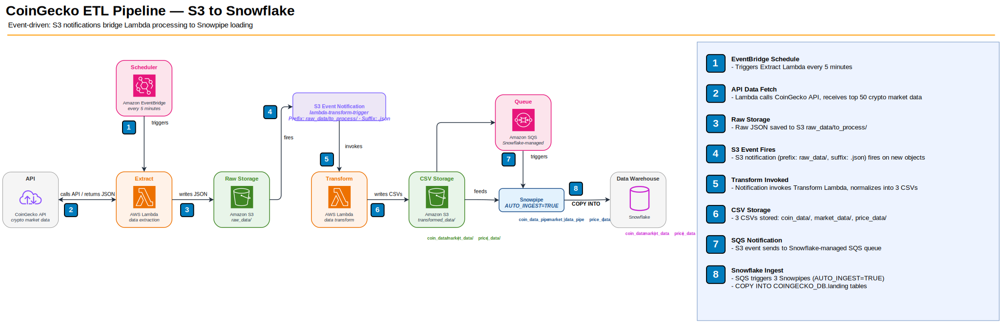

# Crypto Data — AWS to Snowpipe Ingestion

**Topic:** Building an ETL pipeline on AWS that extracts CoinGecko cryptocurrency data, transforms it via Lambda, and loads it into Snowflake via Snowpipe



This pipeline ingests cryptocurrency market data from the **CoinGecko API** every 5 minutes, transforms it into normalized CSVs when an S3 event notification triggers the transform Lambda, and loads them into Snowflake automatically via Snowpipe.

The pipeline uses:
- **Amazon S3** — cloud file storage (like a hard drive in the cloud)
- **AWS Lambda** — serverless functions that run code without managing servers
- **Amazon EventBridge Scheduler** — triggers the extract Lambda on a schedule
- **S3 Event Notifications** — triggers the transform Lambda when new JSON files land in S3, and notifies Snowpipe when new CSV files arrive
- **Amazon SQS** — a message queue that bridges AWS and Snowflake
- **Snowpipe** — Snowflake's auto-ingestion service that loads files from S3 into tables


&nbsp;

## Before You Start — Placeholders and Conventions

Every CLI and Terraform snippet in this walkthrough uses the placeholders in the table below. Substitute them with your own values before copy-pasting.

| Placeholder | What it is | Example |
|---|---|---|
| `<ACCOUNT_ID>` | Your 12-digit AWS account ID | `123456789012` |
| `<REGION>` | AWS region for every resource | `eu-north-1` |
| `<AWS_PROFILE>` | Named AWS CLI profile to authenticate with | `aws-learn` |
| `<PIPELINE_BUCKET>` | S3 bucket name (must be globally unique) | `coingecko-etl-bucket-td-42` |
| `<SNOWPIPE_SQS_ARN>` | From Snowflake `DESC PIPE` output (Step 6 of `snowflake_setup.sql`) | `arn:aws:sqs:eu-north-1:...` |
| `<SNOWFLAKE_IAM_USER_ARN>` | From `DESC INTEGRATION` output | `arn:aws:iam::...:user/xxxxx` |
| `<SNOWFLAKE_EXTERNAL_ID>` | From `DESC INTEGRATION` output | `AB12345_SFCRole=...` |

> **Values used in this walkthrough**
> - **Region:** `eu-north-1` (literal throughout — replace if deploying elsewhere)
> - **AWS profile:** `aws-learn`
> - **Bucket name prefix:** `coingecko-etl-bucket` — append a unique suffix because S3 bucket names are globally unique.

> **CLI conventions:** Every `aws` command in this guide should be suffixed with `--profile <AWS_PROFILE>` (e.g., `--profile aws-learn`). Management operations should also include `--query` or `--output` to avoid dumping unbounded JSON. For brevity, not every command below repeats these flags — add them when copy-pasting.

> **AWS-only variant (skip Snowflake):** If you're deploying the AWS side only (see [crypto_data_aws_to_athena_ingestion.md](./crypto_data_aws_to_athena_ingestion.md) for the Athena-based alternative), skip these sections: **Step 6.2** (Snowpipe SQS S3 notification), **Step 6.3** (Snowflake S3 access role), **Step 7** (Snowflake setup script), and the Terraform blocks **5.`queue`** sub-block and **6** (IAM — Snowflake S3 access role). Pass `enable_snowflake_integration = false` to the Terraform variables block if using the provided Terraform.

&nbsp;

## Data Flow

```
1. EXTRACT    EventBridge Scheduler fires every 5 minutes
                → triggers Lambda `coingecko_api_data_extract`
                → fetches coin data from the CoinGecko API (top 50 coins by market cap)
                → writes raw JSON to S3: <bucket>/raw_data/to_process/

2. TRANSFORM  S3 Event Notification (`lambda-transform-trigger`) detects new .json files in raw_data/to_process/
                → invokes Lambda `coingecko_api_data_transform`
                → applies transformations (symbol normalization, market cap tiers, price ratios, extraction timestamp)
                → splits data into 3 CSVs and writes to S3: <bucket>/transformed_data/{coin_data,market_data,price_data}/
                → moves source JSON to <bucket>/raw_data/processed/ (idempotent — each file is processed exactly once)

3. NOTIFY     S3 Event Notification (`snowpipe-coingecko-autoload`) detects new .csv files in transformed_data/
                → publishes messages to the Snowflake-managed SQS queue

4. LOAD       Snowpipe (3 pipes: coin_data_pipe, market_data_pipe, price_data_pipe) with AUTO_INGEST=TRUE
                → polls the shared SQS queue continuously
                → runs COPY INTO for each new CSV
                → appends rows to Snowflake landing tables: COINGECKO_DB.landing.{coin_data,market_data,price_data}
```

&nbsp;

## S3 Bucket Layout

```
coingecko-etl-bucket/
├── raw_data/                                         ← Raw JSON staging area from the CoinGecko API
│   ├── to_process/                                   ← Extract Lambda writes here; transform Lambda reads here (inbox)
│   └── processed/                                    ← Transform Lambda moves JSON here after processing (archive)
└── transformed_data/                                 ← Normalized CSVs from transform Lambda (Snowpipe loads these)
    ├── coin_data/                                    ← Coin identity CSVs → Snowflake table: coin_data
    ├── market_data/                                  ← Market metrics CSVs → Snowflake table: market_data
    └── price_data/                                   ← Price details CSVs → Snowflake table: price_data
```

> **Note — why two `raw_data/` folders?** `to_process/` acts as an inbox for the transform Lambda (new JSON files trigger it); `processed/` acts as an archive so the same file is never reprocessed.

&nbsp;

## AWS Services Used

| Service | Role in Pipeline |
|---------|-----------------|
| **S3** (`coingecko-etl-bucket`) | Object storage for raw JSON, transformed CSVs, and archived files |
| **Lambda** (`coingecko_api_data_extract`) | Calls CoinGecko API, writes raw JSON to S3 |
| **EventBridge Scheduler** | Invokes extract Lambda every 5 minutes |
| **Lambda** (`coingecko_api_data_transform`) | Parses JSON, applies transformations, splits into 3 CSVs |
| **S3 Event Notifications** | Triggers transform Lambda on new JSON; notifies Snowpipe SQS on new CSVs |
| **SQS** | Bridge between AWS and Snowflake — notifies Snowpipe that new CSVs are ready for loading |
| **Snowpipe** (3 pipes) | Auto-ingests CSVs from S3 into Snowflake landing tables |
| **Snowflake** (`COINGECKO_DB.landing`) | Data warehouse — 3 landing tables for coin, market, and price data |
| **IAM** (`coingecko_lambda_role`) | Shared execution role for both Lambda functions |
| **CloudWatch Logs** | Automatic logging for Lambda executions |

&nbsp;

## Component-by-Component Walkthrough

**S3 (Simple Storage Service)** — The storage backbone. All data lives in a single bucket (`coingecko-etl-bucket`) organized by prefix — raw JSON from the API, transformed CSVs, and archived files. S3 also generates event notifications that connect the pipeline stages together.

**Lambda** (`coingecko_api_data_extract`) — Calls the CoinGecko public API (free, no key required), fetches the top 50 coins by market cap, and writes the raw JSON response to `s3://coingecko-etl-bucket/raw_data/to_process/`. It uses only built-in Python libraries (`urllib`, `boto3`, `json`), so no Lambda Layers are needed.
- **Trigger:** EventBridge Scheduler — runs every 5 minutes using a `rate(5 minutes)` expression. Can be enabled/disabled from the EventBridge console.

**Lambda** (`coingecko_api_data_transform`) — Reads the raw JSON, applies transformations (symbol uppercase, name title case, market cap tier classification, price-to-ATH ratio, daily price range, volume-to-mcap ratio, days since ATH, extraction timestamp), and splits the data into 3 normalized CSVs written to separate S3 folders — `transformed_data/coin_data/`, `transformed_data/market_data/`, and `transformed_data/price_data/`. After the transformation, it moves the source JSON from `to_process/` to `processed/` (idempotent pipeline — each file is processed exactly once).
- **Trigger:** S3 Event Notification (`lambda-transform-trigger`) — monitors `s3://coingecko-etl-bucket/raw_data/to_process/` for new `.json` files and invokes this function.

**SQS (Simple Queue Service)** — Acts as the bridge between AWS and Snowflake — notifies Snowpipe that new CSV files are ready for loading. The queue ARN is retrieved by running `DESC PIPE` in Snowflake. All three pipes share the same SQS queue.
- **Trigger:** S3 Event Notification (`snowpipe-coingecko-autoload`) — monitors `s3://coingecko-etl-bucket/transformed_data/` for new `.csv` files and sends a message to this queue.

**Snowpipe** — Three pipes (`coin_data_pipe`, `market_data_pipe`, `price_data_pipe`) with `AUTO_INGEST=TRUE`. Each pipe listens on the shared SQS queue and runs `COPY INTO` automatically when new CSVs arrive. Uses `MATCH_BY_COLUMN_NAME=CASE_INSENSITIVE` so CSV header order doesn't matter.

**Snowflake Tables** — Three landing tables in `COINGECKO_DB.landing` receive appended snapshots (APPEND mode). Each pipeline run adds 50 rows per table. Historical data is preserved, enabling time-series analysis via the `extracted_at` column.

&nbsp;

## Step 1: S3 Bucket + Folder Structure

### 1.1 — Create the S3 Bucket

1. Go to **S3 → Create bucket**
2. Bucket name: `coingecko-etl-bucket`
3. Region: **eu-north-1** (must match all other resources)
4. Leave remaining settings as default → Click **Create bucket**

Or via CLI:

```bash
aws s3 mb s3://coingecko-etl-bucket --region eu-north-1
```

> Terraform: [1. S3 Bucket + Folder Prefixes](#1-s3-bucket--folder-prefixes)

### 1.2 — Create the Folder Prefixes

1. Go to **S3 → `coingecko-etl-bucket`**
2. Create the following folders (use **Create folder** for each):
   - `raw_data/to_process/`
   - `raw_data/processed/`
   - `transformed_data/coin_data/`
   - `transformed_data/market_data/`
   - `transformed_data/price_data/`

Or via CLI:

```bash
# S3 has no real folders — zero-byte objects with trailing slashes establish the prefixes
aws s3api put-object --bucket coingecko-etl-bucket --key raw_data/to_process/
aws s3api put-object --bucket coingecko-etl-bucket --key raw_data/processed/
aws s3api put-object --bucket coingecko-etl-bucket --key transformed_data/coin_data/
aws s3api put-object --bucket coingecko-etl-bucket --key transformed_data/market_data/
aws s3api put-object --bucket coingecko-etl-bucket --key transformed_data/price_data/
```

> **Note:** S3 has no real folders — these are zero-byte objects that establish the prefixes. The pipeline writes files under these prefixes.

> Terraform: [1. S3 Bucket + Folder Prefixes](#1-s3-bucket--folder-prefixes)

&nbsp;

## Step 2: IAM Role (coingecko_lambda_role)

Shared execution role for both Lambda functions. Needs S3 read/write on the pipeline bucket and CloudWatch Logs access.

### 2.1 — Create the IAM Role

1. Go to **IAM → Roles → Create role**
2. Trusted entity type: **AWS service**
3. Use case: **Lambda**
4. Click **Next**
5. Attach the managed policy: **AWSLambdaBasicExecutionRole** (provides CloudWatch Logs)
6. Click **Next**
7. Role name: `coingecko_lambda_role`
8. Click **Create role**

Or via CLI:

```bash
# 1. Create a trust-policy file for Lambda
cat > trust-policy-lambda.json <<'EOF'
{
  "Version": "2012-10-17",
  "Statement": [
    {
      "Effect": "Allow",
      "Principal": { "Service": "lambda.amazonaws.com" },
      "Action": "sts:AssumeRole"
    }
  ]
}
EOF

# 2. Create the role
aws iam create-role \
  --role-name coingecko_lambda_role \
  --assume-role-policy-document file://trust-policy-lambda.json

# 3. Attach the managed CloudWatch Logs policy
aws iam attach-role-policy \
  --role-name coingecko_lambda_role \
  --policy-arn arn:aws:iam::aws:policy/service-role/AWSLambdaBasicExecutionRole
```

**Trust policy (used above):**
```json
{
  "Version": "2012-10-17",
  "Statement": [
    {
      "Effect": "Allow",
      "Principal": { "Service": "lambda.amazonaws.com" },
      "Action": "sts:AssumeRole"
    }
  ]
}
```

### 2.2 — Add S3 Access Policy

1. Go to **IAM → Roles → `coingecko_lambda_role`**
2. Click **Add permissions → Create inline policy**
3. Switch to the **JSON** editor
4. Paste the JSON below — it grants `s3:GetObject`, `s3:PutObject`, `s3:DeleteObject`, and `s3:ListBucket` on `coingecko-etl-bucket`
5. Policy name: `lambda-s3-coingecko-access`
6. Click **Create policy**

**Inline policy JSON:**
```json
{
  "Version": "2012-10-17",
  "Statement": [
    {
      "Effect": "Allow",
      "Action": [
        "s3:GetObject",
        "s3:PutObject",
        "s3:DeleteObject",
        "s3:ListBucket"
      ],
      "Resource": [
        "arn:aws:s3:::coingecko-etl-bucket",
        "arn:aws:s3:::coingecko-etl-bucket/*"
      ]
    }
  ]
}
```

Or via CLI:

```bash
# Save the policy above as lambda-s3-coingecko-access.json, then attach it inline
aws iam put-role-policy \
  --role-name coingecko_lambda_role \
  --policy-name lambda-s3-coingecko-access \
  --policy-document file://lambda-s3-coingecko-access.json
```

> Terraform: [2. IAM — Lambda Execution Role](#2-iam--lambda-execution-role)

&nbsp;

## Step 3: Lambda Extract Function

**Source file:** [`coingeecko_api_data_extract_lambda.py`](./docs/resources/coingeecko_api_data_extract_lambda.py)

### 3.1 — Create the Lambda Function

1. Go to **Lambda → Create function**
2. **Author from scratch**
3. Function name: `coingecko_api_data_extract`
4. Runtime: **Python 3.12**
5. Execution role: **Use an existing role** → select `coingecko_lambda_role`
6. Click **Create function**
7. In the code editor, paste the contents of [`coingeecko_api_data_extract_lambda.py`](./docs/resources/coingeecko_api_data_extract_lambda.py)
8. Click **Deploy**
9. Go to **Configuration → General configuration → Edit**:
   - Timeout: **60 seconds** (default 3s is too short for API calls)
   - Memory: **128 MB** (sufficient)
   - Click **Save**

Or via CLI:

```bash
# 1. Package the function (only needed for CLI/Terraform — not for console)
zip coingecko_extract.zip coingeecko_api_data_extract_lambda.py

# 2. Create the Lambda function (replace <ACCOUNT_ID>)
aws lambda create-function \
  --function-name coingecko_api_data_extract \
  --runtime python3.12 \
  --role arn:aws:iam::<ACCOUNT_ID>:role/coingecko_lambda_role \
  --handler coingeecko_api_data_extract_lambda.lambda_handler \
  --zip-file fileb://coingecko_extract.zip \
  --timeout 60 \
  --memory-size 128 \
  --region eu-north-1
```

> Terraform: [3. Lambda Extract Function + EventBridge Scheduler](#3-lambda-extract-function--eventbridge-scheduler)

### What it does

1. Calls the CoinGecko public API (free, no API key required)
2. Fetches the top 50 cryptocurrencies by market cap
3. Saves the raw API response as a timestamped JSON file in S3

**Output file example:**
```
s3://coingecko-etl-bucket/raw_data/to_process/coingecko_raw_20260401T112815.json
```

### Runtime Configuration

- **Runtime:** Python 3.12
- **Memory:** 128 MB
- **Timeout:** 60 seconds
- **Execution role:** `coingecko_lambda_role`
- **Libraries used:** `urllib`, `boto3`, `json` — all built-in, no Lambda Layers needed

### Packaging for CI/CD

For Terraform or CI/CD deployments, the zip must be present on the machine running `terraform apply`. The `handler` value follows the pattern `<filename_without_extension>.lambda_handler`.

```yaml
# GitLab CI example
build:
  script:
    - zip coingecko_extract.zip coingeecko_api_data_extract_lambda.py
  artifacts:
    paths:
      - coingecko_extract.zip
```

&nbsp;

## Step 4: EventBridge Scheduler

The EventBridge Scheduler triggers the extract Lambda every 5 minutes.

### 4.1 — Create the Schedule

1. Go to **EventBridge → Scheduler → Schedules → Create schedule**
2. Name: `coingecko-extract-every-5-minutes`
3. Schedule type: **Rate-based** → `rate(5 minutes)`
4. Flexible time window: **Off**
5. Target: **Lambda** → select `coingecko_api_data_extract`
6. Click **Create schedule**

Or via CLI:

```bash
# EventBridge Scheduler needs its own role to invoke Lambda — create one first.
# In the console this is done automatically; via CLI it must be explicit.
cat > trust-policy-scheduler.json <<'EOF'
{
  "Version": "2012-10-17",
  "Statement": [
    {
      "Effect": "Allow",
      "Principal": { "Service": "scheduler.amazonaws.com" },
      "Action": "sts:AssumeRole"
    }
  ]
}
EOF

aws iam create-role \
  --role-name coingecko_scheduler_invoke_role \
  --assume-role-policy-document file://trust-policy-scheduler.json

# Allow the role to invoke the extract Lambda
aws iam put-role-policy \
  --role-name coingecko_scheduler_invoke_role \
  --policy-name scheduler-invoke-extract-lambda \
  --policy-document '{
    "Version":"2012-10-17",
    "Statement":[{
      "Effect":"Allow",
      "Action":"lambda:InvokeFunction",
      "Resource":"arn:aws:lambda:eu-north-1:<ACCOUNT_ID>:function:coingecko_api_data_extract"
    }]
  }'

# Create the schedule (replace <ACCOUNT_ID>)
aws scheduler create-schedule \
  --name coingecko-extract-every-5-minutes \
  --schedule-expression "rate(5 minutes)" \
  --flexible-time-window '{"Mode":"OFF"}' \
  --target '{
    "Arn":"arn:aws:lambda:eu-north-1:<ACCOUNT_ID>:function:coingecko_api_data_extract",
    "RoleArn":"arn:aws:iam::<ACCOUNT_ID>:role/coingecko_scheduler_invoke_role"
  }' \
  --region eu-north-1
```

> **Note:** EventBridge Scheduler needs its own IAM role to invoke Lambda. AWS creates this automatically when you create the schedule via the console. In Terraform and via CLI, it must be declared explicitly (shown above).

> Terraform: [3. Lambda Extract Function + EventBridge Scheduler](#3-lambda-extract-function--eventbridge-scheduler)

&nbsp;

## Step 5: Lambda Transform Function

**Source file:** [`coingeecko_api_data_transform_lambda.py`](./docs/resources/coingeecko_api_data_transform_lambda.py)

### 5.1 — Create the Lambda Function

1. Go to **Lambda → Create function**
2. **Author from scratch**
3. Function name: `coingecko_api_data_transform`
4. Runtime: **Python 3.12**
5. Execution role: **Use an existing role** → select `coingecko_lambda_role`
6. Click **Create function**
7. In the code editor, paste the contents of [`coingeecko_api_data_transform_lambda.py`](./docs/resources/coingeecko_api_data_transform_lambda.py)
8. Click **Deploy**
9. Go to **Configuration → General configuration → Edit**:
   - Timeout: **60 seconds**
   - Memory: **128 MB**
   - Click **Save**

Or via CLI:

```bash
# 1. Package the function
zip coingecko_transform.zip coingeecko_api_data_transform_lambda.py

# 2. Create the Lambda function (replace <ACCOUNT_ID>)
aws lambda create-function \
  --function-name coingecko_api_data_transform \
  --runtime python3.12 \
  --role arn:aws:iam::<ACCOUNT_ID>:role/coingecko_lambda_role \
  --handler coingeecko_api_data_transform_lambda.lambda_handler \
  --zip-file fileb://coingecko_transform.zip \
  --timeout 60 \
  --memory-size 128 \
  --region eu-north-1
```

> Terraform: [4. Lambda Transform Function](#4-lambda-transform-function)

### What it does

1. Lists all `.json` files in `raw_data/to_process/`
2. For each file, reads and parses the JSON
3. Applies transformations (see below)
4. Splits data into 3 normalized CSV files and writes them to S3
5. Moves the original JSON from `to_process/` to `processed/`

### Transformations applied

| Transformation | Description |
|---|---|
| Symbol uppercase | BTC, ETH, etc. |
| Name title case | "bitcoin" → "Bitcoin" |
| Market cap tier | Small (<$1B), Mid ($1-10B), Large ($10-100B), Mega (>$100B) |
| Price-to-ATH ratio | current_price / all_time_high — shows how far from peak (1.0 = at ATH) |
| Daily price range | high_24h - low_24h |
| Volume-to-mcap ratio | total_volume / market_cap — liquidity indicator |
| Days since ATH | Days elapsed since the coin hit its all-time high |
| Extraction timestamp | When the pipeline ran |

### Output files (3 CSVs per run, 50 rows each)

#### coin_data — identity and classification
| Column | Type | Description |
|---|---|---|
| id | VARCHAR | Unique identifier (e.g. "bitcoin") |
| symbol | VARCHAR | Ticker (e.g. "BTC") |
| name | VARCHAR | Full name (e.g. "Bitcoin") |
| market_cap_tier | VARCHAR | Small / Mid / Large / Mega |
| extracted_at | TIMESTAMP | Pipeline run timestamp |

#### market_data — market size and liquidity
| Column | Type | Description |
|---|---|---|
| id | VARCHAR | Join key to coin_data |
| market_cap | NUMBER | Total market cap in USD |
| total_volume | NUMBER | 24h trading volume in USD |
| circulating_supply | NUMBER | Coins in circulation |
| volume_to_mcap_ratio | FLOAT | Liquidity indicator |
| extracted_at | TIMESTAMP | Pipeline run timestamp |

#### price_data — detailed price metrics
| Column | Type | Description |
|---|---|---|
| id | VARCHAR | Join key to coin_data |
| current_price | FLOAT | Current price in USD |
| high_24h | FLOAT | 24h high |
| low_24h | FLOAT | 24h low |
| ath | FLOAT | All-time high price |
| ath_date | TIMESTAMP | Date of all-time high |
| price_change_percentage_24h | FLOAT | % change in 24h |
| price_to_ath_ratio | FLOAT | How close to ATH (1.0 = at ATH) |
| daily_price_range | FLOAT | high_24h - low_24h |
| days_since_ath | INTEGER | Days since all-time high |
| last_updated | TIMESTAMP | CoinGecko last update time |
| extracted_at | TIMESTAMP | Pipeline run timestamp |

### Runtime Configuration

- **Runtime:** Python 3.12
- **Memory:** 128 MB
- **Timeout:** 60 seconds
- **Execution role:** `coingecko_lambda_role`
- **Libraries used:** `json`, `csv`, `boto3`, `io`, `datetime` — all built-in, no Lambda Layers needed

### Trigger: S3 Event Notification

- The transform Lambda is triggered automatically by the `lambda-transform-trigger` S3 event notification (configured in Step 6)
- After saving the notification in S3, the trigger automatically appears in the Lambda console after a few minutes (AWS propagation delay)

### Packaging for CI/CD

```yaml
# GitLab CI example
build:
  script:
    - zip coingecko_transform.zip coingeecko_api_data_transform_lambda.py
  artifacts:
    paths:
      - coingecko_transform.zip
```

&nbsp;

## Step 6: S3 Event Notifications

Two notifications configured on `coingecko-etl-bucket`:

| Name | Prefix | Suffix | Destination | Purpose |
|---|---|---|---|---|
| `lambda-transform-trigger` | `raw_data/to_process/` | `.json` | Lambda: `coingecko_api_data_transform` | Triggers transformation when raw JSON arrives |
| `snowpipe-coingecko-autoload` | `transformed_data/` | `.csv` | SQS → Snowpipe | Notifies Snowpipe to load new CSVs into Snowflake |

### 6.1 — Set up `lambda-transform-trigger`

**Where:** S3 → `coingecko-etl-bucket` → Properties → Event notifications → Create event notification

| Field | Value | Why |
|---|---|---|
| Name | `lambda-transform-trigger` | Descriptive name |
| Event types | All object create events | Fire on any new file upload |
| Prefix | `raw_data/to_process/` | Only watch the inbox folder, not the whole bucket |
| Suffix | `.json` | Only trigger on JSON files, not CSVs or other files |
| Destination | Lambda function | We want to invoke a Lambda |
| Lambda ARN | `arn:aws:lambda:eu-north-1:<ACCOUNT_ID>:function:coingecko_api_data_transform` | The transform Lambda's ARN — found in Lambda console → function page → top right "Function ARN" |

After saving, this notification automatically appears as a trigger in the Lambda console after a few minutes (AWS propagation delay).

Or via CLI:

> **Important:** Step 6.1 and 6.2 must be configured together. AWS replaces the entire bucket notification configuration on each `put-bucket-notification-configuration` call, so they must both be passed in a single JSON payload. The snippet below covers both.

```bash
# 1. Grant S3 permission to invoke the transform Lambda (required once, per account)
aws lambda add-permission \
  --function-name coingecko_api_data_transform \
  --statement-id s3-invoke-transform \
  --action lambda:InvokeFunction \
  --principal s3.amazonaws.com \
  --source-arn arn:aws:s3:::coingecko-etl-bucket \
  --region eu-north-1

# 2. Write the combined notification configuration (Steps 6.1 + 6.2 — replace <ACCOUNT_ID> and <SNOWPIPE_SQS_ARN>)
cat > bucket-notification.json <<'EOF'
{
  "LambdaFunctionConfigurations": [
    {
      "Id": "lambda-transform-trigger",
      "LambdaFunctionArn": "arn:aws:lambda:eu-north-1:<ACCOUNT_ID>:function:coingecko_api_data_transform",
      "Events": ["s3:ObjectCreated:*"],
      "Filter": {
        "Key": {
          "FilterRules": [
            { "Name": "prefix", "Value": "raw_data/to_process/" },
            { "Name": "suffix", "Value": ".json" }
          ]
        }
      }
    }
  ],
  "QueueConfigurations": [
    {
      "Id": "snowpipe-coingecko-autoload",
      "QueueArn": "<SNOWPIPE_SQS_ARN>",
      "Events": ["s3:ObjectCreated:*"],
      "Filter": {
        "Key": {
          "FilterRules": [
            { "Name": "prefix", "Value": "transformed_data/" },
            { "Name": "suffix", "Value": ".csv" }
          ]
        }
      }
    }
  ]
}
EOF

# 3. Apply both notifications atomically
aws s3api put-bucket-notification-configuration \
  --bucket coingecko-etl-bucket \
  --notification-configuration file://bucket-notification.json
```

### 6.2 — Set up `snowpipe-coingecko-autoload`

**Where:** S3 → `coingecko-etl-bucket` → Properties → Event notifications → Create event notification

| Field | Value | Why |
|---|---|---|
| Name | `snowpipe-coingecko-autoload` | Descriptive name |
| Event types | All object create events | Fire on any new file upload |
| Prefix | `transformed_data/` | Only watch the transformed output folder |
| Suffix | `.csv` | Only trigger on CSV files |
| Destination | SQS queue | Snowpipe listens to an SQS queue, not Lambda |
| SQS ARN | *(from Snowflake `DESC PIPE` — see below)* | See below |

> Via CLI: the notification is configured together with 6.1 above — one `put-bucket-notification-configuration` call covers both.

**Where does the SQS ARN come from?**

The SQS queue is created and managed by **Snowflake** (its AWS account, not yours). You get the ARN by running Step 6 in [`snowflake_setup.sql`](./docs/sql/snowflake_setup.sql):
```sql
DESC PIPE COINGECKO_DB.landing.coin_data_pipe;
```
The `notification_channel` column contains the SQS ARN. All three pipes share the same ARN since Snowflake uses one queue per account.

> **Important:** You must complete Steps 1–6 of [`snowflake_setup.sql`](./docs/sql/snowflake_setup.sql) before configuring this notification, because the SQS ARN comes from the `DESC PIPE` output in Step 6.

### 6.3 — Create the Snowflake S3 Access Role (coingecko_snowflake_role)

This IAM role allows Snowflake's storage integration to read from the S3 bucket. It is referenced in [`snowflake_setup.sql`](./docs/sql/snowflake_setup.sql) Step 2 (`STORAGE_AWS_ROLE_ARN`).

1. Go to **IAM → Roles → Create role**
2. Trusted entity type: **Custom trust policy**
3. Paste the trust policy JSON below — it allows Snowflake's IAM user to assume this role using an external ID. (The placeholder values `<SNOWFLAKE_IAM_USER_ARN>` and `<SNOWFLAKE_EXTERNAL_ID>` are filled in after you run Step 2 of [`snowflake_setup.sql`](./docs/sql/snowflake_setup.sql).)
4. Click **Next**
5. Do **not** attach any managed policies — the inline policy below provides the access
6. Role name: `coingecko_snowflake_role`
7. Click **Create role**
8. Go to **IAM → Roles → `coingecko_snowflake_role`** → **Add permissions → Create inline policy**
9. Paste the S3 read policy JSON below — it grants `s3:GetObject`, `s3:GetObjectVersion`, and `s3:ListBucket` on `coingecko-etl-bucket`
10. Policy name: `snowflake-s3-coingecko-read`
11. Click **Create policy**

**Trust policy (with placeholders for Snowflake values):**
```json
{
  "Version": "2012-10-17",
  "Statement": [
    {
      "Effect": "Allow",
      "Principal": { "AWS": "<SNOWFLAKE_IAM_USER_ARN>" },
      "Action": "sts:AssumeRole",
      "Condition": {
        "StringEquals": {
          "sts:ExternalId": "<SNOWFLAKE_EXTERNAL_ID>"
        }
      }
    }
  ]
}
```

**Inline S3 read policy:**
```json
{
  "Version": "2012-10-17",
  "Statement": [
    {
      "Effect": "Allow",
      "Action": [
        "s3:GetObject",
        "s3:GetObjectVersion",
        "s3:ListBucket"
      ],
      "Resource": [
        "arn:aws:s3:::coingecko-etl-bucket",
        "arn:aws:s3:::coingecko-etl-bucket/*"
      ]
    }
  ]
}
```

Or via CLI:

```bash
# 1. Save the trust policy (replace the two Snowflake placeholders after running snowflake_setup.sql Step 2)
cat > trust-policy-snowflake.json <<'EOF'
{
  "Version": "2012-10-17",
  "Statement": [
    {
      "Effect": "Allow",
      "Principal": { "AWS": "<SNOWFLAKE_IAM_USER_ARN>" },
      "Action": "sts:AssumeRole",
      "Condition": {
        "StringEquals": { "sts:ExternalId": "<SNOWFLAKE_EXTERNAL_ID>" }
      }
    }
  ]
}
EOF

# 2. Create the role
aws iam create-role \
  --role-name coingecko_snowflake_role \
  --assume-role-policy-document file://trust-policy-snowflake.json

# 3. Attach the inline S3 read policy
aws iam put-role-policy \
  --role-name coingecko_snowflake_role \
  --policy-name snowflake-s3-coingecko-read \
  --policy-document '{
    "Version":"2012-10-17",
    "Statement":[{
      "Effect":"Allow",
      "Action":["s3:GetObject","s3:GetObjectVersion","s3:ListBucket"],
      "Resource":["arn:aws:s3:::coingecko-etl-bucket","arn:aws:s3:::coingecko-etl-bucket/*"]
    }]
  }'
```

> **After creating the role:** Run Step 2 of [`snowflake_setup.sql`](./docs/sql/snowflake_setup.sql) to create the storage integration, then run `DESC INTEGRATION S3_COINGECKO_INTEGRATION;` to get the `STORAGE_AWS_IAM_USER_ARN` and `STORAGE_AWS_EXTERNAL_ID` values. Update this role's trust policy with those values — replace `<SNOWFLAKE_IAM_USER_ARN>` and `<SNOWFLAKE_EXTERNAL_ID>` with the actual values from Snowflake.

> Terraform: [6. IAM — Snowflake S3 Access Role](#6-iam--snowflake-s3-access-role)

&nbsp;

> **Notes:**
> - AWS S3 does not allow two notifications with overlapping prefixes — these two use completely separate prefixes so they coexist without conflict.
> - `lambda-transform-trigger` is created from the **S3 console** and automatically appears in Lambda's trigger list after a few minutes.
> - `snowpipe-coingecko-autoload` uses a single SQS ARN shared across all 3 Snowpipes — Snowflake routes internally to the correct pipe based on the file path.
> - Amazon EventBridge notifications are enabled on the bucket (toggled On) but not used for Lambda triggering due to corporate SCP restrictions.

> **Why not EventBridge for the transform trigger?** Corporate SCPs (Service Control Policies) blocked `iam:CreateRole` and prevented EventBridge from assuming any role to invoke Lambda. The direct S3 event notification approach bypasses this entirely.

> Terraform: [5. S3 Event Notifications](#5-s3-event-notifications)

&nbsp;

## Step 7: Run the Snowflake Setup Script

> **Note:** All Snowflake resources — database, schema, role, storage integration, external stage, file format, tables, and Snowpipes — are provisioned via SQL in **Snowsight** (Snowflake's web UI). These are completely separate from the AWS resources built in the previous steps.

Open [`snowflake_setup.sql`](./docs/sql/snowflake_setup.sql) in a Snowsight SQL worksheet and run it top to bottom. The script is organized in 9 sequential steps — each builds on the previous one:

| Step | What it creates | Role used |
|---|---|---|
| 1 | Database (`COINGECKO_DB`), schema (`landing`), role (`COINGECKO_DEVELOPER`), grants | `ACCOUNTADMIN` |
| 2 | Storage integration (`S3_COINGECKO_INTEGRATION`) — establishes trust with AWS | `ACCOUNTADMIN` |
| 3 | CSV file format (`ff_csv`) and external stage (`coingecko_stage`) | `COINGECKO_DEVELOPER` |
| 4 | Landing tables — `coin_data`, `market_data`, `price_data` | `COINGECKO_DEVELOPER` |
| 5 | Snowpipes — one per CSV subfolder, `AUTO_INGEST = TRUE` | `COINGECKO_DEVELOPER` |
| 6 | `DESC PIPE` to get the SQS ARN for the S3 event notification | `COINGECKO_DEVELOPER` |
| 7 | Verify pipe status and stage/pipe ownership alignment | `COINGECKO_DEVELOPER` |
| 8 | Force-load files already in S3 (one-time, before `AUTO_INGEST` takes over) | `COINGECKO_DEVELOPER` |
| 9 | Verify data loaded — copy history, row counts, sample join query | `COINGECKO_DEVELOPER` |

The script also includes **Pause** and **Resume** sections at the end for cost management.

> **Prerequisites:** Before starting, you need the S3 bucket (`coingecko-etl-bucket`) from Step 1 and the `coingecko_snowflake_role` IAM role from [Step 6.3](#63--create-the-snowflake-s3-access-role-coingecko_snowflake_role) (for the storage integration trust relationship).

> **Circular dependency with Step 6.2:** The SQS ARN for the `snowpipe-coingecko-autoload` S3 event notification comes from Step 6 of this script (`DESC PIPE`). Complete this script through Step 6, then return to [Step 6.2](#62--set-up-snowpipe-coingecko-autoload) to configure the notification.

> **Key rule:** All pipes, tables, and stages must be owned by the same role (`COINGECKO_DEVELOPER`). If you accidentally create objects under `ACCOUNTADMIN`, the script includes ownership transfer commands. See the troubleshooting section on [Snowpipe STALLED_COMPILATION_ERROR](#snowpipe-stalled_compilation_error-role-ownership) for details.

### IAM Roles Reference

| Role | Purpose |
|---|---|
| `coingecko_lambda_role` | Shared execution role for both Lambda functions. Needs S3 read/write and CloudWatch Logs. Created in [Step 2](#step-2-iam-role-coingecko_lambda_role). |
| `coingecko_snowflake_role` | Used by the Snowflake storage integration to access S3. Created in [Step 6.3](#63--create-the-snowflake-s3-access-role-coingecko_snowflake_role). |
| Developer role | Your login role via Okta SSO (SAML federation). Cannot be assumed by AWS services. |

### Monitoring: CloudWatch Logs

**Lambda** → select function → **Monitor** tab → **View CloudWatch logs**

**Successful transform run log:**
```
START RequestId: abc123
Processing: raw_data/to_process/coingecko_raw_20260401T083125.json
Written 50 rows to s3://coingecko-etl-bucket/transformed_data/coin_data/coin_data_20260401T083125.csv
Written 50 rows to s3://coingecko-etl-bucket/transformed_data/market_data/market_data_20260401T083125.csv
Written 50 rows to s3://coingecko-etl-bucket/transformed_data/price_data/price_data_20260401T083125.csv
Moved raw_data/to_process/coingecko_raw_20260401T083125.json -> raw_data/processed/coingecko_raw_20260401T083125.json
END RequestId: abc123
REPORT Duration: 760ms
```

&nbsp;

## Deployment Workflow

Once the pipeline is live, you'll need to redeploy when Lambda source code changes. Terraform detects changes automatically via `source_code_hash` — if the zip content is identical to the previously-deployed version, the Lambda function is not re-uploaded.

### Manual workflow

```bash
# Re-zip whichever file changed (or both)
zip coingecko_extract.zip coingeecko_api_data_extract_lambda.py
zip coingecko_transform.zip coingeecko_api_data_transform_lambda.py

# Terraform detects the hash change and redeploys only what changed
terraform apply
```

### CI/CD workflow (GitLab)

Push your code change and the pipeline handles packaging and deployment automatically. No manual zip or apply needed.

```yaml
stages:
  - package
  - deploy

package_lambdas:
  stage: package
  script:
    - zip coingecko_extract.zip coingeecko_api_data_extract_lambda.py
    - zip coingecko_transform.zip coingeecko_api_data_transform_lambda.py
  artifacts:
    paths:
      - coingecko_extract.zip
      - coingecko_transform.zip

terraform_deploy:
  stage: deploy
  script:
    - terraform init
    - terraform apply -auto-approve
  dependencies:
    - package_lambdas
```

> **How Terraform knows when to redeploy:** `source_code_hash = filebase64sha256("file.zip")` computes a hash of the zip on every `terraform plan/apply`. If the hash matches the last deployed version, the Lambda is skipped. If the zip changed, Terraform updates the function code automatically.

> **Alternative — store zips in S3:** For team environments or when multiple CI runners are deploying, push the zip to an S3 artifacts bucket first and reference it via `s3_bucket` / `s3_key` instead of `filename`. This avoids the zip needing to be present on the machine running Terraform.

&nbsp;

## Terraform Reference

This section provides a complete, copy-pasteable Terraform configuration that reproduces every AWS resource built through the console guide above. You can use it in two ways: **(a)** hand the entire file to your DevOps team so they can provision the pipeline in a repeatable, auditable manner, or **(b)** run it yourself in a sandbox account where you have admin rights, then point your team at the state file for production promotion.

**DevOps handoff workflow:** Because the corporate AWS account restricts direct IAM and infrastructure creation, the recommended workflow is to commit these Terraform files to your team's infra repository, open a merge request tagged `pipeline-infra`, and let DevOps review, plan, and apply. IAM-related blocks (the shared Lambda execution role, the Snowflake S3 access role) are flagged below so reviewers know which resources require elevated privileges. All other resources (S3 bucket, Lambda functions, EventBridge Scheduler, S3 event notifications) can typically be applied by a developer role with scoped permissions.

> **Order matters:** Apply these resources in the order listed. Later resources reference earlier ones (Lambda functions reference the IAM role; S3 event notifications reference the Lambda functions; the Snowflake access role depends on the S3 bucket). Terraform handles the dependency graph automatically, but if you apply blocks selectively, follow the ordering below.

> **Scope:** Terraform covers only AWS infrastructure. Snowflake objects (database, schema, role, storage integration, stage, file format, tables, pipes) are provisioned via SQL in [Step 7: Run the Snowflake Setup Script](#step-7-run-the-snowflake-setup-script) — not Terraform.

Before any `resource` blocks, your `.tf` file needs the standard provider preamble. This tells Terraform which cloud provider plugin to download and which region to target:

### Provider

```hcl
terraform {
  required_version = ">= 1.5"
  required_providers {
    aws = {
      source  = "hashicorp/aws"
      version = "~> 5.0"
    }
  }
}

provider "aws" {
  region = var.aws_region

  default_tags {
    tags = {
      Project = var.project_name
      Owner   = var.owner_tag
    }
  }
}
```

### Variables

All parameterized values live here. Override them via `terraform.tfvars`, CLI flags, or environment variables.

```hcl
variable "aws_region" {
  description = "AWS region where every pipeline resource is deployed"
  type        = string
  default     = "eu-north-1"
}

variable "bucket_name" {
  description = "S3 bucket name (must be globally unique). Typically coingecko-etl-bucket + your suffix."
  type        = string
  nullable    = false

  validation {
    condition     = can(regex("^[a-z0-9.-]{3,63}$", var.bucket_name))
    error_message = "Bucket name must be 3-63 chars, lowercase letters/digits/dots/hyphens."
  }
}

variable "project_name" {
  description = "Value for the Project tag on every resource"
  type        = string
  default     = "coingecko-etl"
}

variable "owner_tag" {
  description = "Value for the Owner tag on every resource"
  type        = string
  default     = "coingecko-pipeline"
}

variable "lambda_runtime" {
  description = "Python runtime for both Lambda functions"
  type        = string
  default     = "python3.12"
}

variable "extract_schedule_expression" {
  description = "EventBridge Scheduler rate for the extract Lambda"
  type        = string
  default     = "rate(5 minutes)"
}

variable "enable_snowflake_integration" {
  description = "Create Snowflake S3 access role + SQS notification wiring. Set false for the AWS-only (Athena) path."
  type        = bool
  default     = false
}

variable "snowpipe_sqs_arn" {
  description = "SQS ARN from Snowflake DESC PIPE output. Required when enable_snowflake_integration = true."
  type        = string
  default     = ""
}

variable "snowflake_iam_user_arn" {
  description = "Snowflake IAM user ARN from DESC INTEGRATION output. Required when enable_snowflake_integration = true."
  type        = string
  default     = ""
}

variable "snowflake_external_id" {
  description = "Snowflake external ID from DESC INTEGRATION output. Required when enable_snowflake_integration = true."
  type        = string
  default     = ""
}
```

Create a `terraform.tfvars` alongside the `.tf` file to supply required values:

```hcl
bucket_name = "coingecko-etl-bucket-td-42"
# For AWS-only (Athena) deployment, leave enable_snowflake_integration = false.
# For Snowflake integration, set:
# enable_snowflake_integration = true
# snowpipe_sqs_arn             = "arn:aws:sqs:eu-north-1:...:sf-snowpipe-..."
# snowflake_iam_user_arn       = "arn:aws:iam::...:user/..."
# snowflake_external_id        = "..."
```

&nbsp;

### 1. S3 Bucket + Folder Prefixes

Creates the S3 bucket plus the separate v5 security resources (encryption, public-access-block, ownership controls). Folder prefixes are optional — Lambdas create them on first write — but the `for_each` block below pre-creates them for clarity.

> **Console equivalent:** [Step 1: S3 Bucket + Folder Structure](#step-1-s3-bucket--folder-structure)

```hcl
resource "aws_s3_bucket" "coingecko_pipeline" {
  bucket = var.bucket_name

  tags = { Purpose = "CoinGecko pipeline data — raw JSON, transformed CSVs, query results" }
}

resource "aws_s3_bucket_server_side_encryption_configuration" "coingecko_pipeline" {
  bucket = aws_s3_bucket.coingecko_pipeline.id

  rule {
    apply_server_side_encryption_by_default {
      sse_algorithm = "AES256"
    }
  }
}

resource "aws_s3_bucket_public_access_block" "coingecko_pipeline" {
  bucket = aws_s3_bucket.coingecko_pipeline.id

  block_public_acls       = true
  block_public_policy     = true
  ignore_public_acls      = true
  restrict_public_buckets = true
}

resource "aws_s3_bucket_ownership_controls" "coingecko_pipeline" {
  bucket = aws_s3_bucket.coingecko_pipeline.id

  rule { object_ownership = "BucketOwnerEnforced" }
}

# Optional — pre-create the prefixes so they show up in the S3 console.
# These are zero-byte "folder placeholder" objects. Remove the resource if you
# don't care about console tree view — Lambdas create real prefixes on first write.
resource "aws_s3_object" "folder_prefixes" {
  for_each = toset([
    "raw_data/to_process/",
    "raw_data/processed/",
    "transformed_data/coin_data/",
    "transformed_data/market_data/",
    "transformed_data/price_data/",
    "athena-results/",
  ])

  bucket  = aws_s3_bucket.coingecko_pipeline.id
  key     = each.value
  content = ""
}
```

&nbsp;

### 2. IAM — Lambda Execution Role

Shared execution role for both Lambda functions. Attaches the managed `AWSLambdaBasicExecutionRole` policy (CloudWatch Logs) and an inline policy for S3 read/write on the pipeline bucket.

> **Console equivalent:** [Step 2: IAM Role (coingecko_lambda_role)](#step-2-iam-role-coingecko_lambda_role)

```hcl
resource "aws_iam_role" "lambda_execution_role" {
  name = "coingecko_lambda_role"

  assume_role_policy = jsonencode({
    Version = "2012-10-17"
    Statement = [{
      Effect    = "Allow"
      Principal = { Service = "lambda.amazonaws.com" }
      Action    = "sts:AssumeRole"
    }]
  })
}

resource "aws_iam_role_policy_attachment" "lambda_basic_execution" {
  role       = aws_iam_role.lambda_execution_role.name
  policy_arn = "arn:aws:iam::aws:policy/service-role/AWSLambdaBasicExecutionRole"
}

resource "aws_iam_role_policy" "lambda_s3_access" {
  name = "lambda-s3-coingecko-access"
  role = aws_iam_role.lambda_execution_role.id

  policy = jsonencode({
    Version = "2012-10-17"
    Statement = [{
      Effect = "Allow"
      Action = [
        "s3:GetObject",
        "s3:PutObject",
        "s3:DeleteObject",
        "s3:ListBucket"
      ]
      Resource = [
        aws_s3_bucket.coingecko_pipeline.arn,
        "${aws_s3_bucket.coingecko_pipeline.arn}/*"
      ]
    }]
  })
}
```

&nbsp;

### 3. Lambda Extract Function + EventBridge Scheduler

Deploys the extract Lambda function and the EventBridge schedule that invokes it every 5 minutes. Also creates a dedicated scheduler role so EventBridge can assume a principal allowed to call `lambda:InvokeFunction`.

> **Console equivalent:** [Step 3: Lambda Extract Function](#step-3-lambda-extract-function) and [Step 4: EventBridge Scheduler](#step-4-eventbridge-scheduler)

```hcl
# Build the zip at plan time — no pre-apply packaging step.
data "archive_file" "extract_lambda" {
  type        = "zip"
  source_file = "${path.module}/docs/resources/coingeecko_api_data_extract_lambda.py"
  output_path = "${path.module}/coingecko_extract.zip"
}

data "aws_caller_identity" "current" {}

resource "aws_lambda_function" "coingecko_extract" {
  function_name    = "coingecko_api_data_extract"
  role             = aws_iam_role.lambda_execution_role.arn
  handler          = "coingeecko_api_data_extract_lambda.lambda_handler"
  runtime          = var.lambda_runtime
  timeout          = 60
  memory_size      = 128
  filename         = data.archive_file.extract_lambda.output_path
  source_code_hash = data.archive_file.extract_lambda.output_base64sha256

  environment {
    variables = {
      S3_BUCKET = aws_s3_bucket.coingecko_pipeline.bucket
      S3_PREFIX = "raw_data/to_process/"
    }
  }

  tags = { Purpose = "Fetch CoinGecko API, write raw JSON to S3" }
}

# EventBridge Scheduler needs its own role to invoke Lambda
resource "aws_iam_role" "eventbridge_scheduler_role" {
  name = "coingecko-scheduler-invoke-role"

  assume_role_policy = jsonencode({
    Version = "2012-10-17"
    Statement = [{
      Effect    = "Allow"
      Principal = { Service = "scheduler.amazonaws.com" }
      Action    = "sts:AssumeRole"
      Condition = {
        StringEquals = {
          "aws:SourceAccount" = data.aws_caller_identity.current.account_id
        }
      }
    }]
  })
}

resource "aws_iam_role_policy" "eventbridge_invoke_lambda" {
  name = "invoke-coingecko-extract-lambda"
  role = aws_iam_role.eventbridge_scheduler_role.id

  policy = jsonencode({
    Version = "2012-10-17"
    Statement = [{
      Effect   = "Allow"
      Action   = "lambda:InvokeFunction"
      Resource = aws_lambda_function.coingecko_extract.arn
    }]
  })
}

resource "aws_scheduler_schedule" "coingecko_extract" {
  name                = "coingecko-extract-every-5-minutes"
  schedule_expression = var.extract_schedule_expression

  flexible_time_window {
    mode = "OFF"
  }

  target {
    arn      = aws_lambda_function.coingecko_extract.arn
    role_arn = aws_iam_role.eventbridge_scheduler_role.arn
  }
}
```

&nbsp;

### 4. Lambda Transform Function

Deploys the transform Lambda function and grants S3 permission to invoke it (required before `aws_s3_bucket_notification` can attach).

> **Console equivalent:** [Step 5: Lambda Transform Function](#step-5-lambda-transform-function)

```hcl
data "archive_file" "transform_lambda" {
  type        = "zip"
  source_file = "${path.module}/docs/resources/coingeecko_api_data_transform_lambda.py"
  output_path = "${path.module}/coingecko_transform.zip"
}

resource "aws_lambda_function" "coingecko_transform" {
  function_name    = "coingecko_api_data_transform"
  role             = aws_iam_role.lambda_execution_role.arn
  handler          = "coingeecko_api_data_transform_lambda.lambda_handler"
  runtime          = var.lambda_runtime
  timeout          = 60
  memory_size      = 128
  filename         = data.archive_file.transform_lambda.output_path
  source_code_hash = data.archive_file.transform_lambda.output_base64sha256

  environment {
    variables = {
      S3_BUCKET       = aws_s3_bucket.coingecko_pipeline.bucket
      RAW_TO_PROCESS  = "raw_data/to_process/"
      RAW_PROCESSED   = "raw_data/processed/"
      TRANSFORMED     = "transformed_data/"
    }
  }

  tags = { Purpose = "Transform raw JSON to 3 CSVs, archive source JSON" }
}

# Allow S3 to invoke the transform Lambda.
# source_account hardens against confused-deputy (in cross-account scenarios).
resource "aws_lambda_permission" "allow_s3_invoke_transform" {
  statement_id   = "AllowS3InvokeTransform"
  action         = "lambda:InvokeFunction"
  function_name  = aws_lambda_function.coingecko_transform.function_name
  principal      = "s3.amazonaws.com"
  source_arn     = aws_s3_bucket.coingecko_pipeline.arn
  source_account = data.aws_caller_identity.current.account_id
}
```

&nbsp;

### 5. S3 Event Notifications

Both notifications must be declared in a **single** `aws_s3_bucket_notification` resource — AWS replaces the entire notification configuration on each apply, so splitting them into two resources would cause one to overwrite the other. The `queue { }` sub-block is conditionally included via `dynamic` only when `enable_snowflake_integration = true`.

> **Console equivalent:** [Step 6: S3 Event Notifications](#step-6-s3-event-notifications)

```hcl
resource "aws_s3_bucket_notification" "coingecko_pipeline" {
  bucket = aws_s3_bucket.coingecko_pipeline.id

  # Always-on: triggers the transform Lambda when a raw JSON file lands in the inbox
  lambda_function {
    id                  = "lambda-transform-trigger"
    lambda_function_arn = aws_lambda_function.coingecko_transform.arn
    events              = ["s3:ObjectCreated:*"]
    filter_prefix       = "raw_data/to_process/"
    filter_suffix       = ".json"
  }

  # Snowflake-only: notifies Snowpipe via Snowflake-managed SQS when a transformed CSV is ready.
  # Omitted entirely when enable_snowflake_integration = false (AWS-only / Athena path).
  dynamic "queue" {
    for_each = var.enable_snowflake_integration ? [1] : []
    content {
      id            = "snowpipe-coingecko-autoload"
      queue_arn     = var.snowpipe_sqs_arn
      events        = ["s3:ObjectCreated:*"]
      filter_prefix = "transformed_data/"
      filter_suffix = ".csv"
    }
  }

  depends_on = [aws_lambda_permission.allow_s3_invoke_transform]
}
```

> **Note:** The `snowpipe_sqs_arn` variable value comes from Snowflake — it belongs to Snowflake's AWS account, not yours. Obtain it by running `DESC PIPE COINGECKO_DB.landing.coin_data_pipe;` in Snowflake (Step 6 of [`snowflake_setup.sql`](./docs/sql/snowflake_setup.sql)) and copying the `notification_channel` value. The variable is already declared in the [Variables](#variables) block at the top of the Terraform section.

&nbsp;

### 6. IAM — Snowflake S3 Access Role (Snowflake-only)

Creates the IAM role that Snowflake assumes (via its storage integration) to read from the S3 bucket. The entire resource is gated behind `var.enable_snowflake_integration` — if you set that to `false` (AWS-only / Athena path), these resources are not created and the `snowflake_iam_user_arn` / `snowflake_external_id` variables can stay empty.

> **Console equivalent:** [Step 6.3 — Create the Snowflake S3 Access Role](#63--create-the-snowflake-s3-access-role-coingecko_snowflake_role)

**Two-stage apply flow (when `enable_snowflake_integration = true`):**
1. First apply creates the bucket + role with a placeholder trust policy (using your own account ID as a stub principal to keep IAM happy).
2. Run Snowflake `CREATE STORAGE INTEGRATION` referencing the role ARN.
3. Run `DESC INTEGRATION S3_COINGECKO_INTEGRATION;` to get `STORAGE_AWS_IAM_USER_ARN` + `STORAGE_AWS_EXTERNAL_ID`.
4. Populate `snowflake_iam_user_arn` / `snowflake_external_id` in `terraform.tfvars` and `terraform apply` again to swap the trust policy.

```hcl
locals {
  # When Snowflake values haven't been captured yet, fall back to the current account root
  # as the principal (always valid; safe bootstrap). Once real values are supplied, the
  # trust policy switches to Snowflake's IAM user + external ID.
  snowflake_principal = var.snowflake_iam_user_arn != "" ? var.snowflake_iam_user_arn : "arn:aws:iam::${data.aws_caller_identity.current.account_id}:root"
  snowflake_ext_id    = var.snowflake_external_id  != "" ? var.snowflake_external_id  : "bootstrap-placeholder"
}

resource "aws_iam_role" "snowflake_s3_role" {
  count = var.enable_snowflake_integration ? 1 : 0

  name = "coingecko_snowflake_role"

  assume_role_policy = jsonencode({
    Version = "2012-10-17"
    Statement = [{
      Effect    = "Allow"
      Principal = { AWS = local.snowflake_principal }
      Action    = "sts:AssumeRole"
      Condition = {
        StringEquals = {
          "sts:ExternalId" = local.snowflake_ext_id
        }
      }
    }]
  })

  tags = { Purpose = "Snowflake storage integration — reads transformed CSVs from S3" }
}

resource "aws_iam_role_policy" "snowflake_s3_access" {
  count = var.enable_snowflake_integration ? 1 : 0

  name = "snowflake-s3-coingecko-read"
  role = aws_iam_role.snowflake_s3_role[0].id

  policy = jsonencode({
    Version = "2012-10-17"
    Statement = [
      {
        Effect   = "Allow"
        Action   = ["s3:GetObject", "s3:GetObjectVersion"]
        Resource = "${aws_s3_bucket.coingecko_pipeline.arn}/*"
      },
      {
        Effect   = "Allow"
        Action   = "s3:ListBucket"
        Resource = aws_s3_bucket.coingecko_pipeline.arn
        Condition = {
          StringLike = {
            "s3:prefix" = ["transformed_data/*"]
          }
        }
      }
    ]
  })
}
```

&nbsp;

## Troubleshooting

Common issues you may hit during setup, grouped by component. Start with the group that matches the error you're seeing.

&nbsp;

### Lambda Issues

#### Lambda timeout / memory

- **Timeout:** Default is 3 seconds — increase to 60 seconds for both functions. The extract Lambda waits on an external API call; the transform Lambda processes up to 50 rows.
- **Memory:** 128 MB is sufficient. If processing larger payloads, increase to 256 MB.
- **Check:** Lambda → function → Configuration → General configuration

#### Lambda Access Denied

1. Verify `coingecko_lambda_role` has `s3:GetObject`, `s3:PutObject`, `s3:DeleteObject`, `s3:ListBucket` on `coingecko-etl-bucket`
2. Verify `AWSLambdaBasicExecutionRole` is attached (CloudWatch Logs)
3. Check CloudWatch Logs: **Lambda → function → Monitor → View CloudWatch logs**

&nbsp;

### S3 Event Not Firing

#### `lambda-transform-trigger` not invoking transform Lambda

1. Go to **S3 → `coingecko-etl-bucket` → Properties → Event notifications** — verify the notification exists
2. Check the prefix and suffix match exactly: `raw_data/to_process/` and `.json`
3. Verify the Lambda ARN is correct
4. Check if the Lambda resource policy allows S3 to invoke it: **Lambda → function → Configuration → Permissions → Resource-based policy**. If missing, run:
   ```bash
   aws lambda add-permission \
     --function-name coingecko_api_data_transform \
     --statement-id AllowS3InvokeTransform \
     --action lambda:InvokeFunction \
     --principal s3.amazonaws.com \
     --source-arn arn:aws:s3:::coingecko-etl-bucket
   ```
5. After saving the notification in S3, the trigger takes a few minutes to appear in the Lambda console (AWS propagation delay)

#### `snowpipe-coingecko-autoload` not notifying Snowpipe

1. Verify the SQS ARN matches what `DESC PIPE` returns in Snowflake
2. Check the prefix and suffix: `transformed_data/` and `.csv`
3. Verify the SQS queue policy allows S3 to send messages (Snowflake configures this automatically)

&nbsp;

### Snowpipe STALLED_COMPILATION_ERROR (Role Ownership)

This is the most common Snowpipe error and is caused by a **role ownership mismatch**.

```sql
SELECT SYSTEM$PIPE_STATUS('COINGECKO_DB.landing.coin_data_pipe');
-- {"executionState":"STALLED_COMPILATION_ERROR",...}
```

**Cause:** The pipe owner does not have access to the stage or table. Snowpipe runs `COPY INTO` using the **pipe owner's** privileges, not the caller's.

**Fix:**
1. Ensure the stage, tables, and pipes are all owned by `COINGECKO_DEVELOPER`
2. If tables were created under `ACCOUNTADMIN`, transfer ownership:
   ```sql
   USE ROLE ACCOUNTADMIN;
   GRANT OWNERSHIP ON TABLE COINGECKO_DB.landing.coin_data TO ROLE COINGECKO_DEVELOPER COPY CURRENT GRANTS;
   GRANT OWNERSHIP ON TABLE COINGECKO_DB.landing.market_data TO ROLE COINGECKO_DEVELOPER COPY CURRENT GRANTS;
   GRANT OWNERSHIP ON TABLE COINGECKO_DB.landing.price_data TO ROLE COINGECKO_DEVELOPER COPY CURRENT GRANTS;
   ```
3. Recreate the pipes under `COINGECKO_DEVELOPER` (not `ACCOUNTADMIN`)
4. Verify ownership alignment:
   ```sql
   SHOW STAGES IN SCHEMA COINGECKO_DB.landing;
   SHOW PIPES IN SCHEMA COINGECKO_DB.landing;
   -- Check the "owner" column matches for stages and pipes
   ```

&nbsp;

### Snowpipe STOPPED_MISSING_TABLE

```sql
SELECT SYSTEM$PIPE_STATUS('COINGECKO_DB.landing.coin_data_pipe');
-- {"executionState":"STOPPED_MISSING_TABLE",...}
```

**Cause:** The target table does not exist or is not visible to the pipe owner role.

**Fix:**
1. Verify the table exists: `SHOW TABLES IN SCHEMA COINGECKO_DB.landing;`
2. Check the pipe owner has access: `USE ROLE COINGECKO_DEVELOPER; SELECT * FROM COINGECKO_DB.landing.coin_data LIMIT 1;`
3. If the table was dropped and recreated, recreate the pipe (pipe definitions reference table metadata at creation time)

&nbsp;

### EventBridge Not Triggering

#### EventBridge schedule not invoking Lambda

1. Go to **EventBridge → Scheduler → Schedules** — verify `coingecko-extract-every-5-minutes` exists and is **Enabled**
2. Check the target Lambda ARN is correct
3. Verify the EventBridge Scheduler role has `lambda:InvokeFunction` permission
4. Check CloudWatch Logs for the extract Lambda — if no logs appear, EventBridge is not invoking it
5. Test manually: **Lambda → `coingecko_api_data_extract` → Test** — if manual test works but EventBridge doesn't, the issue is the scheduler role or schedule configuration
