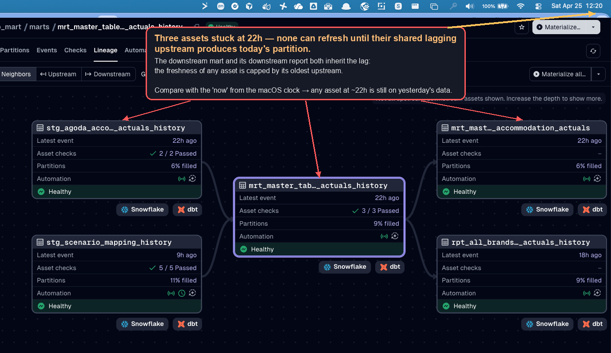
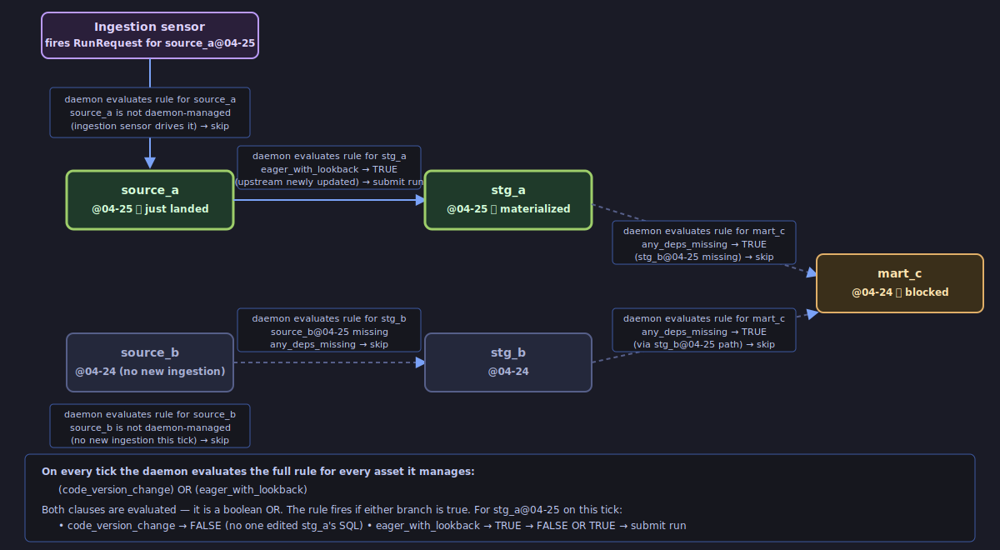
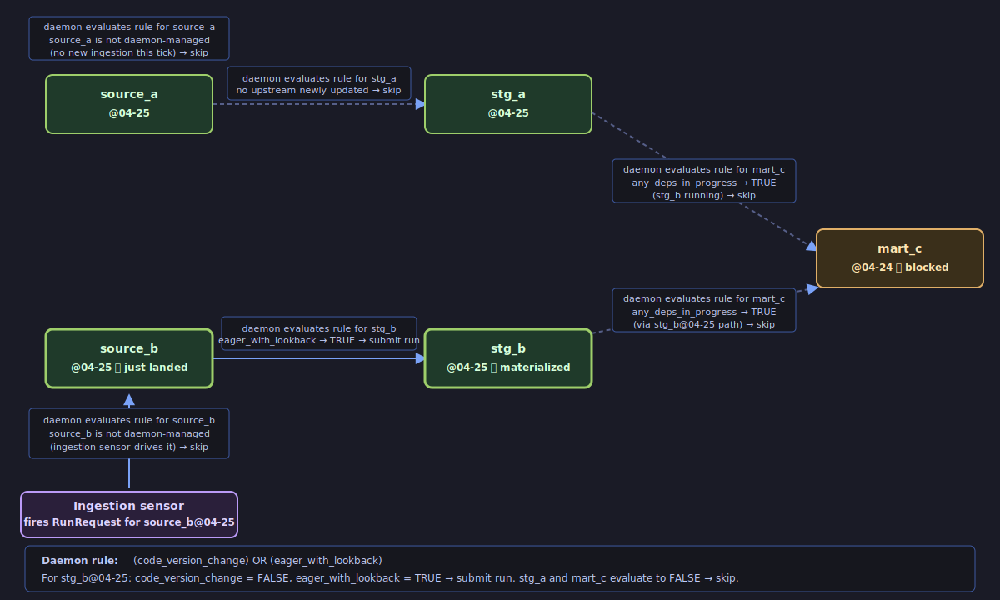
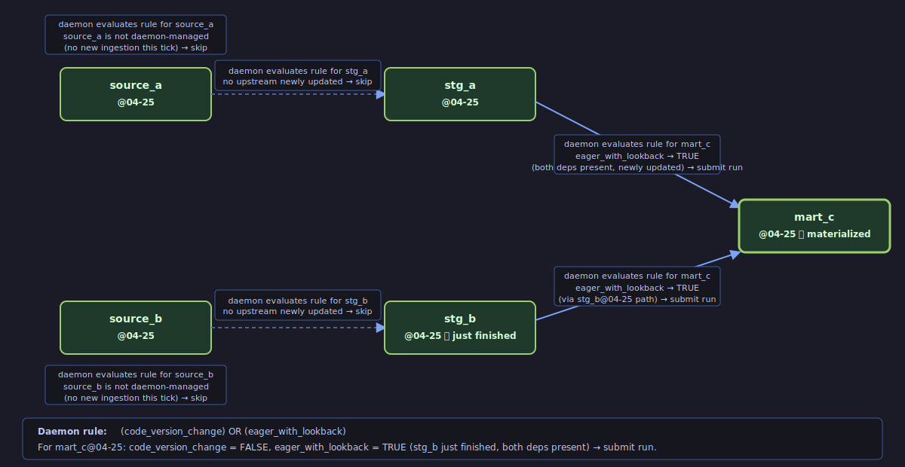
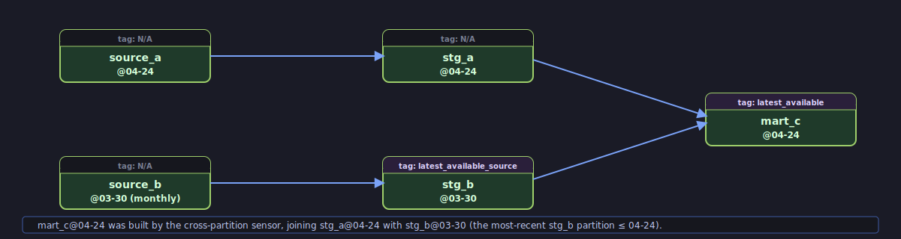
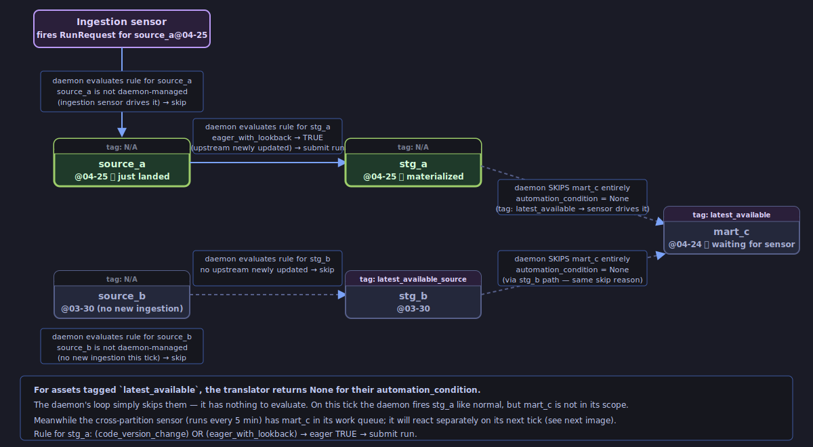
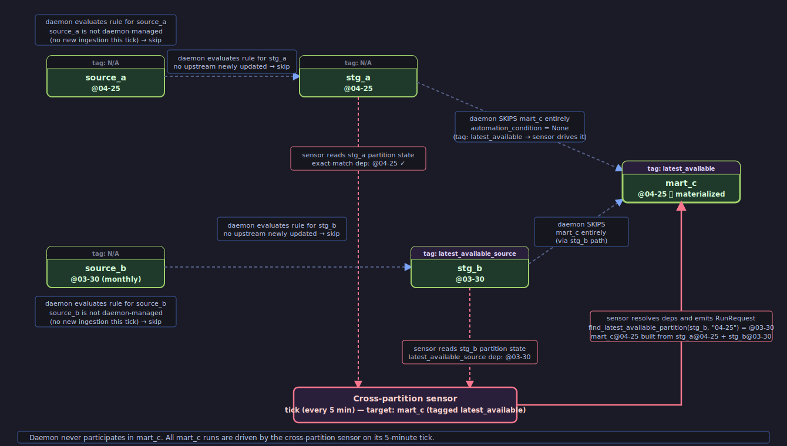
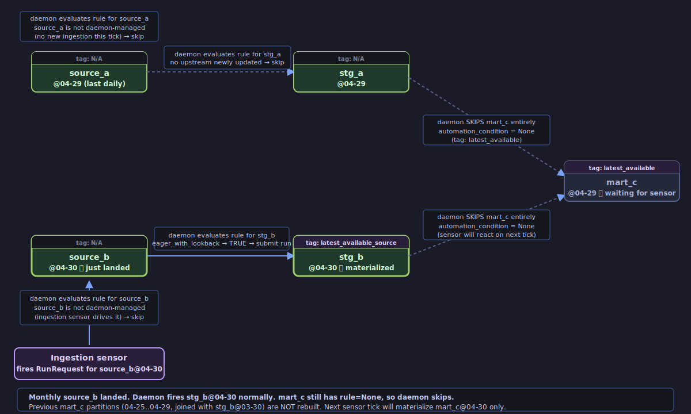
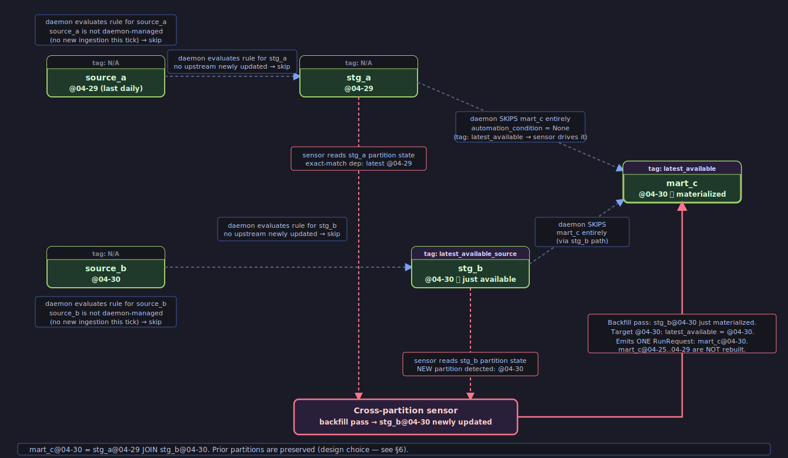

# Why use Dagster — orchestration features that matter in practice

## 1. Four problems Dagster solves out of the box — Airflow … it's complicated

The four scenarios below are the everyday mechanics of a partitioned data warehouse:
- **A** — knowing which days of a table are loaded, missing, or failed. 
- **B** — only building a joined table when all its upstreams are ready *for the same day*. 
- **C** — handling a reference table that updates monthly while its consumers run daily. 
- **D** — re-running a model when its SQL changes. 

Each is easy to describe in English and surprisingly awkward to build in a DAG-centric orchestrator — Airflow can do all four, but only by extending the orchestrator with tracking tables, custom sensors, or date-math in every consumer DAG. Dagster expresses each with a built-in primitive.

> **A note on Airflow versions.** Every "In Airflow:" paragraph below describes Airflow ≤ 3.1 — the version most teams are still running. Airflow 3.2 (April 2026, AIP-76) added partition-aware assets — `PartitionedAssetTimetable`, partition mappers, partition keys on asset events — which narrows the gap on Scenarios A and B. If you're on ≤ 3.1, the comparisons below are faithful and the gap is real today. If you already know 3.2, read this as a choice: close the gap by migrating to 3.2's asset model, or adopt a platform that's been asset-first from the start. Even where 3.2 reaches feature parity, the underlying architectural difference remains — Airflow is a DAG-run-centric orchestrator with an asset layer on top, so partitions are projections of DAG runs onto assets; Dagster is asset-first, so asset and partition state is the primitive and "runs" are what happen when Dagster decides an asset needs to be (re)materialized. That difference shows up in ergonomics even where feature parity has been reached.

### Scenario A — "Did yesterday's data actually land in this table?"

You want to open a dashboard and see, for a daily-loaded table, exactly which days are loaded, which are missing, and which failed. A DAG-centric orchestrator does not store that — you build and maintain it yourself.

**In Airflow:** the unit of record is a DAG run — `(dag_id, logical_date, status)`. That doesn't answer "which days of *this table* are loaded": one DAG run can load many days (a backfill), one day can be loaded by several DAG runs (reprocessing, late arrivals), and data can be written outside any DAG entirely. The common workaround is a side-table the pipeline writes on every load — `(table_name, snapshot_date, status, run_id)` — plus a dashboard that reads it. You own that schema, you enforce it by convention in code review, and you special-case every backfill, rerun, and out-of-band write. Airflow ≤ 3.1's UI has no view organized by table (3.2's Assets UI adds one — see the note at the top of §1).

**In Dagster:** the unit of record is `(asset, partition, status, timestamp)` — the table and the day are first-class keys. The UI shows a bar per table with one cell per day, regardless of which run or backfill loaded it. Loaded, missing, and failed map directly to stored state — no side-table, no convention, no reconstruction.

**Net effect:** "which days of this table are loaded?" is a built-in UI view, not a side-system you build.


*Dagster's Partitions panel for a single landing table. The bar at the top and the list on the left show every daily partition — green = materialized, grey = missing. The header counts (Materialized 177, Missing 668) are table-scoped. The annotation explains a concrete gap: for three specific days the source published no control-table row, so the ingestion sensor never fired, so the landing partition was never created. Dagster records the absence at the table+day level. Airflow's unit of record ("did the DAG run?") cannot express this without a team convention mapping runs to days.*

### Scenario B — "Only build the joined mart when both inputs for that day are ready"

A downstream mart joins two upstream tables (call them `upstream_a` and `upstream_b`) on `snapshot_date`. The April 25 join must not run until both `upstream_a` and `upstream_b` have April 25 data — otherwise April 25 A would be joined to April 24 B, producing wrong results.

**In Airflow:** the closest expression is "run the mart DAG once both upstream DAGs have finished since my last run." That sounds right but is not — if `upstream_a` finishes April 25 at 10am and `upstream_b` is still stuck on April 24 (late), Airflow sees "both have run since last time," fires the join, and the output is wrong. Aligning "both finished **for the same day**" requires custom Python in every consumer DAG to inspect what date each upstream produced.

**In Dagster:** the join's rule is "run me for day X when `upstream_a@X` and `upstream_b@X` both exist." If April 25 A is ready but April 25 B is not, the April 25 join waits. The April 24 join (both done) runs normally. One rule, applied automatically, per day. No custom code in each consumer.

**Net effect:** same-day alignment is a built-in dependency rule, not hand-written date-math in every consumer.



*Dagster's asset-graph view of a mart and its neighbours. Each tile shows the time since the asset's last event; here, four downstream assets are all at "Latest event 22h" because one shared upstream has not produced today's partition yet. The image demonstrates the consequence Scenario B argues for — nothing downstream fired with mismatched-day data. Airflow's closest behaviour ("both upstream DAGs have run since I last ran") does not inspect upstream partition dates and would have fired the join anyway.*

#### Walking through a day

Take a small graph — `source_a` and `source_b` feeding `stg_a` and `stg_b`, both feeding `mart_joined`, then `mart_joined` feeding `report_kpis`. All five assets are daily-partitioned and have been materialized through April 24. On April 25, `source_a` arrives on time but `source_b` is five hours late:

| When (UTC, Apr 25) | Actor | What happens |
|---|---|---|
| 10:00 | Ingestion sensor | `source_a@04-25` lands → materialized. |
| 10:00:30 | Daemon tick | `stg_a@04-25` → TRUE (upstream newly updated, deps present) → run submitted. `stg_b`, `mart_joined`, `report_kpis` all evaluate FALSE because `source_b@04-25` / `stg_b@04-25` are still missing. |
| 10:01 | Run completes | `stg_a@04-25` materialized. |
| 10:01:30 | Daemon tick | `mart_joined@04-25`: `any_deps_missing()` still TRUE (`stg_b` not there) → skip. |
| *(hours pass — `source_b` is delayed)* | | |
| 15:00 | Ingestion sensor | `source_b@04-25` lands → materialized. |
| 15:00:30 | Daemon tick | `stg_b@04-25` → TRUE → run submitted. |
| 15:01 | Run completes | `stg_b@04-25` materialized. |
| 15:01:30 | Daemon tick | `mart_joined@04-25`: both upstreams present, both newly updated, no deps in progress → TRUE → run submitted. |
| 15:02 | Run completes | `mart_joined@04-25` materialized. |
| 15:02:30 | Daemon tick | `report_kpis@04-25` → TRUE → run submitted. |
| 15:03 | Run completes | Whole graph consistent for `2026-04-25`. |

A few things worth noting:

- **There was never a "DAG run for April 25."** Each asset moved forward when *its own* dependencies were satisfied — closer to Airflow's `ExternalTaskSensor` / dataset scheduling than to classic DAG scheduling.
- **`mart_joined` was never rebuilt against mismatched-day inputs.** No wasted compute, no inconsistent output — the join was not materialized against `stg_a@04-25` / `stg_b@04-24`.
- **Only one partition was materialized per asset**, not the whole table. The dbt materialization strategy (`incremental` + `delete+insert` on `snapshot_date`) means only April 25 rows were touched in Snowflake.

### Scenario C — "One upstream updates on a slower cadence than its downstream"

A reference table (e.g. a calendar, exchange rates, a dimension table) only changes around month-end. A downstream mart sits on top of it. What "sits on top" means is a **business decision** with three reasonable answers, and the value of Dagster is that it lets you pick any of the three without rewriting the pipeline. Airflow forces custom Python inside every consumer DAG for any of them.

The three possible behaviours:

- **C1 — "Keep running daily, use the latest available reference value each day."** Most common. The mart materializes every day. Today's daily upstreams contribute today's data; the reference contribution is whatever last month-end's partition has, until a new one eventually lands. When it does, the mart from that day forward uses the new value. Days already materialized are **not** rewritten.

- **C2 — "Block the daily mart until this month's reference table is in."** Stricter. The mart produces nothing for April 1–29 if April's reference hasn't arrived. On April 30 the reference lands and the mart starts materializing. Trade-off: fully consistent on the reference dimension, but 29 days of no output.

- **C3 — "Make the mart monthly."** Simplest. The mart itself is monthly-partitioned. Once per month, when the reference updates, it fires. No daily output at all. Appropriate for month-end close reports.

Decision table:

| If the business says… | Pick |
| --- | --- |
| "Give me numbers every day, even if the reference is stale on that dimension." | C1 |
| "Don't show me anything until the reference is final for the month." | C2 |
| "This is a month-end report; it should only exist per month." | C3 |

**In Airflow** (all three modes): the daily mart can run on a daily schedule (monthly updates don't flow in cleanly), be triggered by the monthly upstream (only runs once a month), or carry custom date-math Python inside the consumer DAG. Every consumer DAG needs its own copy of the chosen semantics — there is no built-in vocabulary for "cadence-aware downstream."

**In Dagster:** all three are a single rule choice on the downstream asset. The details (which tag, which rule) are in §2.

**Net effect:** C1/C2/C3 become a tag/rule choice per asset, not a rewrite per pipeline.


*Paired tags `latest_available` (consumer) and `latest_available_source` (upstream) — together they tell Dagster: ignore cadence alignment, let the consumer run on its own schedule using the upstream's most recent partition.*

#### How C1 works under the hood — `latest_available` + `cross_partition_sensor`

The default `eager_with_lookback` rule works beautifully when *every* upstream shares the *same* partition grain. It breaks when an upstream updates on a different cadence: `dim_mec_calendar` is daily-partitioned but its upstream `stg_booking_mec_calendar` only publishes around month-end. There is no April 25 partition of the MEC calendar — there's a March 31 one, and the next one won't appear until end of April. Under `eager_with_lookback`, `any_deps_missing()` would always be true and the mart would never materialize.

This repo solves it with two tags and one sensor (see §2.2 for the tag definitions):

- Tagging the downstream mart `latest_available` makes the translator return `None` — the daemon stops managing it.
- `cross_partition_sensor` (ticks every 5 minutes) picks it up instead. For each `latest_available` asset, the sensor walks its upstreams, splits them into "exact-match" and `latest_available_source` buckets, and runs four discovery passes: **new partition** (exact upstream partition appeared), **backfill** (exact upstream partition was re-materialized), **code version** (SQL changed), **expansion** (target has only latest-available upstreams — fan out up to 7 days).
- For each candidate partition, `find_latest_available_partition(upstream_partitions, target)` returns the most recent upstream partition ≤ target. No date limit — an irregular upstream from months ago is fine, because that's the point.

#### Walking through C1 — two days around a month-end

Take the same five-asset graph from Scenario B (`source_a`, `source_b`, `stg_a`, `stg_b`, `mart_joined`) plus a MEC calendar staging `stg_mec_calendar` (tagged `latest_available_source`, only updates ~monthly) and a new downstream `mart_with_mec` (tagged `latest_available`) that joins `mart_joined` with the calendar.

**State on April 24, 23:59:**
- daily assets materialized through `2026-04-24`;
- `stg_mec_calendar` last partition is `2026-03-31` (published at March month-end);
- every `mart_with_mec` partition from `2026-04-01` onwards was joined against `stg_mec_calendar@2026-03-31`, because that was the latest available at the time.

| When | Actor | What happens |
|---|---|---|
| 10:00 Apr 25 | Ingestion sensor | `source_a@04-25` lands. |
| 10:00:30 | Daemon tick | `stg_a@04-25` → run submitted. `mart_with_mec` is tagged `latest_available`, so the daemon **skips it entirely**. |
| 15:00 Apr 25 | Ingestion sensor | `source_b@04-25` lands. |
| 15:00:30 | Daemon tick | `stg_b@04-25` → run submitted. |
| 15:01:30 | Daemon tick | `mart_joined@04-25` → both exact-match upstreams present → run submitted. `mart_with_mec` still skipped by the daemon — but now sitting at `04-24`. |
| 15:05 | Cross-partition sensor tick | Scans manifest, finds `mart_with_mec`. Upstreams: `mart_joined` (exact) now has `04-25`, target doesn't. **Pass 1 (new_partition)**: `04-25` is a candidate. `find_latest_available_partition(stg_mec_calendar_partitions, "04-25")` returns `03-31`. Emits `RunRequest(partition="04-25", latest_deps=stg_mec_calendar@03-31)`. |
| 15:06 | Run completes | `mart_with_mec@04-25` materialized, joining `mart_joined@04-25` with `stg_mec_calendar@03-31`. |
| *(Apr 25 → Apr 29 — same daily flow; every `mart_with_mec` partition joins against `stg_mec_calendar@03-31`)* | | |
| 12:00 Apr 30 | MEC ingestion sensor | April MEC calendar is published. Sensor materializes `stg_mec_calendar@04-30`. |
| 12:05 Apr 30 | Cross-partition sensor tick | For `mart_with_mec`: `stg_mec_calendar` was recently updated. **Pass 2 (backfill)**: ask, for each existing target partition, whether `04-30` is the new `latest_available`. For target `04-30`: yes (`find_latest_available_partition([04-30], "04-30") = 04-30`) → candidate. For target `04-29` and older: `04-30` is *after* them, so not a candidate. Only `mart_with_mec@04-30` gets re-materialized. |

Two things worth internalising:

- **April 25–29 are not rebuilt** when the April calendar lands. Those partitions were materialized with the March snapshot; the agreed semantic in this repo is "use the latest available at the time of the run." Changing that would require different tags and/or different pass logic — it is a business decision, not a bug.
- **Age of the latest-available source is not the sensor's concern.** If we ran the same trace on April 20 — 20 days into the cycle, `stg_mec_calendar@03-31` is three weeks old — the sensor happily uses it. `find_latest_available_partition` has no time limit, and the lookback window (§2.4) does not apply because the daemon doesn't manage this asset. Whether "three weeks old" is *too* old is a freshness question (§4.2, proposed), surfaced as an alert, not a scheduling one.

### Scenario D — "I just edited a model's SQL — re-run the latest day automatically"

A bug is fixed in a model's `.sql` file and merged. The latest partition of that model should re-run on its own, so the corrected numbers appear by the next morning.

**In Airflow:** Airflow does not know the SQL changed — a DAG run does not carry a fingerprint of the code it executed. To get "the SQL changed, therefore re-run," each run must be tagged with the git commit SHA (or a per-task hash of the `.sql` file), persisted somewhere — an XCom, a side-table, an external store — compared on the next schedule tick, and a retrigger decision made. That's a system the team builds and maintains: the hashing, the storage, the comparison, the retrigger, plus handling for manual rerun edge cases. Cosmos (the dbt-in-Airflow integration) doesn't change this either — its closest mechanism is dbt's own `state:modified` comparing two manifests in CI, which reruns *once at deploy time*, not continuously as the daemon evaluates.

**In Dagster:** code-version tracking is built in. The primitive is literally one line:

```python
AutomationCondition.code_version_changed()
```

For dbt-derived assets, Dagster fingerprints each model's compiled SQL on every code-load and stores that fingerprint on the asset. On the next daemon tick, if the current fingerprint differs from the one recorded at the last materialization, the condition is true and the latest partition is re-submitted. This primitive is already in the default rule in this repo (see `code_version_change` in §2.4). Nothing to build — the merge itself is the trigger.

---

### What Dagster doesn't give you for free

The pitch above risks sounding one-sided, so three honest qualifications (about §1 as a whole, not about Scenario D specifically):

- **Cross-cadence joins need custom code — on both sides.** `cross_partition_sensor` in this repo is ~850 lines of Python: a sensor class, four discovery passes, cursor management, and a `find_latest_available_partition` helper. Dagster supplies the *primitives* (the `None`-to-skip-daemon escape hatch, the manifest walk, per-partition `RunRequest`) — but the *policy* is hand-written. Airflow 3.2's partition mappers are not a one-to-one replacement (see Scenario C), but the engineering effort to build latest-available semantics on either platform is comparable. What Dagster gives you is the ability to drop that custom logic into the surrounding orchestration model without replacing it.

- **The lookback window is a tuning knob, not a guarantee.** `eager_with_lookback` bounds daemon propagation to the last N days, and N has to be chosen deliberately — too tight and ordinary Friday-drop / Monday-fix operational lateness becomes manual backfill work; too loose and a late-arriving partition from months ago silently rebuilds an entire downstream branch. The mechanism gets you a lot, but you still own the number. See §2.4.

- **Airflow + Cosmos is the honest comparison for simpler pipelines.** Single-cadence data (all daily, or all monthly), no partition-level state tracking, no cross-cadence joins — Cosmos gives you task-per-model dbt visibility, per-model retries, and post-model `dbt test` in a shorter path than building out a Dagster code location. The case for Dagster lands when the pipeline has the shape this repo's does: multiple cadences, partition state that matters, and dependencies that need to reason about dates rather than just run-to-run readiness.

### How the pieces fit together

<p align="center">
  
</p>

---

## 2. How you control this behaviour — tags, rules, and code

Every behaviour described in §1 is ultimately expressed as **one rule per asset**. Rules are called `AutomationCondition`s. They are assigned to assets in Python — and the flow used by this repo is:

```
dbt sql model has tag  →  translator reads tag  →  translator decides AutomationCondition
```

But tags are **not the only way** to do this, and the tags themselves are not magic Dagster keywords. This section walks through what your options are in general, then shows exactly how this repo implements them.

### 2.1. The plumbing — ways Dagster lets you attach a rule to an asset

Dagster is agnostic about *how* an asset gets its rule. It only cares that by the time the asset is loaded, it has one (or `None`, meaning "the daemon won't manage me"). The four approaches below are the common ways to wire that up — use whichever fits where your assets come from.

**1. Via a `DagsterDbtTranslator` subclass.** When your assets come from dbt's `manifest.json` (this repo's case for everything except landing), Dagster calls `DagsterDbtTranslator.get_automation_condition(dbt_resource_props)` once per dbt node. You subclass it, inspect the node's properties — tags, meta, config, resource_type, name, group, anything in the manifest — and return the rule. This is where every dbt-derived rule lives. One function, one file, per-asset granularity for hundreds of models at once.

**2. Declaratively in dbt `meta:`.** An alternative input for approach #1 — instead of branching the translator on tags, branch it on a `meta:` block in each dbt model's YAML:

```yaml
models:
  - name: dim_mec_calendar
    meta:
      dagster:
        cadence: latest_available
```

The translator reads `dbt_resource_props["meta"]["dagster"]["cadence"]` and branches on it. Equivalent in power to tags and namespaced (less risk of colliding with a dbt selector). This repo uses tags (§2.2) rather than `meta:`, but the translator pattern is the same.

**3. Directly on a Python `@asset` decorator.** For assets that are hand-coded in Python (not dbt-derived), attach the rule at the call site:

```python
from dagster import asset, AutomationCondition

@asset(automation_condition=AutomationCondition.eager())
def my_table():
    ...
```

One asset, one rule, all in the source file.

**4. Via an asset factory function.** When assets are generated programmatically — typically from a configuration file or an external schema — the factory builds each `@asset` and can pass `automation_condition=...` through at construction time. Policy like "tables configured as monthly get `AutomationCondition.on_cron('0 0 1 * *')`, everything else gets `eager()`" lives in the factory.

This is how landing assets are built in this repo: `bhi_imp/assets/landing/` reads `ingestion_sources.yaml` and generates one `@asset` per configured source. The factory does not attach an `automation_condition` because landing assets are sensor-driven (§3, Driver B) — the per-brand ingestion sensor is the rule that fires them, and the factory's job ends at building the asset and wiring it to its sensor.

> **In this repo**: everything that lives in `dbt_project/` — the staging, marts, and reporting models, plus seeds — is dbt-derived and goes through the `DagsterDbtTranslator`, which assigns each one a rule based on its tags and resource type. Landing (non-dbt, Python-generated) assets are built by the `Asset Factory`. There are no dbt snapshots in this repo.

### 2.2. The tags — inputs this repo feeds into the translator

`latest_available` and `latest_available_source` are **not Dagster keywords or dbt keywords**. They are plain strings invented by this codebase. Dagster treats all dbt tags as arbitrary metadata; the meaning is given entirely by the translator and sensor that read them.

Tags are declared in a dbt model's `{{ config(...) }}` block (in the `.sql` file) or in the model's `_properties.yml` entry:

```sql
-- stg_booking_mec_calendar.sql
{{ config(tags=['staging', 'latest_available_source']) }}

SELECT ...
```

The two tags this repo defines:

| Tag | Placed on | Effect |
| --- | --- | --- |
| `latest_available` | A downstream model whose upstreams update on a different cadence | The translator returns `None` for this asset. The asset daemon stops managing it. `cross_partition_sensor` takes over and applies "use the latest available upstream partition" semantics. |
| `latest_available_source` | The upstream whose partition the downstream should pick "latest available" from | Marks this upstream as non-exact-match. The sensor will not require a partition-matching upstream; it will use `find_latest_available_partition` to choose the most recent partition ≤ target. |

Any model without these tags gets the default rule (see §2.4).

Tags are cheap to add, change, and remove — they are part of the dbt model file and nothing else. No Dagster-side registration step is needed.

### 2.3. The routing — how the translator reads those tags and decides who manages the asset

The wiring lives in **exactly two places**: a translator method (code-load time) and a sensor (runtime). Each reads one tag.

**Half 1 — the translator reads the *downstream* tag** and decides whether the daemon manages the asset at all. `CustomDagsterDbtTranslator.get_automation_condition()` in `bhi_imp/assets/dbt_imp_mart/utilities.py`, simplified:

```python
def get_automation_condition(self, dbt_resource_props):
    if "latest_available" in dbt_resource_props.get("tags", []):
        return None                                           # daemon opts out

    if dbt_resource_props["resource_type"] == "seed":
        return new_seed_added | code_version_change

    return code_version_change | eager_with_lookback          # default
```

**Half 2 — the sensor reads the *upstream* tag** and decides which partition of each upstream to use. `cross_partition_sensor` walks each `latest_available` asset's dependencies and splits them into two buckets:

```python
if "latest_available_source" in dep_tags:
    latest_available_deps.append((dep_name, dep_key))    # → pick latest ≤ target
else:
    exact_match_deps.append((dep_name, dep_key))         # → require same partition
```

Exact-match upstreams must carry the target's partition. `latest_available_source` upstreams are resolved with `find_latest_available_partition` — the most recent partition at or before the target.

**Consequences of this wiring, worth internalising:**

- **Changing the default rule for every dbt model** = editing the translator's `else` branch. One function, one file.
- **Changing the behaviour for one specific model** = adding a tag to its `.sql` file. If the tag is new, add one `if` branch to the translator.
- **Per-asset custom behaviour without a tag** = also possible. The translator sees the full dbt node props and can branch on anything: resource type, schema, model name, group, `meta:` block.

**To replicate in another project:** reproduce both halves. Subclass `DagsterDbtTranslator` with your own `if tag: return None` branch, write a sensor that walks the manifest for tagged assets and resolves their deps with your own "latest ≤ target" helper (or whatever suits the case), then add the tags to your dbt models. Dagster supplies the primitives; the policy — tag names, which tag triggers what — is yours.

### 2.4. The default rule — what ordinary dbt models get when no routing tag fired

#### How to read the three rules below

The three rules presented here — `eager_with_lookback`, `code_version_change`, `new_seed_added` — are **not Dagster keywords**. They are Python variables defined by this repo in `bhi_imp/assets/dbt_imp_mart/utilities.py`. Each is a boolean expression composed of Dagster's reserved `AutomationCondition` primitives using `&` (AND), `|` (OR), and `~` (NOT) — much like a `weather_superb = hour_between(...) & is_daylight() & temperature_between(...)` you'd compose from a weather library's primitives.

With that in mind, the three conditions in order of importance:

| # | Rule (English pseudo-code) | Real Python | What it means |
| --- | --- | --- | --- |
| 1 | <span style="font-size: smaller">**`eager_with_lookback`** — the staple of Dagster orchestration.<br><br>`eager() WITHOUT in_latest_time_window() AND`<br>`in_latest_time_window(lookback_delta=168 hours) AND`<br>`all_deps_blocking_checks_passed()`</span> | <span style="font-size: smaller">`eager_with_lookback = (`<br>&nbsp;&nbsp;&nbsp;&nbsp;`AutomationCondition.eager().without(`<br>&nbsp;&nbsp;&nbsp;&nbsp;&nbsp;&nbsp;&nbsp;&nbsp;`AutomationCondition.in_latest_time_window()`<br>&nbsp;&nbsp;&nbsp;&nbsp;`)`<br>&nbsp;&nbsp;&nbsp;&nbsp;`& AutomationCondition.in_latest_time_window(`<br>&nbsp;&nbsp;&nbsp;&nbsp;&nbsp;&nbsp;&nbsp;&nbsp;`lookback_delta=timedelta(hours=168)`<br>&nbsp;&nbsp;&nbsp;&nbsp;`)`<br>&nbsp;&nbsp;&nbsp;&nbsp;`& AutomationCondition.all_deps_blocking_checks_passed()`<br>`).with_label("eager")`</span> | If any upstream of mine was materialized more recently than I was, and all upstreams have the partition I need, and all upstream data-quality checks passed — re-materialize me. Only for partitions within the last 7 days. |
| 2 | <span style="font-size: smaller">**`code_version_change`**<br><br>`in_latest_time_window() AND`<br>`code_version_changed() AND`<br>`NOT in_progress() AND`<br>`NOT any_deps_missing() AND`<br>`NOT any_deps_in_progress()`</span> | <span style="font-size: smaller">`code_version_change = (`<br>&nbsp;&nbsp;&nbsp;&nbsp;`AutomationCondition.in_latest_time_window()`<br>&nbsp;&nbsp;&nbsp;&nbsp;`& AutomationCondition.code_version_changed()`<br>&nbsp;&nbsp;&nbsp;&nbsp;`& ~AutomationCondition.in_progress()`<br>&nbsp;&nbsp;&nbsp;&nbsp;`& ~AutomationCondition.any_deps_missing()`<br>&nbsp;&nbsp;&nbsp;&nbsp;`& ~AutomationCondition.any_deps_in_progress()`<br>`).with_label("code version changed")`</span> | If someone merged a change to this model's SQL (or the seed's CSV content changed), and all upstream data exists and isn't in flight, re-materialize the latest partition. |
| 3 | <span style="font-size: smaller">**`new_seed_added`**<br><br>`in_latest_time_window() AND`<br>`missing() AND`<br>`NOT in_progress()`</span> | <span style="font-size: smaller">`new_seed_added = (`<br>&nbsp;&nbsp;&nbsp;&nbsp;`AutomationCondition.in_latest_time_window()`<br>&nbsp;&nbsp;&nbsp;&nbsp;`& AutomationCondition.missing()`<br>&nbsp;&nbsp;&nbsp;&nbsp;`& ~AutomationCondition.in_progress()`<br>`).with_label("new seed added")`</span> | If this seed has never been materialized and nobody is currently loading it, load it. |

Source: `bhi_imp/assets/dbt_imp_mart/utilities.py`.

**The lookback window in rule 1 is the core guarantee**: the daemon only considers partitions from the last N days. Anything older is out of scope — manual backfill required. Here `N = 168 hours` (7 days) — the value this doc recommends as a default, for the reasons worked through below.

#### Why have a window at all?

Without a bound, `eager_with_lookback` would consider every partition ever, and any late-arriving landing partition from months ago would fan out and rebuild its entire downstream branch — usually expensive, sometimes wrong (old data has often been reconciled differently downstream), and almost always surprising. The window forces late-arrival handling past the threshold to be an **explicit human decision** — a UI backfill, not a silent recomputation.

**7 days is a good default** because it covers the realistic operational rhythm: a source can drop on Friday evening, nobody notices until Monday afternoon (~66–72 hours in), triage and fix consume another day, and the partition is still well inside the window when the daemon next evaluates it. 168 hours also happens to match the `EXPANSION_PARTITION_LIMIT = 7` already baked into the cross-partition sensor, keeping the two mechanisms internally consistent.

Note: **the window is a mechanism, not an alert.** It silently decides what the daemon does; it never tells anyone "a partition was landed but not propagated because it was outside the window." The complementary signal — "something is stale, a human should look" — belongs in freshness policies with alerting (§4.2, proposed).

#### What a too-tight window feels like on a bad week

Abstractly, the lookback is a bound on the daemon's evaluation set. Concretely, it is the difference between "the pipeline quietly catches up" and "you open a ticket and go click 'Materialize selected.'" To see the shape of it, imagine the Scenario B graph (`source_a`/`source_b` → `stg_a`/`stg_b` → `mart_joined` → `report_kpis`) running with a 96-hour (4-day) window:

- **April 25–28** — `source_a` stops arriving. The daemon does nothing during this period — it only reacts to updates, and there are none. `source_b` keeps arriving on its daily schedule.
- **May 2, 09:00** — `source_a` finally lands, and the ingestion sensor catches up by materializing all four missing snapshots (`04-25`, `04-26`, `04-27`, `04-28`) as separate `RunRequest`s.
- **May 2, 09:00:30** — daemon tick. `in_latest_time_window(lookback_delta=96h)` evaluates true for partitions within ~4 days of *now* — that means `04-28` onwards. So the daemon propagates `04-28` through `stg_a`, `mart_joined`, `report_kpis` (because `source_b@04-28` has been there for days). Partitions `04-25`, `04-26`, `04-27` were just materialized at landing but are **outside** the window. The daemon will not touch them.

Three partitions of landing data now exist with no downstream counterpart. Nothing automatic will reconcile that. Two ways out, both manual:

1. **Backfill from the Dagster UI.** Select the affected downstream assets, click *Materialize selected…*, pick the partition range `2026-04-25` → `2026-04-27`, submit. Dagster walks the dependency graph and launches per-partition runs in order. This is the Airflow-equivalent of `airflow dags backfill`, with the difference that you select assets and partitions instead of DAG + date range.
2. **Re-trigger via the ingestion job.** Each brand has a job (e.g. `transactions_ingestion_job_bcom`) that can be kicked off manually for specific snapshot dates — but this only re-ingests landing; downstream still needs a UI backfill unless the partitions happen to be *inside* the window at the next daemon tick.

With a 168-hour (7-day) window, this Friday-drop / Monday-fix path lands inside the window and the daemon catches up on its own. That's the argument for 168h as the default used throughout this doc.

---

## 3. The full flow, in order

Reading §2 linearly can leave the impression that all four subsections run at once. They don't. There are **two timescales** in play, and keeping them separate is the key to understanding when each piece fires: code-load (once per deploy) and runtime (continuously, forever). The translator described in §2 belongs to the first timescale; the daemon and sensors belong to the second.

### Timescale 1 — code-load (happens once per deploy)

This is the plumbing. It runs **once** when Dagster loads the code location — i.e., when the webserver or daemon starts, or when the project is hot-reloaded after a deploy.

```
1. Dagster boots and loads the code location.
2. Dagster reads dbt's manifest.json (built ahead of time by `dbt parse` / `dbt compile`).
3. For each dbt node in the manifest:
       a. Dagster calls CustomDagsterDbtTranslator.get_automation_condition(node).
       b. Translator inspects node.tags, node.resource_type, etc.
       c. Translator returns either None (daemon opts out) or one of the
          rules defined in §2.4 (eager_with_lookback / code_version_change /
          new_seed_added, combined according to the node's tags and type).
       d. Dagster stamps that rule onto the asset's in-memory definition.
4. Landing (non-dbt) assets are built by the landing factory (§2.1, approach 4).
   The factory does not attach an AutomationCondition — these assets are
   sensor-driven, so their automation_condition is left unset (equivalent to None).
5. cross_partition_sensor, ingestion sensors, and any schedules are registered
   and started — independently of the translator.
6. Code-load finishes. Nothing else happens at this timescale until the next deploy.
```

Translator returning `None` is **not** a fallback check for whether a schedule or sensor exists. The translator doesn't know about those. It only decides whether the asset daemon is involved. Whether a sensor or schedule ends up firing the asset is decided entirely by which sensors/schedules target it, wired elsewhere in the codebase.

The `latest_available` tag is consumed **here**. At runtime nothing re-reads it.

### Timescale 2 — runtime (runs repeatedly, forever)

Once loaded, the code location enters steady state, and there are **three independent drivers** that can cause an asset to materialize. Each runs in parallel on its own tick rate and does not coordinate with the others:

- **Driver A — the asset daemon.** Reads the rule the translator stamped on the asset's `automation_condition` field. If the field is `None`, the daemon skips the asset forever. If it holds a rule, the daemon re-evaluates it about every 30 seconds (the `AutomationConditionSensorDefinition` default, configurable) and fires a run when the rule is true.
- **Driver B — sensors.** `cross_partition_sensor`, the ingestion sensors, and any other sensor each run their own tick loop with their own logic. They do not look at `automation_condition`.
- **Driver C — schedules.** Cron-driven jobs. Also ignore `automation_condition`.

An asset can be driven by any combination of these (or by none, in which case it only materializes when someone clicks "Materialize" in the UI). A `None` from the translator means "daemon, keep your hands off." It says nothing about sensors and schedules — they are wired independently and remain free to fire the asset.

**Driver A — the asset daemon** (Dagster built-in, ticks about every 30 seconds by default).

```
On each tick, for each asset × partition whose .automation_condition is not None:
    1. Evaluate the AutomationCondition expression.
          - eager_with_lookback fires when an upstream of mine was materialized
            more recently than I was and all my deps are present — this is the
            everyday "an upstream updated, propagate downstream" trigger, which
            drives the vast majority of the graph.
          - code_version_change fires when the model's SQL (or seed's CSV)
            checksum changed since my last materialization.
          - new_seed_added fires when a seed has never been loaded before.
    2. If the expression is TRUE → submit a run for that asset-partition.
       If FALSE → skip.
    3. Next tick, re-evaluate from scratch.
```

**Driver B — cross-partition sensor** (custom, ticks every 5 minutes). Only manages assets tagged `latest_available`. The daemon does not touch these assets; the sensor is the *sole* driver for them in this repo.

```
Every 5 minutes:
    1. Scan the manifest for assets tagged `latest_available` (the work queue).
    2. For each such asset:
          a. Walk its upstreams. Split them into two buckets by tag:
             - latest_available_source → "pick most recent ≤ target" bucket
             - everything else          → "exact match required" bucket
          b. Run four discovery passes to decide which partitions of this
             asset should be (re)materialized:
              - new_partition    (a new common upstream partition appeared)
              - backfill         (an upstream was updated for a partition
                                  the target already has)
              - code_version     (the dbt SQL checksum changed)
              - expansion        (target has only latest-available upstreams —
                                  generate up to 7 days of target partitions
                                  from upstream date range)
          c. For each candidate partition, resolve the latest_available
             upstreams via find_latest_available_partition(...) — which picks
             the most recent upstream partition ≤ target with no date limit.
          d. Emit a RunRequest for each accepted partition.
    3. Dagster launches the requested runs.
```

**Driver C — schedules** (Dagster built-in, cron-driven). A schedule attaches a cron expression to a job, and when the cron fires, every asset in that job gets materialized. This repo runs several schedules today — they target OneStream ingestion jobs, the data-mapping job, and the dynamic-table-cloning job (see `bhi_imp/schedules/`). None of them happen to target a dbt job at the moment, but the mechanism is the same either way: a schedule can fire any asset, including an asset whose `automation_condition` is `None`. Schedules never consult the translator.

### 3.1. End-to-end: daily flow driven by the asset daemon

A small graph — two sources, two stagings, one mart — across April 24 and 25, with all three internal assets driven by the default rule (asset daemon). The full day-by-day trace with timestamps lives in §1 Scenario B; here we just show the visual progression so the driver handoffs are obvious.

**① Before — April 24 (end of day, everything materialized):**

<p align="center">
  
</p>

**② April 25, 10:00 — `source_a@04-25` lands; daemon reacts:**

<p align="center">
  
</p>

**③a April 25, 15:00 — `source_b@04-25` lands; `stg_b` fires:**

<p align="center">
  
</p>

**③b April 25, 15:01 — next tick, `mart_c` fires:**

<p align="center">
  
</p>

**④ After — April 25 (end of day, everything materialized):**

<p align="center">
  
</p>

> Alternative representation: an asset-routing view is available in [`images/routing.svg`](images/routing.svg) — a static picture of how any asset gets routed to a driver (daemon / sensor / schedule / nothing). Not embedded here because it is less clear than the sequence above.

### 3.2. End-to-end: daily flow driven by the cross-partition sensor

Same graph, but now `stg_b` is tagged `latest_available_source` (it only updates monthly) and `mart_c` is tagged `latest_available` — the daemon does **not** manage `mart_c`; the cross-partition sensor does. `source_a`/`stg_a` remain daily. The full trace with timestamps is in §1 Scenario C; the sequence below highlights the driver handoff.

**① Before — April 24 (end of day, monthly source_b last landed on 03-30):**

<p align="center">
  
</p>

**② April 25, 10:00 — `source_a@04-25` lands; daemon fires `stg_a` but skips `mart_c`:**

<p align="center">
  
</p>

**③ April 25, 15:05 — cross-partition sensor tick; `mart_c@04-25` materializes:**

<p align="center">
  
</p>

**④ April 30, 09:00 — monthly `source_b@04-30` lands; daemon fires `stg_b`:**

<p align="center">
  
</p>

**⑤ April 30, 09:05 — cross-partition sensor backfill pass; `mart_c@04-30` materializes:**

<p align="center">
  
</p>

---

## 4. Appendix

### 4.1. Data-quality gates on auto-materialization

Two mechanisms prevent an asset (and everything downstream of it) from being auto-materialized when the data is bad. They solve slightly different problems, but they are not co-equal: **dbt tests are the primary gate and should stay that way for any future project on this stack.** Dagster asset checks fill the specific gaps dbt tests cannot cover. In order of preference:

1. **If you can express it as a dbt test, write it as a dbt test.** It lives next to the model, runs as part of `dbt build`, and gates auto-materialization for free (§4.1.1).
2. **If it needs Python or cross-database logic, write it as a Dagster asset check** — and reach for `blocking=True` only when stopping the *next* downstream run matters, not just failing the current one (§4.1.2).

#### 4.1.1. dbt tests — the primary gate

Every `_*_properties.yml` file in this repo declares dbt tests (`not_null`, `unique`, `accepted_values`, `relationships`, `dbt_utils` expressions, custom SQL). They are the main line of defence and they already gate auto-materialization. Here is how:

1. The daemon decides to re-materialize some asset `X`. Dagster submits a run.
2. The run executes `dbt build` on `X`. `dbt build` first builds the Snowflake table, then runs the tests declared on it.
3. If any test fails, dbt marks the asset's materialization as **failed**. Dagster records the failed state for that partition.
4. On the next daemon tick, every downstream of `X` evaluates its `AutomationCondition`. Because `X`'s latest partition is failed — not present as a successful materialization — the downstream's `~any_deps_missing()` check keeps it from firing.
5. The block propagates all the way through the graph. Nothing downstream of the failed test auto-materializes until someone fixes the data and the upstream re-runs cleanly.

**Net effect**: failing dbt tests stop the cascade. No Dagster-specific configuration is needed for this — it is the natural consequence of `dbt build` failing the asset and the daemon reading that failure on the next tick. This should cover the vast majority of what you need.

#### 4.1.2. Dagster asset checks — the gap-filler

Some assertions cannot be expressed as dbt tests. For those — and only for those — Dagster's **asset checks** are the next tool. They run after an asset materializes and report pass/fail to Dagster directly. Two situations where they add something dbt tests cannot:

- **Assertions you can't express in SQL against a single dbt model** — e.g. comparing today's row count to yesterday's, cross-database consistency checks, or anything requiring Python.
- **Cross-run gating.** dbt tests fail the *current* run; with `blocking=True`, a Dagster asset check prevents the *next* run from even being scheduled. This is the only capability neither dbt nor the daemon's default rule gives you. In this repo the wiring is in place but dormant: the default rule already includes `AutomationCondition.all_deps_blocking_checks_passed()` (§2.4), so a single blocking check anywhere in the graph will immediately start gating downstream runs — no extra wiring needed. Activation is a one-line change in a dbt properties file (Example 1 below) or a single `@asset_check(blocking=True)` in Python (Example 2).

Two examples of how you would add one.

**Example 1 — a dbt test upgraded to a blocking Dagster asset check.** Because the translator has `enable_asset_checks=True`, every dbt test is already visible as an asset check in the Dagster UI. To make it blocking, add one `meta` block in the properties file — the test still lives in dbt, you've just asked Dagster to hold the next downstream run while it's failing:

```yaml
models:
  - name: stg_transactions
    columns:
      - name: transaction_id
        tests:
          - not_null:
              meta:
                dagster:
                  asset_check:
                    blocking: true
```

Effect: the null check continues to do what dbt tests always do (fail the current run), and additionally the Dagster daemon will not schedule any downstream run until the check is back to passing.

**Example 2 — a custom Python check with no dbt equivalent**: "today's row count must be within ±20% of yesterday's."

```python
from dagster import asset_check, AssetCheckResult, AssetCheckSeverity

@asset_check(asset="stg_transactions", blocking=True)
def row_count_within_expected_range(context):
    current = context.resources.snowflake.execute(
        "SELECT COUNT(*) FROM stg_transactions WHERE snapshot_date = CURRENT_DATE - 1"
    )
    previous = context.resources.snowflake.execute(
        "SELECT COUNT(*) FROM stg_transactions WHERE snapshot_date = CURRENT_DATE - 2"
    )
    ratio = current / max(previous, 1)
    return AssetCheckResult(
        passed=0.8 <= ratio <= 1.2,
        severity=AssetCheckSeverity.ERROR,
        metadata={"current": current, "previous": previous, "ratio": ratio},
    )
```

If the ratio falls outside the band, the check fails, Dagster records it, and (because `blocking=True`) the daemon holds off on scheduling downstream runs until the ratio is back in range.

### 4.2. Freshness policies and alerts (proposed)

> **Status: proposal.** None of the mechanisms in this subsection are adopted in `imp_finance_mart` today. This section documents what a first-pass implementation would look like; it is included in the appendix rather than the main body because the rest of the doc describes current behaviour.

The lookback window (§2.4) decides what the daemon does automatically. It is silent — when a partition falls outside the window, nobody is notified. The complementary mechanism is a **freshness policy**: a declarative statement of "how old is too old" that Dagster evaluates on a schedule and surfaces as an **asset check** result. Failing checks feed Dagster's built-in alert policies to notify owners (e.g. by email). No custom sensor.

Freshness and the lookback window are independent knobs and they should be chosen together. One controls mechanism, the other controls signal:

| Knob | What it controls | What it does NOT do |
|---|---|---|
| Lookback window (e.g. 7 days) | What the daemon will auto-propagate | Notify anyone if it blocked propagation |
| Freshness policy (per asset) | When someone is told "this asset is stale" | Change what the daemon materializes |

A 7-day window without freshness alerts leaves "silent failure past day 7"; freshness alerts without a reasonable window still require manual backfill for late data that lands outside the window. **Both together** give you automatic catch-up within the window *and* a visible alert when something has fallen behind its cadence's tolerance.

#### 4.2.1. Cadence-aware policies — don't mix cadences

A single global tolerance (say "alert if older than 7 days") is wrong for any pipeline that mixes daily, weekly, and monthly assets. A monthly asset is not stale at day 10; a daily asset is very stale at day 10. Alerts with noise in them get ignored, so the policies must be **attached to the asset** and tuned per cadence class.

Proposed classes:

| Cadence class | Freshness tolerance — alert fires if the latest partition is older than… | Typical use |
|---|---|---|
| Daily | 7 days | Transactional assets, daily marts, daily stagings |
| Weekly | 10–14 days | Anything on a weekly cadence |
| Monthly | 35–45 days | Month-end reports, monthly dimensions |

Values are suggestions; the right number is the business tolerance. The important property is that **a daily asset and a monthly asset never share the same policy**.

#### 4.2.2. How it would look in Dagster

The shape of the declarative policy, for a time-partitioned asset:

```python
from datetime import timedelta
from dagster import build_time_partition_freshness_checks

daily_freshness_checks = build_time_partition_freshness_checks(
    assets=[...daily assets...],
    freshness=timedelta(days=7),
)

monthly_freshness_checks = build_time_partition_freshness_checks(
    assets=[...monthly assets...],
    freshness=timedelta(days=40),
)
```

Each call produces a set of asset checks Dagster evaluates on a schedule. When the latest materialized partition for one of those assets is older than the given delta, the check flips to `FAILED`. For a non-time-partitioned asset the analogue is `build_last_update_freshness_checks` with the same shape.

Classifying which bucket an asset falls into is easier if the codebase already distinguishes cadences — a dbt group, a tag, or a `meta:` block is enough. The translator can then bucket each dbt node into the right list at code-load:

```python
def classify(dbt_resource_props):
    tags = dbt_resource_props.get("tags", [])
    if "monthly" in tags:
        return "monthly"
    if "weekly" in tags:
        return "weekly"
    return "daily"

# After the translator walks the manifest and groups assets into
# daily_assets / weekly_assets / monthly_assets:

daily_freshness_checks   = build_time_partition_freshness_checks(
    assets=daily_assets,   freshness=timedelta(days=7),
)
weekly_freshness_checks  = build_time_partition_freshness_checks(
    assets=weekly_assets,  freshness=timedelta(days=14),
)
monthly_freshness_checks = build_time_partition_freshness_checks(
    assets=monthly_assets, freshness=timedelta(days=40),
)
```

The routing pattern is the same one we already use for `latest_available` (§2.3) — the translator inspects the dbt node and decides the bucket. One function, one file, per-asset granularity without hand-curation.

> **API note.** The three APIs in this area are easy to confuse:
>
> - `build_time_partition_freshness_checks` / `build_last_update_freshness_checks` — the current check-based approach, used above. Recommended for new work. Asset checks show up in the UI alongside dbt tests and feed alert policies directly.
> - `FreshnessPolicy(deadline_cron=..., lower_bound_delta=...)` — the *current* `FreshnessPolicy` class (reused name, new API since Dagster 1.11). Attaches a policy to an asset declaratively rather than producing a check object. Equivalent in power for the common cases.
> - Legacy `FreshnessPolicy(maximum_lag_minutes=...)` / `@freshness_policy(maximum_lag_minutes=...)` — **deprecated**. Renamed to `LegacyFreshnessPolicy` in Dagster 1.11 and moved to `dagster.deprecated` (`from dagster.deprecated import LegacyFreshnessPolicy`). Don't use for new code.
>
> This subsection uses the check-builder approach throughout because it composes cleanly with the alert-policy wiring described in §4.2.3.

#### 4.2.3. Wiring the alert

Dagster Cloud (Dagster+) ships built-in **alert policies** configurable in the UI or in `dagster_cloud.yaml`. The event types relevant here:

- `ASSET_CHECK_FAILED` — a freshness check (or any other asset check) failed.
- `JOB_FAILURE` — a run failed (dbt test, infra error, etc.). Complementary — it catches the "something broke this run" case that asset checks alone cannot.

Each alert policy targets a set of assets (by group, key, or tag) and routes to a destination: email, Slack, Microsoft Teams, PagerDuty, or a generic webhook. For email, the flow is:

```
asset freshness check fails
    ↓
Dagster records ASSET_CHECK_FAILED event
    ↓
matching alert policy fires
    ↓
email is sent to the owner list configured in the policy
```

Configuration is declarative, happens in the Cloud UI, and requires no redeploy to change thresholds or recipients. Owners can be per-group (`team:finance-data@...`) or per-asset.

#### 4.2.4. What you should *not* do

- **Do not write a custom sensor that polls for staleness.** Freshness policies + alert policies express the same thing declaratively and are evaluated on Dagster's own schedule. A custom sensor is more code, less visibility in the UI, and harder to tune.
- **Do not use one global freshness tolerance.** Mixing cadences in one policy guarantees either false-positive noise or false-negative silence. Classify by cadence and attach per-class.
- **Do not couple freshness to the lookback window.** They express different things. The window is "what I will auto-propagate;" the freshness policy is "what is old enough to tell a human about." Having both independent is the point.

#### 4.2.5. Summary

The pair we want:

- **Lookback window = 7 days** (the mechanism): the daemon will auto-catch-up late arrivals within a week, so ordinary operational lateness does not require a manual backfill.
- **Freshness policies per cadence class** (the signal): daily, weekly, monthly assets get different tolerances; breaches surface as asset checks.
- **Built-in Dagster Cloud alert policy on `ASSET_CHECK_FAILED`** (the notification): stale assets email their owners. No custom sensor.

---

## 5. Comparison with `fpa-finance_mart_w_data_vault`

A sister Dagster project — `fpa-finance_mart_w_data_vault` — runs on a similar stack (Dagster + dbt + Snowflake) but has evolved a different set of emphases. This section inventories Dagster-specific features that are present in one codebase and absent (or less developed) in the other, so engineers moving between the two know what's available where and what might be worth porting.

Both projects sit on close Dagster versions (imp on 1.13.0 / dagster-dbt 0.29.0; FPA on 1.12.20 / dagster-dbt 0.28.20), so the differences below are design-choice differences, not version gaps.

### 5.1. Features present in `imp_finance_mart` and absent (or weaker) in FPA

- **Metric-based sensor cursors.** The ingestion sensors in this repo persist full metrics (hash + row count + snapshot date) per scope in the cursor JSON, so re-triggers happen only when the data actually changed. FPA's custom sensor polls a status table and uses a plain timestamp cursor.
- **Cross-partition sensor (`cross_partition_sensor`).** The ~850-line sensor described in §1/§2/§3 has no counterpart in FPA; FPA expresses cross-cadence dependencies through dbt layering alone.
- **Health-check companion sensor.** `sensor_health_check_mec` reads another sensor's cursor for `source_errors` and fails loudly so Dagster alerts can fire. FPA has no equivalent.
- **Cursor pruning utility.** `prune_cursor_entries()` keeps sensor cursors from growing unboundedly.
- **`QueuedRunCoordinator` with tag-based concurrency limits** in `dagster.yaml` (10 global, 3 per transaction sensor). FPA does not configure run-level queueing.
- **Run-level retry policy in `dagster.yaml`** (`run_retries` block). FPA applies retries only at the asset level.
- **YAML-driven ingestion config (`ingestion_sources.yaml`).** A single source of truth drives landing asset, job, and sensor generation.
- **Explicit dbt-tests-as-asset-checks conversion** via `DagsterDbtTranslatorSettings(enable_asset_checks=True)`, plus per-model test aggregation attached as metadata on the Output event.
- **`SnowflakeResource` alongside the Snowflake IO manager** for direct DDL/DML (used by cloning ops and ingestion helpers).
- **Real pytest coverage** including E2E tests (`test_rmiles_e2e.py`) and lightweight config tests that don't need a full Dagster instance.

### 5.2. Features present in `fpa-finance_mart_w_data_vault` and absent (or weaker) in this repo

The table below focuses only on the FPA-biased direction — features where FPA has something this repo doesn't, or has a more developed version. Use it as a shopping list for "what would we pick up if we ported FPA's pattern here?"

| Feature | Status in `imp_finance_mart` | Status / What it does in FPA |
|---|---|---|
| `FreshnessPolicy` framework | Absent. §4.2 above is a *proposal*; no freshness policies are attached today. | FPA ships a `StandardPolicies` factory with three predefined policies (`DAILY_STANDARD`, `DAILY_MORNING`, `MYSQL_DAILY_STANDARD`) plus a custom string parser (`"daily@HH:MM~Xh"`, `"weekly@DAY:HH:MM~Xh"`). Policies are attached declaratively from the dbt `meta:` block (`meta.dagster.freshness_policy: "daily@20:00~19h"`) and the custom translator parses them at code-load time. Applied to MySQL assets and dbt models; backs FPA's cron-based deadline + lower-bound-delta freshness model (`FreshnessPolicy.cron(deadline_cron="0 20 * * *", lower_bound_delta=timedelta(hours=19), timezone="Europe/Amsterdam")`). This is roughly the §4.2 proposal already built. |
| `AutomationConditionSensorDefinition` | Absent. All automation conditions are evaluated by the default asset daemon. | FPA defines **six** `AutomationConditionSensorDefinition`s — one per dbt layer (`vault`, `mart`, `report`, `sox_report`) plus `email` and `anaplan` groups. Each sensor scopes condition evaluation to a specific asset selection. This is the newer declarative pattern replacing the single global daemon loop and lets FPA tune tick cadence / concurrency per layer. |
| Blocking asset checks (`blocking=True`) | Absent. Asset checks in this repo (control table, completeness, dbt tests) are informational — they fail the current run but do not gate the *next* downstream run. §4.1.2 describes what this would look like. | FPA has **40+ DVS blocking asset checks** on Iceberg/Fintech tables, generated via `DVSAssetCheckGenerator` from `dvs_asset_check_metadata.py`. Each check queries the external DAS API, computes a completeness SLI per partition, and returns `AssetCheckResult(passed=..., blocking=True, metadata={...})`. Because the default rule includes `all_deps_blocking_checks_passed()`, a failure immediately stops downstream scheduling — no manual wiring. |
| `@multi_asset_sensor` | Absent. All sensors are single-target or multi-target-via-dispatch custom sensors. | FPA uses `@dg.multi_asset_sensor` for `retrieve_asset_materialization_logs` — it monitors the SOX-tagged dbt asset set and fires the `asset_materialization_logs_job` on materialization events (24h interval). Gives Dagster-native event-driven audit logging instead of a custom polling query. |
| K8s resource tags on jobs / RunRequests | Absent. Container sizing is whatever the Dagster Cloud deployment default provides. | FPA attaches `dagster-k8s/config` tags on both jobs and `RunRequest`s to request specific CPU/memory (e.g. `requests: {cpu: "18", memory: "60Gi"}`, `merge_behavior: "SHALLOW"`). Lets heavy ingestion jobs reserve large pods while light jobs stay cheap. Also sets `multiprocess.max_concurrent` inside the run config (8 for MySQL/Anaplan, 20 for dynamic ingestion). |
| Sized Snowflake warehouse matrix | Single Snowflake resource + one IO manager + a second IO manager for OneStream. | FPA defines a **matrix of 20+ Snowflake resources** combining key (admin / fmart / fds / opex) × size (base / small / medium / large / sensor / 5xlarge / 6xlarge). Each asset picks a `io_manager_key="fds_sf_io_manager_small"` appropriate to its workload. Big transformations get 6xlarge warehouses without blocking small models behind them. |
| `with_source_code_references` + Git linking | Absent. The Dagster UI shows asset definitions but no clickable "view source" link. | FPA wraps all assets in `dg.with_source_code_references(...)` with `AnchorBasedFilePathMapping`, so the UI renders clickable links from each asset definition back to its file in GitLab. Speeds up debugging ("where is this asset defined?") to one click. |
| `DbtManifestAssetSelection.build()` | Absent. dbt asset selections use `AssetSelection.assets(...)` or `AssetSelection.groups(...)`. | FPA uses `DbtManifestAssetSelection.build(manifest=..., select="fqn:finance_mart.fpa.sox_reports", dagster_dbt_translator=...)` in job definitions. This means jobs can be scoped using dbt's own FQN / tag selection syntax (`tag:sox`, `fqn:path.to.group`) with `.upstream()` / `.downstream()` walks, keeping dbt and Dagster selection semantics in sync. |
| `load_assets_from_package_module` | Absent. Assets are imported and spread into the `Definitions(assets=[...])` list by hand. | FPA uses `load_assets_from_package_module` for the data-readiness and admin-report asset packages — any `@asset` added to those packages is auto-registered. Cuts boilerplate when a team owns a whole package of assets. |
| Reusable `AutomationCondition` builder functions | Inline. `eager_with_lookback`, `code_version_change`, `new_seed_added` are defined once in `utilities.py` and reused by the translator, but there are no parameterised builders. | FPA exposes **parameterised builders** in `finance/resources/automation_condition.py`: `eager_with_lookback(lookback_delta)` and `wait_for_upstream_with_lookback(lookback_delta, once_per_partition=True)`. Different layers can pass different deltas (48h here, 24h there) without copying the expression. |
| Dagster Cloud Insights asset + schedule | Basic. `.with_insights()` is called in the dbt CLI stream, but the Insights asset/schedule isn't registered. | FPA registers `create_snowflake_insights_asset_and_schedule(start_date=..., snowflake_resource_key="admin_sf")` and folds its assets + schedule into `Definitions`. Gives Dagster Cloud Insights a proper lineage node for the Snowflake cost/perf metrics pull. |
| Custom resource ecosystem | `SftpResource` (custom), `OneStreamResource` (custom), plus the official Snowflake / dbt resources. | FPA adds `AnaplanResource`, `MicroStrategyResource`, `GSheetResource`, `SmtpEmailService`, `DASResource` (Data Availability Service), `DVSResource` (Data Validation Service). Reflects FPA's wider surface — import/export to planning and BI systems — rather than a one-way Snowflake landing pipeline. |
| Multi-profile dbt setup | Single dbt profile (`dbt_imp_mart`) and one `DbtCliResource`. | FPA has **nine dbt profiles** (`main`, `fpa_sox`, `fpa_automation_rpt`, `fpa_rpt`, `flight`, `payment_accounting`, `tax`, `fpa_static`, `fpa_opex`), each exposed as its own resource (`{profile}_dbt`). Lets different business domains compile/run with isolated target configs (different warehouses, schemas, thread counts) from within one Dagster code location. |
| Schedule emitting multiple partitions per tick | Single-partition schedules. Each schedule emits one `RunRequest` targeting one partition. | FPA's `daily_dq_check_schedule` yields **two** `RunRequest`s per tick — one for partition `now-1d`, one for `now-2d` — so a missed tick doesn't leave a hole. Also uses non-UTC timezones (`Europe/Amsterdam`) natively. |
| Non-UTC schedule timezone | All schedules run in UTC. | FPA schedules declare `execution_timezone="Europe/Amsterdam"` so business-hour crons (`"0,30 5-23 * * *"`) line up with local expectations even across DST. |
| Sidecar shutdown signal (`atexit`) | Absent. | FPA registers an `atexit` handler that touches `/tmp/SHUTDOWN_SIDECARS` on run-worker exit, so sidecar containers (e.g. SSH tunnels, local proxies) know to terminate cleanly. Solves the "hanging pod" problem on Kubernetes when the main process exits before sidecars. |
| `InsightsSnowflakeResource` wrapper | Uses plain `SnowflakeResource` + `SnowflakePandasIOManager`. Insights are only collected via the dbt CLI `.with_insights()` call. | FPA wraps its Snowflake resources in `InsightsSnowflakeResource` (from `dagster_cloud.dagster_insights`) so **every** Snowflake query — not just dbt ones — gets reported to Dagster Cloud Insights with cost attribution. |

### 5.3. What to consider porting, in order

If we were to pick up patterns from FPA, the highest-leverage ones for this repo are:

1. **Freshness policies + alert policy wiring.** §4.2 is already a proposal; FPA's `StandardPolicies` factory and `meta:`-driven attachment is a concrete template to copy.
2. **Blocking asset checks** on the handful of partitions where "don't build downstream if this is wrong" is the right answer. The default rule here already reads `all_deps_blocking_checks_passed()`, so activation is one tag in a properties file (see §4.1.2 Example 1).
3. **`with_source_code_references`** for UI → GitLab navigation. Pure ergonomic win, no runtime behaviour change.
4. **K8s resource tags on jobs** so heavy ingestion runs can be sized independently of the default pod.
5. **Parameterised automation-condition builders** so different layers can carry different lookback windows without duplicating the boolean expression.

The features we would *not* port lightly — `AutomationConditionSensorDefinition` per layer, the sized Snowflake matrix, multi-profile dbt — solve problems this repo doesn't currently have (single-profile, single-warehouse, single-team). Worth revisiting if the scope widens.
