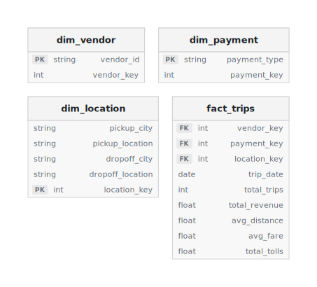

<div align="center"><strong>Real-Time Ride Data Pipeline — Full Setup Guide</strong></div>

> **Last verified:** 2026-04-20


## Table of Contents

- [Section 1: Architecture](#section-1-architecture)
  - [Architecture Overview](#architecture-overview)
  - [Data Flow](#data-flow)
  - [Component-by-Component Walkthrough](#component-by-component-walkthrough)
  - [Services Used](#services-used)
  - [S3 Bucket Structure](#s3-bucket-structure)
- [Section 2: Step-by-Step Console Guide](#section-2-step-by-step-console-guide)
  - [Phase 1: Create the MSK Cluster](#phase-1-create-the-msk-cluster)
  - [Phase 2: Create EC2 Instance (Kafka Client)](#phase-2-create-ec2-instance-kafka-client)
  - [Phase 3: Install Kafka Libraries on EC2](#phase-3-install-kafka-libraries-on-ec2)
  - [Phase 4: IAM Policy and Role for EC2 → MSK Access](#phase-4-iam-policy-and-role-for-ec2--msk-access)
  - [Phase 5: Create Kafka Topic and Test](#phase-5-create-kafka-topic-and-test)
  - [Phase 6: Run the Kafka Producer Script](#phase-6-run-the-kafka-producer-script)
  - [Phase 7: Create S3 Bucket and Firehose Stream (MSK → S3)](#phase-7-create-s3-bucket-and-firehose-stream-msk--s3)
  - [Phase 8: AWS Glue — Transform Raw Data to Refined](#phase-8-aws-glue--transform-raw-data-to-refined)
  - [Phase 9: EMR Serverless — Dimensional Modelling (Star Schema)](#phase-9-emr-serverless--dimensional-modelling-star-schema)
  - [Phase 10: Glue Crawler and Athena — Catalog and Query](#phase-10-glue-crawler-and-athena--catalog-and-query)
  - [Phase 11: Step Functions — Automate the EMR Spark Job](#phase-11-step-functions--automate-the-emr-spark-job)
  - [Phase 12: EventBridge — Automate the Full Pipeline](#phase-12-eventbridge--automate-the-full-pipeline)
  - [Phase 13: EC2 Instance for dbt](#phase-13-ec2-instance-for-dbt)
  - [Phase 14: Install and Configure dbt on EC2](#phase-14-install-and-configure-dbt-on-ec2)
  - [Phase 15: dbt Project Setup — Sources and Models](#phase-15-dbt-project-setup--sources-and-models)
  - [Phase 16: dbt Tests](#phase-16-dbt-tests)
  - [Phase 17: dbt Documentation](#phase-17-dbt-documentation)
- [Section 3: Terraform — All Resources](#section-3-terraform--all-resources)
  - [1. VPC + Networking](#1-vpc--networking)
  - [2. EC2 Key Pair](#2-ec2-key-pair)
  - [3. S3 Bucket](#3-s3-bucket)
  - [4. MSK Serverless Cluster](#4-msk-serverless-cluster)
  - [5. EC2 Instance (Kafka Client)](#5-ec2-instance-kafka-client)
  - [6. IAM — EC2 → MSK Access](#6-iam----ec2--msk-access)
  - [7. IAM + Firehose Stream](#7-iam--firehose-stream)
  - [8. IAM + Glue ETL Job](#8-iam--glue-etl-job)
  - [9. EMR Serverless](#9-emr-serverless)
  - [10. IAM + Glue Crawler + Glue Database](#10-iam--glue-crawler--glue-database)
  - [11. Step Functions State Machine](#11-step-functions-state-machine)
  - [12. EventBridge Rule](#12-eventbridge-rule)
  - [13. EC2 Instance (dbt Client)](#13-ec2-instance-dbt-client)
- [Section 4: Troubleshooting](#section-4-troubleshooting)
  - [MSK / Kafka Issues](#msk--kafka-issues)
  - [Step Functions Issues](#step-functions-issues)

---

# Section 1: Architecture

> **Last verified:** 2026-04-20

&nbsp;

## Contents

- [Architecture Overview](#architecture-overview)
- [Data Flow](#data-flow)
- [Component-by-Component Walkthrough](#component-by-component-walkthrough)
- [Services Used](#services-used)
- [S3 Bucket Structure](#s3-bucket-structure)

&nbsp;

This pipeline ingests real-time ride data via **Amazon MSK** (Kafka), transforms it through **Glue** and **EMR Serverless**, builds a star schema in **S3**, and serves analytical queries through **Athena** and **dbt**.

The pipeline uses:
- **Amazon MSK** — managed Kafka cluster for real-time event streaming
- **Amazon Data Firehose** — managed consumer that delivers raw JSON to S3
- **S3** — storage for all data layers (raw, refined, business, scripts)
- **EC2** — hosts Kafka CLI tools and the producer script
- **AWS Glue Job** — Visual ETL for column renames, drops, and derived fields
- **AWS Glue Crawler** — schema discovery and Glue Data Catalog registration
- **Glue Data Catalog** — centralized metadata store for Athena
- **EMR Serverless** — PySpark dimensional modelling (star schema)
- **Step Functions** — orchestrates the daily EMR pipeline
- **EventBridge** — triggers the pipeline on a schedule
- **Amazon Athena** — serverless SQL over S3 via Glue Catalog
- **dbt** — analytics engineering layer on top of Athena
- **IAM** — roles and policies for cross-service access

&nbsp;

## Architecture Overview

> **Diagram:** See [pipeline_architecture.drawio](diagrams/pipeline_architecture.drawio) for the full AWS architecture diagram with service icons and data flow arrows.

> **Star Schema:** 

> **dbt Lineage:** 

&nbsp;

## Data Flow

1. **EC2 Producer** (`kafka_producer.py`) generates continuous ride events (pickup, dropoff, fare, timestamps) and publishes JSON messages to an MSK Kafka topic
2. **Amazon Data Firehose** reads from the MSK topic, buffers records for 5 minutes or 5 MB (whichever comes first), and writes raw JSON to S3 under a time-partitioned path: `s3://ridestreamlakehouse-td/<YYYY>/<MM>/<DD>/<HH>/`
3. **AWS Glue** (Visual ETL job) reads the raw JSON from S3, renames columns, drops unwanted fields, adds derived columns, and writes cleaned CSV to `s3://ridestreamlakehouse-td/Refined/`
   - Trigger: **runs daily** (manual or scheduled)
4. **EMR Serverless** (PySpark job) reads the refined CSV, builds a star schema — 3 dimension tables (`dim_vendor`, `dim_location`, `dim_payment`) and 1 fact table (`fact_trips`) — and writes Parquet to `s3://ridestreamlakehouse-td/Business/processed/dimensions/` and `facts/`
   - Trigger: **Step Functions** orchestrates daily execution
   - Production: partitioned by `trip_date` for efficient querying
5. **Glue Crawler** scans the Parquet files in `Business/processed/`, discovers schemas, and registers tables in the Glue Data Catalog
6. **Amazon Athena** queries tables via the Glue Catalog using serverless SQL
   - **dbt** connects to Athena and builds analytical models (joins, aggregations, business logic)

&nbsp;

## Component-by-Component Walkthrough

Here's what each service does in the pipeline, in the order data touches it.

### What is MSK / Kafka?

**Amazon MSK (Managed Streaming for Apache Kafka)** is a fully managed Kafka cluster service. Kafka is a distributed streaming platform built around four core concepts:

- **Producer** — an application that publishes (writes) messages to Kafka. In this pipeline, the ride event generator running on EC2 is the producer. It sends ride data — pickup location, dropoff location, fare amount, timestamps — as JSON messages into a Kafka topic.
- **Topics** — named channels that organize messages by category. Think of a topic as a feed or stream. Producers write to a topic, consumers read from it (e.g., a `ride_events` topic). Topics are split into **partitions** for parallel processing and horizontal scalability.
- **Consumer** — an application that subscribes to and reads messages from topics. In this pipeline, Amazon Data Firehose acts as the managed consumer — it reads from the MSK topic and delivers records to S3. Consumers track their position (**offset**) in each partition so they can resume where they left off after a restart or failure.
- **Cluster** — a group of Kafka servers (**brokers**) working together. The cluster provides fault tolerance (data is replicated across brokers) and horizontal scalability (partitions are distributed across brokers). AWS MSK is a managed Kafka cluster — AWS handles broker provisioning, patching, and replication.

The **bootstrap server** is the initial connection endpoint that any client (producer or consumer) uses to discover the full cluster. When a client connects, it contacts the bootstrap server address, receives metadata about all brokers and which broker owns which topic partitions, and then connects directly to the appropriate brokers for reading or writing. Think of it as a phonebook — you call one number to get the directory of everyone else. In AWS MSK, the bootstrap server endpoint is found under **View client information** after the cluster is created.

This pipeline uses **MSK Serverless**, which auto-provisions and scales Kafka capacity on demand. There are no brokers to size, no storage to provision, and no ZooKeeper to manage — you create a cluster, get the bootstrap endpoint, and start producing.

> **Why MSK Serverless?** MSK Serverless vs MSK Provisioned — Serverless auto-scales broker capacity, eliminates operational overhead (no broker count decisions, no storage management, no ZooKeeper), and charges per throughput rather than per broker-hour. Provisioned MSK gives fixed capacity and lower per-GB cost at sustained high volume, but requires you to choose instance types, broker counts, and storage. For a tutorial pipeline with variable and intermittent load, Serverless eliminates operational complexity and avoids paying for idle brokers.

**EC2** (`kafka-client`) — Hosts the Kafka CLI tools and the producer script. EC2 is the workstation inside the VPC where you create Kafka topics (`kafka-topics.sh`), test produce/consume from the command line, and run `kafka_producer.py` to generate continuous ride events. The instance must be in the same VPC as the MSK cluster and have an IAM role that permits MSK access. Once data is flowing through Firehose to S3, the EC2 instance is no longer needed for the pipeline to operate — it is a setup and testing tool, not a runtime dependency.

**Amazon Data Firehose** (`ride-data-firehose`) — A fully managed delivery stream that acts as the Kafka consumer. Firehose reads from the MSK topic, buffers records, and writes raw JSON to S3 in micro-batches. It handles all the complexity of consuming from Kafka — offset tracking, retry on failure, backpressure — with zero application code. The output lands in a time-partitioned S3 path (`<YYYY>/<MM>/<DD>/<HH>/`) created automatically based on arrival time.

> **Why Firehose as managed consumer?** Firehose vs a custom Kafka consumer on EC2 — Firehose requires zero code, auto-scales with throughput, handles retries and delivery guarantees out of the box, and integrates natively with MSK as a source. A custom consumer gives more control over processing logic, batching behavior, and output format, but requires you to manage EC2 instances or containers, handle offset commits, and implement retry logic yourself. For a pipeline that simply needs reliable delivery of raw records to S3, Firehose eliminates an entire class of operational burden.

**S3** (`ridestreamlakehouse-td`) — The storage backbone of the entire pipeline. All data lives in a single bucket organized by prefix — raw JSON from Firehose, cleaned CSV from Glue, dimensional Parquet from EMR, PySpark scripts, and Athena query results. S3 serves as both the landing zone for raw ingestion and the permanent analytical store for transformed data. Every downstream service reads from and writes to S3.

**AWS Glue Job** (Visual ETL) — A managed ETL service that runs the first transformation step. The Visual ETL job reads raw JSON from the Firehose output path, renames columns to human-readable names, drops unwanted fields, and adds derived columns (e.g., trip duration calculations). The output is cleaned CSV written to the `Refined/` prefix. Visual ETL provides a drag-and-drop canvas for defining these transformations — no Spark or Python code to write or maintain.

> **Why Glue Visual ETL?** Glue Visual ETL vs a Glue script job vs Lambda — Visual ETL provides a drag-and-drop interface for simple transformations (column renames, drops, type casts, derived fields) without writing or maintaining any code. A Glue script job offers full PySpark flexibility but requires writing and testing Python code. Lambda could handle small-file transformations but has a 15-minute timeout and 10 GB memory limit that makes it unsuitable for growing datasets. For this pipeline's transformation needs — column renames, field drops, and a few derived columns — Visual ETL is sufficient and eliminates script maintenance entirely.

**EMR Serverless** — Runs the PySpark dimensional modelling job that transforms the cleaned CSV into a star schema. The job reads from `Refined/`, applies business logic to build 3 dimension tables (`dim_vendor`, `dim_location`, `dim_payment`) and 1 fact table (`fact_trips`), and writes Parquet to `Business/processed/`. EMR Serverless provisions Spark capacity on demand — you submit a job, it spins up the compute, runs the job, and releases the resources when done. No cluster to manage, no idle capacity to pay for.

> **Why EMR Serverless?** EMR Serverless vs EMR on EC2 vs Glue for Spark — EMR Serverless eliminates cluster management entirely. You submit a Spark job and AWS provisions the compute, scales it during execution, and releases it when the job finishes. Standard EMR on EC2 requires you to choose instance types, manage cluster lifecycle, and pay for idle time between jobs. Glue could run PySpark jobs too, but EMR gives you more control over Spark configuration and access to the full Spark ecosystem. For a daily batch job that runs for minutes and then has no work, Serverless's pay-per-execution model is the most cost-effective option.

**Step Functions** — Orchestrates the daily EMR pipeline. The state machine defines the execution sequence: submit the EMR Serverless job, poll for completion, handle success or failure. Step Functions provides built-in retry logic, timeout handling, and visual execution history. Without it, you would need a cron job or Lambda to submit the EMR job and another mechanism to check whether it finished successfully before triggering the downstream Glue Crawler.

**EventBridge** — Automates the full pipeline on a schedule. An EventBridge rule triggers the Step Functions state machine at a defined interval (e.g., daily), which in turn runs the EMR job, waits for completion, and kicks off the Glue Crawler. EventBridge is the clock that drives the pipeline — without it, you would need to start each run manually.

> **Why EventBridge?** EventBridge vs a direct Lambda trigger or cron — EventBridge decouples the schedule from the target. You can change the schedule, add multiple downstream targets, or apply event filtering without modifying any other resource. A CloudWatch Events cron rule would work for simple scheduling, but EventBridge offers richer event matching, cross-account event routing, and a cleaner integration with Step Functions. For a pipeline that needs reliable daily execution, EventBridge provides the scheduling layer with the least operational friction.

**Glue Crawler** — Scans the Parquet files written by EMR in `Business/processed/`, infers the schema (column names, types, partition structure), and registers the tables in the Glue Data Catalog. The crawler runs after each EMR job completes, ensuring the catalog always reflects the latest data. Without the crawler, you would need to manually define table schemas in the catalog every time the data structure changes.

**Glue Data Catalog** — The centralized metadata store that Athena reads from. It holds table definitions — column names, data types, partition keys, S3 locations — for every dataset the crawler has registered. When you run a query in Athena, it consults the Data Catalog to know where the data lives and what shape it has. The catalog is not a database — it stores no data itself, only metadata about data stored in S3.

**Amazon Athena** — A serverless SQL query engine that runs queries directly against S3 files using the schemas registered in the Glue Data Catalog. There is no infrastructure to manage and no data to load — you write SQL, Athena scans the relevant S3 files, and returns results. You pay per terabyte scanned, so Parquet's columnar format (which allows Athena to skip irrelevant columns) keeps costs low. Athena is the interactive query layer of the pipeline — useful for ad-hoc analysis, data validation, and feeding dbt models.

**dbt** — The analytics engineering layer. dbt connects to Athena as its query engine and builds analytical models — SQL transformations that join dimension and fact tables, compute aggregations, and produce business-ready datasets. Models are version-controlled, tested, and documented. dbt does not move data — it issues SQL statements against Athena, which in turn reads from and writes to S3. This separation means dbt handles the *what* (business logic) while Athena handles the *how* (query execution).

> **Tutorial vs our approach:** The trainer uses a dedicated EC2 instance to install and run dbt, keeping the entire pipeline within AWS. A local install or a container-based approach (e.g., Docker on a developer machine or ECS) would also work — dbt itself is a Python CLI tool that only needs network access to Athena. The dedicated EC2 was chosen for a consistent environment, straightforward access to AWS services without VPN/SSO complications, and reproducibility across different developer setups.

&nbsp;

## Services Used

| Service | Role in Pipeline |
|---|---|
| **S3** (`ridestreamlakehouse-td`) | Storage for all data layers — raw JSON, refined CSV, business Parquet, scripts, and Athena results |
| **EC2** (`kafka-client`) | Hosts Kafka CLI tools and the producer script for topic creation, testing, and event generation |
| **AWS Glue Job** (Visual ETL) | First transformation — renames columns, drops fields, adds derived columns, outputs CSV to `Refined/` |
| **AWS Glue Crawler** | Scans Parquet files in `Business/processed/`, discovers schemas, registers tables in Glue Data Catalog |
| **Glue Data Catalog** | Centralized metadata store — table definitions (columns, types, partitions, S3 locations) for Athena |
| **EMR Serverless** | Runs PySpark dimensional modelling — builds star schema (3 dimensions + 1 fact table) from refined CSV |
| **Amazon MSK** (Serverless) | Managed Kafka cluster for real-time ride event streaming from the EC2 producer |
| **Amazon Data Firehose** (`ride-data-firehose`) | Managed Kafka consumer — reads from MSK topic, buffers, writes raw JSON to S3 |
| **Step Functions** | Orchestrates the daily EMR pipeline — submit job, poll for completion, handle success/failure |
| **EventBridge** | Triggers the Step Functions state machine on a schedule (e.g., daily) to automate the pipeline |
| **Amazon Athena** | Serverless SQL query engine — queries S3 data via Glue Catalog, pay-per-scan pricing |
| **dbt** | Analytics engineering — builds analytical models (joins, aggregations, business logic) on top of Athena |
| **IAM** | Roles and policies for cross-service access — EC2-to-MSK, Firehose-to-S3, EMR execution role, Glue permissions |

&nbsp;

## S3 Bucket Structure

```
ridestreamlakehouse-td/
├── <YYYY>/<MM>/<DD>/<HH>/                            ← Raw JSON from Firehose (auto-partitioned by arrival time)
├── Refined/                                           ← Cleaned CSV from Glue Job
├── Business/
│   └── processed/
│       ├── dimensions/
│       │   ├── dim_vendor/       (parquet)            ← Vendor dimension table
│       │   ├── dim_location/     (parquet)            ← Location dimension table
│       │   └── dim_payment/      (parquet)            ← Payment type dimension table
│       └── facts/
│           └── fact_trips/       (parquet)            ← Trip fact table (partitioned by trip_date)
├── scripts/                                           ← PySpark scripts for EMR Serverless
└── athena-results/                                    ← Athena query output
```

> **Note on raw data path:** Firehose automatically creates the `<YYYY>/<MM>/<DD>/<HH>/` hierarchy based on arrival time. You do not create these folders manually.

> **Note on bucket naming:** S3 bucket names are globally unique across all AWS accounts worldwide. If your chosen name is taken, append a suffix.


---

# Section 2: Step-by-Step Console Guide

This section walks you through creating every AWS resource in the pipeline using the browser console. Each phase builds on the previous one, and most phases end with a link to the equivalent Terraform block in Section 3. Phases 14–17 (dbt setup) have no Terraform equivalent — dbt is installed via CLI.

## Phase 1: Create the MSK Cluster

### What is MSK?

**Amazon Managed Streaming for Apache Kafka (MSK)** is a fully managed Kafka service. You get a Kafka cluster without managing brokers, ZooKeeper, patching, or scaling. The **Serverless** variant auto-scales and you pay per data throughput — no need to choose broker instance types.

### Prerequisites: VPC and Networking

MSK Serverless requires a **VPC** with **subnets in at least 2 Availability Zones** and a **security group**.

- **VPC (Virtual Private Cloud)** — An isolated virtual network within AWS. All resources (EC2, MSK, etc.) live inside a VPC and communicate through it.
- **Subnet** — A subdivision of a VPC tied to a specific Availability Zone. Each AZ gets its own subnet so resources can be distributed for fault tolerance.
- **Availability Zone (AZ)** — A physically separate data center within an AWS region. Spreading resources across AZs means if one data center has issues, the others keep running.
- **Security Group** — A virtual firewall that controls inbound/outbound traffic for resources. Rules specify which ports, protocols, and source IPs are allowed.

#### If your account has a default VPC (fresh/personal account):

New AWS accounts come with a **default VPC** that has subnets in all AZs and a default security group. You can use these directly — no setup needed.

#### If your account has no VPC (corporate/restricted account):

You'll need to create VPC resources via Terraform (see [DevOps Request](#devops-request---terraform-resources) at the bottom).

### Console Steps

1. **AWS Console** → search **MSK** → **Amazon MSK** → **Create cluster**
2. **Creation method:** Custom create
3. **Cluster name:** `MSK`
4. **Cluster type:** Serverless
5. Click **Next**
6. **Networking:**
   - **VPC:** Select your VPC (default VPC or the one created via Terraform)
   - **Availability Zones:** Select 2 zones (e.g. `eu-north-1a`, `eu-north-1b`)
   - **Subnets:** Select one subnet per AZ (auto-populated from the VPC)
   - **Security group:** The default security group will be attached
7. Click **Next** until **Create cluster** → **Create**
8. Wait for status to change from **Creating** to **Active** (takes a few minutes)

### Get the Bootstrap Server Endpoint

Once the cluster is **Active**:

1. Click on the cluster name → **View client information**
2. Copy the **Bootstrap servers** endpoint (e.g. `boot-xxxxx.c2.kafka-serverless.<region>.amazonaws.com:9098`)
3. **Save this** — you'll need it for every Kafka CLI command on the EC2 instance

> Terraform: [1. VPC + Networking](#1-vpc--networking)

---

## Phase 2: Create EC2 Instance (Kafka Client)

### Why EC2?

MSK doesn't have a built-in UI for managing topics or producing/consuming messages. We need a machine **inside the same VPC** that can talk to the MSK brokers over the private network. The EC2 instance acts as our **Kafka client** — we'll install Kafka CLI tools on it and use it to create topics, send test messages, and verify the cluster works.

### Console Steps

1. **AWS Console** → **EC2** → **Launch Instance**
2. **Name:** `Kafka-Client` (or any name)
3. **AMI:** Amazon Linux (default)
4. **Instance type:** `t3.micro` (if free tier eligible) or `t2.micro`
5. **Key pair:** Click **Create new key pair**
   - **Name:** `kafka_access`
   - **Type:** RSA
   - **Format:** `.pem`
   - **Create** — the `.pem` file downloads automatically. Keep it safe.
6. **Network settings:**
   - **VPC:** Same VPC as the MSK cluster
   - **Auto-assign public IP:** Enable
   - **Firewall:** Select **Create security group**
   - **SSH** from Anywhere (`0.0.0.0/0`) is pre-selected ✅
   - Click **Add security group rule** → select **HTTP**, source **Anywhere**
7. **Storage:** 8 GiB (default)
8. Click **Launch instance**

> **Note on key pair:** In a corporate environment where you lack `ec2:CreateKeyPair` permissions, this must be provisioned via Terraform. See [DevOps Request](#devops-request---terraform-resources).

> **Note:** `0.0.0.0/0` means open to the world — fine for learning, not for production.

### ⚠️ Critical: Security Group Configuration for MSK Access

The EC2 instance and MSK cluster **must share a security group** for the EC2 to communicate with MSK. The default security group only allows inbound traffic from resources **within the same security group**. If your EC2 instance was created with a different security group (e.g. `launch-wizard-1`), it will be blocked from reaching MSK.

**Symptom:** Kafka CLI commands time out with `TimeoutException: Timed out waiting for a node assignment`.

**Fix — add the MSK security group to your EC2 instance:**

1. Go to **EC2** → Select your instance → **Actions** → **Security** → **Change security groups**
2. **Add** the default security group (the one your MSK cluster uses)
3. **Save**

Or via CLI:
```bash
aws ec2 modify-instance-attribute \
  --instance-id <your-instance-id> \
  --groups <ec2-security-group-id> <msk-default-security-group-id> \
  --region <your-region>
```

> **How to find which security group MSK uses:** Go to **MSK** → click your cluster → **Networking** section → note the security group ID. Then add that same group to your EC2 instance.

### Connect to the Instance

1. Go to **EC2** → Select your instance → **Connect**
2. Select **EC2 Instance Connect** tab
3. Click **Connect**
4. This opens a browser-based terminal — no `.pem` file needed for this method

> Terraform: [2. EC2 Key Pair](#2-ec2-key-pair)

---

## Phase 3: Install Kafka Libraries on EC2

Once connected to the EC2 instance via Instance Connect, run these commands:

```bash
# 1. Install Java (Kafka requires JVM to run)
sudo yum -y install java-11

# 2. Install Python pip (needed for Python Kafka libraries later)
sudo yum -y install python-pip

# 3. Download Kafka CLI tools (2.8.1 — compatible with MSK Serverless)
wget https://archive.apache.org/dist/kafka/2.8.1/kafka_2.12-2.8.1.tgz

# 4. Extract and make scripts executable
tar -xzf kafka_2.12-2.8.1.tgz
chmod +x kafka_2.12-2.8.1/bin/*.sh

# 5. Download AWS MSK IAM authentication plugin
# MSK Serverless ONLY supports IAM auth — without this JAR, Kafka CLI
# tools cannot authenticate to the cluster.
cd kafka_2.12-2.8.1/libs/
wget https://github.com/aws/aws-msk-iam-auth/releases/download/v2.3.0/aws-msk-iam-auth-2.3.0-all.jar
cd ~

# 6. Create client.properties (IAM auth config for Kafka CLI)
# Every Kafka CLI command will reference this file via --command-config flag.
cat > kafka_2.12-2.8.1/bin/client.properties << 'EOF'
security.protocol=SASL_SSL
sasl.mechanism=AWS_MSK_IAM
sasl.jaas.config=software.amazon.msk.auth.iam.IAMLoginModule required;
sasl.client.callback.handler.class=software.amazon.msk.auth.iam.IAMClientCallbackHandler
EOF

# 7. Set CLASSPATH — tells Java where to find the IAM auth JAR
# Export for current session AND persist in .bashrc for reconnects.
export CLASSPATH=/home/ec2-user/kafka_2.12-2.8.1/libs/aws-msk-iam-auth-2.3.0-all.jar
echo 'export CLASSPATH=/home/ec2-user/kafka_2.12-2.8.1/libs/aws-msk-iam-auth-2.3.0-all.jar' >> ~/.bashrc

# 8. Install Python Kafka packages
# kafka-python: for writing producers/consumers in Python (used later for ride event producer)
# aws-msk-iam-sasl-signer-python: generates IAM auth tokens for kafka-python
pip install kafka-python
pip install aws-msk-iam-sasl-signer-python
```


> Terraform: No Terraform equivalent — this is a CLI-only step.

---

## Phase 4: IAM Policy and Role for EC2 → MSK Access

### Why?

The EC2 instance needs **permission** to talk to the MSK cluster. AWS uses IAM roles to grant permissions to EC2 instances instead of storing credentials on the machine. We create a **policy** (what actions are allowed) and a **role** (who gets those permissions), then attach the role to the EC2 instance.

### What is an IAM Policy?

A JSON document that defines **what actions** are allowed on **which resources**. Our policy grants Kafka cluster operations: connect, create topics, read/write data, describe topics and consumer groups.

### What is an IAM Role?

An identity that AWS services can **assume** to get temporary credentials. Unlike a user (which has permanent credentials), a role is assumed by a service (like EC2) and gets short-lived tokens. The role has policies attached that define what it can do.

### What is an Instance Profile?

A wrapper around an IAM role that allows EC2 instances to assume it. When you attach a role to an EC2 instance via the Console, AWS creates an instance profile automatically behind the scenes. In Terraform, you must create it explicitly.

### Console Steps

1. **AWS Console** → **IAM** → **Policies** → **Create policy**
2. Switch to **JSON** tab, paste:
```json
{
    "Version": "2012-10-17",
    "Statement": [
        {
            "Effect": "Allow",
            "Action": [
                "kafka-cluster:Connect",
                "kafka-cluster:DescribeCluster"
            ],
            "Resource": "*"
        },
        {
            "Effect": "Allow",
            "Action": [
                "kafka-cluster:CreateTopic",
                "kafka-cluster:WriteData",
                "kafka-cluster:ReadData",
                "kafka-cluster:DescribeTopic"
            ],
            "Resource": "*"
        },
        {
            "Effect": "Allow",
            "Action": [
                "kafka-cluster:DescribeGroup",
                "kafka-cluster:AlterGroup",
                "kafka-cluster:ReadData"
            ],
            "Resource": "*"
        }
    ]
}
```
3. **Name:** `Access_to_Kafka_Cluster`
4. Click **Create policy**
5. **IAM** → **Roles** → **Create role**
6. **Trusted entity type:** AWS Service
7. **Use case:** EC2
8. Click **Next**
9. **Search and select:** `Access_to_Kafka_Cluster`
10. Click **Next**
11. **Role name:** `Kafka_Cluster_Access`
12. Click **Create role**
13. Go to **EC2** → Select your instance → **Actions** → **Security** → **Modify IAM role**
14. Select `Kafka_Cluster_Access` → **Update IAM role**

> **Note:** In a corporate environment where you lack IAM permissions, the policy, role, and instance profile must be created via Terraform. See [DevOps Request](#devops-request---terraform-resources).

> Terraform: [4. MSK Serverless Cluster](#4-msk-serverless-cluster)

---

## Phase 5: Create Kafka Topic and Test

### Navigate to the Kafka bin directory

```bash
cd ~/kafka_2.12-2.8.1/bin/
```

### Create a test topic

Replace `<BOOTSTRAP_SERVER>` with your endpoint from Step 1:

```bash
./kafka-topics.sh --create \
  --topic first_topic \
  --command-config /home/ec2-user/kafka_2.12-2.8.1/bin/client.properties \
  --partitions 1 \
  --bootstrap-server <BOOTSTRAP_SERVER>
```

Expected output:
```
WARNING: Due to limitations in metric names, topics with a period ('.') or underscore ('_') could collide...
Created topic first_topic.
```

> The WARNING is informational — Kafka recommends using hyphens (`-`) in topic names instead of underscores (`_`) or periods (`.`).

### Test with Producer (send messages)

```bash
./kafka-console-producer.sh \
  --topic first_topic \
  --producer.config /home/ec2-user/kafka_2.12-2.8.1/bin/client.properties \
  --bootstrap-server <BOOTSTRAP_SERVER>
```

This opens an interactive prompt (`>`). Type messages one per line, then `Ctrl+C` to exit.

### Test with Consumer (read messages)

```bash
./kafka-console-consumer.sh \
  --topic first_topic \
  --consumer.config /home/ec2-user/kafka_2.12-2.8.1/bin/client.properties \
  --from-beginning \
  --bootstrap-server <BOOTSTRAP_SERVER>
```

This reads all messages from the topic from the beginning. `Ctrl+C` to exit.

> **Real-time demo (optional):** Open two Instance Connect tabs to the same EC2 instance. Run the producer in one, the consumer in the other. Messages appear in the consumer instantly as you type them in the producer — demonstrating Kafka's pub/sub model.

> See [Troubleshooting → Phase 5: Kafka Topic](#troubleshooting--phase-5-kafka-topic)
> Terraform: [5. EC2 Instance (Kafka Client)](#5-ec2-instance-kafka-client)

---

## Phase 6: Run the Kafka Producer Script

### What this step does

Instead of manually typing messages into the Kafka console producer, we run a Python script (`kafka_producer.py`) that generates 100 simulated NYC Green Taxi ride records and publishes them to the MSK topic. Each record is a JSON message containing trip details: pickup/dropoff locations, timestamps, fares, passenger count, payment type, etc.

> **Note on data:** The script generates **randomized dummy data**, not real API data. For a real-data alternative, the NYC Taxi & Limousine Commission provides a free REST API (no auth required): `https://data.cityofnewyork.us/resource/gkne-dk5s.json?$limit=100`. See the script's docstring for details.

> **Script reference:** `kafka_producer.py` (in `docs/resources/`) — fully commented with explanations of each section.

### Steps

#### 1. Create the topic for the producer script

The script publishes to a topic called `realtimeridedata`. Create it first:

```bash
cd ~/kafka_2.12-2.8.1/bin/

./kafka-topics.sh --create \
  --topic realtimeridedata \
  --command-config /home/ec2-user/kafka_2.12-2.8.1/bin/client.properties \
  --partitions 1 \
  --bootstrap-server <BOOTSTRAP_SERVER>
```

#### 2. Upload the producer script to the EC2 instance

The script needs to be on the EC2 instance. From the Instance Connect terminal, create the file:

```bash
cd ~
vi producer.py
```

Paste the contents of `kafka_producer.py` (from `docs/resources/`) into the editor. **Before saving**, update these lines at the top of the script with your values:

```python
topicname = 'realtimeridedata'
BROKERS = '<YOUR_BOOTSTRAP_SERVER>'  # e.g. 'boot-xxxxx.c2.kafka-serverless.eu-north-1.amazonaws.com:9098'
region = '<YOUR_REGION>'             # e.g. 'eu-north-1'
```

Save and exit vi (`:wq`).

#### 3. Run the producer

```bash
python3 producer.py
```

Expected output:
```
Starting to send 100 NYC Green Taxi records...
Sent record 1/100: Trip ID trip_0001 - $12.45 - Manhattan to Brooklyn
Sent record 2/100: Trip ID trip_0002 - $8.30 - Queens to Queens
...
Finished! Successfully sent 100 out of 100 records.
```

#### 4. (Optional) Verify with a consumer

Open a **second Instance Connect tab** to the same EC2 instance and run:

```bash
cd ~/kafka_2.12-2.8.1/bin/

./kafka-console-consumer.sh \
  --topic realtimeridedata \
  --consumer.config /home/ec2-user/kafka_2.12-2.8.1/bin/client.properties \
  --from-beginning \
  --bootstrap-server <BOOTSTRAP_SERVER>
```

You'll see all 100 JSON records scroll by. `Ctrl+C` when done.

> Terraform: [6. IAM — EC2 → MSK Access](#6-iam----ec2--msk-access)

---

## Phase 7: Create S3 Bucket and Firehose Stream (MSK → S3)

### What this step does

We create an **S3 bucket** to store all pipeline data and an **Amazon Data Firehose** stream that automatically reads messages from the MSK topic and writes them as JSON files to S3. This replaces the manual consumer — Firehose continuously consumes from Kafka and batches the data into files in S3.

### What is Amazon Data Firehose?

A fully managed service that captures, transforms, and delivers streaming data to destinations like S3, Redshift, or OpenSearch. In our pipeline, Firehose acts as a **managed Kafka consumer** — it reads from the MSK topic and writes the data as files into S3 without us having to manage any infrastructure.

### What is S3?

**Amazon Simple Storage Service (S3)** is object storage — you store files (called "objects") in containers (called "buckets"). Unlike a filesystem with directories, S3 uses flat key-value storage where the key is the full path (e.g. `2026/04/16/11/MSK_Batch-1-...`). The "folders" you see in the Console are just key prefixes.

### Console Steps

#### 1. Create the S3 bucket

1. **AWS Console** → **S3** → **Create bucket**
2. **Bucket name:** Choose a unique name (e.g. `ridestreamlakehouse-td`)
3. **Region:** Same as your MSK cluster
4. Leave all other settings as default → **Create bucket**

#### 2. Create folders for the pipeline layers

Create these folders inside the bucket (S3 Console → **Create folder**):
- `Refined/`
- `Business/`

The raw layer folder (`<YYYY>/<MM>/<DD>/<HH>/`) is created automatically by Firehose.

#### 3. Update MSK cluster policy for Firehose access

Before Firehose can read from MSK, the cluster must explicitly allow it:

1. **AWS Console** → **Amazon MSK** → Click your cluster
2. Go to the **Properties** tab
3. Click **Edit cluster policy**
4. Select **Basic**
5. Check **Include Kafka** and **Include Firehose**
6. **Save changes**

#### 4. Create the Firehose stream

1. From the MSK cluster page, go to the **S3 delivery** tab
2. Click **Create a Firehose stream** (this pre-fills source and destination)
3. **Source:** Amazon MSK (pre-selected)
4. **Destination:** Amazon S3 (pre-selected)
5. **Stream name:** `MSK_Batch`
6. **MSK cluster:** Browse and **select** your MSK cluster (do not rely on auto-fill)
7. **Topic:** Type `realtimeridedata`
8. **S3 bucket:** Select the bucket you created
9. Click **Create Firehose stream**
10. Wait for status to change to **Active**

> **Note:** If creation fails on the first attempt, try again — the IAM role Firehose needs gets auto-created on the first attempt but the stream creation itself may time out. The second attempt usually succeeds since the role already exists.

#### 5. Attach additional permissions to the Firehose role

The auto-created Firehose role has a scoped-down policy, but it needs broader MSK and S3 access to work reliably:

1. **AWS Console** → **IAM** → **Roles**
2. Search for the Firehose role (named `KinesisFirehoseServiceRole-MSK_Batch-<region>-<id>`)
3. Click **Add permissions** → **Attach policies**
4. Search and select:
   - `AmazonMSKFullAccess`
   - `AmazonS3FullAccess`
5. Click **Attach policies**

#### 6. Run the producer to generate data for Firehose

Firehose only reads **new messages** from the point it was created. Data produced before Firehose existed will not appear in S3. Go back to the EC2 Instance Connect terminal and run the producer 2–3 times:

```bash
cd ~
python3 producer.py
python3 producer.py
python3 producer.py
```

#### 7. Verify data in S3

Wait ~5 minutes for Firehose to flush its buffer, then check S3:

- **AWS Console** → **S3** → Click your bucket
- You'll see a folder structure: `<YYYY>/<MM>/<DD>/<HH>/`
- Inside the hour folder: a file named `MSK_Batch-1-<timestamp>-<UUID>`
- This file contains the raw JSON ride records (one JSON object per line, concatenated)

### Buffering

Firehose doesn't write every message individually to S3. It buffers data and flushes based on:
- **Size:** 5 MB (when the buffer reaches 5 MB, it writes to S3)
- **Time:** 300 seconds / 5 minutes (even if the buffer hasn't reached 5 MB, it flushes after 5 minutes)

Whichever threshold is hit first triggers the write.

> Terraform: [7. IAM + Firehose Stream](#7-iam--firehose-stream)

---

## Phase 8: AWS Glue — Transform Raw Data to Refined

### What this step does

We use **AWS Glue Visual ETL** to read the raw JSON data from S3, rename columns to more descriptive names, drop unwanted fields, add a derived column, and write the result as CSV to the `Refined/` folder in the same bucket.

### What is AWS Glue?

A fully managed **ETL (Extract, Transform, Load)** service. Glue provides:
- **Visual ETL editor** — drag-and-drop pipeline builder (no code required)
- **Script editor** — write PySpark/Python code directly, full control over the transformation logic
- **Notebook** — interactive Jupyter notebook for developing and testing PySpark code cell by cell, then converting to a job
- **Data Catalog** — metadata store for table schemas (used later with Athena)
- **Crawlers** — automatically discover data schemas in S3

All three authoring options (Visual ETL, Script editor, Notebook) produce the same thing — a Glue job running PySpark. The Visual ETL generates the script for you automatically. For simple transforms like column renames and drops, Visual ETL is the fastest. For complex logic, the Script editor or Notebook gives full control.

In this step we use the Visual ETL editor. Glue generates a PySpark script behind the scenes and stores it in an auto-created bucket (`aws-glue-assets-<account-id>-<region>`).

### IAM Role for Glue ETL

Glue needs an IAM role to read/write S3 and access the Glue service:

1. **AWS Console** → **IAM** → **Roles** → **Create role**
2. **Trusted entity:** AWS Service → **Glue**
3. **Attach policies:**
   - `AmazonS3FullAccess`
   - `AWSGlueConsoleFullAccess`
   - `AWSGlueServiceRole`
4. **Role name:** `Glue_S3_msk_access`
5. **Create role**

### Console Steps — Visual ETL

#### 1. Create the Glue job

1. **AWS Console** → **AWS Glue** → **Visual ETL** → **Create**
2. Click **+** → **Source** → **Amazon S3**
   - **S3 URL:** Browse and select the `<YYYY>/` folder in your bucket (e.g. `s3://ridestreamlakehouse-td/2026/`)
   - **Data format:** JSON
3. **IAM role:** Select `Glue_S3_msk_access`

#### 2. Add the Change Schema transform

Click **+** on the S3 source node → **Transform** → **Change Schema**

Rename the following columns:

| Original | Renamed to |
|---|---|
| `pickup_dt` | `pickup_datetime` |
| `dropoff_dt` | `dropoff_datetime` |
| `passenger_cnt` | `passenger_count` |
| `trip_dst` | `trip_distance` |
| `pickup_loc` | `pickup_location` |
| `dropoff_loc` | `dropoff_location` |
| `fare_amt` | `fare_amount` |
| `tolls_amt` | `tolls_amount` |
| `total_amt` | `total_amount` |
| `payment_typ` | `payment_type` |
| `rate_cd` | `rate_code` |
| `trip_typ` | `trip_type` |

Check (drop) these columns:
- `airport_fee`
- `event_time`

All other columns remain unchanged (`trip_id`, `vendor_id`, `pickup_city`, `dropoff_city`, `congestion_surcharge`).

#### 3. Add the SQL Query transform

Click **+** on the Change Schema node → **Transform** → **SQL Query**

This adds a derived `vendor_name` column:
```sql
SELECT *, 
  CASE WHEN vendor_id = 1 THEN 'Individual' ELSE 'Group' END AS vendor_name 
FROM myDataSource
```

#### 4. Add the S3 Target

Click **+** on the SQL Query node → **Target** → **Amazon S3**
- **Node parents:** SQL Query (should be auto-selected)
- **Format:** CSV
- **Compression:** None
- **S3 Target Path:** Browse and select the `Refined/` folder in your bucket

> **Note:** When adding the S3 target, make sure you select it from the **Targets** section, not Sources. The Target node will have a "Node parents" dropdown where you select the SQL Query node.

#### 5. Save and run

1. **Job name:** `RAW_TO_REFINED`
2. Before saving, go to **Job details** tab and verify:
   - **Glue version:** 5.0 (or latest available — do NOT use 0.9/1.0 which are End of Life)
   - **Worker type:** G.1X
   - **Number of workers:** 2
3. Click **Save**
4. Click **Run**
5. Go to the **Runs** tab to monitor — wait for status **Succeeded**

> **⚠️ Glue Version:** AWS Glue versions 0.9 and 1.0 reached End of Life on March 31, 2026. Jobs on these versions can no longer run. Always use Glue 5.0 (or the latest available). If creating via the Console Visual ETL, verify the version in Job details before saving — the Console may default to an older version.

### Output

After the job succeeds, the `Refined/` folder in your bucket will contain a CSV file with:
- All columns renamed to descriptive names
- `airport_fee` and `event_time` dropped
- New `vendor_name` column added (Individual/Group based on `vendor_id`)

**Final refined columns:**

| Column | Type | Description |
|---|---|---|
| `trip_id` | string | Unique trip identifier |
| `vendor_id` | int | Vendor ID (1 or 2) |
| `pickup_datetime` | string | Pickup timestamp |
| `dropoff_datetime` | string | Dropoff timestamp |
| `passenger_count` | int | Number of passengers |
| `trip_distance` | double | Trip distance in miles |
| `pickup_city` | string | Pickup borough |
| `pickup_location` | string | Pickup neighborhood |
| `dropoff_city` | string | Dropoff borough |
| `dropoff_location` | string | Dropoff neighborhood |
| `fare_amount` | double | Base fare |
| `tolls_amount` | double | Toll charges |
| `total_amount` | double | Total fare |
| `payment_type` | string | Payment method |
| `rate_code` | string | Rate code |
| `trip_type` | string | Trip type (Street-hail/Dispatch) |
| `congestion_surcharge` | double | Congestion surcharge |
| `vendor_name` | string | Derived: Individual (vendor 1) or Group (vendor 2) |

> Terraform: [8. IAM + Glue ETL Job](#8-iam--glue-etl-job)

---

## Phase 9: EMR Serverless — Dimensional Modelling (Star Schema)

### What this step does

We run a PySpark script on **EMR Serverless** that reads the refined CSV data and builds a **star schema**: 3 dimension tables and 1 fact table. The output is written as Parquet files to the `Business/processed/` folder in S3.

### What is EMR Serverless?

**Amazon EMR (Elastic MapReduce) Serverless** lets you run big data frameworks (Spark, Hive) without managing clusters. You submit a job, EMR provisions the compute, runs it, and shuts down. You pay only for the resources used during the job.

### What is a Star Schema?

A dimensional modelling pattern where a central **fact table** (containing measurable metrics like revenue, trip count) references multiple **dimension tables** (containing descriptive attributes like vendor name, payment type, location). The "star" shape comes from the fact table at the center with dimensions radiating outward.

Our star schema:
- **dim_vendor** — vendor_id → vendor_key
- **dim_payment** — payment_type → payment_key
- **dim_location** — pickup/dropoff city+location → location_key
- **fact_trips** — aggregated metrics keyed by vendor_key, payment_key, location_key, trip_date

> **Script reference:** `emr_spark_job.py` (in `docs/resources/`) — fully commented with explanations of each block.

> **⚠️ TODO (Production):** The fact table should be partitioned by `trip_date` using Hive-style partitioning (`partitionBy("trip_date")`) so that the Glue Crawler registers `trip_date` as a proper partition column and Athena can use partition pruning. The current script writes flat. If the trainer doesn't cover this in the automation section, revisit and add `.partitionBy("trip_date")` to the fact table write.

### Console Steps

#### 1. Upload the PySpark script to S3

The script must be in S3 for EMR to access it:

- Create a `scripts/` folder in your bucket
- Upload `emr_spark_job.py` (from `docs/resources/`) to `s3://<your-bucket>/scripts/emr_spark_job.py`

Or via CLI:
```bash
aws s3 cp emr_spark_job.py s3://<your-bucket>/scripts/emr_spark_job.py
```

#### 2. Create EMR Studio

1. **AWS Console** → **Amazon EMR** → **Studios** (left sidebar)
2. Click **Create Studio**
3. Select **Batch jobs**
4. Name it (e.g. `studio-1`)
5. Create
6. **Important:** Ensure you are in the correct region (same as your S3 bucket). EMR Studios can default to `us-east-1` regardless of your Console region setting.

#### 3. Create Application

1. Click on the **Studio URL** to enter the studio
2. Click **Create application**
3. **Name:** `EMR_ETL`
4. **Type:** Spark
5. **Release version:** 7.7.0 (or latest available — do NOT use 6.x versions)
6. Click **Create and start application**
7. Wait for status to show **Started**

> **⚠️ EMR Version:** Amazon EMR versions 6.x reach End of Support on July 31, 2026. After this date, 6.x versions will no longer receive security updates. Always use EMR 7.x (latest). If the Console defaults to a 6.x version, change it before creating the application.

#### 4. Submit Batch Job

1. Click **Submit batch job run**
2. **Job name:** `EMR_Spark_Job`
3. **Runtime role:** Click **Create new role**
   - In the popup, select **Specific buckets in this account**
   - Select your bucket (e.g. `ridestreamlakehouse-td`)
   - Click **Create role**
4. **Script location:** Browse to `s3://<your-bucket>/scripts/emr_spark_job.py`
5. Click **Submit**
6. Watch status: **Scheduled** → **Running** → **Success** (~2 minutes)

#### 5. Verify output in S3

After success, your bucket will contain:

```
Business/processed/
├── dimensions/
│   ├── dim_vendor/       → _SUCCESS + .snappy.parquet
│   ├── dim_location/     → _SUCCESS + .snappy.parquet
│   └── dim_payment/      → _SUCCESS + .snappy.parquet
└── facts/
    └── fact_trips/       → _SUCCESS + .snappy.parquet
```

> **Note on folder names:** These are NOT created manually. The PySpark script creates them via the output paths in the code (e.g. `dim_output + "dim_vendor/"`). You control all folder names through the script's `dim_output` and `fact_output` variables.

> **Note on `_SUCCESS` files:** Spark writes a zero-byte `_SUCCESS` marker when a write completes successfully. It's metadata, not data.

#### 6. Stop the EMR application

After verifying the output, stop the application to avoid charges:

**EMR Console** → **Serverless** → **Applications** → Select `EMR_ETL` → **Stop application**

> Terraform: [9. EMR Serverless](#9-emr-serverless)

---

## Phase 10: Glue Crawler and Athena — Catalog and Query

### What this step does

We run a **Glue Crawler** to scan the Parquet files in `Business/processed/` and register them as tables in the **Glue Data Catalog**. Once cataloged, **Amazon Athena** can query them with standard SQL.

### What is a Glue Crawler?

A Crawler scans data in S3 (or other sources), infers the schema (column names, types), and creates/updates table definitions in the Glue Data Catalog. Think of it as an automated `CREATE TABLE` that figures out the columns by reading the actual data files.

### What is the Glue Data Catalog?

A centralized metadata store that holds table definitions (database, table name, columns, types, S3 location). Athena, Redshift Spectrum, and EMR all use it to know "where is the data and what does it look like" without each service needing its own metadata.

### What is Amazon Athena?

A serverless SQL query engine that reads data directly from S3 using table definitions from the Glue Data Catalog. You pay per query ($5 per TB scanned). No infrastructure to manage — just write SQL.

### IAM Role for the Crawler

Create a dedicated role for the crawler (separate from the Glue ETL role for production best practices):

1. **AWS Console** → **IAM** → **Roles** → **Create role**
2. **Trusted entity:** AWS Service → **Glue**
3. **Attach policies:**
   - `AWSGlueServiceRole`
   - `AmazonS3FullAccess`
4. **Role name:** `Glue_Crawler_Role`
5. **Create role**

### Console Steps

#### 1. Create a Glue database

1. **AWS Console** → **AWS Glue** → **Databases** (left sidebar)
2. Click **Add database**
3. **Name:** `athena-db`
4. **Create**

#### 2. Create and run the Crawler

1. **AWS Glue** → **Crawlers** → **Create crawler**
2. **Name:** `Business_Data_Crawler`
3. **Add data source:**
   - **S3 path:** Browse to `s3://<your-bucket>/Business/processed/`
4. **IAM role:** Select `Glue_Crawler_Role`
5. **Target database:** `athena-db`
6. Click **Create crawler**
7. Click **Run crawler**
8. Wait for it to complete — it will create 4 tables in `athena-db`

#### 3. Verify tables in Athena

1. **AWS Console** → **Amazon Athena**
2. If prompted for a query results location, set it to `s3://<your-bucket>/athena-results/`
3. In the left panel, select database `athena-db`
4. You should see 4 tables: `dim_vendor`, `dim_location`, `dim_payment`, `facts`
5. Run test queries:

```sql
SELECT * FROM dim_vendor;
SELECT * FROM dim_payment;
SELECT * FROM dim_location LIMIT 10;
SELECT * FROM facts LIMIT 10;
```

### Tables Created

| Table | Rows | Description |
|---|---|---|
| `dim_vendor` | 2 | Vendor ID → surrogate key mapping |
| `dim_payment` | 5 | Payment type → surrogate key mapping |
| `dim_location` | Many | Unique pickup/dropoff location combinations → surrogate key |
| `facts` | Many | Aggregated trip metrics by vendor, payment, location, date |

> **Note:** The `facts` table may contain a `partition_0` column with value `fact_trips`. This is because the Crawler interpreted the `fact_trips/` subfolder as a Hive partition. It's harmless and can be ignored in queries. To prevent this in production, either point the Crawler at each subfolder individually, or use Hive-style partitioning (`trip_date=YYYY-MM-DD/`) in the Spark output.

> Terraform: [10. IAM + Glue Crawler + Glue Database](#10-iam--glue-crawler--glue-database)

---

## Phase 11: Step Functions — Automate the EMR Spark Job

### What this step does

We create an **AWS Step Functions state machine** that triggers the EMR Spark job on demand. Later (Step 12), we'll connect it to **EventBridge** so it runs automatically when new refined data lands in S3 — completing the automation chain.

### What is AWS Step Functions?

A serverless orchestration service that lets you coordinate multiple AWS services into workflows (called **state machines**). Each step in the workflow can call an AWS service (EMR, Glue, Lambda, etc.), handle errors, wait, branch, or retry. You define the flow visually or in JSON (Amazon States Language).

In our pipeline, the state machine has a single step: `StartJobRun` — which submits the PySpark job to EMR Serverless.

### What is a State Machine?

A graph of **states** (steps) that execute in sequence or parallel. Each state has a type:
- **Task** — calls an AWS service (what we use here)
- **Choice** — branching logic
- **Wait** — pause for a duration
- **Pass** — passes input to output (useful for transformations)
- **Succeed/Fail** — terminal states

Our state machine is simple: one Task state that calls `emr-serverless:StartJobRun`.

### Prerequisites

#### EMR Serverless Application

An EMR Serverless application must exist and be in **Started** state before the state machine can submit jobs to it.

1. **AWS Console** → search **EMR Serverless** → **Applications**
2. If no application exists, create one via an EMR Studio:
   - **EMR Console** → **Studios** → **Create Studio** → **Batch jobs**
   - Click the **Studio URL** to enter it
   - **Create application** → Name: `EMR_ETL`, Type: Spark, Release: 7.7.0
   - Click **Create and start application**
3. Note the **Application ID** from the application details (e.g. `00g50u89699vnp1d`)

#### EMR Execution Role

This role was auto-created when you first submitted a batch job in EMR Studio. It allows EMR Serverless to read/write your S3 bucket.

- **How to find it:** **IAM Console** → **Roles** → search `AmazonEMR-ExecutionRole` → copy the **ARN**
- **Trust policy:** Must allow `emr-serverless.amazonaws.com` to assume it. If you recreated the EMR application after the role was originally created, the trust policy may reference the old application ID. Update the `aws:SourceArn` condition to use a wildcard (`/applications/*`) or the new application ID.

### Console Steps

#### 1. Create the State Machine

1. **AWS Console** → **Step Functions** → **State machines** (left panel)
2. Click **Create state machine**
3. **Template:** Blank
4. **Type:** Standard
5. **Name:** `EMR_Automation`

#### 2. Add the StartJobRun Action

1. In the search field, type `emr ser` → select **StartJobRun**
2. Drag it to the center of the canvas
3. With it selected, go to the **Arguments & Output** panel on the right
4. Replace the arguments with the following JSON:

```json
{
  "ApplicationId": "<EMR_APPLICATION_ID>",
  "Name": "EMR_Step_Function_job",
  "ExecutionRoleArn": "<EMR_EXECUTION_ROLE_ARN>",
  "JobDriver": {
    "SparkSubmit": {
      "EntryPoint": "s3://<YOUR_BUCKET>/scripts/emr_spark_job.py",
      "EntryPointArguments": [],
      "SparkSubmitParameters": "--conf spark.executor.memory=2g --conf spark.executor.cores=2 --conf spark.driver.memory=2g"
    }
  }
}
```

> **Template reference:** `step_function_and_event_bridge_config.md` (in `docs/resources/`) — contains this template with a table showing where to find each placeholder value.

#### 3. Create and Confirm

Click **Create** → **Confirm**.

#### 4. Add PassRole permission to the Step Functions role

The state machine creation auto-generates an IAM role for Step Functions (named `StepFunctions-EMR_Automation-role-<random>`). This role needs permission to **pass** the EMR execution role to EMR Serverless, otherwise the job fails with `AccessDeniedException` on `iam:PassRole`.

**How to find the Step Functions role:**
- In the state machine details page, the **IAM Role ARN** is displayed — click it to go to the role in IAM
- Or: **IAM Console** → **Roles** → search `StepFunctions-EMR_Automation` → it will be the only match

**Create and attach the PassRole policy:**

1. **IAM Console** → **Policies** → **Create policy**
2. Switch to **JSON** tab, paste:
```json
{
    "Version": "2012-10-17",
    "Statement": [
        {
            "Effect": "Allow",
            "Action": "iam:PassRole",
            "Resource": "<EMR_EXECUTION_ROLE_ARN>"
        }
    ]
}
```
> The `Resource` ARN is the same EMR Execution Role ARN used in the state machine arguments. Find it at: **IAM Console** → **Roles** → search `AmazonEMR-ExecutionRole` → copy the ARN.

3. **Name:** `PassRole`
4. **Create policy**
5. Go back to the Step Functions role → **Add permissions** → **Attach policies**
6. Search and attach:
   - `PassRole`
   - `AmazonEMRFullAccessPolicy_v2`

The Step Functions role should now have 4 policies:
| Policy | Purpose |
|---|---|
| `XRayAccessPolicy-...` | Auto-created default — X-Ray tracing |
| `EMRServerlessStartJobRunScopedAccessPolicy-...` | Auto-created default — scoped EMR access |
| `PassRole` | Allows passing the EMR execution role |
| `AmazonEMRFullAccessPolicy_v2` | Full EMR access to avoid permission issues |

#### 5. Execute the State Machine

1. **Step Functions** → Select `EMR_Automation`
2. Click **Start execution**
3. In the popup, click **Start execution** (no input needed)
4. Watch the execution — the state should go from blue (running) to green (succeeded)

#### 6. Verify the EMR Job Ran

Via CLI:
```bash
aws emr-serverless list-job-runs \
  --application-id <EMR_APPLICATION_ID> \
  --region <YOUR_REGION> \
  --query 'jobRuns[0].{Name:name,State:state}'
```

Or check the `Business/processed/facts/fact_trips/` folder in S3 — the parquet file should have a fresh timestamp.

> See [Troubleshooting → Phase 11: Step Functions](#troubleshooting--phase-11-step-functions)
> Terraform: [11. Step Functions State Machine](#11-step-functions-state-machine)

---

## Phase 12: EventBridge — Automate the Full Pipeline

### What this step does

We create an **Amazon EventBridge rule** that watches for new files in the `Refined/` folder of our S3 bucket. When the Glue `RAW_TO_REFINED` job writes refined data, S3 emits an event. EventBridge catches it and automatically triggers the `EMR_Automation` Step Function, which runs the Spark dimensional modelling job. This completes the automation chain:

```
Glue writes to Refined/  →  S3 emits "Object Created" event
  →  EventBridge matches the event  →  triggers Step Function
    →  Step Function starts EMR Spark job  →  writes to Business/
```

### What is Amazon EventBridge?

A serverless event bus that routes events between AWS services. Services like S3, EC2, and Glue emit events when things happen (file created, instance stopped, job completed). EventBridge lets you create **rules** that match specific events and route them to **targets** (Lambda, Step Functions, SNS, etc.).

### What is an EventBridge Rule?

A rule has two parts:
- **Event pattern** — a JSON filter that describes which events to match (e.g. "S3 Object Created in bucket X with key prefix Y")
- **Target** — what to invoke when the pattern matches (e.g. our Step Function)

### IAM Role for EventBridge

EventBridge needs a role to invoke the Step Function. For production, use a dedicated role with scoped permissions rather than letting the Console auto-create one with broad access.

Create this role before setting up the rule:

1. **AWS Console** → **IAM** → **Roles** → **Create role**
2. **Trusted entity:** AWS Service → **EventBridge**
3. **Create a custom inline policy** with:
```json
{
    "Version": "2012-10-17",
    "Statement": [{
        "Effect": "Allow",
        "Action": "states:StartExecution",
        "Resource": "<STEP_FUNCTION_STATE_MACHINE_ARN>"
    }]
}
```
> **Where to find the ARN:** **Step Functions Console** → click `EMR_Automation` → the ARN is shown at the top of the details page (e.g. `arn:aws:states:<YOUR_REGION>:<ACCOUNT_ID>:stateMachine:EMR_Automation`)

4. **Role name:** `EventBridge_StepFunction_Role`
5. **Create role**

> **Why not auto-create?** The Console auto-creates a role with `AWSStepFunctionsFullAccess` — which allows invoking *any* state machine. The dedicated role above only allows invoking `EMR_Automation`.

> **Why EventBridge over a direct Lambda trigger?** EventBridge decouples the trigger from the target, allowing multiple downstream targets and event filtering without modifying the S3 bucket configuration.

### Console Steps

#### 1. Navigate to EventBridge

1. **AWS Console** → search **EventBridge** → **Amazon EventBridge**

> **Note:** The EventBridge Console has been updated. If you see a modern UI without the classic rule creation screen, click **Advanced Builder** to get the standard rule creation flow.

#### 2. Create the Rule

1. Click **Create rule**
2. If prompted, select **Advanced Builder**
3. **Name:** `Refined_bucket_Upload`
4. Click **Next**

#### 3. Define the Event Pattern

On the event pattern screen, paste this JSON:

```json
{
  "source": ["aws.s3"],
  "detail-type": ["Object Created"],
  "detail": {
    "bucket": {
      "name": ["<YOUR_BUCKET>"]
    },
    "object": {
      "key": [{
        "prefix": "Refined/"
      }]
    }
  }
}
```

Replace `<YOUR_BUCKET>` with your bucket name (e.g. `ridestreamlakehouse-td`).

**What each field means:**

| Field | Value | Purpose |
|---|---|---|
| `source` | `aws.s3` | Only match events from the S3 service |
| `detail-type` | `Object Created` | Only match new object creation (not delete, not modify) |
| `detail.bucket.name` | Your bucket name | Only match events from this specific bucket |
| `detail.object.key.prefix` | `Refined/` | Only match objects in the Refined folder — raw uploads and other files are ignored |

> **Template reference:** `step_function_and_event_bridge_config.md` (in `docs/resources/`) — contains this pattern with placeholder table.

Click **Next**.

#### 4. Select the Target

1. **Target type:** AWS service
2. **Select a target:** Step Functions state machine
3. **State machine:** Select `EMR_Automation`
4. **Execution role:** Select **Use existing role** → `EventBridge_StepFunction_Role`
5. Click **Next**

#### 5. Review and Create

Review the configuration and click **Create rule**.

#### 6. Enable EventBridge Notifications on the S3 Bucket

S3 does **not** send events to EventBridge by default — you must enable it per bucket:

1. **AWS Console** → **S3** → Click your bucket
2. Go to the **Properties** tab
3. Scroll down to **Amazon EventBridge**
4. If it says **Off**, click **Edit** → toggle to **On** → **Save changes**

Without this, S3 won't emit any events and the EventBridge rule will never trigger.

Or via CLI:
```bash
aws s3api put-bucket-notification-configuration \
  --bucket <YOUR_BUCKET> \
  --notification-configuration '{"EventBridgeConfiguration": {}}' \
  --region <YOUR_REGION>
```

### Testing the Full Automation

To test the complete chain:

1. Run the Glue `RAW_TO_REFINED` job (it writes to `Refined/`)
2. EventBridge detects the new file → triggers `EMR_Automation`
3. Step Function submits the EMR Spark job
4. EMR processes the data → writes Parquet to `Business/processed/`

Verify by checking:
- **EventBridge** → Rules → `Refined_bucket_Upload` → Monitoring tab for invocation count
- **Step Functions** → `EMR_Automation` → Executions tab for new execution
- **S3** → `Business/processed/facts/fact_trips/` for fresh parquet file timestamp

> Terraform: [12. EventBridge Rule](#12-eventbridge-rule)

---

## Phase 13: EC2 Instance for dbt

### What this step does

We launch a new EC2 instance to install and run **dbt** (data build tool), which connects to **Amazon Athena** and builds analytical models on top of the star schema tables in the Glue Data Catalog.

### What is dbt?

**dbt (data build tool)** is an open-source transformation framework that lets you write SQL SELECT statements and dbt turns them into tables/views in your data warehouse. It handles dependency ordering, testing, documentation, and incremental builds. dbt doesn't extract or load data — it only transforms data that's already in the warehouse (the "T" in ELT).

In this pipeline, dbt connects to Athena (via the Glue Data Catalog) and builds models that join dimension and fact tables, create aggregations, and produce final analytics-ready datasets.

### Why a separate EC2 instance?

The trainer uses a new EC2 instance for dbt rather than the original Kafka client instance. Considerations:

| Approach | When to use |
|---|---|
| **Same EC2 for both** | Small pipelines, learning/dev environments. Both Kafka CLI and dbt are lightweight. Saves cost — one instance instead of two. |
| **Separate EC2 instances** | When the Kafka client and dbt need different IAM roles (MSK access vs Athena/Glue access), different security groups, or independent scaling/restart. Cleaner separation of concerns. |
| **No EC2 at all for dbt** | Production best practice. See alternatives below. |

### Alternatives to EC2 for running dbt

In production, a persistent EC2 instance for dbt is unnecessary overhead. Better options:

| Alternative | How it works | Best for |
|---|---|---|
| **CI/CD pipeline** (GitHub Actions, GitLab CI, AWS CodeBuild) | dbt runs as a step in your deployment pipeline. Triggered on merge to main or on a schedule. No persistent infrastructure. | Teams with existing CI/CD. Most common production approach. |
| **AWS CodeBuild** | Serverless build service. Define a `buildspec.yml` that installs dbt and runs `dbt run`. Triggered by EventBridge, CodePipeline, or manual. | AWS-native teams without external CI. |
| **Docker container** (ECS Fargate, Lambda) | Package dbt in a container. Run on-demand via Fargate task or scheduled via EventBridge. | Teams using containerized workflows. |
| **dbt Cloud** | Managed dbt service. Handles scheduling, environment management, docs hosting, and CI. | Teams that want zero infrastructure management for dbt. |
| **Local machine** | Run `dbt run` from your laptop. Fine for development and testing. | Individual development. |

> **Real-world note:** In many organizations, dbt runs against a different warehouse entirely (e.g. Snowflake, BigQuery) with its own repository and CI/CD. The AWS pipeline handles ingestion and initial transformation, then data is loaded into the analytics warehouse where dbt takes over. This tutorial demonstrates dbt on Athena to show that AWS can handle the full stack — but it's equally valid to stop the AWS pipeline at the Glue Catalog stage and hand off to Snowflake/dbt from there.

### Console Steps

Use the same configuration as the first EC2 instance (Step 2):

1. **AWS Console** → **EC2** → **Launch Instance**
2. **Name:** `dbt-client`
3. **AMI:** Amazon Linux (default)
4. **Instance type:** `t3.micro` (or `t2.micro` if free tier)
5. **Key pair:** Select existing `kafka_access`
6. **Network settings:**
   - **VPC:** Default VPC (same as before)
   - **Auto-assign public IP:** Enable
   - **Security group:** Select existing — pick both `launch-wizard-1` (SSH/HTTP) and `default`
7. **Storage:** 8 GiB
8. Click **Launch instance**

Or via CLI:
```bash
aws ec2 run-instances \
  --image-id <AMAZON_LINUX_AMI_ID> \
  --instance-type t3.micro \
  --key-name kafka_access \
  --subnet-id <SUBNET_ID> \
  --security-group-ids <LAUNCH_WIZARD_SG_ID> <DEFAULT_SG_ID> \
  --associate-public-ip-address \
  --block-device-mappings '[{"DeviceName":"/dev/xvda","Ebs":{"VolumeSize":8}}]' \
  --tag-specifications 'ResourceType=instance,Tags=[{Key=Name,Value=dbt-client}]' \
  --region <YOUR_REGION>
```

### Connect to the Instance

1. Go to **EC2** → Select `dbt-client` → **Connect**
2. Select **EC2 Instance Connect** tab → **Connect**

### Configure AWS Credentials on the Instance

dbt needs AWS credentials to authenticate to Athena and S3. We create a dedicated **service user** (not a personal user) with only the permissions dbt requires.

#### Why a service user?

- Named with `svc_` prefix to distinguish from human users
- Scoped permissions — only Athena, Glue, and S3 access (not admin)
- Credentials are programmatic (access key + secret) — no Console login
- Can be rotated or revoked independently without affecting human users

#### 1. Create the IAM user

1. **AWS Console** → **IAM** → **Users** → **Create user**
2. **User name:** `svc_dbt_athena`
3. **Do NOT** check "Provide user access to the AWS Management Console" — this is a programmatic-only user
4. Click **Next**
5. **Attach policies directly** → search and select:
   - `AmazonAthenaFullAccess` — run queries, manage workgroups
   - `AWSGlueConsoleFullAccess` — read Glue Data Catalog tables
   - `AmazonS3FullAccess` — read data from S3, write Athena query results
6. Click **Next** → **Create user**

> **Note:** The trainer uses admin access here. For production, **never give admin access to a service account**. The three policies above are all dbt needs.

#### 2. Create access keys

1. Click on the user `svc_dbt_athena`
2. Go to the **Security credentials** tab
3. Scroll to **Access keys** → **Create access key**
4. **Use case:** Select **Command Line Interface (CLI)**
5. Check the acknowledgement → **Create access key**
6. **Copy both values** — the Secret Access Key is only shown once

Or via CLI:
```bash
aws iam create-access-key --user-name svc_dbt_athena
```

#### 3. Configure AWS CLI on the EC2 instance

In the EC2 Instance Connect terminal:

```bash
aws configure
```

Enter when prompted:
- **AWS Access Key ID:** `<from step 2>`
- **AWS Secret Access Key:** `<from step 2>`
- **Default region name:** `<your-region>` (e.g. `eu-north-1`)
- **Default output format:** leave blank (just hit Enter)

#### Verify

```bash
aws sts get-caller-identity
```

Should return the `svc_dbt_athena` user ARN.

### Terraform (corporate accounts)

```hcl
resource "aws_iam_user" "svc_dbt_athena" {
  name = "svc_dbt_athena"
  tags = { Name = "svc_dbt_athena" }
}

resource "aws_iam_user_policy_attachment" "dbt_athena" {
  user       = aws_iam_user.svc_dbt_athena.name
  policy_arn = "arn:aws:iam::aws:policy/AmazonAthenaFullAccess"
}

resource "aws_iam_user_policy_attachment" "dbt_glue" {
  user       = aws_iam_user.svc_dbt_athena.name
  policy_arn = "arn:aws:iam::aws:policy/AWSGlueConsoleFullAccess"
}

resource "aws_iam_user_policy_attachment" "dbt_s3" {
  user       = aws_iam_user.svc_dbt_athena.name
  policy_arn = "arn:aws:iam::aws:policy/AmazonS3FullAccess"
}

resource "aws_iam_access_key" "svc_dbt_athena_key" {
  user = aws_iam_user.svc_dbt_athena.name
}

output "svc_dbt_access_key" {
  value = aws_iam_access_key.svc_dbt_athena_key.id
}

output "svc_dbt_secret_key" {
  value     = aws_iam_access_key.svc_dbt_athena_key.secret
  sensitive = true
}
```

> After `terraform apply`, retrieve the secret: `terraform output -raw svc_dbt_secret_key`

> Terraform: [13. EC2 Instance (dbt Client)](#13-ec2-instance-dbt-client)

---

## Phase 14: Install and Configure dbt on EC2

### What this step does

We install **dbt-core** and the **Athena adapter** inside a Python virtual environment on the EC2 instance, then initialize a dbt project configured to connect to Athena via the Glue Data Catalog.

### Install dbt

In the EC2 Instance Connect terminal:

```bash
# 1. Create a Python virtual environment
python3 -m venv dbt-env

# 2. Activate it (prompt changes to show (dbt-env))
source dbt-env/bin/activate

# 3. Install dbt-core and the Athena adapter
pip install dbt-core dbt-athena-community
```

> **Note:** The Athena adapter package is `dbt-athena-community` (not `dbt-athena`). This is the actively maintained community adapter for connecting dbt to Amazon Athena via the Glue Data Catalog.

> **Note on virtual environment:** Always activate the virtual environment (`source dbt-env/bin/activate`) before running any dbt commands. If you reconnect to the EC2 instance, you'll need to re-activate it.

### Initialize the dbt Project

```bash
dbt init
```

Follow the interactive prompts:

| Prompt | Value | Notes |
|---|---|---|
| **Project name** | `taxi_pipeline` | Letters, digits, underscore only. **Do NOT use `dbt_athena`** — see warning below. |
| **Database** | `1` (athena) | Only option since we installed the Athena adapter |
| **s3_staging_dir** | `s3://<dbt-bucket>/results/` | Athena writes query results here. Create a dedicated bucket with a `results/` folder. |
| **s3_data_dir** | `s3://<dbt-bucket>/data/` | dbt stores seed data here. Same bucket, `data/` folder. |
| **region_name** | `<your-region>` | e.g. `eu-north-1` |
| **schema** | `athena-dbt-db` | The Glue database where dbt writes its models. **See note below.** |
| **database** | Just hit Enter | Defaults to `awsdatacatalog` — the standard Glue Data Catalog name. Only change if using a federated catalog. |
| **threads** | `4` | Number of models that run in parallel. **See note below.** |

> **⚠️ Project naming — do NOT use `dbt_athena`:** The project name must not conflict with any installed dbt adapter package name. The Athena adapter is internally named `dbt_athena`, so using that as your project name causes the error: `dbt found more than one package with the name "dbt_athena"`. Use a descriptive name like `taxi_pipeline`, `ride_analytics`, or your organization name.

### S3 Bucket for dbt

dbt needs an S3 bucket for Athena query results and seed data storage. Create a dedicated bucket:

1. **AWS Console** → **S3** → **Create bucket**
2. **Name:** e.g. `dbt-athena-td` (must be globally unique)
3. **Create** two folders inside: `results/` and `data/`

Or via CLI:
```bash
aws s3 mb s3://<dbt-bucket> --region <your-region>
aws s3api put-object --bucket <dbt-bucket> --key results/
aws s3api put-object --bucket <dbt-bucket> --key data/
```

### Why a Separate Glue Database for dbt?

We use `athena-dbt-db` instead of the existing `athena-db` to keep a clean separation:

| Database | Contains | Created by |
|---|---|---|
| `athena-db` | Raw star schema tables (`dim_vendor`, `dim_location`, `dim_payment`, `facts`) | Glue Crawler scanning Business/ parquet files |
| `athena-dbt-db` | Analytical models (joins, aggregations, marts) | dbt |

dbt reads from `athena-db` via `source()` definitions and writes its models to `athena-dbt-db`. This mirrors production best practice where landing/raw tables and transformation outputs live in separate databases:

- **Landing database** — raw ingested data
- **Staging/transformation database** — cleaned, joined, business-logic models
- **Marts/reporting database** — final analytics-ready tables

Mixing crawler-created tables with dbt-built models in one database makes it hard to tell what's raw vs transformed, and risks dbt accidentally overwriting source tables.

### Why 4 Threads?

**Threads** control how many dbt models execute **in parallel**. With 1 thread, models run sequentially. With 4 threads, up to 4 independent models run simultaneously (respecting dependency order).

- **1 thread** — safe for testing, but slow for large projects
- **4 threads** — good default for production. Matches typical Athena concurrent query limits
- **8+ threads** — for large projects with many independent models. May hit Athena concurrency limits

We use 4 because even though this tutorial has few models, it establishes the right default for when the project grows.

### Generated Configuration

After `dbt init`, the connection profile is stored in `~/.dbt/profiles.yml`:

```yaml
taxi_pipeline:
  outputs:
    dev:
      type: athena
      s3_staging_dir: s3://<dbt-bucket>/results/
      s3_data_dir: s3://<dbt-bucket>/data/
      region_name: <your-region>
      schema: athena-dbt-db
      database: awsdatacatalog
      threads: 4
  target: dev
```

The project files are in `~/dbt_athena/`.

### Terraform (corporate accounts)

```hcl
resource "aws_s3_bucket" "dbt_bucket" {
  bucket = "dbt-athena-<UNIQUE_SUFFIX>"
  tags   = { Name = "dbt-athena-<UNIQUE_SUFFIX>" }
}

resource "aws_s3_object" "dbt_results_folder" {
  bucket = aws_s3_bucket.dbt_bucket.id
  key    = "results/"
}

resource "aws_s3_object" "dbt_data_folder" {
  bucket = aws_s3_bucket.dbt_bucket.id
  key    = "data/"
}

resource "aws_glue_catalog_database" "dbt_db" {
  name = "athena-dbt-db"
}
```

> **Terraform:** No Terraform equivalent — dbt is installed via CLI.

---

## Phase 15: dbt Project Setup — Sources and Models

### What this step does

We set up the dbt project structure: define **sources** (the Glue Catalog tables dbt reads from) and prepare the **models** (SQL transformations dbt will build).

### dbt Project Structure

After `dbt init`, the project lives at `~/dbt_athena/` on the EC2 instance:

```
~/dbt_athena/
├── dbt_project.yml          ← project config (name, profile, paths)
├── models/
│   ├── sources.yml           ← defines source tables in Glue Catalog
│   ├── total_revenue.sql     ← model: revenue by vendor
│   ├── daily_avg_fare.sql    ← model: daily fare trend
│   ├── revenue_by_payment.sql ← model: revenue by payment type
│   └── top_routes.sql        ← model: top pickup/dropoff routes
└── tests/
    └── revenue_not_negative.sql  ← custom test (later)
```

### What are dbt Sources?

Sources define **external tables that dbt reads from but doesn't manage**. In our case, these are the star schema tables created by the EMR Spark job and registered by the Glue Crawler. Sources are defined in `sources.yml` and referenced in models via `{{ source('source_name', 'table_name') }}`.

This decouples your SQL from hardcoded table names — if the underlying table name or database changes, you update `sources.yml` in one place instead of every model.

### Create sources.yml

Navigate to the models directory and create the file:

```bash
cd ~/dbt_athena/models/
vi sources.yml
```

Press `i` to enter insert mode, paste:

```yaml
version: 2

sources:
  - name: taxi_source
    database: awsdatacatalog
    schema: athena-db
    tables:
      - name: dim_vendor
        description: "Vendor dimension - maps vendor_id to surrogate vendor_key"
      - name: dim_payment
        description: "Payment dimension - maps payment_type to surrogate payment_key"
      - name: dim_location
        description: "Location dimension - maps pickup/dropoff city+location to surrogate location_key"
      - name: facts
        description: "Fact table - aggregated trip metrics by vendor, payment, location, and date"
```

Press `Esc`, then type `:wq` and Enter to save and exit.

**Field explanations:**

| Field | Value | Purpose |
|---|---|---|
| `name` | `taxi_source` | Logical name used in `{{ source() }}` references |
| `database` | `awsdatacatalog` | The Glue Data Catalog name (always this for Athena) |
| `schema` | `athena-db` | The Glue database containing the source tables (NOT `athena-dbt-db` — that's where dbt writes) |
| `tables` | 4 entries | Each Glue table the models will reference |

> **Key distinction:** dbt **reads from** `athena-db` (source tables) and **writes to** `athena-dbt-db` (configured in `profiles.yml` as the `schema`). This keeps raw and transformed data separate.

### Install git (dbt dependency)

dbt-core requires git internally (for package management via `dbt deps`). Install it before running any dbt commands:

```bash
sudo yum install -y git
```

### Verify dbt connection

```bash
cd ~/dbt_athena
dbt debug
```

All checks should pass. If git is missing, you'll get an error — install it first (above).

### Remove default example models

dbt init creates example models we don't need:

```bash
rm -rf ~/dbt_athena/models/example/
```

### Create the dbt Models

Each model is a `.sql` file in the `models/` directory. All models reference source tables via `{{ source('taxi_source', 'table_name') }}`.

```bash
cd ~/dbt_athena/models/
```

#### total_revenue.sql — Revenue by vendor

```sql
{{ config(materialized='table') }}

SELECT
    v.vendor_id,
    SUM(f.total_revenue) AS revenue
FROM {{ source('taxi_source', 'facts') }} f
JOIN {{ source('taxi_source', 'dim_vendor') }} v
    ON f.vendor_key = v.vendor_key
GROUP BY v.vendor_id
ORDER BY revenue DESC
```

#### daily_avg_fare.sql — Daily average fare trend

```sql
{{ config(materialized='table') }}

SELECT
    f.trip_date,
    AVG(f.avg_fare) AS avg_daily_fare
FROM {{ source('taxi_source', 'facts') }} f
GROUP BY f.trip_date
ORDER BY f.trip_date
```

#### revenue_by_payment.sql — Revenue by payment type

```sql
{{ config(materialized='table') }}

SELECT
    p.payment_type,
    SUM(f.total_revenue) AS revenue
FROM {{ source('taxi_source', 'facts') }} f
JOIN {{ source('taxi_source', 'dim_payment') }} p
    ON f.payment_key = p.payment_key
GROUP BY p.payment_type
ORDER BY revenue DESC
```

#### top_routes.sql — Top 10 routes by revenue

```sql
{{ config(materialized='table') }}

SELECT
    l.pickup_location,
    l.dropoff_location,
    SUM(f.total_revenue) AS revenue,
    SUM(f.total_trips) AS trips
FROM {{ source('taxi_source', 'facts') }} f
JOIN {{ source('taxi_source', 'dim_location') }} l
    ON f.location_key = l.location_key
GROUP BY l.pickup_location, l.dropoff_location
ORDER BY revenue DESC
LIMIT 10
```

> **`{{ config(materialized='table') }}`** tells dbt to create a physical table in the target database (`athena-dbt-db`). The alternative is `materialized='view'` which creates a virtual view — faster to build but slower to query since it re-runs the SQL on every access.

> **Script reference:** All model SQL is also documented in `docs/dbt/` with file-by-file headers.

### Run the Models

```bash
cd ~/dbt_athena
dbt run
```

Expected output:
```
Concurrency: 4 threads (target='dev')

1 of 4 START sql table model athena-dbt-db.daily_avg_fare ......... [RUN]
2 of 4 START sql table model athena-dbt-db.revenue_by_payment ..... [RUN]
3 of 4 START sql table model athena-dbt-db.top_routes ............. [RUN]
4 of 4 START sql table model athena-dbt-db.total_revenue .......... [RUN]
...
Completed successfully
Done. PASS=4 WARN=0 ERROR=0 SKIP=0 NO-OP=0 TOTAL=4
```

All 4 models run in parallel (4 threads) and create tables in the `athena-dbt-db` Glue database.

### Run a specific model

```bash
dbt run --select total_revenue
```

### Verify in Athena

Go to **Athena Console** → select database `athena-dbt-db` → you should see 4 new tables:

| Table | Rows | Description |
|---|---|---|
| `total_revenue` | 2 | Revenue totals per vendor |
| `daily_avg_fare` | 30 | Average daily fare over time |
| `revenue_by_payment` | 5 | Revenue breakdown by payment type |
| `top_routes` | 10 | Top 10 pickup→dropoff routes by revenue |

> **Terraform:** No Terraform equivalent — dbt is installed via CLI.

---

## Phase 16: dbt Tests

### What this step does

We add **data quality tests** to validate the dbt models. dbt has two types of tests:

| Type | Location | How it works |
|---|---|---|
| **Generic tests** | `models/*.yml` | Predefined tests (`not_null`, `unique`, `accepted_values`, `relationships`) applied to columns via YAML |
| **Singular tests** | `tests/*.sql` | Custom SQL queries that should return **zero rows** to pass. Any returned rows = failures. |

### Create Singular Test — No Negative Revenue

This custom SQL test checks that no fact rows have negative `total_revenue`. If any rows are returned, the test fails.

```bash
mkdir -p ~/dbt_athena/tests
```

Create `~/dbt_athena/tests/no_negative_revenue.sql`:

```sql
SELECT *
FROM {{ source('taxi_source', 'facts') }} f
WHERE total_revenue < 0
```

### Create Generic Tests — Vendor Model Validation

Generic tests are defined in YAML alongside the models they test. They use built-in test types.

Create `~/dbt_athena/models/vendor_test.yml`:

```yaml
version: 2

models:
  - name: total_revenue
    description: "Aggregates total revenue by vendor using fact trip data and vendor dimension."
    columns:
      - name: vendor_id
        description: "Unique identifier for the vendor (from dim_vendor)."
        tests:
          - not_null
          - unique

      - name: revenue
        description: "Total revenue generated per vendor."
        tests:
          - not_null
```

**What each test does:**

| Test | Column | Validates |
|---|---|---|
| `not_null` | `vendor_id` | Every row has a vendor_id (no NULLs) |
| `unique` | `vendor_id` | No duplicate vendor_ids (one row per vendor) |
| `not_null` | `revenue` | Every vendor has a revenue value |

### Run Tests

```bash
cd ~/dbt_athena
dbt test
```

Expected output:
```
1 of 4 START test no_negative_revenue .................. [RUN]
2 of 4 START test not_null_total_revenue_revenue ....... [RUN]
3 of 4 START test not_null_total_revenue_vendor_id ..... [RUN]
4 of 4 START test unique_total_revenue_vendor_id ....... [RUN]
...
Done. PASS=4 WARN=0 ERROR=0 SKIP=0 NO-OP=0 TOTAL=4
```

### Run Specific Tests

```bash
# Run only the singular test
dbt test --select no_negative_revenue

# Run only tests for a specific model
dbt test --select total_revenue
```

> **Test reference:** `docs/dbt/vendor_test.yml` documents both test types with explanations.

> **Terraform:** No Terraform equivalent — dbt is installed via CLI.

---

## Phase 17: dbt Documentation

### What this step does

We generate and serve **dbt docs** — a static website that documents the entire dbt project: models, sources, columns, descriptions, tests, and a **lineage graph** showing how data flows between sources and models.

### What is dbt Docs?

dbt auto-generates documentation from your project files:
- Model SQL and descriptions from YAML files
- Source definitions from `sources.yml`
- Test coverage
- **Lineage graph** — visual DAG showing source → model dependencies

The docs are served as a web application. In production, you'd typically host them on S3 + CloudFront or use dbt Cloud's built-in docs hosting. For this tutorial, we serve them directly from the EC2 instance.

### Security Group — Open Port 8080

The dbt docs server runs on port 8080. The EC2 security group must allow inbound traffic on this port:

1. **EC2 Console** → Select your instance → **Security** tab
2. Click the **Security group** link
3. **Edit inbound rules** → **Add rule**:
   - **Type:** Custom TCP
   - **Port:** 8080
   - **Source:** `0.0.0.0/0` (anywhere)
4. **Save rules**

Or via CLI:
```bash
aws ec2 authorize-security-group-ingress \
  --group-id <SECURITY_GROUP_ID> \
  --protocol tcp --port 8080 --cidr 0.0.0.0/0 \
  --region <YOUR_REGION>
```

### Generate and Serve

```bash
cd ~/dbt_athena

# Generate the documentation site
dbt docs generate

# Start the web server
dbt docs serve --host 0.0.0.0 --port 8080
```

- **`dbt docs generate`** — scans the project and builds the documentation as static HTML/JSON
- **`--host 0.0.0.0`** — listens on all network interfaces, not just localhost. Required for external access.
- **`--port 8080`** — the port the web server runs on

### View in Browser

Open your browser and navigate to:

```
http://<EC2_PUBLIC_IP>:8080
```

**Where to find the EC2 Public IP:** **EC2 Console** → click your instance → **Public IPv4 address** in the instance details.

### Restarting the Docs Server

The `dbt docs serve` command blocks the terminal. If you need to restart it (e.g. after updating models):

```bash
# Find the process
lsof -i :8080

# Kill it
kill -9 <PID>

# Regenerate and serve
dbt docs generate
dbt docs serve --host 0.0.0.0 --port 8080
```

> **Note:** In production, dbt docs would not be served from an EC2 instance. Common approaches:
> - **dbt Cloud** — built-in docs hosting, updated on every run
> - **S3 + CloudFront** — upload the generated `target/` folder to S3, serve via CloudFront
> - **CI/CD** — generate docs in the pipeline, deploy to a static hosting service

> **Terraform:** No Terraform equivalent — dbt is installed via CLI.

---

---

---

# Section 3: Terraform — All Resources

## Terraform — All Resources

This section provides production-ready Terraform HCL for every AWS resource in the pipeline. In a corporate environment where developers lack Console permissions, hand these blocks to your DevOps or infrastructure team to provision the full stack. Note that interactive steps — Kafka library installation on EC2, dbt CLI setup, and manual script uploads — are not covered here and must be performed via the Console or SSH as described in the walkthrough sections above.

```hcl
variable "region" {
  description = "AWS region to deploy into"
  type        = string
  default     = "eu-north-1"
}
```

### Provider

```hcl
terraform {
  required_providers {
    aws = {
      source  = "hashicorp/aws"
      version = "~> 5.0"
    }
    tls = {
      source  = "hashicorp/tls"
      version = "~> 4.0"
    }
  }
}

provider "aws" {
  region = var.region
}
```

### 1. VPC + Networking

> Console: [Phase 1: Create the MSK Cluster](#phase-1-create-the-msk-cluster)

```hcl
resource "aws_vpc" "vpc_kafka" {
  cidr_block           = "10.0.0.0/16"
  enable_dns_support   = true
  enable_dns_hostnames = true
  tags = { Name = "VPC_Kafka" }
}

resource "aws_subnet" "msk_subnet_a" {
  vpc_id            = aws_vpc.vpc_kafka.id
  cidr_block        = "10.0.1.0/24"
  availability_zone = "${var.region}a"
  tags = { Name = "msk_subnet_a" }
}

resource "aws_subnet" "msk_subnet_b" {
  vpc_id            = aws_vpc.vpc_kafka.id
  cidr_block        = "10.0.2.0/24"
  availability_zone = "${var.region}b"
  tags = { Name = "msk_subnet_b" }
}

resource "aws_security_group" "msk_sg" {
  name        = "msk_sg"
  description = "Security group for MSK Serverless and EC2"
  vpc_id      = aws_vpc.vpc_kafka.id

  ingress {
    from_port   = 0
    to_port     = 0
    protocol    = "-1"
    cidr_blocks = ["10.0.0.0/16"]
  }
  egress {
    from_port   = 0
    to_port     = 0
    protocol    = "-1"
    cidr_blocks = ["0.0.0.0/0"]
  }
  tags = { Name = "msk_sg" }
}

resource "aws_security_group" "ec2_sg" {
  name        = "ec2_sg"
  description = "SSH and HTTP access for Kafka client EC2"
  vpc_id      = aws_vpc.vpc_kafka.id

  ingress {
    from_port   = 22
    to_port     = 22
    protocol    = "tcp"
    cidr_blocks = ["0.0.0.0/0"]
  }
  ingress {
    from_port   = 80
    to_port     = 80
    protocol    = "tcp"
    cidr_blocks = ["0.0.0.0/0"]
  }
  egress {
    from_port   = 0
    to_port     = 0
    protocol    = "-1"
    cidr_blocks = ["0.0.0.0/0"]
  }
  tags = { Name = "ec2_sg" }
}
```

### 2. EC2 Key Pair

> Console: [Phase 2: Create EC2 Instance (Kafka Client)](#phase-2-create-ec2-instance-kafka-client)

```hcl
resource "tls_private_key" "kafka_access" {
  algorithm = "RSA"
  rsa_bits  = 4096
}

resource "aws_key_pair" "kafka_access" {
  key_name   = "kafka_access"
  public_key = tls_private_key.kafka_access.public_key_openssh
  tags = { Name = "kafka_access" }
}

output "kafka_private_key" {
  value     = tls_private_key.kafka_access.private_key_pem
  sensitive = true
}
```

### 3. S3 Bucket

> Console: [Phase 7: Create S3 Bucket and Firehose Stream](#phase-7-create-s3-bucket-and-firehose-stream-msk-s3)

```hcl
resource "aws_s3_bucket" "pipeline_bucket" {
  bucket = "ridestreamlakehouse-<UNIQUE_SUFFIX>"
  tags   = { Name = "ridestreamlakehouse-<UNIQUE_SUFFIX>" }
}

resource "aws_s3_object" "refined_folder" {
  bucket = aws_s3_bucket.pipeline_bucket.id
  key    = "Refined/"
}

resource "aws_s3_object" "business_folder" {
  bucket = aws_s3_bucket.pipeline_bucket.id
  key    = "Business/"
}

resource "aws_s3_object" "scripts_folder" {
  bucket = aws_s3_bucket.pipeline_bucket.id
  key    = "scripts/"
}

resource "aws_s3_object" "athena_results_folder" {
  bucket = aws_s3_bucket.pipeline_bucket.id
  key    = "athena-results/"
}
```

### 4. MSK Serverless Cluster

> Console: [Phase 1: Create the MSK Cluster](#phase-1-create-the-msk-cluster)

```hcl
resource "aws_msk_serverless_cluster" "msk" {
  cluster_name = "MSK"

  vpc_config {
    subnet_ids         = [aws_subnet.msk_subnet_a.id, aws_subnet.msk_subnet_b.id]
    security_group_ids = [aws_security_group.msk_sg.id]
  }

  client_authentication {
    sasl {
      iam {
        enabled = true
      }
    }
  }

  tags = { Name = "MSK" }
}
```

### 5. EC2 Instance (Kafka Client)

> Console: [Phase 2: Create EC2 Instance (Kafka Client)](#phase-2-create-ec2-instance-kafka-client)

```hcl
data "aws_ami" "amazon_linux" {
  most_recent = true
  owners      = ["amazon"]
  filter {
    name   = "name"
    values = ["al2023-ami-*-x86_64"]
  }
}

resource "aws_instance" "kafka_client" {
  ami                    = data.aws_ami.amazon_linux.id
  instance_type          = "t3.micro"
  key_name               = aws_key_pair.kafka_access.key_name
  subnet_id              = aws_subnet.msk_subnet_a.id
  vpc_security_group_ids = [aws_security_group.msk_sg.id, aws_security_group.ec2_sg.id]
  iam_instance_profile   = aws_iam_instance_profile.kafka_instance_profile.name

  root_block_device {
    volume_size = 8
  }

  tags = { Name = "Kafka-Client" }
}
```

### 6. IAM — EC2 → MSK Access

> Console: [Phase 4: IAM Policy and Role for EC2 → MSK Access](#phase-4-iam-policy-and-role-for-ec2-msk-access)

```hcl
resource "aws_iam_policy" "access_to_kafka_cluster" {
  name        = "Access_to_Kafka_Cluster"
  description = "Allows EC2 to connect to MSK cluster and manage Kafka topics"

  policy = jsonencode({
    Version = "2012-10-17"
    Statement = [
      {
        Effect   = "Allow"
        Action   = ["kafka-cluster:Connect", "kafka-cluster:DescribeCluster"]
        Resource = "*"
      },
      {
        Effect   = "Allow"
        Action   = ["kafka-cluster:CreateTopic", "kafka-cluster:WriteData", "kafka-cluster:ReadData", "kafka-cluster:DescribeTopic"]
        Resource = "*"
      },
      {
        Effect   = "Allow"
        Action   = ["kafka-cluster:DescribeGroup", "kafka-cluster:AlterGroup", "kafka-cluster:ReadData"]
        Resource = "*"
      }
    ]
  })
}

resource "aws_iam_role" "kafka_cluster_access" {
  name = "Kafka_Cluster_Access"

  assume_role_policy = jsonencode({
    Version = "2012-10-17"
    Statement = [{
      Effect    = "Allow"
      Principal = { Service = "ec2.amazonaws.com" }
      Action    = "sts:AssumeRole"
    }]
  })
}

resource "aws_iam_role_policy_attachment" "kafka_policy_attach" {
  role       = aws_iam_role.kafka_cluster_access.name
  policy_arn = aws_iam_policy.access_to_kafka_cluster.arn
}

resource "aws_iam_instance_profile" "kafka_instance_profile" {
  name = "Kafka_Cluster_Access"
  role = aws_iam_role.kafka_cluster_access.name
}
```

### 7. IAM + Firehose Stream

> Console: [Phase 7: Create S3 Bucket and Firehose Stream](#phase-7-create-s3-bucket-and-firehose-stream-msk-s3)

```hcl
resource "aws_iam_role" "firehose_role" {
  name = "KinesisFirehoseServiceRole"

  assume_role_policy = jsonencode({
    Version = "2012-10-17"
    Statement = [{
      Effect    = "Allow"
      Principal = { Service = "firehose.amazonaws.com" }
      Action    = "sts:AssumeRole"
    }]
  })
}

resource "aws_iam_role_policy_attachment" "firehose_s3" {
  role       = aws_iam_role.firehose_role.name
  policy_arn = "arn:aws:iam::aws:policy/AmazonS3FullAccess"
}

resource "aws_iam_role_policy_attachment" "firehose_msk" {
  role       = aws_iam_role.firehose_role.name
  policy_arn = "arn:aws:iam::aws:policy/AmazonMSKFullAccess"
}

resource "aws_kinesis_firehose_delivery_stream" "msk_batch" {
  name        = "MSK_Batch"
  destination = "extended_s3"

  extended_s3_configuration {
    role_arn   = aws_iam_role.firehose_role.arn
    bucket_arn = aws_s3_bucket.pipeline_bucket.arn
    buffering_size     = 5
    buffering_interval = 300
  }

  msk_source_configuration {
    authentication_configuration {
      connectivity = "PRIVATE"
      role_arn     = aws_iam_role.firehose_role.arn
    }
    msk_cluster_arn = aws_msk_serverless_cluster.msk.arn
    topic_name      = "realtimeridedata"
  }
}
```

### 8. IAM + Glue ETL Job

> Console: [Phase 8: AWS Glue — Transform Raw Data to Refined](#phase-8-aws-glue-transform-raw-data-to-refined)

```hcl
resource "aws_iam_role" "glue_etl_role" {
  name = "Glue_S3_msk_access"

  assume_role_policy = jsonencode({
    Version = "2012-10-17"
    Statement = [{
      Effect    = "Allow"
      Principal = { Service = "glue.amazonaws.com" }
      Action    = "sts:AssumeRole"
    }]
  })
}

resource "aws_iam_role_policy_attachment" "glue_etl_s3" {
  role       = aws_iam_role.glue_etl_role.name
  policy_arn = "arn:aws:iam::aws:policy/AmazonS3FullAccess"
}

resource "aws_iam_role_policy_attachment" "glue_etl_console" {
  role       = aws_iam_role.glue_etl_role.name
  policy_arn = "arn:aws:iam::aws:policy/AWSGlueConsoleFullAccess"
}

resource "aws_iam_role_policy_attachment" "glue_etl_service" {
  role       = aws_iam_role.glue_etl_role.name
  policy_arn = "arn:aws:iam::aws:policy/service-role/AWSGlueServiceRole"
}

resource "aws_s3_object" "glue_script" {
  bucket = aws_s3_bucket.pipeline_bucket.id
  key    = "scripts/RAW_TO_REFINED.py"
  source = "${path.module}/scripts/RAW_TO_REFINED.py"
  etag   = filemd5("${path.module}/scripts/RAW_TO_REFINED.py")
}

resource "aws_glue_job" "raw_to_refined" {
  name     = "RAW_TO_REFINED"
  role_arn = aws_iam_role.glue_etl_role.arn

  command {
    name            = "glueetl"
    script_location = "s3://${aws_s3_bucket.pipeline_bucket.id}/scripts/RAW_TO_REFINED.py"
    python_version  = "3"
  }

  glue_version      = "5.0"
  worker_type       = "G.1X"
  number_of_workers = 2
  max_retries       = 0
  timeout           = 480
}
```

### 9. EMR Serverless

> Console: [Phase 9: EMR Serverless — Dimensional Modelling](#phase-9-emr-serverless-dimensional-modelling-star-schema)

```hcl
resource "aws_s3_object" "emr_script" {
  bucket = aws_s3_bucket.pipeline_bucket.id
  key    = "scripts/emr_spark_job.py"
  source = "${path.module}/scripts/emr_spark_job.py"
  etag   = filemd5("${path.module}/scripts/emr_spark_job.py")
}

resource "aws_emrserverless_application" "emr_etl" {
  name          = "EMR_ETL"
  release_label = "emr-7.7.0"
  type          = "SPARK"

  tags = { Name = "EMR_ETL" }
}
```

> **Note:** EMR Serverless job runs are submitted via CLI or Step Functions, not Terraform. Terraform creates the application; job submission is orchestrated separately.

### 10. IAM + Glue Crawler + Glue Database

> Console: [Phase 10: Glue Crawler and Athena — Catalog and Query](#phase-10-glue-crawler-and-athena-catalog-and-query)

```hcl
resource "aws_iam_role" "glue_crawler_role" {
  name = "Glue_Crawler_Role"

  assume_role_policy = jsonencode({
    Version = "2012-10-17"
    Statement = [{
      Effect    = "Allow"
      Principal = { Service = "glue.amazonaws.com" }
      Action    = "sts:AssumeRole"
    }]
  })
}

resource "aws_iam_role_policy_attachment" "crawler_service" {
  role       = aws_iam_role.glue_crawler_role.name
  policy_arn = "arn:aws:iam::aws:policy/service-role/AWSGlueServiceRole"
}

resource "aws_iam_role_policy_attachment" "crawler_s3" {
  role       = aws_iam_role.glue_crawler_role.name
  policy_arn = "arn:aws:iam::aws:policy/AmazonS3FullAccess"
}

resource "aws_glue_catalog_database" "athena_db" {
  name = "athena-db"
}

resource "aws_glue_crawler" "business_crawler" {
  name          = "Business_Data_Crawler"
  role          = aws_iam_role.glue_crawler_role.arn
  database_name = aws_glue_catalog_database.athena_db.name

  s3_target {
    path = "s3://${aws_s3_bucket.pipeline_bucket.id}/Business/processed/"
  }
}
```

### 11. Step Functions State Machine

> Console: [Phase 11: Step Functions — Automate the EMR Spark Job](#phase-11-step-functions-automate-the-emr-spark-job)

```hcl
# --- IAM Role for Step Functions ---
resource "aws_iam_role" "step_functions_role" {
  name = "StepFunctions-EMR_Automation"

  assume_role_policy = jsonencode({
    Version = "2012-10-17"
    Statement = [{
      Effect    = "Allow"
      Principal = { Service = "states.amazonaws.com" }
      Action    = "sts:AssumeRole"
    }]
  })
}

# PassRole — allows Step Functions to pass the EMR execution role to EMR Serverless
resource "aws_iam_policy" "pass_role" {
  name = "PassRole"

  policy = jsonencode({
    Version = "2012-10-17"
    Statement = [{
      Effect   = "Allow"
      Action   = "iam:PassRole"
      Resource = aws_iam_role.emr_execution_role.arn
    }]
  })
}

resource "aws_iam_role_policy_attachment" "sfn_pass_role" {
  role       = aws_iam_role.step_functions_role.name
  policy_arn = aws_iam_policy.pass_role.arn
}

resource "aws_iam_role_policy_attachment" "sfn_emr_full" {
  role       = aws_iam_role.step_functions_role.name
  policy_arn = "arn:aws:iam::aws:policy/AmazonEMRFullAccessPolicy_v2"
}

# --- EMR Execution Role (if not auto-created via Console) ---
resource "aws_iam_role" "emr_execution_role" {
  name = "AmazonEMR-ExecutionRole"

  assume_role_policy = jsonencode({
    Version = "2012-10-17"
    Statement = [{
      Sid       = "ServerlessTrustPolicy"
      Effect    = "Allow"
      Principal = { Service = "emr-serverless.amazonaws.com" }
      Action    = "sts:AssumeRole"
      Condition = {
        StringLike = {
          "aws:SourceAccount" = data.aws_caller_identity.current.account_id
          "aws:SourceArn"     = "arn:aws:emr-serverless:${var.region}:${data.aws_caller_identity.current.account_id}:/applications/*"
        }
      }
    }]
  })
}

resource "aws_iam_role_policy_attachment" "emr_exec_s3" {
  role       = aws_iam_role.emr_execution_role.name
  policy_arn = "arn:aws:iam::aws:policy/AmazonS3FullAccess"
}

resource "aws_iam_role_policy_attachment" "emr_exec_glue" {
  role       = aws_iam_role.emr_execution_role.name
  policy_arn = "arn:aws:iam::aws:policy/AWSGlueConsoleFullAccess"
}

data "aws_caller_identity" "current" {}

# --- State Machine ---
resource "aws_sfn_state_machine" "emr_automation" {
  name     = "EMR_Automation"
  role_arn = aws_iam_role.step_functions_role.arn

  definition = jsonencode({
    Comment = "Triggers EMR Spark job for dimensional modelling"
    StartAt = "StartJobRun"
    States = {
      StartJobRun = {
        Type     = "Task"
        Resource = "arn:aws:states:::emr-serverless:startJobRun.sync"
        Parameters = {
          "ApplicationId" = aws_emrserverless_application.emr_etl.id
          "Name"          = "EMR_Step_Function_job"
          "ExecutionRoleArn" = aws_iam_role.emr_execution_role.arn
          "JobDriver" = {
            "SparkSubmit" = {
              "EntryPoint"            = "s3://${aws_s3_bucket.pipeline_bucket.id}/scripts/emr_spark_job.py"
              "EntryPointArguments"   = []
              "SparkSubmitParameters" = "--conf spark.executor.memory=2g --conf spark.executor.cores=2 --conf spark.driver.memory=2g"
            }
          }
        }
        End = true
      }
    }
  })
}
```

> **Note on EMR Execution Role trust policy:** The `aws:SourceArn` condition uses a wildcard (`/applications/*`) instead of a specific application ID. This prevents the trust policy from breaking if the EMR application is recreated. In a locked-down production environment, scope this to the specific application ARN.

### 12. EventBridge Rule

> Console: [Phase 12: EventBridge — Automate the Full Pipeline](#phase-12-eventbridge-automate-the-full-pipeline)

```hcl
# --- IAM Role for EventBridge ---
resource "aws_iam_role" "eventbridge_sfn_role" {
  name = "EventBridge_StepFunction_Role"

  assume_role_policy = jsonencode({
    Version = "2012-10-17"
    Statement = [{
      Effect    = "Allow"
      Principal = { Service = "events.amazonaws.com" }
      Action    = "sts:AssumeRole"
    }]
  })
}

resource "aws_iam_role_policy" "eventbridge_invoke_sfn" {
  name = "InvokeStepFunction"
  role = aws_iam_role.eventbridge_sfn_role.id

  policy = jsonencode({
    Version = "2012-10-17"
    Statement = [{
      Effect   = "Allow"
      Action   = "states:StartExecution"
      Resource = aws_sfn_state_machine.emr_automation.arn
    }]
  })
}

resource "aws_iam_role_policy_attachment" "eventbridge_s3" {
  role       = aws_iam_role.eventbridge_sfn_role.name
  policy_arn = "arn:aws:iam::aws:policy/AmazonS3FullAccess"
}

# --- Enable EventBridge notifications on the S3 bucket ---
resource "aws_s3_bucket_notification" "eventbridge_notification" {
  bucket      = aws_s3_bucket.pipeline_bucket.id
  eventbridge = true
}

# --- EventBridge Rule ---
resource "aws_cloudwatch_event_rule" "refined_upload" {
  name        = "Refined_bucket_Upload"
  description = "Triggers EMR automation when new refined data lands in S3"

  event_pattern = jsonencode({
    source      = ["aws.s3"]
    detail-type = ["Object Created"]
    detail = {
      bucket = {
        name = [aws_s3_bucket.pipeline_bucket.id]
      }
      object = {
        key = [{
          prefix = "Refined/"
        }]
      }
    }
  })
}

resource "aws_cloudwatch_event_target" "sfn_target" {
  rule      = aws_cloudwatch_event_rule.refined_upload.name
  target_id = "EMR_Automation"
  arn       = aws_sfn_state_machine.emr_automation.arn
  role_arn  = aws_iam_role.eventbridge_sfn_role.arn
}
```

### 13. EC2 Instance (dbt Client)

> Console: [Phase 13: EC2 Instance for dbt](#phase-13-ec2-instance-for-dbt)

```hcl
resource "aws_instance" "dbt_client" {
  ami                    = data.aws_ami.amazon_linux.id
  instance_type          = "t3.micro"
  key_name               = aws_key_pair.kafka_access.key_name
  subnet_id              = aws_subnet.msk_subnet_a.id
  vpc_security_group_ids = [aws_security_group.msk_sg.id, aws_security_group.ec2_sg.id]

  root_block_device {
    volume_size = 8
  }

  tags = { Name = "dbt-client" }
}
```

---

### Parameterization Note

The Terraform blocks above use the following variables and placeholders. Replace them with values appropriate for your environment before running `terraform apply`.

| Variable / Placeholder | Type | Default | Where Used | Description |
|---|---|---|---|---|
| `var.region` | `string` | *(see `variable "region"` declaration above)* | Provider block, subnet availability zones (Block 1), EMR trust policy ARN (Block 11) | AWS region to deploy into |
| `<UNIQUE_SUFFIX>` | placeholder | *(none — you must replace)* | S3 bucket name and tag (Block 3) | Unique suffix to make the S3 bucket name globally unique |
| `data.aws_caller_identity.current.account_id` | data source | *(resolved at plan time)* | EMR trust policy `aws:SourceAccount` condition (Block 11) | Your AWS account ID — resolved automatically by Terraform |


---

# Section 4: Troubleshooting

Common issues grouped by component. Each entry links back to the relevant console phase.

## MSK / Kafka Issues

> See also: [Phase 5: Create Kafka Topic and Test](#phase-5-create-kafka-topic-and-test)

| Error | Cause | Fix |
|---|---|---|
| `TimeoutException: Timed out waiting for a node assignment` | EC2 can't reach MSK — security group mismatch | Add the MSK security group to the EC2 instance (see Phase 2) |
| `CLASSPATH is not set` / IAM auth errors | CLASSPATH not exported | Run `export CLASSPATH=/home/ec2-user/kafka_2.12-2.8.1/libs/aws-msk-iam-auth-2.3.0-all.jar` |
| `AccessDeniedException` on Kafka operations | IAM role not attached or policy missing | Verify the `Kafka_Cluster_Access` role is attached to the EC2 instance |

## Step Functions Issues

> See also: [Phase 11: Step Functions — Automate the EMR Spark Job](#phase-11-step-functions--automate-the-emr-spark-job)

| Error | Cause | Fix |
|---|---|---|
| `AccessDeniedException: iam:PassRole` | Step Functions role missing PassRole policy | Attach the `PassRole` policy (see step 4 above) |
| `Could not assume runtime role ... doesn't exist or isn't setup with the required trust relationship` | EMR execution role's trust policy references an old/deleted application ID | Update the trust policy: **IAM** → Roles → `AmazonEMR-ExecutionRole-...` → **Trust relationships** → **Edit** → change `aws:SourceArn` to `arn:aws:emr-serverless:<region>:<account-id>:/applications/*` |
| Step Function succeeds but EMR job shows FAILED | — | The Step Function only confirms it submitted the job — check the EMR job status separately via CLI or Console |

---

> **Cleanup Note:** When you are done experimenting, tear down resources in reverse order to avoid unnecessary costs: delete EventBridge rules, Step Functions state machines, EMR applications, Glue jobs and crawlers, Firehose streams, MSK clusters, and finally VPC/networking. S3 buckets and data persist until explicitly deleted.


> **Resource files** are in `docs/resources/` (Python scripts: kafka_producer.py, emr_spark_job.py) and `docs/dbt/` (dbt project files). These were migrated from the original repository root.