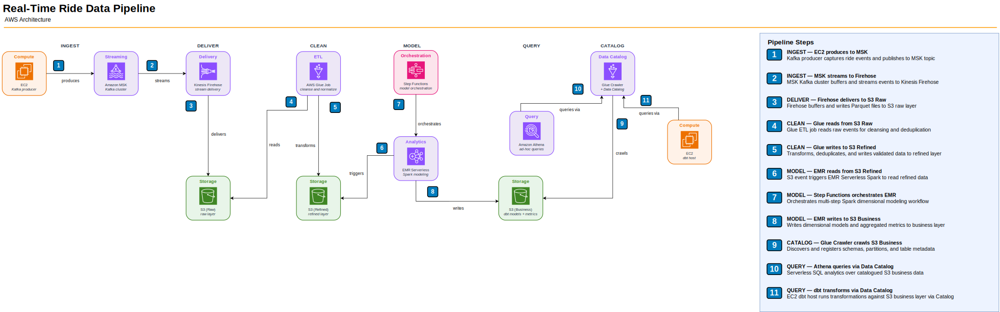

# Taxi Riders — With Kafka and Step Functions

**Topic:** Building a real-time data pipeline on AWS for riders data (Uber-like service)



## Data Flow — How the Pipeline Works in Production

```
1. INGEST     Producer (Python on EC2) generates ride events continuously
                → publishes JSON messages to MSK Kafka topic

2. DELIVER    AWS Data Firehose (managed consumer) reads from MSK
                → buffers for 5 min or 5 MB
                → writes raw JSON to S3: <bucket>/<YYYY>/<MM>/<DD>/<HH>/

3. CLEAN      AWS Glue Job runs daily
                → reads raw JSON from S3
                → renames columns, drops unwanted fields, adds derived columns
                → writes cleaned CSV to S3: <bucket>/Refined/

4. MODEL      EMR Serverless Spark Job runs daily (orchestrated by Step Functions)
                → reads refined CSV
                → builds star schema: 3 dimension tables + 1 fact table
                → writes Parquet to S3: <bucket>/Business/processed/dimensions/ and facts/
                → fact_trips is partitioned by trip_date (Hive-style) for partition pruning in Athena

5. CATALOG    AWS Glue Crawler runs after each EMR job
                → scans Business/ Parquet files
                → discovers schemas and registers tables in Glue Data Catalog

6. QUERY      Amazon Athena queries tables via Glue Catalog
                → dbt connects to Athena and builds analytical models (joins, aggregations)
```

### S3 Bucket Layout

```
ridestreamlakehouse-td/
├── <YYYY>/<MM>/<DD>/<HH>/                            ← Raw JSON from Firehose (auto-partitioned by arrival time)
├── Refined/                                           ← Cleaned CSV from Glue Job
├── Business/
│   └── processed/
│       ├── dimensions/
│       │   ├── dim_vendor/       (parquet)
│       │   ├── dim_location/     (parquet)
│       │   └── dim_payment/      (parquet)
│       └── facts/
│           └── fact_trips/
│               └── trip_date=<YYYY-MM-DD>/   (parquet, one folder per date — Hive-style partition)
├── scripts/                                           ← PySpark scripts for EMR
└── athena-results/                                    ← Athena query output
```

> **Note on raw data path:** Firehose automatically creates the `<YYYY>/<MM>/<DD>/<HH>/` hierarchy based on arrival time. You do not create these folders manually.

> **Note on bucket naming:** S3 bucket names are globally unique across all AWS accounts worldwide. If your chosen name is taken, append a suffix.

### AWS Services Used

| Service | Role |
|---|---|
| **MSK (Managed Streaming for Kafka)** | Ingests real-time ride events via Kafka topics |
| **Data Firehose** | Managed Kafka consumer — reads from MSK topic and writes JSON to S3 raw layer |
| **S3** | Storage for all data layers (raw, refined, business, scripts, athena results) |
| **EC2** | Hosts Kafka CLI tools — used to create topics, test produce/consume, and run the producer script |
| **Glue Job** | Visual ETL — renames columns, drops unwanted fields, adds derived columns, outputs CSV |
| **Glue Crawler** | Scans Parquet files in S3, discovers schemas, registers tables in Glue Data Catalog |
| **Glue Data Catalog** | Metadata store — table definitions that Athena queries against |
| **EMR Serverless** | Runs PySpark dimensional modelling jobs (star schema) |
| **Step Functions** | Orchestrates the daily EMR pipeline |
| **Athena** | Serverless SQL query engine over Glue Catalog tables |
| **dbt** | Builds analytical models on top of Athena (joins, aggregations) |

&nbsp;

### Component-by-Component Walkthrough

Here's what each service does in the pipeline, in the order data touches it.

**EC2 (Kafka client + dbt client)** — An EC2 instance inside the same VPC as MSK acts as the Kafka client — it hosts the Kafka CLI tools for creating topics and testing produce/consume, and runs the Python producer script that generates 100 NYC Green Taxi ride events into the `realtimeridedata` topic. Later in the pipeline a second EC2 instance (or the same one) hosts dbt for building analytical models on top of Athena. Without EC2, you'd need another compute layer to talk to MSK over private networking and to run dbt.

> **Note on the dbt instance:** The trainer provisions a separate EC2 for dbt to isolate Kafka vs analytics IAM scopes. In production, dbt usually runs through CI/CD (GitHub Actions, GitLab CI, AWS CodeBuild) or dbt Cloud — no persistent EC2. See Step 13 for alternatives.

**MSK (Managed Streaming for Apache Kafka)** — MSK hosts the `realtimeridedata` Kafka topic that sits at the center of the pipeline: the producer writes to it, Firehose reads from it. MSK Serverless auto-scales, distributes brokers across availability zones for fault tolerance, and handles replication — you get a Kafka cluster without managing brokers, ZooKeeper, or capacity planning. Like any Kafka cluster, it decouples producers from consumers so either side can restart, scale, or fail without losing data.

> **Why Kafka instead of Kinesis?** MSK is the right fit when your team already has Kafka expertise, when you need Kafka-specific features (consumer groups, compacted topics, Kafka Streams), or when you need portability across cloud providers. Kinesis Data Streams is typically simpler and cheaper for AWS-native workloads where Kafka compatibility isn't required.

**Amazon Data Firehose** — Firehose is the managed Kafka consumer that bridges MSK and S3. It reads from the `realtimeridedata` topic, buffers records (5 MB or 5 minutes, whichever triggers first), and writes JSON files to the raw S3 layer with automatic time-based partitioning (`<YYYY>/<MM>/<DD>/<HH>/`). Firehose cannot transform data — it delivers exactly what it receives. Everything downstream reads from S3, not MSK.

> **"Real-time" vs "micro-batch":** Firehose is near-real-time — records land in S3 within 5 minutes of reaching MSK. That's fine for a daily dimensional modelling pipeline but not for per-record latency guarantees. For true sub-second stream processing you'd run a Flink job on MSK directly instead of buffering through Firehose.

**S3 (Simple Storage Service)** — S3 is the durable backbone that holds every pipeline layer: raw JSON from Firehose, refined CSV from Glue, the star-schema Parquet (dimensions + facts) from EMR, PySpark scripts for EMR, and Athena query results. See the [S3 Bucket Layout](#s3-bucket-layout) tree above for the full structure. S3 acts as both the staging layer between pipeline stages and the permanent analytical store that Athena queries directly.

**AWS Glue — Visual ETL Job** — A Glue job runs the `RAW_TO_REFINED` transformation. Using the Visual ETL editor we chain three nodes: an S3 Source (reads raw JSON), a Change Schema transform (renames columns like `pickup_dt` → `pickup_datetime`, drops `airport_fee` and `event_time`), and a SQL Query transform (adds a `vendor_name` derived column). Glue generates the underlying PySpark script automatically — no code to maintain for simple column-level transforms. Output is CSV in `Refined/`.

> **Why CSV for the refined layer?** The tutorial uses CSV because it's human-readable and easy to inspect. For production, Parquet is usually better — columnar compression shrinks files, predicate pushdown makes Athena queries faster, and schema evolution is more robust.

**EMR Serverless (Spark)** — EMR Serverless is the dimensional modelling engine. A PySpark script reads the refined CSV, builds a **star schema** (three dimensions — `dim_vendor`, `dim_location`, `dim_payment` — plus one fact table `fact_trips`), and writes the result as Parquet to `Business/processed/`. EMR Serverless auto-provisions Spark compute, runs the job, and shuts down — you pay only for the resources used. Spark is the right tool here because dimensional modelling involves shuffle-heavy joins and surrogate-key generation that Glue's simpler transforms can't express cleanly.

> **Why a star schema?** Star schemas separate descriptive attributes (vendor name, payment type, pickup location) from measurable metrics (total revenue, trip count). Queries are simple and fast — join fact to a few dimensions, filter on dimension attributes, aggregate the facts. This is the classic pattern for BI reporting and it's what downstream dbt models expect.

**AWS Step Functions** — Step Functions orchestrates the EMR Spark job. The state machine has a single Task state that calls `emr-serverless:StartJobRun` with the right application ID, execution role, and Spark configuration. Step Functions handles retries, failure paths, and audit logs without you writing any orchestration code. In a larger pipeline you'd add pre-validation, post-verification, and notification states around the core job.

> **Why not just schedule Spark directly?** You could schedule Spark via EventBridge → Lambda, but Step Functions gives you structured state machines — visual execution graphs, per-state retry/error handling, and an audit log of every run. For a one-step pipeline it's overkill; for a real workflow with validation, branching, and rollback, it's the right abstraction.

**Amazon EventBridge** — EventBridge closes the automation loop. A rule watches S3 for `Object Created` events on the `Refined/` prefix. When the Glue ETL job writes refined data, S3 emits an event, EventBridge matches it, and fires the Step Function, which runs the EMR job. The full chain becomes: Glue writes → S3 event → EventBridge → Step Function → EMR writes Parquet. This is event-driven orchestration — no schedulers, no polling.

> **Note on enabling S3 → EventBridge:** S3 does not send events to EventBridge by default. You must enable the "Send notifications to Amazon EventBridge" property on each bucket that should emit events. Easy to miss during setup.

**AWS Glue Crawler + Data Catalog** — After EMR writes, a Glue Crawler scans the Parquet files in `Business/processed/`, infers the schema, and registers the dimension and fact tables in the Glue Data Catalog (`athena-db` database). The Data Catalog is the centralized metadata store — it tells Athena (and Redshift Spectrum, and EMR) "where is the data, and what does it look like" without each service managing its own metadata.

> **Why a Crawler?** You could run `CREATE EXTERNAL TABLE` DDL in Athena manually. A Crawler auto-detects schema changes (new columns, type changes, new partitions) and keeps the catalog in sync without intervention. For evolving data it saves maintenance; for stable schemas explicit DDL gives more control.

**Amazon Athena** — Athena is the serverless SQL engine over the Glue Catalog. You write SQL, Athena scans the Parquet files in S3 directly, and you pay per TB scanned (~$5/TB). No servers to provision, no data to load — just point at the catalog and query. Athena serves two roles here: the ad-hoc query interface for exploring the star schema, and the target database that dbt reads from and writes to.

**dbt (data build tool)** — dbt is the transformation layer on top of Athena. Its source tables are the star schema in `athena-db` (created by EMR and registered by the Crawler). dbt reads these via `{{ source() }}` references and builds analytical models — joins between fact and dimension tables, revenue aggregations, top-N route rankings — writing the results to `athena_dbt_db`. dbt handles dependency ordering, tests (`not_null`, `unique`, custom SQL tests), documentation, and incremental builds. Unlike EMR, dbt doesn't extract or load data; it only transforms data already in the warehouse (the "T" in ELT).

> **Note on dbt in production:** The tutorial runs dbt on an EC2 instance, which is fine for learning. In production dbt typically runs through CI/CD or dbt Cloud — no persistent infrastructure to manage. See Step 13 for alternatives.

---

## Apache Kafka — Concepts

### Four Core Components

1. **Producer** — An application that publishes (writes) messages to Kafka. In this pipeline, the ride event generator is the producer — it sends ride data (pickup, dropoff, fare, timestamps, etc.) into Kafka topics.

2. **Topics** — Named channels that organize messages by category. Think of a topic as a feed or stream. Producers write to a topic, consumers read from it (e.g. a `ride_events` topic). Topics are split into **partitions** for parallel processing and scalability.

3. **Consumer** — An application that subscribes to and reads messages from topics. In this pipeline, AWS Data Firehose acts as the consumer — it reads from the MSK topic and delivers records to S3. Consumers track their position (**offset**) in each partition so they can resume where they left off.

4. **Cluster** — A group of Kafka servers (**brokers**) working together. The cluster provides fault tolerance (data is replicated across brokers) and horizontal scalability (partitions are distributed across brokers). AWS MSK is a managed Kafka cluster — AWS handles broker provisioning, patching, and replication.

### Bootstrap Server

The **bootstrap server** is the initial connection endpoint a client (producer or consumer) uses to discover the full cluster. When a client connects:

1. It contacts the bootstrap server address (one or more broker addresses).
2. The server responds with metadata about **all** brokers and which broker owns which topic partitions.
3. The client then connects directly to the appropriate brokers for reading/writing.

Think of it as a phonebook — you call one number to get the directory of everyone else. In AWS MSK, the bootstrap server endpoint is found under **View client information** after the cluster is created.

---

## Step 1: Create the MSK Cluster

> **⚠️ Region check before you start — Firehose + MSK Serverless regional limitation:**
> The pipeline's Step 7 uses Firehose `MSKAsSource` with `Connectivity: PRIVATE`. This requires the MSK cluster to support multi-VPC private connectivity. For **MSK Serverless**, that feature is regionally gated — notably **not available in `eu-north-1` today**. Verify your region up front:
>
> ```bash
> # Read-only probe: if this returns "BadRequestException: This Region doesn't currently support VPC connectivity with Amazon MSK Serverless clusters", use MSK Provisioned instead.
> aws kafka create-vpc-connection --target-cluster-arn <ANY_EXISTING_SERVERLESS_ARN> \
>   --authentication SASL_IAM --vpc-id <any-vpc> \
>   --client-subnets <subnet-a> --security-groups <sg> \
>   --region <YOUR_REGION> 2>&1 | head -2
> ```
>
> If the probe errors out with the "Region doesn't support" message, follow the **MSK Provisioned** path below instead of Serverless. Otherwise continue with Serverless (cheaper to run, auto-scales, 2-5 min to provision).

### Option A: MSK Serverless (preferred when region supports it)

1. **AWS Console** → search **MSK** → **Amazon MSK** → **Create cluster**
2. **Creation method:** Custom create
3. **Cluster name:** `MSK`
4. **Cluster type:** Serverless
5. Click **Next**
6. **Networking:**
   - **VPC:** Select your VPC (default VPC or the one created via Terraform)
   - **Availability Zones:** Select 2 zones (e.g. `eu-north-1a`, `eu-north-1b`)
   - **Subnets:** Select one subnet per AZ (auto-populated from the VPC)
   - **Security group:** The default security group will be attached
7. Click **Next** until **Create cluster** → **Create**
8. Wait for status to change from **Creating** to **Active** (takes a few minutes)

Or via CLI:
```bash
aws kafka create-cluster-v2 \
  --cluster-name MSK \
  --serverless 'VpcConfigs=[{SubnetIds=["<SUBNET_A>","<SUBNET_B>"],SecurityGroupIds=["<DEFAULT_SG_ID>"]}],ClientAuthentication={Sasl={Iam={Enabled=true}}}' \
  --region <YOUR_REGION>

# Poll cluster state until ACTIVE
aws kafka list-clusters-v2 \
  --cluster-name-filter MSK \
  --region <YOUR_REGION> \
  --query 'ClusterInfoList[0].{Name:ClusterName,State:State,Arn:ClusterArn}'
```

### Option B: MSK Provisioned (required when Serverless multi-VPC is unavailable in your region)

Provisioned MSK supports multi-VPC private connectivity in every region where MSK is available. Use 3 AZs (multi-VPC requires 3-broker minimum) and `kafka.m5.large` or larger (`t3.small` doesn't support multi-VPC).

```bash
# 1. Create the provisioned cluster
cat > cluster-config.json <<EOF
{
  "ClusterName": "MSK",
  "KafkaVersion": "3.9.x",
  "NumberOfBrokerNodes": 3,
  "BrokerNodeGroupInfo": {
    "InstanceType": "kafka.m5.large",
    "ClientSubnets": ["<SUBNET_A>","<SUBNET_B>","<SUBNET_C>"],
    "SecurityGroups": ["<SG_ID>"],
    "StorageInfo": {"EbsStorageInfo": {"VolumeSize": 100}}
  },
  "ClientAuthentication": {
    "Sasl": {"Iam": {"Enabled": true}}
  },
  "EncryptionInfo": {
    "EncryptionInTransit": {"ClientBroker": "TLS", "InCluster": true}
  }
}
EOF
aws kafka create-cluster --cli-input-json file://cluster-config.json --region <YOUR_REGION>

# 2. Wait for ACTIVE (15-30 min). Then enable multi-VPC private connectivity:
VER=$(aws kafka describe-cluster-v2 --cluster-arn <MSK_ARN> --region <YOUR_REGION> \
  --query 'ClusterInfo.CurrentVersion' --output text)
aws kafka update-connectivity --cluster-arn <MSK_ARN> --current-version "$VER" --region <YOUR_REGION> \
  --connectivity-info '{"VpcConnectivity":{"ClientAuthentication":{"Sasl":{"Iam":{"Enabled":true}}}}}'
# update-connectivity takes 15-60 min to roll across brokers. Cluster is ACTIVE when done.
```

> **⚠️ Cost:** Provisioned MSK with 3× `kafka.m5.large` is roughly **$0.87/hr running** plus storage. For a learning walkthrough, only keep the cluster running while you're actively using it — the teardown script handles deletion.

### Get the Bootstrap Server Endpoint

Once the cluster is **Active**:

1. Click on the cluster name → **View client information**
2. Copy the **Bootstrap servers** endpoint
   - Serverless: `boot-xxxxx.c2.kafka-serverless.<region>.amazonaws.com:9098`
   - Provisioned: `b-1.msk.<id>.c2.kafka.<region>.amazonaws.com:9098,b-2.*,b-3.*`
3. **Save this** — you'll need it for every Kafka CLI command on the EC2 instance

Or via CLI:
```bash
aws kafka get-bootstrap-brokers \
  --cluster-arn <MSK_CLUSTER_ARN> \
  --region <YOUR_REGION> \
  --query 'BootstrapBrokerStringSaslIam'
```

### Prerequisites: VPC and Networking

MSK Serverless requires a **VPC** with **subnets in at least 2 Availability Zones** and a **security group**.

- **VPC (Virtual Private Cloud)** — An isolated virtual network within AWS. All resources (EC2, MSK, etc.) live inside a VPC and communicate through it.
- **Subnet** — A subdivision of a VPC tied to a specific Availability Zone. Each AZ gets its own subnet so resources can be distributed for fault tolerance.
- **Availability Zone (AZ)** — A physically separate data center within an AWS region. Spreading resources across AZs means if one data center has issues, the others keep running.
- **Security Group** — A virtual firewall that controls inbound/outbound traffic for resources. Rules specify which ports, protocols, and source IPs are allowed.

#### If your account has a default VPC (fresh/personal account):

New AWS accounts come with a **default VPC** that has subnets in all AZs and a default security group. You can use these directly — no setup needed.

#### If your account has no VPC (corporate/restricted account):

You'll need to create VPC resources via Terraform (see [1. VPC + Networking](#1-vpc--networking) in the Terraform — All Resources section).

---

## Step 2: Create EC2 Instance (Kafka Client)

### Launch the Instance

1. **AWS Console** → **EC2** → **Launch Instance**
2. **Name:** `Kafka-Client` (or any name)
3. **AMI:** Amazon Linux (default)
4. **Instance type:** `t3.micro` (if free tier eligible) or `t2.micro`
5. **Key pair:** Click **Create new key pair**
   - **Name:** `kafka_access`
   - **Type:** RSA
   - **Format:** `.pem`
   - **Create** — the `.pem` file downloads automatically. Keep it safe.
6. **Network settings:**
   - **VPC:** Same VPC as the MSK cluster
   - **Auto-assign public IP:** Enable
   - **Firewall:** Select **Create security group**
   - **SSH**: change source from `0.0.0.0/0` to **My IP** (Console auto-fills your current public IP)
   - Do NOT add an HTTP/80 rule — nothing on the Kafka client serves HTTP
7. **Advanced details → Metadata version:** `V2 only (token required)` (enforces IMDSv2)
8. **Storage:** 30 GiB — Amazon Linux 2023 requires a minimum of 30 GB (the snapshot is ~20 GB); anything smaller is rejected at launch.
9. Click **Launch instance**

Or via CLI:
```bash
# 1. (First time only) Create the key pair and save the private key
aws ec2 create-key-pair \
  --key-name kafka_access \
  --query 'KeyMaterial' --output text > kafka_access.pem
chmod 400 kafka_access.pem

# 2. Find your current public IP for the SSH rule
MY_IP=$(curl -s https://checkip.amazonaws.com)/32

# 3. Launch the EC2 instance (replace placeholders with your values)
#    --metadata-options enforces IMDSv2 (token required); prevents SSRF-based credential theft.
aws ec2 run-instances \
  --image-id <AMAZON_LINUX_AMI_ID> \
  --instance-type t3.micro \
  --key-name kafka_access \
  --subnet-id <SUBNET_ID> \
  --security-group-ids <DEFAULT_SG_ID> \
  --associate-public-ip-address \
  --block-device-mappings 'DeviceName=/dev/xvda,Ebs={VolumeSize=30}' \
  --metadata-options 'HttpTokens=required,HttpPutResponseHopLimit=2,HttpEndpoint=enabled' \
  --tag-specifications 'ResourceType=instance,Tags=[{Key=Name,Value=Kafka-Client}]' \
  --region <YOUR_REGION>
```

> **Note on key pair:** In a corporate environment where you lack `ec2:CreateKeyPair` permissions, this must be provisioned via Terraform. See [2. EC2 Key Pair](#2-ec2-key-pair) in the Terraform — All Resources section.

> **Why restrict SSH to your IP and skip HTTP?** `0.0.0.0/0` on port 22 invites constant scanning and brute-force attempts against the `.pem` key material. Restricting to your current public IP closes that surface. The Kafka client has no web server, so port 80 serves no purpose — leaving it open is a gratuitous attack surface. This tutorial uses EC2 Instance Connect (browser-based SSH) via AWS APIs, so you don't even need port 22 from the public internet for this walkthrough; the **My IP** scope is belt-and-suspenders for when you want to SSH directly using the `.pem`.

> **Zero-ingress alternative — SSM Session Manager:** Attach the `AmazonSSMManagedInstanceCore` managed policy to the EC2 instance role (see Step 4) to reach the instance with `aws ssm start-session --target <INSTANCE_ID>` — no SSH port, no public IP needed. Ideal for production.

### Connect to the Instance

1. Go to **EC2** → Select your instance → **Connect**
2. Select **EC2 Instance Connect** tab
3. Click **Connect**
4. This opens a browser-based terminal — no `.pem` file needed for this method

### Why EC2?

MSK doesn't have a built-in UI for managing topics or producing/consuming messages. We need a machine **inside the same VPC** that can talk to the MSK brokers over the private network. The EC2 instance acts as our **Kafka client** — we'll install Kafka CLI tools on it and use it to create topics, send test messages, and verify the cluster works.

### ⚠️ Critical: Security Group Configuration for MSK Access

The EC2 instance and MSK cluster **must share a security group** for the EC2 to communicate with MSK. The default security group only allows inbound traffic from resources **within the same security group**. If your EC2 instance was created with a different security group (e.g. `launch-wizard-1`), it will be blocked from reaching MSK.

**Symptom:** Kafka CLI commands time out with `TimeoutException: Timed out waiting for a node assignment`.

**Fix — add the MSK security group to your EC2 instance:**

1. Go to **EC2** → Select your instance → **Actions** → **Security** → **Change security groups**
2. **Add** the default security group (the one your MSK cluster uses)
3. **Save**

Or via CLI:
```bash
aws ec2 modify-instance-attribute \
  --instance-id <your-instance-id> \
  --groups <ec2-security-group-id> <msk-default-security-group-id> \
  --region <your-region>
```

> **How to find which security group MSK uses:** Go to **MSK** → click your cluster → **Networking** section → note the security group ID. Then add that same group to your EC2 instance.

---

## Step 3: Install Kafka Libraries on EC2

Once connected to the EC2 instance via Instance Connect, run these commands:

```bash
# 1. Install Java 17 + wget (Kafka 3.x requires Java 11+; Java 17 is the current LTS
#    and is what MSK Serverless runs internally — matching versions avoids
#    subtle class-loading issues when using the IAM auth JAR. Amazon Linux 2023
#    does NOT ship wget by default.)
sudo yum -y install java-17-amazon-corretto wget

# 2. Install Python pip (needed for Python Kafka libraries later)
sudo yum -y install python-pip

# 3. Download Kafka CLI tools (3.9.0 — current stable, compatible with MSK Serverless).
#    NOTE: Older versions (2.8.x) still technically work with MSK Serverless today,
#    but Apache Kafka 4.0 (2025) removed several old client API versions and AWS
#    will eventually follow. Use a recent 3.x to stay safe.
wget https://archive.apache.org/dist/kafka/3.9.0/kafka_2.13-3.9.0.tgz

# 4. Extract and make scripts executable
tar -xzf kafka_2.13-3.9.0.tgz
chmod +x kafka_2.13-3.9.0/bin/*.sh

# 5. Download AWS MSK IAM authentication plugin
# MSK Serverless ONLY supports IAM auth — without this JAR, Kafka CLI
# tools cannot authenticate to the cluster.
cd kafka_2.13-3.9.0/libs/
wget https://github.com/aws/aws-msk-iam-auth/releases/download/v2.3.0/aws-msk-iam-auth-2.3.0-all.jar
cd ~

# 6. Create client.properties (IAM auth config for Kafka CLI)
# Every Kafka CLI command will reference this file via --command-config flag.
cat > kafka_2.13-3.9.0/bin/client.properties << 'EOF'
security.protocol=SASL_SSL
sasl.mechanism=AWS_MSK_IAM
sasl.jaas.config=software.amazon.msk.auth.iam.IAMLoginModule required;
sasl.client.callback.handler.class=software.amazon.msk.auth.iam.IAMClientCallbackHandler
EOF

# 7. Set CLASSPATH — tells Java where to find the IAM auth JAR
# Export for current session AND persist in .bashrc for reconnects.
export CLASSPATH=/home/ec2-user/kafka_2.13-3.9.0/libs/aws-msk-iam-auth-2.3.0-all.jar
echo 'export CLASSPATH=/home/ec2-user/kafka_2.13-3.9.0/libs/aws-msk-iam-auth-2.3.0-all.jar' >> ~/.bashrc

# 8. Install Python Kafka packages
# kafka-python: for writing producers/consumers in Python (used later for ride event producer)
# aws-msk-iam-sasl-signer-python: generates IAM auth tokens for kafka-python
# Pin a known-good kafka-python version (2.0.5+) to avoid API drift.
pip install 'kafka-python>=2.0.5'
pip install aws-msk-iam-sasl-signer-python
```

> **Alternative Python client:** For production-realistic code, consider `confluent-kafka` (librdkafka-based) instead of `kafka-python`. It has better performance and tighter Apache Kafka version tracking. Stick with `kafka-python` here — the tutorial producer script uses it.


---

## Step 4: IAM Policy and Role for EC2 → MSK Access

### Create the Policy and Role

1. **AWS Console** → **IAM** → **Policies** → **Create policy**
2. Switch to **JSON** tab, paste:
```json
{
    "Version": "2012-10-17",
    "Statement": [
        {
            "Effect": "Allow",
            "Action": [
                "kafka-cluster:Connect",
                "kafka-cluster:DescribeCluster"
            ],
            "Resource": "*"
        },
        {
            "Effect": "Allow",
            "Action": [
                "kafka-cluster:CreateTopic",
                "kafka-cluster:WriteData",
                "kafka-cluster:ReadData",
                "kafka-cluster:DescribeTopic"
            ],
            "Resource": "*"
        },
        {
            "Effect": "Allow",
            "Action": [
                "kafka-cluster:DescribeGroup",
                "kafka-cluster:AlterGroup",
                "kafka-cluster:ReadData"
            ],
            "Resource": "*"
        }
    ]
}
```
3. **Name:** `Access_to_Kafka_Cluster`
4. Click **Create policy**
5. **IAM** → **Roles** → **Create role**
6. **Trusted entity type:** AWS Service
7. **Use case:** EC2
8. Click **Next**
9. **Search and select:** `Access_to_Kafka_Cluster`
10. Click **Next**
11. **Role name:** `Kafka_Cluster_Access`
12. Click **Create role**
13. Go to **EC2** → Select your instance → **Actions** → **Security** → **Modify IAM role**
14. Select `Kafka_Cluster_Access` → **Update IAM role**

Or via CLI (save the policy JSON above to `kafka-cluster-policy.json` first):
```bash
# 1. Create the policy
aws iam create-policy \
  --policy-name Access_to_Kafka_Cluster \
  --policy-document file://kafka-cluster-policy.json

# 2. Create the role with EC2 trust policy
aws iam create-role \
  --role-name Kafka_Cluster_Access \
  --assume-role-policy-document '{"Version":"2012-10-17","Statement":[{"Effect":"Allow","Principal":{"Service":"ec2.amazonaws.com"},"Action":"sts:AssumeRole"}]}'

# 3. Attach the policy to the role
aws iam attach-role-policy \
  --role-name Kafka_Cluster_Access \
  --policy-arn arn:aws:iam::<ACCOUNT_ID>:policy/Access_to_Kafka_Cluster

# 4. Create an instance profile and add the role
aws iam create-instance-profile --instance-profile-name Kafka_Cluster_Access
aws iam add-role-to-instance-profile \
  --instance-profile-name Kafka_Cluster_Access \
  --role-name Kafka_Cluster_Access

# 5. Attach the instance profile to the EC2 instance
aws ec2 associate-iam-instance-profile \
  --instance-id <INSTANCE_ID> \
  --iam-instance-profile Name=Kafka_Cluster_Access \
  --region <YOUR_REGION>
```

> **Note:** In a corporate environment where you lack IAM permissions, the policy, role, and instance profile must be created via Terraform. See [6. IAM — EC2 → MSK Access](#6-iam--ec2--msk-access) in the Terraform — All Resources section.

### Why?

The EC2 instance needs **permission** to talk to the MSK cluster. AWS uses IAM roles to grant permissions to EC2 instances instead of storing credentials on the machine. We create a **policy** (what actions are allowed) and a **role** (who gets those permissions), then attach the role to the EC2 instance.

### What is an IAM Policy?

A JSON document that defines **what actions** are allowed on **which resources**. Our policy grants Kafka cluster operations: connect, create topics, read/write data, describe topics and consumer groups.

### What is an IAM Role?

An identity that AWS services can **assume** to get temporary credentials. Unlike a user (which has permanent credentials), a role is assumed by a service (like EC2) and gets short-lived tokens. The role has policies attached that define what it can do.

### What is an Instance Profile?

A wrapper around an IAM role that allows EC2 instances to assume it. When you attach a role to an EC2 instance via the Console, AWS creates an instance profile automatically behind the scenes. In Terraform, you must create it explicitly.

---

## Step 5: Create Kafka Topic and Test

### Navigate to the Kafka bin directory

```bash
cd ~/kafka_2.13-3.9.0/bin/
```

### Create a test topic

Replace `<BOOTSTRAP_SERVER>` with your endpoint from Step 1:

```bash
./kafka-topics.sh --create \
  --topic first_topic \
  --command-config /home/ec2-user/kafka_2.13-3.9.0/bin/client.properties \
  --partitions 1 \
  --bootstrap-server <BOOTSTRAP_SERVER>
```

Expected output:
```
WARNING: Due to limitations in metric names, topics with a period ('.') or underscore ('_') could collide...
Created topic first_topic.
```

> The WARNING is informational — Kafka recommends using hyphens (`-`) in topic names instead of underscores (`_`) or periods (`.`).

### Test with Producer (send messages)

```bash
./kafka-console-producer.sh \
  --topic first_topic \
  --producer.config /home/ec2-user/kafka_2.13-3.9.0/bin/client.properties \
  --bootstrap-server <BOOTSTRAP_SERVER>
```

This opens an interactive prompt (`>`). Type messages one per line, then `Ctrl+C` to exit.

### Test with Consumer (read messages)

```bash
./kafka-console-consumer.sh \
  --topic first_topic \
  --consumer.config /home/ec2-user/kafka_2.13-3.9.0/bin/client.properties \
  --from-beginning \
  --bootstrap-server <BOOTSTRAP_SERVER>
```

This reads all messages from the topic from the beginning. `Ctrl+C` to exit.

> **Real-time demo (optional):** Open two Instance Connect tabs to the same EC2 instance. Run the producer in one, the consumer in the other. Messages appear in the consumer instantly as you type them in the producer — demonstrating Kafka's pub/sub model.

### Troubleshooting

| Error | Cause | Fix |
|---|---|---|
| `TimeoutException: Timed out waiting for a node assignment` | EC2 can't reach MSK — security group mismatch | Add the MSK security group to the EC2 instance (see Step 2) |
| `CLASSPATH is not set` / IAM auth errors | CLASSPATH not exported | Run `export CLASSPATH=/home/ec2-user/kafka_2.13-3.9.0/libs/aws-msk-iam-auth-2.3.0-all.jar` |
| `AccessDeniedException` on Kafka operations | IAM role not attached or policy missing | Verify the `Kafka_Cluster_Access` role is attached to the EC2 instance |

---

## Step 6: Run the Kafka Producer Script

### Run the Producer

#### 1. Create the topic for the producer script

The script publishes to a topic called `realtimeridedata`. Create it first:

```bash
cd ~/kafka_2.13-3.9.0/bin/

./kafka-topics.sh --create \
  --topic realtimeridedata \
  --command-config /home/ec2-user/kafka_2.13-3.9.0/bin/client.properties \
  --partitions 1 \
  --bootstrap-server <BOOTSTRAP_SERVER>
```

#### 2. Upload the producer script to the EC2 instance

The script needs to be on the EC2 instance. From the Instance Connect terminal, create the file:

```bash
cd ~
vi producer.py
```

Paste the contents of [`docs/resources/kafka_producer.py`](docs/resources/kafka_producer.py) into the editor — **no code edits required**. The script reads its config from environment variables (`MSK_BOOTSTRAP`, `AWS_REGION`, `MSK_TOPIC`), so the same file works across regions/accounts without modification.

Save and exit vi (`:wq`).

#### 3. Run the producer

Set the config env vars once (values come from Step 1's bootstrap endpoint) and run:

```bash
export MSK_BOOTSTRAP="boot-xxxxx.c2.kafka.<YOUR_REGION>.amazonaws.com:9098"  # from MSK View client information
export AWS_REGION="<YOUR_REGION>"
export MSK_TOPIC="realtimeridedata"
python3 producer.py
```

If you want the env vars to persist across shells, append the three `export` lines to `~/.bashrc`.

Expected output:
```
Starting to send 100 NYC Green Taxi records...
Sent record 1/100: Trip ID trip_0001 - $12.45 - Manhattan to Brooklyn
Sent record 2/100: Trip ID trip_0002 - $8.30 - Queens to Queens
...
Finished! Successfully sent 100 out of 100 records.
```

#### 4. (Optional) Verify with a consumer

Open a **second Instance Connect tab** to the same EC2 instance and run:

```bash
cd ~/kafka_2.13-3.9.0/bin/

./kafka-console-consumer.sh \
  --topic realtimeridedata \
  --consumer.config /home/ec2-user/kafka_2.13-3.9.0/bin/client.properties \
  --from-beginning \
  --bootstrap-server <BOOTSTRAP_SERVER>
```

You'll see all 100 JSON records scroll by. `Ctrl+C` when done.

### What this step does

Instead of manually typing messages into the Kafka console producer, we run a Python script (`kafka_producer.py`) that generates 100 simulated NYC Green Taxi ride records and publishes them to the MSK topic. Each record is a JSON message containing trip details: pickup/dropoff locations, timestamps, fares, passenger count, payment type, etc.

> **Note on data:** The script generates **randomized dummy data**, not real API data. For a real-data alternative, the NYC Taxi & Limousine Commission provides a free REST API (no auth required): `https://data.cityofnewyork.us/resource/gkne-dk5s.json?$limit=100`. See the script's docstring for details.

> **Script reference:** `docs/resources/kafka_producer.py` — fully commented with explanations of each section.

---

## Step 7: Create S3 Bucket and Firehose Stream (MSK → S3)

### Create the Bucket and Firehose Stream

#### 1. Create the S3 bucket

1. **AWS Console** → **S3** → **Create bucket**
2. **Bucket name:** Choose a unique name (e.g. `ridestreamlakehouse-td`)
3. **Region:** Same as your MSK cluster
4. Verify **Block all public access** is **ON** (default — do not disable)
5. **Default encryption:** AES256 (SSE-S3) — enabled by default for accounts created after Jan 2023; verify it is on
6. **Create bucket**

Or via CLI:
```bash
# Create the bucket. Note: outside us-east-1 you must pass LocationConstraint
# if you use `s3api create-bucket` instead of the shorthand `s3 mb`.
aws s3 mb s3://<YOUR_BUCKET> --region <YOUR_REGION>

# Enforce Block Public Access (belt-and-suspenders — new buckets already have this
# on by default, but explicit is better).
aws s3api put-public-access-block \
  --bucket <YOUR_BUCKET> \
  --public-access-block-configuration \
    BlockPublicAcls=true,IgnorePublicAcls=true,BlockPublicPolicy=true,RestrictPublicBuckets=true

# Verify default encryption is on (SSE-S3 / AES256)
aws s3api get-bucket-encryption --bucket <YOUR_BUCKET>
```

#### 2. Create folders for the pipeline layers

Create these folders inside the bucket (S3 Console → **Create folder**):
- `Refined/`
- `Business/`

The raw layer folder (`<YYYY>/<MM>/<DD>/<HH>/`) is created automatically by Firehose.

Or via CLI:
```bash
aws s3api put-object --bucket <YOUR_BUCKET> --key Refined/
aws s3api put-object --bucket <YOUR_BUCKET> --key Business/
```

#### 3. Update MSK cluster policy for Firehose access

Before Firehose can read from MSK, the cluster must explicitly allow it via a **resource-based policy** (attached to the cluster itself). The policy needs TWO statements working together:

- **`Service: firehose.amazonaws.com`** granted `kafka:CreateVpcConnection` — lets the Firehose service provision its managed PrivateLink endpoint into the cluster's VPC.
- **`AWS: <FIREHOSE_ROLE_ARN>`** granted the data-plane `kafka-cluster:*` actions on the cluster + topic + group ARNs — lets the Firehose role authenticate via SASL/IAM and consume records. (The data-plane actions are **not** accepted under the `Service` principal in an MSK cluster policy; they must use the IAM role ARN as the `AWS` principal.)

1. **AWS Console** → **Amazon MSK** → Click your cluster
2. Go to the **Properties** tab
3. Click **Edit cluster policy**
4. Choose **Advanced** (the "Basic" template only covers the `Service` side — it leaves the role-side data-plane actions off, which is why Firehose silently fails to consume)
5. Paste the following JSON, substituting `<MSK_CLUSTER_ARN>`, `<MSK_UUID>` (the UUID suffix of the cluster ARN), and `<FIREHOSE_ROLE_ARN>`
6. **Save changes**

```json
{
  "Version": "2012-10-17",
  "Statement": [
    {
      "Sid": "FirehoseServiceCreateVpcConnection",
      "Effect": "Allow",
      "Principal": { "Service": "firehose.amazonaws.com" },
      "Action": "kafka:CreateVpcConnection",
      "Resource": "<MSK_CLUSTER_ARN>"
    },
    {
      "Sid": "FirehoseRoleClusterAccess",
      "Effect": "Allow",
      "Principal": { "AWS": "<FIREHOSE_ROLE_ARN>" },
      "Action": [
        "kafka:GetBootstrapBrokers",
        "kafka:DescribeCluster",
        "kafka:DescribeClusterV2",
        "kafka-cluster:Connect"
      ],
      "Resource": "<MSK_CLUSTER_ARN>"
    },
    {
      "Sid": "FirehoseRoleTopicAccess",
      "Effect": "Allow",
      "Principal": { "AWS": "<FIREHOSE_ROLE_ARN>" },
      "Action": [
        "kafka-cluster:DescribeTopic",
        "kafka-cluster:DescribeTopicDynamicConfiguration",
        "kafka-cluster:ReadData"
      ],
      "Resource": "arn:aws:kafka:<YOUR_REGION>:<ACCOUNT_ID>:topic/MSK/<MSK_UUID>/*"
    },
    {
      "Sid": "FirehoseRoleGroupAccess",
      "Effect": "Allow",
      "Principal": { "AWS": "<FIREHOSE_ROLE_ARN>" },
      "Action": "kafka-cluster:DescribeGroup",
      "Resource": "arn:aws:kafka:<YOUR_REGION>:<ACCOUNT_ID>:group/MSK/<MSK_UUID>/*"
    }
  ]
}
```

> **⚠️ If you're on MSK Serverless:** you also need multi-VPC private connectivity enabled on the cluster. On **Provisioned** clusters this is toggled via `aws kafka update-connectivity --connectivity-info '{"VpcConnectivity":{"ClientAuthentication":{"Sasl":{"Iam":{"Enabled":true}}}}}'` **after** cluster creation. On MSK Serverless, multi-VPC is supposed to be inherent, but **in some regions (notably `eu-north-1`) the `CreateVpcConnection` API returns `"This Region doesn't currently support VPC connectivity with Amazon MSK Serverless clusters"`** — in which case Firehose's internal `CreateVpcConnection` call silently no-ops and the stream sits ACTIVE with zero reads. Verify with `aws kafka create-vpc-connection --target-cluster-arn <arn> --authentication SASL_IAM --vpc-id <id> --client-subnets <subnets> --security-groups <sgs>` (read-only probe — expect `BadRequestException` if the feature is unavailable). If your region isn't on the supported list, switch to **MSK Provisioned** (Step 1 has the CLI for it) or a supported region.

Or via CLI (save the JSON above as `msk-cluster-policy.json` first):
```bash
aws kafka put-cluster-policy \
  --cluster-arn <MSK_CLUSTER_ARN> \
  --policy file://msk-cluster-policy.json \
  --region <YOUR_REGION>
```

#### 4. Create the Firehose stream

1. From the MSK cluster page, go to the **S3 delivery** tab
2. Click **Create a Firehose stream** (this pre-fills source and destination)
3. **Source:** Amazon MSK (pre-selected)
4. **Destination:** Amazon S3 (pre-selected)
5. **Stream name:** `MSK_Batch`
6. **MSK cluster:** Browse and **select** your MSK cluster (do not rely on auto-fill)
7. **Topic:** Type `realtimeridedata`
8. **S3 bucket:** Select the bucket you created
9. Click **Create Firehose stream**
10. Wait for status to change to **Active**

Or via CLI (requires the MSK cluster policy to allow Firehose first).

Firehose needs two config files. Create them locally — substitute `<MSK_CLUSTER_ARN>`, `<FIREHOSE_ROLE_ARN>`, `<YOUR_BUCKET>`, and `<YOUR_REGION>` with your values:

`msk-source-config.json`:
```json
{
  "MSKClusterARN": "<MSK_CLUSTER_ARN>",
  "TopicName": "realtimeridedata",
  "AuthenticationConfiguration": {
    "RoleARN": "<FIREHOSE_ROLE_ARN>",
    "Connectivity": "PRIVATE"
  }
}
```

`s3-destination-config.json`:
```json
{
  "RoleARN": "<FIREHOSE_ROLE_ARN>",
  "BucketARN": "arn:aws:s3:::<YOUR_BUCKET>",
  "BufferingHints": { "SizeInMBs": 5, "IntervalInSeconds": 300 },
  "CompressionFormat": "UNCOMPRESSED",
  "CloudWatchLoggingOptions": {
    "Enabled": true,
    "LogGroupName": "/aws/kinesisfirehose/MSK_Batch",
    "LogStreamName": "DestinationDelivery"
  }
}
```

Then create the stream:
```bash
# (Optional, one-time) Pre-create the log group with a bounded retention.
# Without this, Firehose's auto-created log group defaults to "Never Expire".
aws logs create-log-group --log-group-name /aws/kinesisfirehose/MSK_Batch --region <YOUR_REGION>
aws logs put-retention-policy \
  --log-group-name /aws/kinesisfirehose/MSK_Batch \
  --retention-in-days 14 \
  --region <YOUR_REGION>

aws firehose create-delivery-stream \
  --delivery-stream-name MSK_Batch \
  --delivery-stream-type MSKAsSource \
  --msk-source-configuration file://msk-source-config.json \
  --extended-s3-destination-configuration file://s3-destination-config.json \
  --region <YOUR_REGION>

# Poll until ACTIVE
aws firehose describe-delivery-stream \
  --delivery-stream-name MSK_Batch \
  --region <YOUR_REGION> \
  --query 'DeliveryStreamDescription.DeliveryStreamStatus'
```

> **Note:** If creation fails on the first attempt, try again — the IAM role Firehose needs gets auto-created on the first attempt but the stream creation itself may time out. The second attempt usually succeeds since the role already exists.

#### 5. Attach additional permissions to the Firehose role

The auto-created Firehose role has a scoped-down policy but needs **a specific set of MSK, EC2, and S3 permissions** for the PRIVATE connectivity path to work. In addition, the role's **trust policy** must NOT restrict the assume-role call with `aws:SourceAccount` — that condition blocks Firehose's internal `CreateVpcConnection` attempt and produces the misleading error `AWS Firehose is not authorized to perform kafka:CreateVpcConnection on resource <role-arn>`.

**Step 5a — fix the trust policy** (remove any SourceAccount/SourceArn conditions):

1. **AWS Console** → **IAM** → **Roles** → the Firehose role
2. **Trust relationships** tab → **Edit trust policy**
3. Replace with:

```json
{
  "Version": "2012-10-17",
  "Statement": [
    {
      "Effect": "Allow",
      "Principal": { "Service": "firehose.amazonaws.com" },
      "Action": "sts:AssumeRole"
    }
  ]
}
```

4. **Update policy**

> **Why no `aws:SourceAccount` condition here?** Firehose's managed code path that calls `CreateVpcConnection` internally does so outside the normal delivery-stream context, and the `aws:SourceAccount` condition isn't always populated at that layer. Leaving the condition in place causes a silent assume-role denial that is reported (misleadingly) as `kafka:CreateVpcConnection on resource <role-arn>`. Removing the condition fixes this.

**Step 5b — attach the scoped inline policy**:

1. **AWS Console** → **IAM** → **Roles** → the Firehose role (named `KinesisFirehoseServiceRole-MSK_Batch-<region>-<id>`)
2. Click **Add permissions** → **Create inline policy**
3. Switch to **JSON** tab, paste (substitute `<MSK_CLUSTER_ARN>`, `<MSK_UUID>`, `<YOUR_BUCKET>`, `<YOUR_REGION>`, `<ACCOUNT_ID>`):

```json
{
  "Version": "2012-10-17",
  "Statement": [
    {
      "Sid": "MSKControlPlane",
      "Effect": "Allow",
      "Action": [
        "kafka:CreateVpcConnection",
        "kafka:DeleteVpcConnection",
        "kafka:DescribeVpcConnection",
        "kafka:DescribeCluster",
        "kafka:DescribeClusterV2",
        "kafka:GetBootstrapBrokers"
      ],
      "Resource": [
        "<MSK_CLUSTER_ARN>",
        "arn:aws:kafka:<YOUR_REGION>:<ACCOUNT_ID>:vpc-connection/*"
      ]
    },
    {
      "Sid": "MSKDataPlane",
      "Effect": "Allow",
      "Action": [
        "kafka-cluster:Connect",
        "kafka-cluster:DescribeCluster",
        "kafka-cluster:DescribeTopic",
        "kafka-cluster:DescribeTopicDynamicConfiguration",
        "kafka-cluster:ReadData",
        "kafka-cluster:DescribeGroup",
        "kafka-cluster:AlterGroup"
      ],
      "Resource": [
        "<MSK_CLUSTER_ARN>",
        "arn:aws:kafka:<YOUR_REGION>:<ACCOUNT_ID>:topic/MSK/<MSK_UUID>/*",
        "arn:aws:kafka:<YOUR_REGION>:<ACCOUNT_ID>:group/MSK/<MSK_UUID>/*"
      ]
    },
    {
      "Sid": "EC2PrivateLink",
      "Effect": "Allow",
      "Action": [
        "ec2:CreateTags",
        "ec2:CreateVpcEndpoint",
        "ec2:DescribeVpcEndpoints",
        "ec2:DeleteVpcEndpoints",
        "ec2:DescribeNetworkInterfaces",
        "ec2:CreateNetworkInterface",
        "ec2:DeleteNetworkInterface",
        "ec2:DescribeSubnets",
        "ec2:DescribeSecurityGroups",
        "ec2:DescribeVpcs",
        "ec2:DescribeRouteTables"
      ],
      "Resource": "*"
    },
    {
      "Sid": "S3Write",
      "Effect": "Allow",
      "Action": [
        "s3:AbortMultipartUpload",
        "s3:GetBucketLocation",
        "s3:GetObject",
        "s3:ListBucket",
        "s3:ListBucketMultipartUploads",
        "s3:PutObject"
      ],
      "Resource": [
        "arn:aws:s3:::<YOUR_BUCKET>",
        "arn:aws:s3:::<YOUR_BUCKET>/*"
      ]
    },
    {
      "Sid": "CWLogs",
      "Effect": "Allow",
      "Action": ["logs:PutLogEvents", "logs:CreateLogStream"],
      "Resource": "arn:aws:logs:<YOUR_REGION>:<ACCOUNT_ID>:log-group:/aws/kinesisfirehose/MSK_Batch:*"
    }
  ]
}
```

4. **Name:** `FirehosePipelineAccess`
5. **Create policy**

> **Why `ec2:CreateTags`/`ec2:*VpcEndpoint`/`ec2:*NetworkInterface` on the Firehose role?** Firehose provisions its PrivateLink connection by creating a VPC interface endpoint in your VPC, which triggers ENI creation in the cluster's subnets. Without `ec2:CreateTags` specifically, that provisioning fails silently and the Firehose stream either stalls in `CREATING` or becomes `ACTIVE` but never reads data. The AWS docs for multi-VPC private connectivity clients list these actions as required; they apply identically to Firehose as a MSK client.
>
> **Why scoped rather than `AmazonS3FullAccess` + `AmazonMSKFullAccess`?** The managed policies grant `s3:*` and `kafka-cluster:*` on **every** resource in the account. The scoped inline policy lists only the bucket, cluster, and VPC resources this pipeline uses — same functionality, far smaller blast radius.

#### 6. Run the producer to generate data for Firehose

Firehose only reads **new messages** from the point it was created. Data produced before Firehose existed will not appear in S3. Go back to the EC2 Instance Connect terminal and run the producer 2–3 times:

```bash
cd ~
python3 producer.py
python3 producer.py
python3 producer.py
```

#### 7. Verify data in S3

Wait ~5 minutes for Firehose to flush its buffer, then check S3:

- **AWS Console** → **S3** → Click your bucket
- You'll see a folder structure: `<YYYY>/<MM>/<DD>/<HH>/`
- Inside the hour folder: a file named `MSK_Batch-1-<timestamp>-<UUID>`
- This file contains the raw JSON ride records (one JSON object per line, concatenated)

### What this step does

We create an **S3 bucket** to store all pipeline data and an **Amazon Data Firehose** stream that automatically reads messages from the MSK topic and writes them as JSON files to S3. This replaces the manual consumer — Firehose continuously consumes from Kafka and batches the data into files in S3.

### Buffering

Firehose doesn't write every message individually to S3. It buffers data and flushes based on:
- **Size:** 5 MB (when the buffer reaches 5 MB, it writes to S3)
- **Time:** 300 seconds / 5 minutes (even if the buffer hasn't reached 5 MB, it flushes after 5 minutes)

Whichever threshold is hit first triggers the write.

---

## Step 8: AWS Glue — Transform Raw Data to Refined

### IAM Role for Glue ETL

Glue needs an IAM role to read/write the pipeline S3 bucket and access the Glue service. Avoid `*FullAccess` managed policies — the managed `AWSGlueServiceRole` is required (it is narrowly scoped) but S3 access should be limited to your specific bucket via an inline policy.

1. **AWS Console** → **IAM** → **Roles** → **Create role**
2. **Trusted entity:** AWS Service → **Glue**
3. **Attach managed policy:**
   - `AWSGlueServiceRole` (required — grants Glue control-plane access)
4. **Role name:** `Glue_S3_msk_access`
5. **Create role**
6. Open the new role → **Add permissions** → **Create inline policy** → **JSON** tab, paste (substitute `<YOUR_BUCKET>`):

```json
{
  "Version": "2012-10-17",
  "Statement": [
    {
      "Effect": "Allow",
      "Action": [
        "s3:GetObject",
        "s3:PutObject",
        "s3:DeleteObject",
        "s3:ListBucket"
      ],
      "Resource": [
        "arn:aws:s3:::<YOUR_BUCKET>",
        "arn:aws:s3:::<YOUR_BUCKET>/*",
        "arn:aws:s3:::aws-glue-assets-*",
        "arn:aws:s3:::aws-glue-assets-*/*"
      ]
    }
  ]
}
```

7. **Name:** `GluePipelineBucketAccess` → **Create policy**

> **Why not `AmazonS3FullAccess`?** Managed full-access policies grant `s3:*` on every bucket in the account. The scoped inline policy above limits access to your pipeline bucket plus the Glue asset bucket (which Glue auto-creates to store its generated PySpark scripts). A Glue job using this role cannot accidentally read or clobber unrelated buckets.

> **Why is `AWSGlueConsoleFullAccess` NOT in the list?** That policy is only needed when a user (or role) needs to use the **Glue Console UI** to edit jobs — it includes Console-specific helper permissions. The Glue **job execution** only needs `AWSGlueServiceRole`.

### Build the Visual ETL Job

#### 1. Create the Glue job

1. **AWS Console** → **AWS Glue** → **Visual ETL** → **Create**
2. Click **+** → **Source** → **Amazon S3**
   - **S3 URL:** Browse and select the `<YYYY>/` folder in your bucket (e.g. `s3://ridestreamlakehouse-td/2026/`)
   - **Data format:** JSON
3. **IAM role:** Select `Glue_S3_msk_access`

#### 2. Add the Change Schema transform

Click **+** on the S3 source node → **Transform** → **Change Schema**

Rename the following columns:

| Original | Renamed to |
|---|---|
| `pickup_dt` | `pickup_datetime` |
| `dropoff_dt` | `dropoff_datetime` |
| `passenger_cnt` | `passenger_count` |
| `trip_dst` | `trip_distance` |
| `pickup_loc` | `pickup_location` |
| `dropoff_loc` | `dropoff_location` |
| `fare_amt` | `fare_amount` |
| `tolls_amt` | `tolls_amount` |
| `total_amt` | `total_amount` |
| `payment_typ` | `payment_type` |
| `rate_cd` | `rate_code` |
| `trip_typ` | `trip_type` |

Check (drop) these columns:
- `airport_fee`
- `event_time`

All other columns remain unchanged (`trip_id`, `vendor_id`, `pickup_city`, `dropoff_city`, `congestion_surcharge`).

#### 3. Add the SQL Query transform

Click **+** on the Change Schema node → **Transform** → **SQL Query**

This adds a derived `vendor_name` column:
```sql
SELECT *, 
  CASE WHEN vendor_id = 1 THEN 'Individual' ELSE 'Group' END AS vendor_name 
FROM myDataSource
```

#### 4. Add the S3 Target

Click **+** on the SQL Query node → **Target** → **Amazon S3**
- **Node parents:** SQL Query (should be auto-selected)
- **Format:** CSV
- **Compression:** None
- **S3 Target Path:** Browse and select the `Refined/` folder in your bucket

> **Note:** When adding the S3 target, make sure you select it from the **Targets** section, not Sources. The Target node will have a "Node parents" dropdown where you select the SQL Query node.

#### 5. Save and run

1. **Job name:** `RAW_TO_REFINED`
2. Before saving, go to **Job details** tab and verify:
   - **Glue version:** 5.0 (or latest available — do NOT use 0.9/1.0 which are End of Life)
   - **Worker type:** G.1X
   - **Number of workers:** 2
   - **Job bookmark:** **Enable** (critical — see note below)
3. Click **Save**
4. Click **Run**
5. Go to the **Runs** tab to monitor — wait for status **Succeeded**

> **⚠️ Glue Version:** AWS Glue versions 0.9 and 1.0 reached End of Life on March 31, 2026. Jobs on these versions can no longer run. Always use Glue 5.0 (or the latest available). If creating via the Console Visual ETL, verify the version in Job details before saving — the Console may default to an older version.

> **⚠️ Enable Job Bookmarks:** Without bookmarks, every re-run of this job re-reads **all** raw files and re-writes the entire `Refined/` folder. Because the EventBridge rule in Step 12 fires on every new object in `Refined/`, this creates an infinite loop of EMR job runs. With bookmarks enabled, Glue tracks which input files it has already processed and only reads new ones.

> **Bound CloudWatch log retention:** Glue auto-creates `/aws-glue/jobs/output` and `/aws-glue/jobs/error` log groups with **Never Expire** retention the first time any Glue job runs in this account — a silent cost accrual. Set retention once per account:
>
> ```bash
> for lg in /aws-glue/jobs/output /aws-glue/jobs/error; do
>   aws logs put-retention-policy \
>     --log-group-name "$lg" --retention-in-days 14 \
>     --region <YOUR_REGION>
> done
> ```

### Output

After the job succeeds, the `Refined/` folder in your bucket will contain a CSV file with:
- All columns renamed to descriptive names
- `airport_fee` and `event_time` dropped
- New `vendor_name` column added (Individual/Group based on `vendor_id`)

**Final refined columns:**

| Column | Type | Description |
|---|---|---|
| `trip_id` | string | Unique trip identifier |
| `vendor_id` | int | Vendor ID (1 or 2) |
| `pickup_datetime` | string | Pickup timestamp |
| `dropoff_datetime` | string | Dropoff timestamp |
| `passenger_count` | int | Number of passengers |
| `trip_distance` | double | Trip distance in miles |
| `pickup_city` | string | Pickup borough |
| `pickup_location` | string | Pickup neighborhood |
| `dropoff_city` | string | Dropoff borough |
| `dropoff_location` | string | Dropoff neighborhood |
| `fare_amount` | double | Base fare |
| `tolls_amount` | double | Toll charges |
| `total_amount` | double | Total fare |
| `payment_type` | string | Payment method |
| `rate_code` | string | Rate code |
| `trip_type` | string | Trip type (Street-hail/Dispatch) |
| `congestion_surcharge` | double | Congestion surcharge |
| `vendor_name` | string | Derived: Individual (vendor 1) or Group (vendor 2) |

### What this step does

We use **AWS Glue Visual ETL** to read the raw JSON data from S3, rename columns to more descriptive names, drop unwanted fields, add a derived column, and write the result as CSV to the `Refined/` folder in the same bucket.

> **Why Visual ETL?** Glue offers three authoring options — Visual ETL editor, Script editor, and Notebook — all producing the same thing (a PySpark job). For simple column renames and drops, Visual ETL is fastest; for complex logic, the Script editor or Notebook gives full control. Under the hood, Glue generates the PySpark script and stores it in an auto-created bucket (`aws-glue-assets-<account-id>-<region>`).

---

## Step 9: EMR Serverless — Dimensional Modelling (Star Schema)

### Run the Spark Job

#### 1. Upload the PySpark script to S3

The script must be in S3 for EMR to access it:

- Create a `scripts/` folder in your bucket
- Upload `docs/resources/emr_spark_job.py` to `s3://<your-bucket>/scripts/emr_spark_job.py`

Or via CLI:
```bash
aws s3 cp emr_spark_job.py s3://<your-bucket>/scripts/emr_spark_job.py
```

#### 2. Create EMR Studio

1. **AWS Console** → **Amazon EMR** → **Studios** (left sidebar)
2. Click **Create Studio**
3. Select **Batch jobs**
4. Name it (e.g. `studio-1`)
5. Create
6. **Important:** Ensure you are in the correct region (same as your S3 bucket). EMR Studios can default to `us-east-1` regardless of your Console region setting.

#### 3. Create Application

1. Click on the **Studio URL** to enter the studio
2. Click **Create application**
3. **Name:** `EMR_ETL`
4. **Type:** Spark
5. **Release version:** 7.7.0 (or latest available — do NOT use 6.x versions)
6. Click **Create and start application**
7. Wait for status to show **Started**

> **⚠️ EMR Version:** Amazon EMR versions 6.x reach End of Support on July 31, 2026. After this date, 6.x versions will no longer receive security updates. Always use EMR 7.x (latest). If the Console defaults to a 6.x version, change it before creating the application.

#### 4. Submit Batch Job

1. Click **Submit batch job run**
2. **Job name:** `EMR_Spark_Job`
3. **Runtime role:** Click **Create new role**
   - In the popup, select **Specific buckets in this account**
   - Select your bucket (e.g. `ridestreamlakehouse-td`)
   - Click **Create role**
4. **Script location:** Browse to `s3://<your-bucket>/scripts/emr_spark_job.py`
5. Expand **Additional settings** → **Monitoring and logs** — enable S3 logs:
   - **S3 URI:** `s3://<your-bucket>/emr-logs/`
   - This captures driver/executor stdout/stderr after the job ends. Without it, a failed job has no recoverable logs.
6. Click **Submit**
7. Watch status: **Scheduled** → **Running** → **Success** (~2 minutes)

> **Why S3 logs matter:** When the Step Function in Step 11 kicks off this job and it fails, the Step Function turns red and EMR shows `FAILED` — but without S3 logs configured, the Spark driver stack trace is unreachable. Enabling S3 logs once (either here or via the JobRun `MonitoringConfiguration`) makes failures debuggable.

#### 5. Verify output in S3

After success, your bucket will contain:

```
Business/processed/
├── dimensions/
│   ├── dim_vendor/       → _SUCCESS + .snappy.parquet
│   ├── dim_location/     → _SUCCESS + .snappy.parquet
│   └── dim_payment/      → _SUCCESS + .snappy.parquet
└── facts/
    └── fact_trips/
        ├── trip_date=2026-04-16/   → .snappy.parquet
        ├── trip_date=2026-04-17/   → .snappy.parquet
        └── _SUCCESS                ← success marker at the partition root
```

> **Note on partitioned layout:** `partitionBy("trip_date")` in the Spark write produces one subfolder per distinct `trip_date` value. Each subfolder contains Parquet files for trips on that specific date. Athena uses the folder names directly (e.g. `WHERE trip_date = '2026-04-16'` reads only that subfolder), which is why partition pruning makes queries on large fact tables orders of magnitude cheaper.

> **Note on folder names:** These are NOT created manually. The PySpark script creates them via the output paths in the code (e.g. `dim_output + "dim_vendor/"`). You control all folder names through the script's `dim_output` and `fact_output` variables.

> **Note on `_SUCCESS` files:** Spark writes a zero-byte `_SUCCESS` marker when a write completes successfully. It's metadata, not data.

#### 6. Stop the EMR application

After verifying the output, stop the application to avoid charges:

**EMR Console** → **Serverless** → **Applications** → Select `EMR_ETL` → **Stop application**

### What this step does

We run a PySpark script on **EMR Serverless** that reads the refined CSV data and builds a **star schema**: 3 dimension tables and 1 fact table. The output is written as Parquet files to the `Business/processed/` folder in S3.

### Our Star Schema

- **dim_vendor** — vendor_id → vendor_key
- **dim_payment** — payment_type → payment_key
- **dim_location** — pickup/dropoff city+location → location_key
- **fact_trips** — aggregated metrics keyed by vendor_key, payment_key, location_key, trip_date

> **Script reference:** `docs/resources/emr_spark_job.py` — fully commented with explanations of each block.

> **Partitioning:** The script writes `fact_trips` with `.partitionBy("trip_date")`, producing Hive-style folder structure (`fact_trips/trip_date=YYYY-MM-DD/...parquet`). The Glue Crawler registers `trip_date` as a proper partition column so Athena can use partition pruning (`WHERE trip_date = '2026-04-16'` scans only that one folder, not the full fact table).

---

## Step 10: Glue Crawler and Athena — Catalog and Query

### IAM Role for the Crawler

Create a dedicated role for the crawler (separate from the Glue ETL role for production best practices):

1. **AWS Console** → **IAM** → **Roles** → **Create role**
2. **Trusted entity:** AWS Service → **Glue**
3. **Attach managed policy:**
   - `AWSGlueServiceRole` (required — grants Glue control-plane access)
4. **Role name:** `Glue_Crawler_Role`
5. **Create role**
6. Open the new role → **Add permissions** → **Create inline policy** → **JSON** tab, paste (substitute `<YOUR_BUCKET>`):

```json
{
  "Version": "2012-10-17",
  "Statement": [{
    "Effect": "Allow",
    "Action": ["s3:GetObject", "s3:ListBucket"],
    "Resource": [
      "arn:aws:s3:::<YOUR_BUCKET>",
      "arn:aws:s3:::<YOUR_BUCKET>/Business/*"
    ]
  }]
}
```

7. **Name:** `CrawlerBusinessRead` → **Create policy**

> **Why read-only on `Business/*`?** The crawler only scans the Parquet output to infer schemas — it never writes. Restricting this role to `s3:GetObject`/`s3:ListBucket` on exactly the prefix the crawler reads eliminates a whole class of "crawler accidentally broke other folders" failure modes.

### Create the Crawler and Query Data

#### 1. Create a Glue database

1. **AWS Console** → **AWS Glue** → **Databases** (left sidebar)
2. Click **Add database**
3. **Name:** `athena-db`
4. **Create**

#### 2. Create and run the Crawler

1. **AWS Glue** → **Crawlers** → **Create crawler**
2. **Name:** `Business_Data_Crawler`
3. **Add data source:**
   - **S3 path:** Browse to `s3://<your-bucket>/Business/processed/`
4. **IAM role:** Select `Glue_Crawler_Role`
5. **Target database:** `athena-db`
6. Click **Create crawler**
7. Click **Run crawler**
8. Wait for it to complete — it will create 4 tables in `athena-db`

Or via CLI:
```bash
# 1. Create Glue database
aws glue create-database \
  --database-input Name=athena-db \
  --region <YOUR_REGION>

# 2. Create the crawler
aws glue create-crawler \
  --name Business_Data_Crawler \
  --role <CRAWLER_ROLE_ARN> \
  --database-name athena-db \
  --targets 'S3Targets=[{Path=s3://<YOUR_BUCKET>/Business/processed/}]' \
  --region <YOUR_REGION>

# 3. Run the crawler
aws glue start-crawler --name Business_Data_Crawler --region <YOUR_REGION>

# 4. Poll until READY (finished)
aws glue get-crawler \
  --name Business_Data_Crawler \
  --region <YOUR_REGION> \
  --query 'Crawler.State'
```

#### 3. Verify tables in Athena

1. **AWS Console** → **Amazon Athena**
2. If prompted for a query results location, set it to `s3://<your-bucket>/athena-results/`
3. In the left panel, select database `athena-db`
4. You should see 4 tables: `dim_vendor`, `dim_location`, `dim_payment`, `facts`
5. Run test queries:

```sql
SELECT * FROM dim_vendor;
SELECT * FROM dim_payment;
SELECT * FROM dim_location LIMIT 10;
SELECT * FROM facts LIMIT 10;
```

### Tables Created

| Table | Rows | Description |
|---|---|---|
| `dim_vendor` | 2 | Vendor ID → surrogate key mapping |
| `dim_payment` | 5 | Payment type → surrogate key mapping |
| `dim_location` | Many | Unique pickup/dropoff location combinations → surrogate key |
| `facts` | Many | Aggregated trip metrics by vendor, payment, location, date |

> **Note on partition columns:** Because the Spark job writes `fact_trips` with `.partitionBy("trip_date")` (Hive-style `trip_date=YYYY-MM-DD/` subfolders), the Crawler registers `trip_date` as a real **partition column** in the Glue Catalog — it appears in the table schema as `partitionKey: trip_date (string)` rather than as a regular data column. Athena then uses partition pruning: a query like `WHERE trip_date = '2026-04-16'` reads only that one partition folder instead of scanning every file, cutting cost and latency dramatically as the fact table grows.

> **Re-crawling after new data:** Each time the Spark job writes new `trip_date=...` subfolders, re-run the Crawler (or call `MSCK REPAIR TABLE facts;` in Athena) so the Glue Catalog picks up the new partitions. Without this, Athena won't know about the new dates.

### What this step does

We run a **Glue Crawler** to scan the Parquet files in `Business/processed/` and register them as tables in the **Glue Data Catalog**. Once cataloged, **Amazon Athena** can query them with standard SQL.

---

## Step 11: Step Functions — Automate the EMR Spark Job

### Prerequisites

#### EMR Serverless Application

An EMR Serverless application must exist and be in **Started** state before the state machine can submit jobs to it.

1. **AWS Console** → search **EMR Serverless** → **Applications**
2. If no application exists, create one via an EMR Studio:
   - **EMR Console** → **Studios** → **Create Studio** → **Batch jobs**
   - Click the **Studio URL** to enter it
   - **Create application** → Name: `EMR_ETL`, Type: Spark, Release: 7.7.0
   - Click **Create and start application**
3. Note the **Application ID** from the application details (e.g. `00g50u89699vnp1d`)

#### EMR Execution Role

This role was auto-created when you first submitted a batch job in EMR Studio. It allows EMR Serverless to read/write your S3 bucket.

- **How to find it:** **IAM Console** → **Roles** → search `AmazonEMR-ExecutionRole` → copy the **ARN**
- **Trust policy:** Must allow `emr-serverless.amazonaws.com` to assume it. If you recreated the EMR application after the role was originally created, the trust policy may reference the old application ID. Update the `aws:SourceArn` condition to use a wildcard (`/applications/*`) or the new application ID.

### Build the State Machine

#### 1. Create the State Machine

1. **AWS Console** → **Step Functions** → **State machines** (left panel)
2. Click **Create state machine**
3. **Template:** Blank
4. **Type:** Standard
5. **Name:** `EMR_Automation`

#### 2. Add the StartJobRun Action

1. In the search field, type `emr ser` → find **StartJobRun**
2. **Select the `.sync` variant** — the pattern name ends in `.sync` and the description says *"Wait for job to complete"*. Do NOT pick the plain async version.
3. Drag it to the center of the canvas
4. With it selected, go to the **Arguments & Output** panel on the right
5. Replace the arguments with the following JSON:

```json
{
  "ApplicationId": "<EMR_APPLICATION_ID>",
  "Name": "EMR_Step_Function_job",
  "ExecutionRoleArn": "<EMR_EXECUTION_ROLE_ARN>",
  "JobDriver": {
    "SparkSubmit": {
      "EntryPoint": "s3://<YOUR_BUCKET>/scripts/emr_spark_job.py",
      "EntryPointArguments": [],
      "SparkSubmitParameters": "--conf spark.executor.memory=2g --conf spark.executor.cores=2 --conf spark.driver.memory=2g"
    }
  },
  "ConfigurationOverrides": {
    "MonitoringConfiguration": {
      "S3MonitoringConfiguration": {
        "LogUri": "s3://<YOUR_BUCKET>/emr-logs/"
      }
    }
  }
}
```

6. In **Error handling** (same right-hand panel), add a **Retry** block — task: `States.ALL`, max attempts: `2`, backoff rate: `2.0`, interval: `10`. Transient EMR failures (throttling, capacity) self-heal on retry.
7. Add a **Catch** block — errors: `States.ALL`, next state: `FailState` (you'll add this in the next step).

Why this matters: without `.sync`, the state machine returns success the instant the job is **submitted**, even if the job crashes seconds later. With `.sync` the state machine waits for the job to reach a terminal state and returns the actual success/failure.

**Add a Fail state for the Catch block:**

8. Drag a **Fail** state onto the canvas next to the task. Name it `FailState`. Leave default settings — it simply marks the execution as failed when `StartJobRun.sync` raises (e.g. the Spark job fails).

> **Template reference:** `docs/resources/step_function_and_event_bridge_config.md` — contains this template with a table showing where to find each placeholder value.

#### 3. Create and Confirm

Click **Create** → **Confirm**.

#### 4. Add PassRole permission to the Step Functions role

The state machine creation auto-generates an IAM role for Step Functions (named `StepFunctions-EMR_Automation-role-<random>`). This role needs permission to **pass** the EMR execution role to EMR Serverless, otherwise the job fails with `AccessDeniedException` on `iam:PassRole`.

**How to find the Step Functions role:**
- In the state machine details page, the **IAM Role ARN** is displayed — click it to go to the role in IAM
- Or: **IAM Console** → **Roles** → search `StepFunctions-EMR_Automation` → it will be the only match

**Create and attach the PassRole policy:**

1. **IAM Console** → **Policies** → **Create policy**
2. Switch to **JSON** tab, paste:
```json
{
    "Version": "2012-10-17",
    "Statement": [
        {
            "Effect": "Allow",
            "Action": "iam:PassRole",
            "Resource": "<EMR_EXECUTION_ROLE_ARN>"
        }
    ]
}
```
> The `Resource` ARN is the same EMR Execution Role ARN used in the state machine arguments. Find it at: **IAM Console** → **Roles** → search `AmazonEMR-ExecutionRole` → copy the ARN.

3. **Name:** `PassRole`
4. **Create policy**
5. Go back to the Step Functions role → **Add permissions** → **Attach policies**
6. Search and attach:
   - `PassRole`

The Step Functions role should now have 3 policies:
| Policy | Purpose |
|---|---|
| `XRayAccessPolicy-...` | Auto-created default — X-Ray tracing |
| `EMRServerlessStartJobRunScopedAccessPolicy-...` | Auto-created default — scoped EMR access (already enough to call `StartJobRun.sync` on your specific application) |
| `PassRole` | Allows passing the EMR execution role |

> **Why we dropped `AmazonEMRFullAccessPolicy_v2`:** Earlier revisions of this guide attached that managed policy "to avoid permission issues". It grants `emr:*` and `emr-serverless:*` on every EMR resource in the account. The auto-generated `EMRServerlessStartJobRunScopedAccessPolicy-*` already covers the exact actions a state machine needs to submit jobs to your specific application, with resource-level scope. Removing `AmazonEMRFullAccessPolicy_v2` tightens the blast radius without losing functionality.

#### 5. Execute the State Machine

1. **Step Functions** → Select `EMR_Automation`
2. Click **Start execution**
3. In the popup, click **Start execution** (no input needed)
4. Watch the execution — the state should go from blue (running) to green (succeeded)

Or via CLI (save the state machine definition above as `emr-automation.asl.json` and the PassRole policy as `passrole.json`):
```bash
# 1. Create Step Functions role
aws iam create-role \
  --role-name StepFunctions-EMR_Automation \
  --assume-role-policy-document '{"Version":"2012-10-17","Statement":[{"Effect":"Allow","Principal":{"Service":"states.amazonaws.com"},"Action":"sts:AssumeRole"}]}'

# 2. Attach the PassRole inline policy (scoped to the EMR execution role only)
aws iam put-role-policy \
  --role-name StepFunctions-EMR_Automation \
  --policy-name PassRole \
  --policy-document file://passrole.json

# 3. Attach a scoped inline policy granting only StartJobRun / GetJobRun / CancelJobRun
#    on your specific EMR Serverless application (replace <APPLICATION_ARN>):
aws iam put-role-policy \
  --role-name StepFunctions-EMR_Automation \
  --policy-name StartEmrServerlessJob \
  --policy-document '{"Version":"2012-10-17","Statement":[{"Effect":"Allow","Action":["emr-serverless:StartJobRun","emr-serverless:GetJobRun","emr-serverless:CancelJobRun"],"Resource":["<APPLICATION_ARN>","<APPLICATION_ARN>/jobruns/*"]}]}'

# 4. Create the state machine
aws stepfunctions create-state-machine \
  --name EMR_Automation \
  --definition file://emr-automation.asl.json \
  --role-arn arn:aws:iam::<ACCOUNT_ID>:role/StepFunctions-EMR_Automation \
  --region <YOUR_REGION>

# 5. Start an execution
aws stepfunctions start-execution \
  --state-machine-arn <STATE_MACHINE_ARN> \
  --region <YOUR_REGION>
```

#### 6. Verify the EMR Job Ran

Via CLI:
```bash
aws emr-serverless list-job-runs \
  --application-id <EMR_APPLICATION_ID> \
  --region <YOUR_REGION> \
  --query 'jobRuns[0].{Name:name,State:state}'
```

Or check the `Business/processed/facts/fact_trips/` folder in S3 — the parquet file should have a fresh timestamp.

### Troubleshooting

| Error | Cause | Fix |
|---|---|---|
| `AccessDeniedException: iam:PassRole` | Step Functions role missing PassRole policy | Attach the `PassRole` policy (see step 4 above) |
| `Could not assume runtime role ... doesn't exist or isn't setup with the required trust relationship` | EMR execution role's trust policy references an old/deleted application ID | Update the trust policy: **IAM** → Roles → `AmazonEMR-ExecutionRole-...` → **Trust relationships** → **Edit** → change `aws:SourceArn` to `arn:aws:emr-serverless:<region>:<account-id>:/applications/*` |
| Step Function succeeds but EMR job shows FAILED | The Step Function only confirms it submitted the job — check the EMR job status separately via CLI or Console |

### What this step does

We create an **AWS Step Functions state machine** that triggers the EMR Spark job on demand. Later (Step 12), we'll connect it to **EventBridge** so it runs automatically when new refined data lands in S3 — completing the automation chain. In our pipeline, the state machine has a single step: `StartJobRun` — which submits the PySpark job to EMR Serverless.

### What is a State Machine?

A graph of **states** (steps) that execute in sequence or parallel. Each state has a type:
- **Task** — calls an AWS service (what we use here)
- **Choice** — branching logic
- **Wait** — pause for a duration
- **Pass** — passes input to output (useful for transformations)
- **Succeed/Fail** — terminal states

Our state machine is simple: one Task state that calls `emr-serverless:StartJobRun`.

---

## Step 12: EventBridge — Automate the Full Pipeline

### IAM Role for EventBridge

EventBridge needs a role to invoke the Step Function. For production, use a dedicated role with scoped permissions rather than letting the Console auto-create one with broad access.

Create this role before setting up the rule:

1. **AWS Console** → **IAM** → **Roles** → **Create role**
2. **Trusted entity:** AWS Service → **EventBridge**
3. **Create a custom inline policy** with:
```json
{
    "Version": "2012-10-17",
    "Statement": [{
        "Effect": "Allow",
        "Action": "states:StartExecution",
        "Resource": "<STEP_FUNCTION_STATE_MACHINE_ARN>"
    }]
}
```
> **Where to find the ARN:** **Step Functions Console** → click `EMR_Automation` → the ARN is shown at the top of the details page (e.g. `arn:aws:states:eu-north-1:946509368226:stateMachine:EMR_Automation`)

4. **Role name:** `EventBridge_StepFunction_Role`
5. **Create role**

> **Why not auto-create?** The Console auto-creates a role with `AWSStepFunctionsFullAccess` — which allows invoking *any* state machine. The dedicated role above only allows invoking `EMR_Automation`.

### Create the EventBridge Rule

#### 1. Navigate to EventBridge

1. **AWS Console** → search **EventBridge** → **Amazon EventBridge**

> **Note:** The EventBridge Console has been updated. If you see a modern UI without the classic rule creation screen, click **Advanced Builder** to get the standard rule creation flow.

#### 2. Create the Rule

1. Click **Create rule**
2. If prompted, select **Advanced Builder**
3. **Name:** `Refined_bucket_Upload`
4. Click **Next**

#### 3. Define the Event Pattern

On the event pattern screen, paste this JSON:

```json
{
  "source": ["aws.s3"],
  "detail-type": ["Object Created"],
  "detail": {
    "bucket": {
      "name": ["<YOUR_BUCKET>"]
    },
    "object": {
      "key": [{
        "prefix": "Refined/"
      }]
    }
  }
}
```

Replace `<YOUR_BUCKET>` with your bucket name (e.g. `ridestreamlakehouse-td`).

**What each field means:**

| Field | Value | Purpose |
|---|---|---|
| `source` | `aws.s3` | Only match events from the S3 service |
| `detail-type` | `Object Created` | Only match new object creation (not delete, not modify) |
| `detail.bucket.name` | Your bucket name | Only match events from this specific bucket |
| `detail.object.key.prefix` | `Refined/` | Only match objects in the Refined folder — raw uploads and other files are ignored |

> **Template reference:** `docs/resources/step_function_and_event_bridge_config.md` — contains this pattern with placeholder table.

Click **Next**.

#### 4. Select the Target

1. **Target type:** AWS service
2. **Select a target:** Step Functions state machine
3. **State machine:** Select `EMR_Automation`
4. **Execution role:** Select **Use existing role** → `EventBridge_StepFunction_Role`
5. Click **Next**

#### 5. Review and Create

Review the configuration and click **Create rule**.

Or via CLI (save the event pattern above as `event-pattern.json` and the trust + invoke policy as `eventbridge-trust.json` / `invoke-sfn.json`):
```bash
# 1. Create EventBridge IAM role
aws iam create-role \
  --role-name EventBridge_StepFunction_Role \
  --assume-role-policy-document '{"Version":"2012-10-17","Statement":[{"Effect":"Allow","Principal":{"Service":"events.amazonaws.com"},"Action":"sts:AssumeRole"}]}'

# 2. Attach inline policy allowing the role to start the state machine
aws iam put-role-policy \
  --role-name EventBridge_StepFunction_Role \
  --policy-name InvokeStepFunction \
  --policy-document '{"Version":"2012-10-17","Statement":[{"Effect":"Allow","Action":"states:StartExecution","Resource":"<STATE_MACHINE_ARN>"}]}'

# 3. Create the rule
aws events put-rule \
  --name Refined_bucket_Upload \
  --event-pattern file://event-pattern.json \
  --region <YOUR_REGION>

# 4. Wire the Step Function as the target
aws events put-targets \
  --rule Refined_bucket_Upload \
  --targets 'Id=1,Arn=<STATE_MACHINE_ARN>,RoleArn=<EVENTBRIDGE_ROLE_ARN>' \
  --region <YOUR_REGION>
```

#### 6. Enable EventBridge Notifications on the S3 Bucket

S3 does **not** send events to EventBridge by default — you must enable it per bucket:

1. **AWS Console** → **S3** → Click your bucket
2. Go to the **Properties** tab
3. Scroll down to **Amazon EventBridge**
4. If it says **Off**, click **Edit** → toggle to **On** → **Save changes**

Without this, S3 won't emit any events and the EventBridge rule will never trigger.

Or via CLI:
```bash
aws s3api put-bucket-notification-configuration \
  --bucket <YOUR_BUCKET> \
  --notification-configuration '{"EventBridgeConfiguration": {}}' \
  --region <YOUR_REGION>
```

### Testing the Full Automation

To test the complete chain:

1. Run the Glue `RAW_TO_REFINED` job (it writes to `Refined/`)
2. EventBridge detects the new file → triggers `EMR_Automation`
3. Step Function submits the EMR Spark job
4. EMR processes the data → writes Parquet to `Business/processed/`

Verify by checking:
- **EventBridge** → Rules → `Refined_bucket_Upload` → Monitoring tab for invocation count
- **Step Functions** → `EMR_Automation` → Executions tab for new execution
- **S3** → `Business/processed/facts/fact_trips/` for fresh parquet file timestamp

### What this step does

We create an **Amazon EventBridge rule** that watches for new files in the `Refined/` folder of our S3 bucket. When the Glue `RAW_TO_REFINED` job writes refined data, S3 emits an event. EventBridge catches it and automatically triggers the `EMR_Automation` Step Function, which runs the Spark dimensional modelling job. This completes the automation chain:

```
Glue writes to Refined/  →  S3 emits "Object Created" event
  →  EventBridge matches the event  →  triggers Step Function
    →  Step Function starts EMR Spark job  →  writes to Business/
```

### What is an EventBridge Rule?

A rule has two parts:
- **Event pattern** — a JSON filter that describes which events to match (e.g. "S3 Object Created in bucket X with key prefix Y")
- **Target** — what to invoke when the pattern matches (e.g. our Step Function)

---

## Step 13: EC2 Instance for dbt

### Launch the Instance

Use the same configuration as the first EC2 instance (Step 2):

1. **AWS Console** → **EC2** → **Launch Instance**
2. **Name:** `dbt-client`
3. **AMI:** Amazon Linux (default)
4. **Instance type:** `t3.micro` (or `t2.micro` if free tier)
5. **Key pair:** Select existing `kafka_access`
6. **Network settings:**
   - **VPC:** Default VPC (same as before)
   - **Auto-assign public IP:** Enable
   - **Security group:** Select existing — pick both the Kafka-Client SG (with SSH restricted to **My IP**) and `default`. Do NOT reuse any SG that still has an `0.0.0.0/0` rule.
7. **Advanced details → Metadata version:** `V2 only (token required)`
8. **Storage:** 30 GiB (Amazon Linux 2023 minimum)
9. Click **Launch instance**

Or via CLI:
```bash
aws ec2 run-instances \
  --image-id <AMAZON_LINUX_AMI_ID> \
  --instance-type t3.micro \
  --key-name kafka_access \
  --subnet-id <SUBNET_ID> \
  --security-group-ids <KAFKA_CLIENT_SG_ID> <DEFAULT_SG_ID> \
  --associate-public-ip-address \
  --block-device-mappings '[{"DeviceName":"/dev/xvda","Ebs":{"VolumeSize":30}}]' \
  --metadata-options 'HttpTokens=required,HttpPutResponseHopLimit=2,HttpEndpoint=enabled' \
  --tag-specifications 'ResourceType=instance,Tags=[{Key=Name,Value=dbt-client}]' \
  --region <YOUR_REGION>
```

### Connect to the Instance

1. Go to **EC2** → Select `dbt-client` → **Connect**
2. Select **EC2 Instance Connect** tab → **Connect**

### Attach an IAM Instance Role for dbt

dbt needs AWS credentials to authenticate to Athena, Glue, and S3. Rather than creating an IAM user and pasting access keys onto the instance, **attach an IAM role to the EC2 instance**. The AWS SDK's default credentials chain automatically discovers the role via IMDSv2 — no keys on disk, automatic rotation, no `aws configure` ceremony, and no credentials leak if someone gains shell access.

This mirrors the pattern used in Step 4 for the Kafka client.

#### 1. Create the dbt IAM policy

1. **AWS Console** → **IAM** → **Policies** → **Create policy**
2. Switch to **JSON** tab, paste (substitute `<YOUR_BUCKET>` with the pipeline bucket from Step 7 and `<DBT_BUCKET>` with the dbt bucket you'll create in Step 14):

```json
{
  "Version": "2012-10-17",
  "Statement": [
    {
      "Sid": "AthenaQueries",
      "Effect": "Allow",
      "Action": [
        "athena:StartQueryExecution",
        "athena:GetQueryExecution",
        "athena:GetQueryResults",
        "athena:GetWorkGroup",
        "athena:StopQueryExecution",
        "athena:ListQueryExecutions"
      ],
      "Resource": "*"
    },
    {
      "Sid": "GlueCatalogRead",
      "Effect": "Allow",
      "Action": [
        "glue:GetDatabase",
        "glue:GetDatabases",
        "glue:GetTable",
        "glue:GetTables",
        "glue:GetPartition",
        "glue:GetPartitions",
        "glue:CreateTable",
        "glue:UpdateTable",
        "glue:DeleteTable",
        "glue:BatchCreatePartition",
        "glue:BatchDeletePartition"
      ],
      "Resource": "*"
    },
    {
      "Sid": "S3DataRead",
      "Effect": "Allow",
      "Action": ["s3:GetObject", "s3:ListBucket"],
      "Resource": [
        "arn:aws:s3:::<YOUR_BUCKET>",
        "arn:aws:s3:::<YOUR_BUCKET>/*"
      ]
    },
    {
      "Sid": "S3DbtWorkspace",
      "Effect": "Allow",
      "Action": [
        "s3:GetObject",
        "s3:PutObject",
        "s3:DeleteObject",
        "s3:ListBucket"
      ],
      "Resource": [
        "arn:aws:s3:::<DBT_BUCKET>",
        "arn:aws:s3:::<DBT_BUCKET>/*"
      ]
    }
  ]
}
```

3. **Name:** `dbt_Athena_Access`
4. **Create policy**

#### 2. Create the role and attach it to the instance

1. **IAM** → **Roles** → **Create role**
2. **Trusted entity:** AWS Service → **EC2**
3. **Attach policies:**
   - `dbt_Athena_Access` (just created)
   - `AmazonSSMManagedInstanceCore` (optional but recommended — enables zero-ingress SSM Session Manager access)
4. **Role name:** `dbt_Athena_Access`
5. **Create role**
6. Go to **EC2** → Select `dbt-client` → **Actions** → **Security** → **Modify IAM role**
7. Select `dbt_Athena_Access` → **Update IAM role**

Or via CLI:
```bash
# 1. Save the policy JSON above as dbt-policy.json, then create the policy + role:
aws iam create-policy --policy-name dbt_Athena_Access --policy-document file://dbt-policy.json

aws iam create-role \
  --role-name dbt_Athena_Access \
  --assume-role-policy-document '{"Version":"2012-10-17","Statement":[{"Effect":"Allow","Principal":{"Service":"ec2.amazonaws.com"},"Action":"sts:AssumeRole"}]}'

aws iam attach-role-policy \
  --role-name dbt_Athena_Access \
  --policy-arn arn:aws:iam::<ACCOUNT_ID>:policy/dbt_Athena_Access

# 2. Create instance profile and add the role
aws iam create-instance-profile --instance-profile-name dbt_Athena_Access
aws iam add-role-to-instance-profile \
  --instance-profile-name dbt_Athena_Access \
  --role-name dbt_Athena_Access

# 3. Attach the instance profile to the EC2 instance
aws ec2 associate-iam-instance-profile \
  --instance-id <DBT_INSTANCE_ID> \
  --iam-instance-profile Name=dbt_Athena_Access \
  --region <YOUR_REGION>
```

#### Verify

In the EC2 Instance Connect terminal:

```bash
aws sts get-caller-identity
```

Should return an `assumed-role/dbt_Athena_Access/...` ARN — meaning the SDK picked up the instance role credentials from IMDSv2 automatically.

> **Why not an IAM user + access keys?** Earlier revisions of this guide instructed creating `svc_dbt_athena` as an IAM user and stashing its access key pair via `aws configure`. That approach has three concrete problems: (1) long-lived credentials on disk are the #1 credential-leak vector — anyone with shell access (or a misconfigured backup) can exfiltrate them; (2) rotation is a manual chore that almost never gets done; (3) `aws configure` is explicitly disallowed by the repo's own AWS skill ("NEVER run `aws configure` with access keys"). The instance role approach has zero of these problems: credentials are short-lived, auto-rotated, never land on disk, and never show up in shell history.

> **Terraform:** See [14. IAM Instance Role for dbt](#14-iam-instance-role-for-dbt) in the Terraform — All Resources section.

### What this step does

We launch a new EC2 instance to install and run **dbt** (data build tool), which connects to **Amazon Athena** and builds analytical models on top of the star schema tables in the Glue Data Catalog.

### Why a separate EC2 instance?

The trainer uses a new EC2 instance for dbt rather than the original Kafka client instance. Considerations:

| Approach | When to use |
|---|---|
| **Same EC2 for both** | Small pipelines, learning/dev environments. Both Kafka CLI and dbt are lightweight. Saves cost — one instance instead of two. |
| **Separate EC2 instances** | When the Kafka client and dbt need different IAM roles (MSK access vs Athena/Glue access), different security groups, or independent scaling/restart. Cleaner separation of concerns. |
| **No EC2 at all for dbt** | Production best practice. See alternatives below. |

### Alternatives to EC2 for running dbt

In production, a persistent EC2 instance for dbt is unnecessary overhead. Better options:

| Alternative | How it works | Best for |
|---|---|---|
| **CI/CD pipeline** (GitHub Actions, GitLab CI, AWS CodeBuild) | dbt runs as a step in your deployment pipeline. Triggered on merge to main or on a schedule. No persistent infrastructure. | Teams with existing CI/CD. Most common production approach. |
| **AWS CodeBuild** | Serverless build service. Define a `buildspec.yml` that installs dbt and runs `dbt run`. Triggered by EventBridge, CodePipeline, or manual. | AWS-native teams without external CI. |
| **Docker container** (ECS Fargate, Lambda) | Package dbt in a container. Run on-demand via Fargate task or scheduled via EventBridge. | Teams using containerized workflows. |
| **dbt Cloud** | Managed dbt service. Handles scheduling, environment management, docs hosting, and CI. | Teams that want zero infrastructure management for dbt. |
| **Local machine** | Run `dbt run` from your laptop. Fine for development and testing. | Individual development. |

> **Real-world note:** In many organizations, dbt runs against a different warehouse entirely (e.g. Snowflake, BigQuery) with its own repository and CI/CD. The AWS pipeline handles ingestion and initial transformation, then data is loaded into the analytics warehouse where dbt takes over. This tutorial demonstrates dbt on Athena to show that AWS can handle the full stack — but it's equally valid to stop the AWS pipeline at the Glue Catalog stage and hand off to Snowflake/dbt from there.

---

## Step 14: Install and Configure dbt on EC2

### What this step does

We install **dbt-core** and the **Athena adapter** inside a Python virtual environment on the EC2 instance, then initialize a dbt project configured to connect to Athena via the Glue Data Catalog.

### Install dbt

In the EC2 Instance Connect terminal:

```bash
# 1. Create a Python virtual environment
python3 -m venv dbt-env

# 2. Activate it (prompt changes to show (dbt-env))
source dbt-env/bin/activate

# 3. Install dbt-core and the Athena adapter
pip install dbt-core dbt-athena-community
```

> **Note:** The Athena adapter package is `dbt-athena-community` (not `dbt-athena`). This is the actively maintained community adapter for connecting dbt to Amazon Athena via the Glue Data Catalog.

> **Note on virtual environment:** Always activate the virtual environment (`source dbt-env/bin/activate`) before running any dbt commands. If you reconnect to the EC2 instance, you'll need to re-activate it.

### Initialize the dbt Project

```bash
dbt init
```

Follow the interactive prompts:

| Prompt | Value | Notes |
|---|---|---|
| **Project name** | `taxi_pipeline` | Letters, digits, underscore only. **Do NOT use `dbt_athena`** — see warning below. |
| **Database** | `1` (athena) | Only option since we installed the Athena adapter |
| **s3_staging_dir** | `s3://<dbt-bucket>/results/` | Athena writes query results here. Create a dedicated bucket with a `results/` folder. |
| **s3_data_dir** | `s3://<dbt-bucket>/data/` | dbt stores seed data here. Same bucket, `data/` folder. |
| **region_name** | `<your-region>` | e.g. `eu-north-1` |
| **schema** | `athena_dbt_db` | The Glue database where dbt writes its models. **See note below.** |
| **database** | Just hit Enter | Defaults to `awsdatacatalog` — the standard Glue Data Catalog name. Only change if using a federated catalog. |
| **threads** | `4` | Number of models that run in parallel. **See note below.** |

> **⚠️ Project naming — do NOT use `dbt_athena`:** The project name must not conflict with any installed dbt adapter package name. The Athena adapter is internally named `dbt_athena`, so using that as your project name causes the error: `dbt found more than one package with the name "dbt_athena"`. Use a descriptive name like `taxi_pipeline`, `ride_analytics`, or your organization name.

### S3 Bucket for dbt

dbt needs an S3 bucket for Athena query results and seed data storage. Create a dedicated bucket:

1. **AWS Console** → **S3** → **Create bucket**
2. **Name:** e.g. `dbt-athena-td` (must be globally unique)
3. **Create** two folders inside: `results/` and `data/`

Or via CLI:
```bash
aws s3 mb s3://<dbt-bucket> --region <your-region>
aws s3api put-object --bucket <dbt-bucket> --key results/
aws s3api put-object --bucket <dbt-bucket> --key data/
```

### Why a Separate Glue Database for dbt?

We use `athena_dbt_db` instead of the existing `athena-db` to keep a clean separation:

| Database | Contains | Created by |
|---|---|---|
| `athena-db` | Raw star schema tables (`dim_vendor`, `dim_location`, `dim_payment`, `facts`) | Glue Crawler scanning Business/ parquet files |
| `athena_dbt_db` | Analytical models (joins, aggregations, marts) | dbt |

dbt reads from `athena-db` via `source()` definitions and writes its models to `athena_dbt_db`. This mirrors production best practice where landing/raw tables and transformation outputs live in separate databases:

- **Landing database** — raw ingested data
- **Staging/transformation database** — cleaned, joined, business-logic models
- **Marts/reporting database** — final analytics-ready tables

Mixing crawler-created tables with dbt-built models in one database makes it hard to tell what's raw vs transformed, and risks dbt accidentally overwriting source tables.

### Why 4 Threads?

**Threads** control how many dbt models execute **in parallel**. With 1 thread, models run sequentially. With 4 threads, up to 4 independent models run simultaneously (respecting dependency order).

- **1 thread** — safe for testing, but slow for large projects
- **4 threads** — good default for production. Matches typical Athena concurrent query limits
- **8+ threads** — for large projects with many independent models. May hit Athena concurrency limits

We use 4 because even though this tutorial has few models, it establishes the right default for when the project grows.

### Generated Configuration

After `dbt init`, the connection profile is stored in `~/.dbt/profiles.yml`:

```yaml
taxi_pipeline:
  outputs:
    dev:
      type: athena
      s3_staging_dir: s3://<dbt-bucket>/results/
      s3_data_dir: s3://<dbt-bucket>/data/
      region_name: <your-region>
      schema: athena_dbt_db
      database: awsdatacatalog
      threads: 4
  target: dev
```

The project files are in `~/dbt_athena/`.

> **Terraform:** The dbt S3 bucket and its dedicated Glue database can be provisioned via Terraform. See [15. dbt S3 Bucket and Glue Database](#15-dbt-s3-bucket-and-glue-database) in the Terraform — All Resources section.

---

## Step 15: dbt Project Setup — Sources and Models

### What this step does

We set up the dbt project structure: define **sources** (the Glue Catalog tables dbt reads from) and prepare the **models** (SQL transformations dbt will build).

### dbt Project Structure

After `dbt init`, the project lives at `~/dbt_athena/` on the EC2 instance:

```
~/dbt_athena/
├── dbt_project.yml          ← project config (name, profile, paths)
├── models/
│   ├── sources.yml           ← defines source tables in Glue Catalog
│   ├── total_revenue.sql     ← model: revenue by vendor
│   ├── daily_avg_fare.sql    ← model: daily fare trend
│   ├── revenue_by_payment.sql ← model: revenue by payment type
│   └── top_routes.sql        ← model: top pickup/dropoff routes
└── tests/
    └── revenue_not_negative.sql  ← custom test (later)
```

### What are dbt Sources?

Sources define **external tables that dbt reads from but doesn't manage**. In our case, these are the star schema tables created by the EMR Spark job and registered by the Glue Crawler. Sources are defined in `sources.yml` and referenced in models via `{{ source('source_name', 'table_name') }}`.

This decouples your SQL from hardcoded table names — if the underlying table name or database changes, you update `sources.yml` in one place instead of every model.

### Create sources.yml

Navigate to the models directory and create the file by copying the tracked version:

```bash
cd ~/dbt_athena/models/
vi sources.yml   # paste the content from docs/dbt/sources.yml, then :wq
```

The source definitions live in [`docs/dbt/sources.yml`](docs/dbt/sources.yml) — copy that file's content verbatim into the editor.

**Field explanations:**

| Field | Value | Purpose |
|---|---|---|
| `name` | `taxi_source` | Logical name used in `{{ source() }}` references |
| `database` | `awsdatacatalog` | The Glue Data Catalog name (always this for Athena) |
| `schema` | `athena-db` | The Glue database containing the source tables (NOT `athena_dbt_db` — that's where dbt writes) |
| `tables` | 4 entries | Each Glue table the models will reference |

> **Key distinction:** dbt **reads from** `athena-db` (source tables) and **writes to** `athena_dbt_db` (configured in `profiles.yml` as the `schema`). This keeps raw and transformed data separate.

### Install git (dbt dependency)

dbt-core requires git internally (for package management via `dbt deps`). Install it before running any dbt commands:

```bash
sudo yum install -y git
```

### Verify dbt connection

```bash
cd ~/dbt_athena
dbt debug
```

All checks should pass. If git is missing, you'll get an error — install it first (above).

### Remove default example models

dbt init creates example models we don't need:

```bash
rm -rf ~/dbt_athena/models/example/
```

### Create the dbt Models

Each model is a `.sql` file in the `models/` directory. All models reference source tables via `{{ source('taxi_source', 'table_name') }}`.

```bash
cd ~/dbt_athena/models/
```

Create each model file by copying the tracked version from `docs/dbt/`:

| Model file | Purpose | Source |
|---|---|---|
| `total_revenue.sql` | Revenue by vendor | [`docs/dbt/total_revenue.sql`](docs/dbt/total_revenue.sql) |
| `daily_avg_fare.sql` | Daily average fare trend | [`docs/dbt/daily_avg_fare.sql`](docs/dbt/daily_avg_fare.sql) |
| `revenue_by_payment.sql` | Revenue by payment type | [`docs/dbt/revenue_by_payment.sql`](docs/dbt/revenue_by_payment.sql) |
| `top_routes.sql` | Top 10 routes by revenue | [`docs/dbt/top_routes.sql`](docs/dbt/top_routes.sql) |

Each model uses `{{ source('taxi_source', 'table_name') }}` to reference the Glue Catalog tables defined in `sources.yml`, and starts with `{{ config(materialized='table') }}`.

> **`{{ config(materialized='table') }}`** tells dbt to create a physical table in the target database (`athena_dbt_db`). The alternative is `materialized='view'` which creates a virtual view — faster to build but slower to query since it re-runs the SQL on every access.

### Run the Models

```bash
cd ~/dbt_athena
dbt run
```

Expected output:
```
Concurrency: 4 threads (target='dev')

1 of 4 START sql table model athena_dbt_db.daily_avg_fare ......... [RUN]
2 of 4 START sql table model athena_dbt_db.revenue_by_payment ..... [RUN]
3 of 4 START sql table model athena_dbt_db.top_routes ............. [RUN]
4 of 4 START sql table model athena_dbt_db.total_revenue .......... [RUN]
...
Completed successfully
Done. PASS=4 WARN=0 ERROR=0 SKIP=0 NO-OP=0 TOTAL=4
```

All 4 models run in parallel (4 threads) and create tables in the `athena_dbt_db` Glue database.

### Run a specific model

```bash
dbt run --select total_revenue
```

### Verify in Athena

Go to **Athena Console** → select database `athena_dbt_db` → you should see 4 new tables:

| Table | Rows | Description |
|---|---|---|
| `total_revenue` | 2 | Revenue totals per vendor |
| `daily_avg_fare` | 30 | Average daily fare over time |
| `revenue_by_payment` | 5 | Revenue breakdown by payment type |
| `top_routes` | 10 | Top 10 pickup→dropoff routes by revenue |

---

## Step 16: dbt Tests

### What this step does

We add **data quality tests** to validate the dbt models. dbt has two types of tests:

| Type | Location | How it works |
|---|---|---|
| **Generic tests** | `models/*.yml` | Predefined tests (`not_null`, `unique`, `accepted_values`, `relationships`) applied to columns via YAML |
| **Singular tests** | `tests/*.sql` | Custom SQL queries that should return **zero rows** to pass. Any returned rows = failures. |

### Create Singular Test — No Negative Revenue

This custom SQL test checks that no fact rows have negative `total_revenue`. If any rows are returned, the test fails.

```bash
mkdir -p ~/dbt_athena/tests
```

Create `~/dbt_athena/tests/no_negative_revenue.sql` with the content from [`docs/dbt/no_negative_revenue.sql`](docs/dbt/no_negative_revenue.sql).

### Create Generic Tests — Vendor Model Validation

Generic tests are defined in YAML alongside the models they test. They use built-in test types.

Create `~/dbt_athena/models/vendor_test.yml` with the content from [`docs/dbt/vendor_test.yml`](docs/dbt/vendor_test.yml).

**What each test does:**

| Test | Column | Validates |
|---|---|---|
| `not_null` | `vendor_id` | Every row has a vendor_id (no NULLs) |
| `unique` | `vendor_id` | No duplicate vendor_ids (one row per vendor) |
| `not_null` | `revenue` | Every vendor has a revenue value |

### Run Tests

```bash
cd ~/dbt_athena
dbt test
```

Expected output:
```
1 of 4 START test no_negative_revenue .................. [RUN]
2 of 4 START test not_null_total_revenue_revenue ....... [RUN]
3 of 4 START test not_null_total_revenue_vendor_id ..... [RUN]
4 of 4 START test unique_total_revenue_vendor_id ....... [RUN]
...
Done. PASS=4 WARN=0 ERROR=0 SKIP=0 NO-OP=0 TOTAL=4
```

### Run Specific Tests

```bash
# Run only the singular test
dbt test --select no_negative_revenue

# Run only tests for a specific model
dbt test --select total_revenue
```

> **Test reference:** `docs/dbt/vendor_test.yml` documents both test types with explanations.

---

## Step 17: dbt Documentation

### What this step does

We generate and serve **dbt docs** — a static website that documents the entire dbt project: models, sources, columns, descriptions, tests, and a **lineage graph** showing how data flows between sources and models.

### What is dbt Docs?

dbt auto-generates documentation from your project files:
- Model SQL and descriptions from YAML files
- Source definitions from `sources.yml`
- Test coverage
- **Lineage graph** — visual DAG showing source → model dependencies

The docs are served as a web application. In production, you'd typically host them on S3 + CloudFront or use dbt Cloud's built-in docs hosting. For this tutorial, we serve them directly from the EC2 instance.

### Serving the Docs — Two Safe Options

The dbt docs server on port 8080 is **unauthenticated** — it reveals your full data model (tables, columns, sample SQL) to anyone who can reach that port. Do NOT expose it to `0.0.0.0/0`.

**Option A (recommended): SSH port-forward from your laptop — zero ingress changes**

From your laptop, tunnel 8080 over SSH to the EC2 instance, then serve the docs bound to localhost:

```bash
# On your laptop (adds a local port → remote port tunnel over SSH Instance Connect)
aws ec2-instance-connect open-tunnel \
  --instance-id <DBT_INSTANCE_ID> \
  --remote-port 8080 \
  --local-port 8080 \
  --region <YOUR_REGION> &
```

Then on the EC2 instance, serve the docs bound to localhost only:

```bash
cd ~/dbt_athena
dbt docs generate
dbt docs serve --host 127.0.0.1 --port 8080
```

Open `http://localhost:8080` on your laptop. The dbt docs server never listens on a public interface, so no security group rule is needed.

**Option B: Restrict port 8080 to your public IP — small ingress change**

If you prefer a direct browser-to-EC2 connection:

1. **EC2 Console** → Select your instance → **Security** tab → click the **Security group** link
2. **Edit inbound rules** → **Add rule**:
   - **Type:** Custom TCP
   - **Port:** 8080
   - **Source:** **My IP** (auto-fills your current public IP as `<YOUR_IP>/32`)
3. **Save rules**

Or via CLI:
```bash
MY_IP=$(curl -s https://checkip.amazonaws.com)
aws ec2 authorize-security-group-ingress \
  --group-id <SECURITY_GROUP_ID> \
  --protocol tcp --port 8080 --cidr ${MY_IP}/32 \
  --region <YOUR_REGION>
```

> **Do not use `--cidr 0.0.0.0/0`.** The dbt docs site has no authentication — it exposes every table, column, and sample query your project touches. Anyone who scans the public internet for open 8080 ports gets a free map of your data model and the bucket/database names that hold it. Always scope to your own IP, or use SSH port-forwarding (Option A).

### Generate and Serve

If you chose Option A (SSH port-forward), see the command block above. If you chose Option B (ingress rule):

```bash
cd ~/dbt_athena

# Generate the documentation site
dbt docs generate

# Start the web server (listening on all interfaces — Option B only)
dbt docs serve --host 0.0.0.0 --port 8080
```

- **`dbt docs generate`** — scans the project and builds the documentation as static HTML/JSON
- **`--host 0.0.0.0`** — listens on all network interfaces. Only use this with a scoped ingress rule (Option B).
- **`--host 127.0.0.1`** — listens only on localhost (used with the SSH tunnel in Option A). **Preferred.**
- **`--port 8080`** — the port the web server runs on

### View in Browser

Open your browser and navigate to:

- **Option A:** `http://localhost:8080`
- **Option B:** `http://<EC2_PUBLIC_IP>:8080` (find the IP in the EC2 Console → your instance → **Public IPv4 address**)

### Revoking the ingress rule after the lab (Option B only)

Don't leave port 8080 open after you're done. Revoke the rule:

```bash
MY_IP=$(curl -s https://checkip.amazonaws.com)
aws ec2 revoke-security-group-ingress \
  --group-id <SECURITY_GROUP_ID> \
  --protocol tcp --port 8080 --cidr ${MY_IP}/32 \
  --region <YOUR_REGION>
```

### Restarting the Docs Server

The `dbt docs serve` command blocks the terminal. If you need to restart it (e.g. after updating models):

```bash
# Find the process
lsof -i :8080

# Kill it
kill -9 <PID>

# Regenerate and serve
dbt docs generate
dbt docs serve --host 0.0.0.0 --port 8080
```

> **Note:** In production, dbt docs would not be served from an EC2 instance. Common approaches:
> - **dbt Cloud** — built-in docs hosting, updated on every run
> - **S3 + CloudFront** — upload the generated `target/` folder to S3, serve via CloudFront
> - **CI/CD** — generate docs in the pipeline, deploy to a static hosting service

---

## Step 18: Cleanup — Tear Down Everything

When you're done with the walkthrough, tear everything down to stop accruing cost. MSK Serverless, EMR Serverless idle state, running EC2 instances, and un-deleted CloudWatch log groups all bill daily.

Use the bundled **[`teardown.sh`](teardown.sh)** script. It walks every resource this guide creates in safe dependency order (triggers → EMR Serverless → Glue → Firehose + MSK → EC2 → S3 → IAM → CloudWatch log groups) and ends with a verification block. It's idempotent — safe to re-run.

**Before running**, open the script and substitute the placeholders with your actual values:

```
<ACCOUNT_ID>              — aws sts get-caller-identity --profile aws-learn --query Account --output text
<MSK_CLUSTER_ARN>         — aws kafka list-clusters-v2 --profile aws-learn --region eu-north-1 --query 'ClusterInfoList[?ClusterName==`MSK`].ClusterArn'
<EMR_APPLICATION_ID>      — aws emr-serverless list-applications --profile aws-learn --region eu-north-1 --query 'applications[?name==`EMR_ETL`].id'
<KAFKA_CLIENT_INSTANCE_ID>
<DBT_CLIENT_INSTANCE_ID>  — aws ec2 describe-instances --profile aws-learn --region eu-north-1 --filters 'Name=tag:Name,Values=Kafka-Client,dbt-client' --query 'Reservations[].Instances[].[InstanceId,Tags[?Key==`Name`].Value|[0]]' --output table
<PIPELINE_BUCKET>
<DBT_BUCKET>              — aws s3api list-buckets --profile aws-learn --query 'Buckets[?starts_with(Name,`ridestreamlakehouse`) || starts_with(Name,`dbt-athena`)].Name'
```

**Run:**

```bash
bash realtime_kafka_aws_pipeline/teardown.sh
```

> **If you applied via Terraform:** `terraform destroy` handles the full dependency graph in one shot — no placeholder substitution needed. The bash script exists for learners who built everything via the Console and never touched Terraform.
>
> **Cost sanity check:** 24–48h after teardown, run `aws ce get-cost-and-usage` for `eu-north-1`. An unexpected non-zero bill usually means an EMR Serverless app left in STARTED state, a forgotten S3 bucket with objects, or a CloudWatch log group you didn't delete.

---

## Terraform Reference

This section provides a complete, copy-pasteable Terraform configuration that reproduces every AWS resource built through the console guide above. You can use it in two ways: **(a)** hand the entire file to your DevOps team so they can provision the pipeline in a repeatable, auditable manner, or **(b)** run it yourself in a sandbox account where you have admin rights, then point your team at the state file for production promotion.

**DevOps handoff workflow:** Because the corporate AWS account restricts direct IAM and infrastructure creation, the recommended workflow is to commit these Terraform files to your team's infra repository, open a merge request tagged `pipeline-infra`, and let DevOps review, plan, and apply. IAM-related blocks are flagged below so reviewers know which resources require elevated privileges. All other resources (S3 objects, MSK cluster, EC2 instances, Glue jobs/crawlers, EMR Serverless, Step Functions, EventBridge) can typically be applied by a developer role with scoped permissions.

> **Order matters:** Apply these resources in the order listed. Later resources reference earlier ones (e.g., the MSK cluster references the subnets and security group; the Step Functions state machine references the EMR execution role; EventBridge references the state machine). Terraform handles the dependency graph automatically, but if you apply blocks selectively, follow the ordering below.

Before any `resource` blocks, your `.tf` file needs the standard provider preamble and input variables. This tells Terraform which cloud provider plugins to download, which region to target, and which values the rest of the config can parameterize.

### Provider

```hcl
terraform {
  required_version = "~> 1.9"

  required_providers {
    aws = {
      source  = "hashicorp/aws"
      version = "~> 5.0"
    }
    tls = {
      source  = "hashicorp/tls"
      version = "~> 4.0"
    }
    random = {
      source  = "hashicorp/random"
      version = "~> 3.6"
    }
  }
}

provider "aws" {
  region = var.region

  default_tags {
    tags = {
      Project     = "realtime-kafka-pipeline"
      Environment = var.environment
      Owner       = var.owner
      ManagedBy   = "terraform"
    }
  }
}

# Resolve the current account ID once — reused in ARN conditions below.
data "aws_caller_identity" "current" {}
```

### Variables

```hcl
variable "region" {
  description = "AWS region for all resources"
  type        = string
  default     = "eu-north-1"
  nullable    = false

  validation {
    condition     = can(regex("^[a-z]{2}-[a-z]+-[0-9]+$", var.region))
    error_message = "Region must be a valid AWS region ID, e.g. eu-north-1."
  }
}

variable "environment" {
  description = "Environment name for resource tagging"
  type        = string
  default     = "dev"
  nullable    = false

  validation {
    condition     = contains(["dev", "staging", "prod"], var.environment)
    error_message = "Environment must be one of: dev, staging, prod."
  }
}

variable "owner" {
  description = "Owner (email or team name) for cost attribution and ops contact"
  type        = string
  default     = "data-platform"
  nullable    = false
}

variable "availability_zones" {
  description = "AZs for MSK subnets (MSK Serverless requires >= 2 AZs)"
  type        = list(string)
  default     = ["eu-north-1a", "eu-north-1b"]

  validation {
    condition     = length(var.availability_zones) >= 2
    error_message = "MSK Serverless requires at least 2 AZs."
  }
}

variable "allowed_ssh_cidr" {
  description = "CIDR block allowed to SSH into the EC2 instances. Must NOT be 0.0.0.0/0 outside of dev."
  type        = string
  default     = "0.0.0.0/0" # Overridden in terraform.tfvars — see note below.

  validation {
    condition     = can(cidrnetmask(var.allowed_ssh_cidr))
    error_message = "allowed_ssh_cidr must be a valid CIDR."
  }
}

variable "public_key_openssh" {
  description = "SSH public key (OpenSSH format) uploaded as the EC2 key pair. Leave null to let Terraform generate a keypair (dev only — the private key ends up in state)."
  type        = string
  default     = null
}
```

> **Set `allowed_ssh_cidr` in a `terraform.tfvars` file (git-ignored), never `0.0.0.0/0` in real environments:**
>
> ```hcl
> # terraform.tfvars  (do NOT commit)
> allowed_ssh_cidr = "203.0.113.42/32"  # Your public IP — https://checkip.amazonaws.com
> public_key_openssh = file("~/.ssh/id_ed25519.pub")  # If you want to use your own key
> ```

### Provider (continued — moved-block migration note)

If you previously applied an earlier version of this Terraform (with `aws_vpc.vpc_kafka`, `aws_subnet.msk_subnet_a`, etc.) and are adopting the renamed/collectioned resources below, include `moved` blocks to avoid destroy-and-recreate:

```hcl
moved {
  from = aws_vpc.vpc_kafka
  to   = aws_vpc.this
}

moved {
  from = aws_subnet.msk_subnet_a
  to   = aws_subnet.msk["eu-north-1a"]
}

moved {
  from = aws_subnet.msk_subnet_b
  to   = aws_subnet.msk["eu-north-1b"]
}

moved {
  from = aws_msk_serverless_cluster.msk
  to   = aws_msk_serverless_cluster.this
}

moved {
  from = aws_s3_bucket.pipeline_bucket
  to   = aws_s3_bucket.pipeline
}
```

### 1. VPC + Networking

```hcl
resource "aws_vpc" "this" {
  cidr_block           = "10.0.0.0/16"
  enable_dns_support   = true
  enable_dns_hostnames = true

  tags = { Name = "VPC_Kafka" }
}

# One subnet per AZ — using for_each keeps resource addresses stable if you
# reorder the AZ list (count would renumber every subsequent subnet).
resource "aws_subnet" "msk" {
  for_each = toset(var.availability_zones)

  vpc_id            = aws_vpc.this.id
  availability_zone = each.key
  cidr_block        = cidrsubnet(aws_vpc.this.cidr_block, 8, index(var.availability_zones, each.key) + 1)

  tags = { Name = "msk_subnet_${each.key}" }
}

# MSK SG: EC2 client ↔ MSK brokers only, on the specific Kafka ports.
resource "aws_security_group" "msk" {
  name        = "msk_sg"
  description = "Security group for MSK Serverless"
  vpc_id      = aws_vpc.this.id

  tags = { Name = "msk_sg" }
}

resource "aws_vpc_security_group_ingress_rule" "msk_from_client" {
  for_each = toset(["9092", "9098"]) # 9092 = SASL_SSL on prov. clusters; 9098 = IAM auth

  security_group_id            = aws_security_group.msk.id
  from_port                    = tonumber(each.key)
  to_port                      = tonumber(each.key)
  ip_protocol                  = "tcp"
  referenced_security_group_id = aws_security_group.ec2_client.id
  description                  = "Kafka client reaches MSK on ${each.key}"
}

resource "aws_vpc_security_group_egress_rule" "msk_all_out" {
  security_group_id = aws_security_group.msk.id
  cidr_ipv4         = "0.0.0.0/0"
  ip_protocol       = "-1"
  description       = "Allow all egress"
}

# EC2 client SG: SSH from the operator's IP ONLY. No public HTTP.
resource "aws_security_group" "ec2_client" {
  name        = "ec2_client_sg"
  description = "SSH + outbound for Kafka/dbt client EC2"
  vpc_id      = aws_vpc.this.id

  tags = { Name = "ec2_client_sg" }
}

resource "aws_vpc_security_group_ingress_rule" "ec2_ssh" {
  security_group_id = aws_security_group.ec2_client.id
  from_port         = 22
  to_port           = 22
  ip_protocol       = "tcp"
  cidr_ipv4         = var.allowed_ssh_cidr
  description       = "SSH from allowed operator IP"
}

resource "aws_vpc_security_group_egress_rule" "ec2_all_out" {
  security_group_id = aws_security_group.ec2_client.id
  cidr_ipv4         = "0.0.0.0/0"
  ip_protocol       = "-1"
  description       = "Allow all egress"
}
```

> **Why `aws_vpc_security_group_ingress_rule` instead of inline `ingress {}` blocks?** The standalone-rule resources are idempotent, allow tagging, and work cleanly with `for_each`. Inline ingress blocks inside `aws_security_group` force Terraform to replace the whole SG when any rule changes — risky when long-lived resources (EC2 instances, MSK brokers) depend on the SG.
>
> **Why scope MSK SG to ports 9092/9098 from the EC2 SG (not `10.0.0.0/16`)?** A source SG reference is stricter than a CIDR — it only allows traffic from resources that are members of that specific SG, not every resource that happens to live in the VPC.

### 2. EC2 Key Pair

Two paths — pick one based on your environment:

**Preferred: upload an existing public key** — no secrets ever touch Terraform state.

```hcl
# Uses var.public_key_openssh (defined in Variables). If null, falls back to
# generating a keypair (dev-only path below).
resource "aws_key_pair" "this" {
  count = var.public_key_openssh != null ? 1 : 0

  key_name   = "kafka_access"
  public_key = var.public_key_openssh

  tags = { Name = "kafka_access" }
}
```

**Dev-only fallback: let Terraform generate a keypair.** The private key lives in state forever — **never use this for production**. In Terraform 1.11+ you can mark the output as write-only to keep it out of state.

```hcl
resource "tls_private_key" "generated" {
  count = var.public_key_openssh == null ? 1 : 0

  algorithm = "RSA"
  rsa_bits  = 4096
}

resource "aws_key_pair" "generated" {
  count = var.public_key_openssh == null ? 1 : 0

  key_name   = "kafka_access"
  public_key = tls_private_key.generated[0].public_key_openssh

  tags = { Name = "kafka_access" }
}

# Use a local to pick whichever key pair name exists, so downstream resources
# reference one attribute regardless of which path was taken.
locals {
  kafka_key_name = try(
    aws_key_pair.this[0].key_name,
    aws_key_pair.generated[0].key_name,
  )
}

# DEV-ONLY: emit the generated private key so you can save it to disk.
# Retrieve once with: terraform output -raw kafka_private_key > kafka_access.pem; chmod 400 kafka_access.pem
# Then delete the generated keypair and switch to var.public_key_openssh.
output "kafka_private_key" {
  value     = try(tls_private_key.generated[0].private_key_pem, null)
  sensitive = true
}
```

### 3. S3 Bucket

```hcl
# Generate a short random suffix so bucket names are globally unique without
# making the developer pick one. Change the prefix if you want a branded name.
resource "random_id" "bucket_suffix" {
  byte_length = 4
}

resource "aws_s3_bucket" "pipeline" {
  bucket = "ridestreamlakehouse-${random_id.bucket_suffix.hex}"

  tags = { Name = "ridestreamlakehouse-${random_id.bucket_suffix.hex}" }
}

resource "aws_s3_bucket_public_access_block" "pipeline" {
  bucket = aws_s3_bucket.pipeline.id

  block_public_acls       = true
  block_public_policy     = true
  ignore_public_acls      = true
  restrict_public_buckets = true
}

resource "aws_s3_bucket_server_side_encryption_configuration" "pipeline" {
  bucket = aws_s3_bucket.pipeline.id

  rule {
    apply_server_side_encryption_by_default {
      sse_algorithm = "AES256"
    }
    bucket_key_enabled = true
  }
}

resource "aws_s3_bucket_versioning" "pipeline" {
  bucket = aws_s3_bucket.pipeline.id

  versioning_configuration {
    status = "Enabled"
  }
}
```

> **No `aws_s3_object "xxx_folder"` blocks.** S3 has no concept of folders — the `<YYYY>/`, `Refined/`, `Business/` etc. "folders" are simply implicit in object keys. Firehose, Glue, and EMR create the keys they need on their first write. Creating zero-byte folder markers up-front only works if you also pass `content = ""` to `aws_s3_object` (a common apply failure) and adds no real value.

### 4. MSK Serverless Cluster

```hcl
resource "aws_msk_serverless_cluster" "this" {
  cluster_name = "MSK"

  vpc_config {
    subnet_ids         = [for s in aws_subnet.msk : s.id]
    security_group_ids = [aws_security_group.msk.id]
  }

  client_authentication {
    sasl {
      iam {
        enabled = true
      }
    }
  }

  tags = { Name = "MSK" }
}

# Cluster policy — allows Firehose to read from the cluster (Step 7).
# NOTE: Firehose requires BOTH a Service-principal statement (for CreateVpcConnection,
# the only kafka:* action accepted under the Service principal on a cluster policy)
# AND an AWS role-arn principal statement (for the kafka-cluster:* data-plane actions,
# which MSK cluster policies accept ONLY under an IAM role ARN principal, not Service).
resource "aws_msk_cluster_policy" "firehose_read" {
  cluster_arn = aws_msk_serverless_cluster.this.arn

  policy = jsonencode({
    Version = "2012-10-17"
    Statement = [
      {
        Sid       = "FirehoseServiceCreateVpcConnection"
        Effect    = "Allow"
        Principal = { Service = "firehose.amazonaws.com" }
        Action    = "kafka:CreateVpcConnection"
        Resource  = aws_msk_serverless_cluster.this.arn
      },
      {
        Sid       = "FirehoseRoleClusterAccess"
        Effect    = "Allow"
        Principal = { AWS = aws_iam_role.firehose.arn }
        Action = [
          "kafka:GetBootstrapBrokers",
          "kafka:DescribeCluster",
          "kafka:DescribeClusterV2",
          "kafka-cluster:Connect",
        ]
        Resource = aws_msk_serverless_cluster.this.arn
      },
      {
        Sid       = "FirehoseRoleTopicAccess"
        Effect    = "Allow"
        Principal = { AWS = aws_iam_role.firehose.arn }
        Action = [
          "kafka-cluster:DescribeTopic",
          "kafka-cluster:DescribeTopicDynamicConfiguration",
          "kafka-cluster:ReadData",
        ]
        Resource = "arn:aws:kafka:${var.region}:${data.aws_caller_identity.current.account_id}:topic/${aws_msk_serverless_cluster.this.cluster_name}/*/*"
      },
      {
        Sid       = "FirehoseRoleGroupAccess"
        Effect    = "Allow"
        Principal = { AWS = aws_iam_role.firehose.arn }
        Action    = "kafka-cluster:DescribeGroup"
        Resource  = "arn:aws:kafka:${var.region}:${data.aws_caller_identity.current.account_id}:group/${aws_msk_serverless_cluster.this.cluster_name}/*/*"
      }
    ]
  })
}
```

### 5. EC2 Instance (Kafka Client)

```hcl
data "aws_ami" "amazon_linux" {
  most_recent = true
  owners      = ["amazon"]

  filter {
    name   = "name"
    values = ["al2023-ami-*-x86_64"]
  }
}

resource "aws_instance" "kafka_client" {
  ami                    = data.aws_ami.amazon_linux.id
  instance_type          = "t3.micro"
  key_name               = local.kafka_key_name
  subnet_id              = aws_subnet.msk[var.availability_zones[0]].id
  vpc_security_group_ids = [aws_security_group.msk.id, aws_security_group.ec2_client.id]
  iam_instance_profile   = aws_iam_instance_profile.kafka_client.name

  # Enforce IMDSv2 (HttpTokens=required). Prevents SSRF-based credential theft.
  metadata_options {
    http_tokens                 = "required"
    http_put_response_hop_limit = 2
    http_endpoint               = "enabled"
  }

  root_block_device {
    volume_size = 30
    encrypted   = true
  }

  tags = { Name = "Kafka-Client" }
}
```

### 6. IAM — EC2 → MSK Access

> **[IAM — requires DevOps elevated permissions]**

```hcl
resource "aws_iam_policy" "access_to_kafka_cluster" {
  name        = "Access_to_Kafka_Cluster"
  description = "Allows EC2 to connect to MSK cluster and manage Kafka topics"

  policy = jsonencode({
    Version = "2012-10-17"
    Statement = [
      {
        Effect   = "Allow"
        Action   = ["kafka-cluster:Connect", "kafka-cluster:DescribeCluster"]
        Resource = aws_msk_serverless_cluster.this.arn
      },
      {
        Effect   = "Allow"
        Action   = ["kafka-cluster:CreateTopic", "kafka-cluster:WriteData", "kafka-cluster:ReadData", "kafka-cluster:DescribeTopic"]
        Resource = "${aws_msk_serverless_cluster.this.arn}/*"
      },
      {
        Effect   = "Allow"
        Action   = ["kafka-cluster:DescribeGroup", "kafka-cluster:AlterGroup"]
        Resource = "${aws_msk_serverless_cluster.this.arn}/*"
      }
    ]
  })
}

resource "aws_iam_role" "kafka_client" {
  name = "Kafka_Cluster_Access"

  assume_role_policy = jsonencode({
    Version = "2012-10-17"
    Statement = [{
      Effect    = "Allow"
      Principal = { Service = "ec2.amazonaws.com" }
      Action    = "sts:AssumeRole"
    }]
  })
}

resource "aws_iam_role_policy_attachment" "kafka_client_msk" {
  role       = aws_iam_role.kafka_client.name
  policy_arn = aws_iam_policy.access_to_kafka_cluster.arn
}

# Optional but recommended: enable zero-ingress access via SSM Session Manager.
resource "aws_iam_role_policy_attachment" "kafka_client_ssm" {
  role       = aws_iam_role.kafka_client.name
  policy_arn = "arn:aws:iam::aws:policy/AmazonSSMManagedInstanceCore"
}

# Instance profile must have a DIFFERENT name from the role it wraps to avoid
# console/role collisions during partial manual operations.
resource "aws_iam_instance_profile" "kafka_client" {
  name = "Kafka_Client_Instance_Profile"
  role = aws_iam_role.kafka_client.name
}
```

### 7. IAM + Firehose Stream

> **[IAM — requires DevOps elevated permissions]**

```hcl
resource "aws_iam_role" "firehose" {
  name = "KinesisFirehoseServiceRole"

  # IMPORTANT: No `aws:SourceAccount` (or `aws:SourceArn`) StringEquals condition
  # here. Firehose's managed code path that calls kafka:CreateVpcConnection
  # internally does so outside the normal delivery-stream context and the
  # SourceAccount key isn't populated at that layer. Leaving the condition in
  # place causes a silent assume-role denial that surfaces (misleadingly) as
  # "AWS Firehose is not authorized to perform kafka:CreateVpcConnection on
  # resource arn:aws:iam::.../role/..." when creating the stream.
  assume_role_policy = jsonencode({
    Version = "2012-10-17"
    Statement = [{
      Effect    = "Allow"
      Principal = { Service = "firehose.amazonaws.com" }
      Action    = "sts:AssumeRole"
    }]
  })
}

# Scoped inline policy — control-plane + data-plane MSK + EC2 PrivateLink + S3 + logs.
# Replaces AmazonMSKFullAccess + AmazonS3FullAccess from earlier versions.
resource "aws_iam_role_policy" "firehose_scoped" {
  name = "FirehosePipelineAccess"
  role = aws_iam_role.firehose.id

  policy = jsonencode({
    Version = "2012-10-17"
    Statement = [
      {
        Sid    = "MSKControlPlane"
        Effect = "Allow"
        Action = [
          "kafka:CreateVpcConnection",
          "kafka:DeleteVpcConnection",
          "kafka:DescribeVpcConnection",
          "kafka:DescribeCluster",
          "kafka:DescribeClusterV2",
          "kafka:GetBootstrapBrokers",
        ]
        Resource = [
          aws_msk_serverless_cluster.this.arn,
          "arn:aws:kafka:${var.region}:${data.aws_caller_identity.current.account_id}:vpc-connection/*",
        ]
      },
      {
        Sid    = "MSKDataPlane"
        Effect = "Allow"
        Action = [
          "kafka-cluster:Connect",
          "kafka-cluster:DescribeCluster",
          "kafka-cluster:DescribeTopic",
          "kafka-cluster:DescribeTopicDynamicConfiguration",
          "kafka-cluster:ReadData",
          "kafka-cluster:DescribeGroup",
          "kafka-cluster:AlterGroup",
        ]
        Resource = [
          aws_msk_serverless_cluster.this.arn,
          "arn:aws:kafka:${var.region}:${data.aws_caller_identity.current.account_id}:topic/${aws_msk_serverless_cluster.this.cluster_name}/*/*",
          "arn:aws:kafka:${var.region}:${data.aws_caller_identity.current.account_id}:group/${aws_msk_serverless_cluster.this.cluster_name}/*/*",
        ]
      },
      {
        # Firehose provisions a PrivateLink VPC interface endpoint in your VPC
        # on stream creation. Without ec2:CreateTags specifically, endpoint
        # provisioning fails silently and Firehose stays in CREATING or flips
        # to ACTIVE but reads nothing. AWS MSK multi-VPC client permissions
        # docs list these as required for any service acting as an MSK client.
        Sid    = "EC2PrivateLink"
        Effect = "Allow"
        Action = [
          "ec2:CreateTags",
          "ec2:CreateVpcEndpoint",
          "ec2:DescribeVpcEndpoints",
          "ec2:DeleteVpcEndpoints",
          "ec2:DescribeNetworkInterfaces",
          "ec2:CreateNetworkInterface",
          "ec2:DeleteNetworkInterface",
          "ec2:DescribeSubnets",
          "ec2:DescribeSecurityGroups",
          "ec2:DescribeVpcs",
          "ec2:DescribeRouteTables",
        ]
        Resource = "*"
      },
      {
        Sid    = "S3Write"
        Effect = "Allow"
        Action = [
          "s3:AbortMultipartUpload",
          "s3:GetBucketLocation",
          "s3:GetObject",
          "s3:ListBucket",
          "s3:ListBucketMultipartUploads",
          "s3:PutObject",
        ]
        Resource = [
          aws_s3_bucket.pipeline.arn,
          "${aws_s3_bucket.pipeline.arn}/*",
        ]
      },
      {
        Sid      = "CloudWatchLogs"
        Effect   = "Allow"
        Action   = ["logs:PutLogEvents", "logs:CreateLogStream"]
        Resource = "${aws_cloudwatch_log_group.firehose.arn}:*"
      }
    ]
  })
}

# Explicit log group with bounded retention. Without this, Firehose auto-creates
# the log group on first write with "Never Expire" retention — unbounded cost.
resource "aws_cloudwatch_log_group" "firehose" {
  name              = "/aws/kinesisfirehose/MSK_Batch"
  retention_in_days = 14

  tags = { Name = "MSK_Batch" }
}

resource "aws_kinesis_firehose_delivery_stream" "msk_batch" {
  name        = "MSK_Batch"
  destination = "extended_s3"

  extended_s3_configuration {
    role_arn           = aws_iam_role.firehose.arn
    bucket_arn         = aws_s3_bucket.pipeline.arn
    buffering_size     = 5
    buffering_interval = 300

    cloudwatch_logging_options {
      enabled         = true
      log_group_name  = aws_cloudwatch_log_group.firehose.name
      log_stream_name = "DestinationDelivery"
    }
  }

  msk_source_configuration {
    authentication_configuration {
      connectivity = "PRIVATE"
      role_arn     = aws_iam_role.firehose.arn
    }

    msk_cluster_arn = aws_msk_serverless_cluster.this.arn
    topic_name      = "realtimeridedata"
  }

  tags = { Name = "MSK_Batch" }

  depends_on = [
    aws_iam_role_policy.firehose_scoped,
    aws_msk_cluster_policy.firehose_read,
  ]
}
```

### 8. IAM + Glue ETL Job

> **[IAM — requires DevOps elevated permissions]**

```hcl
resource "aws_iam_role" "glue_etl" {
  name = "Glue_S3_msk_access"

  assume_role_policy = jsonencode({
    Version = "2012-10-17"
    Statement = [{
      Effect    = "Allow"
      Principal = { Service = "glue.amazonaws.com" }
      Action    = "sts:AssumeRole"
    }]
  })
}

# Required managed policy — grants Glue control-plane access (narrow, AWS-scoped).
resource "aws_iam_role_policy_attachment" "glue_etl_service" {
  role       = aws_iam_role.glue_etl.name
  policy_arn = "arn:aws:iam::aws:policy/service-role/AWSGlueServiceRole"
}

# Scoped inline — write only the pipeline bucket plus the Glue assets bucket
# (where Glue stores the auto-generated PySpark script).
resource "aws_iam_role_policy" "glue_etl_s3" {
  name = "GluePipelineBucketAccess"
  role = aws_iam_role.glue_etl.id

  policy = jsonencode({
    Version = "2012-10-17"
    Statement = [{
      Effect = "Allow"
      Action = [
        "s3:GetObject",
        "s3:PutObject",
        "s3:DeleteObject",
        "s3:ListBucket"
      ]
      Resource = [
        aws_s3_bucket.pipeline.arn,
        "${aws_s3_bucket.pipeline.arn}/*",
        "arn:aws:s3:::aws-glue-assets-${data.aws_caller_identity.current.account_id}-${var.region}",
        "arn:aws:s3:::aws-glue-assets-${data.aws_caller_identity.current.account_id}-${var.region}/*",
      ]
    }]
  })
}

# Account-scoped Glue log groups with bounded retention. These are SHARED across
# every Glue job in the account — if you already have other Glue workloads, skip
# these and set retention on the existing groups via the console.
resource "aws_cloudwatch_log_group" "glue_jobs_output" {
  name              = "/aws-glue/jobs/output"
  retention_in_days = 14
}

resource "aws_cloudwatch_log_group" "glue_jobs_error" {
  name              = "/aws-glue/jobs/error"
  retention_in_days = 14
}

resource "aws_s3_object" "glue_script" {
  bucket = aws_s3_bucket.pipeline.id
  key    = "scripts/RAW_TO_REFINED.py"
  source = "${path.module}/scripts/RAW_TO_REFINED.py"
  etag   = filemd5("${path.module}/scripts/RAW_TO_REFINED.py")
}

resource "aws_glue_job" "raw_to_refined" {
  name     = "RAW_TO_REFINED"
  role_arn = aws_iam_role.glue_etl.arn

  command {
    name            = "glueetl"
    script_location = "s3://${aws_s3_bucket.pipeline.id}/scripts/RAW_TO_REFINED.py"
    python_version  = "3"
  }

  glue_version      = "5.0"
  worker_type       = "G.1X"
  number_of_workers = 2
  max_retries       = 0
  timeout           = 480

  # Enable job bookmarks to avoid re-processing already-seen files. Without this,
  # re-runs re-read ALL raw files and re-write Refined/, which re-triggers the
  # EventBridge rule in Section 12 → infinite EMR loop.
  default_arguments = {
    "--job-bookmark-option" = "job-bookmark-enable"
    "--enable-metrics"      = "true"
  }

  tags = { Name = "RAW_TO_REFINED" }
}
```

### 9. EMR Serverless

```hcl
resource "aws_s3_object" "emr_script" {
  bucket = aws_s3_bucket.pipeline.id
  key    = "scripts/emr_spark_job.py"
  source = "${path.module}/scripts/emr_spark_job.py"
  etag   = filemd5("${path.module}/scripts/emr_spark_job.py")
}

resource "aws_emrserverless_application" "emr_etl" {
  name          = "EMR_ETL"
  release_label = "emr-7.7.0" # Check current at https://docs.aws.amazon.com/emr/latest/ReleaseGuide/
  type          = "SPARK"

  auto_stop_configuration {
    enabled              = true
    idle_timeout_minutes = 15 # Scale to zero after 15 minutes idle.
  }

  tags = { Name = "EMR_ETL" }
}

# Capture driver/executor logs for debugging failed runs.
# Without this, a failed EMR run leaves no recoverable logs.
resource "aws_cloudwatch_log_group" "emr_serverless" {
  name              = "/aws/emr-serverless/applications/EMR_ETL"
  retention_in_days = 14
}
```

> **Note:** EMR Serverless job runs are submitted via CLI or Step Functions (Section 11 wires in a `ConfigurationOverrides.MonitoringConfiguration` pointing at `s3://<bucket>/emr-logs/` — the state-machine definition captures logs to S3 on every run).

### 10. IAM + Glue Crawler + Glue Database

> **[IAM — requires DevOps elevated permissions]**

```hcl
resource "aws_iam_role" "glue_crawler" {
  name = "Glue_Crawler_Role"

  assume_role_policy = jsonencode({
    Version = "2012-10-17"
    Statement = [{
      Effect    = "Allow"
      Principal = { Service = "glue.amazonaws.com" }
      Action    = "sts:AssumeRole"
    }]
  })
}

resource "aws_iam_role_policy_attachment" "crawler_service" {
  role       = aws_iam_role.glue_crawler.name
  policy_arn = "arn:aws:iam::aws:policy/service-role/AWSGlueServiceRole"
}

# Read-only access to the Business/ prefix — the crawler only infers schemas,
# never writes S3. Replaces AmazonS3FullAccess from the previous version.
resource "aws_iam_role_policy" "crawler_read" {
  name = "CrawlerBusinessRead"
  role = aws_iam_role.glue_crawler.id

  policy = jsonencode({
    Version = "2012-10-17"
    Statement = [{
      Effect = "Allow"
      Action = ["s3:GetObject", "s3:ListBucket"]
      Resource = [
        aws_s3_bucket.pipeline.arn,
        "${aws_s3_bucket.pipeline.arn}/Business/*",
      ]
    }]
  })
}

resource "aws_glue_catalog_database" "athena_db" {
  name = "athena-db"
}

resource "aws_glue_crawler" "business" {
  name          = "Business_Data_Crawler"
  role          = aws_iam_role.glue_crawler.arn
  database_name = aws_glue_catalog_database.athena_db.name

  s3_target {
    path = "s3://${aws_s3_bucket.pipeline.id}/Business/processed/"
  }

  tags = { Name = "Business_Data_Crawler" }
}

# Shared Glue crawler log group — account-scoped.
resource "aws_cloudwatch_log_group" "glue_crawlers" {
  name              = "/aws-glue/crawlers"
  retention_in_days = 14
}
```

### 11. Step Functions State Machine

> **[IAM — requires DevOps elevated permissions]**

```hcl
# --- EMR Execution Role ---
# Trust policy: Allow emr-serverless.amazonaws.com to assume, restricted to
# jobs launched by our own account/applications. StringEquals for SourceAccount
# (exact 12-digit match) and StringLike for SourceArn (wildcard /applications/*).
resource "aws_iam_role" "emr_execution" {
  name = "AmazonEMR-ExecutionRole"

  assume_role_policy = jsonencode({
    Version = "2012-10-17"
    Statement = [{
      Sid       = "ServerlessTrustPolicy"
      Effect    = "Allow"
      Principal = { Service = "emr-serverless.amazonaws.com" }
      Action    = "sts:AssumeRole"
      Condition = {
        StringEquals = {
          "aws:SourceAccount" = data.aws_caller_identity.current.account_id
        }
        StringLike = {
          "aws:SourceArn" = "arn:aws:emr-serverless:${var.region}:${data.aws_caller_identity.current.account_id}:/applications/*"
        }
      }
    }]
  })
}

# Scoped S3 access for EMR to read scripts + write Business/ + emr-logs/.
resource "aws_iam_role_policy" "emr_exec_s3" {
  name = "EmrExecS3Access"
  role = aws_iam_role.emr_execution.id

  policy = jsonencode({
    Version = "2012-10-17"
    Statement = [{
      Effect = "Allow"
      Action = ["s3:GetObject", "s3:PutObject", "s3:DeleteObject", "s3:ListBucket", "s3:AbortMultipartUpload", "s3:ListBucketMultipartUploads"]
      Resource = [
        aws_s3_bucket.pipeline.arn,
        "${aws_s3_bucket.pipeline.arn}/*",
      ]
    }]
  })
}

# Glue catalog access so Spark can register Gold tables if needed.
resource "aws_iam_role_policy_attachment" "emr_exec_glue" {
  role       = aws_iam_role.emr_execution.name
  policy_arn = "arn:aws:iam::aws:policy/service-role/AWSGlueServiceRole"
}

# --- Step Functions Role ---
resource "aws_iam_role" "step_functions" {
  name = "StepFunctions-EMR_Automation"

  assume_role_policy = jsonencode({
    Version = "2012-10-17"
    Statement = [{
      Effect    = "Allow"
      Principal = { Service = "states.amazonaws.com" }
      Action    = "sts:AssumeRole"
    }]
  })
}

# PassRole — allows Step Functions to hand the EMR execution role to EMR Serverless.
resource "aws_iam_role_policy" "sfn_pass_role" {
  name = "PassRole"
  role = aws_iam_role.step_functions.id

  policy = jsonencode({
    Version = "2012-10-17"
    Statement = [{
      Effect   = "Allow"
      Action   = "iam:PassRole"
      Resource = aws_iam_role.emr_execution.arn
    }]
  })
}

# Scoped EMR Serverless access — only actions needed to submit & track jobs
# on OUR specific application. Replaces AmazonEMRFullAccessPolicy_v2.
resource "aws_iam_role_policy" "sfn_emr_scoped" {
  name = "StartEmrServerlessJob"
  role = aws_iam_role.step_functions.id

  policy = jsonencode({
    Version = "2012-10-17"
    Statement = [{
      Effect = "Allow"
      Action = [
        "emr-serverless:StartJobRun",
        "emr-serverless:GetJobRun",
        "emr-serverless:CancelJobRun",
        "emr-serverless:TagResource",
      ]
      Resource = [
        aws_emrserverless_application.emr_etl.arn,
        "${aws_emrserverless_application.emr_etl.arn}/jobruns/*",
      ]
    }]
  })
}

# Logging destination for the state machine.
resource "aws_cloudwatch_log_group" "sfn" {
  name              = "/aws/vendedlogs/states/EMR_Automation-Logs"
  retention_in_days = 14
}

resource "aws_iam_role_policy" "sfn_logs" {
  name = "StateMachineLogs"
  role = aws_iam_role.step_functions.id

  policy = jsonencode({
    Version = "2012-10-17"
    Statement = [{
      Effect   = "Allow"
      Action   = ["logs:CreateLogDelivery", "logs:GetLogDelivery", "logs:UpdateLogDelivery", "logs:DeleteLogDelivery", "logs:ListLogDeliveries", "logs:PutResourcePolicy", "logs:DescribeResourcePolicies", "logs:DescribeLogGroups"]
      Resource = "*"
    }]
  })
}

# --- State Machine ---
resource "aws_sfn_state_machine" "emr_automation" {
  name     = "EMR_Automation"
  role_arn = aws_iam_role.step_functions.arn

  definition = jsonencode({
    Comment = "Triggers EMR Spark job for dimensional modelling (sync — waits for completion)"
    StartAt = "StartJobRun"
    States = {
      StartJobRun = {
        Type = "Task"
        # .sync waits for the job to reach a terminal state and reports its
        # actual success/failure. Without .sync the task returns the instant
        # the job is SUBMITTED, masking crashes.
        Resource = "arn:aws:states:::emr-serverless:startJobRun.sync"
        Parameters = {
          ApplicationId    = aws_emrserverless_application.emr_etl.id
          Name             = "EMR_Step_Function_job"
          ExecutionRoleArn = aws_iam_role.emr_execution.arn
          JobDriver = {
            SparkSubmit = {
              EntryPoint            = "s3://${aws_s3_bucket.pipeline.id}/scripts/emr_spark_job.py"
              EntryPointArguments   = []
              SparkSubmitParameters = "--conf spark.executor.memory=2g --conf spark.executor.cores=2 --conf spark.driver.memory=2g"
            }
          }
          ConfigurationOverrides = {
            MonitoringConfiguration = {
              S3MonitoringConfiguration = {
                LogUri = "s3://${aws_s3_bucket.pipeline.id}/emr-logs/"
              }
            }
          }
        }
        Retry = [{
          ErrorEquals     = ["States.ALL"]
          IntervalSeconds = 10
          MaxAttempts     = 2
          BackoffRate     = 2.0
        }]
        Catch = [{
          ErrorEquals = ["States.ALL"]
          Next        = "FailState"
        }]
        End = true
      }
      FailState = {
        Type  = "Fail"
        Cause = "EMR Spark job failed after retries exhausted"
      }
    }
  })

  logging_configuration {
    log_destination        = "${aws_cloudwatch_log_group.sfn.arn}:*"
    include_execution_data = true
    level                  = "ERROR"
  }

  tags = { Name = "EMR_Automation" }
}
```

> **Note on EMR Execution Role trust policy:** `aws:SourceAccount` uses `StringEquals` (the value is an exact 12-digit account ID), while `aws:SourceArn` uses `StringLike` so it can match `/applications/*`. Mixing these up (e.g. `StringLike` on SourceAccount) causes IAM to reject the trust policy silently at assume time.

### 12. EventBridge Rule

> **[IAM — requires DevOps elevated permissions]**

```hcl
# --- IAM Role for EventBridge ---
resource "aws_iam_role" "eventbridge_sfn" {
  name = "EventBridge_StepFunction_Role"

  assume_role_policy = jsonencode({
    Version = "2012-10-17"
    Statement = [{
      Effect    = "Allow"
      Principal = { Service = "events.amazonaws.com" }
      Action    = "sts:AssumeRole"
    }]
  })
}

# ONLY permission needed: start this specific state machine. No S3 access,
# no broad permissions. The AmazonS3FullAccess attachment from earlier revisions
# was unrelated to the actual required permission scope.
resource "aws_iam_role_policy" "eventbridge_invoke_sfn" {
  name = "InvokeStepFunction"
  role = aws_iam_role.eventbridge_sfn.id

  policy = jsonencode({
    Version = "2012-10-17"
    Statement = [{
      Effect   = "Allow"
      Action   = "states:StartExecution"
      Resource = aws_sfn_state_machine.emr_automation.arn
    }]
  })
}

# --- Enable EventBridge notifications on the S3 bucket ---
resource "aws_s3_bucket_notification" "pipeline_eventbridge" {
  bucket      = aws_s3_bucket.pipeline.id
  eventbridge = true
}

# --- EventBridge Rule ---
resource "aws_cloudwatch_event_rule" "refined_upload" {
  name        = "Refined_bucket_Upload"
  description = "Triggers EMR automation when new refined data lands in S3"

  event_pattern = jsonencode({
    source      = ["aws.s3"]
    detail-type = ["Object Created"]
    detail = {
      bucket = {
        name = [aws_s3_bucket.pipeline.id]
      }
      object = {
        key = [{
          prefix = "Refined/"
        }]
      }
    }
  })

  tags = { Name = "Refined_bucket_Upload" }

  depends_on = [aws_s3_bucket_notification.pipeline_eventbridge]
}

resource "aws_cloudwatch_event_target" "sfn_target" {
  rule      = aws_cloudwatch_event_rule.refined_upload.name
  target_id = "EMR_Automation"
  arn       = aws_sfn_state_machine.emr_automation.arn
  role_arn  = aws_iam_role.eventbridge_sfn.arn
}
```

> **`Object Created` matches all PUT/POST/CopyObject/CompleteMultipartUpload events.** Spark writes to Parquet can exceed 5 MB and trigger multipart uploads; the "Object Created" filter covers that path too.

### 13. EC2 Instance (dbt Client)

```hcl
resource "aws_instance" "dbt_client" {
  ami                    = data.aws_ami.amazon_linux.id
  instance_type          = "t3.micro"
  key_name               = local.kafka_key_name
  subnet_id              = aws_subnet.msk[var.availability_zones[0]].id
  vpc_security_group_ids = [aws_security_group.ec2_client.id]
  iam_instance_profile   = aws_iam_instance_profile.dbt.name # NO static credentials — see Section 14.

  metadata_options {
    http_tokens                 = "required"
    http_put_response_hop_limit = 2
    http_endpoint               = "enabled"
  }

  root_block_device {
    volume_size = 30
    encrypted   = true
  }

  tags = { Name = "dbt-client" }
}
```

### 14. IAM Instance Role for dbt

> **[IAM — requires DevOps elevated permissions]**

Uses an **EC2 instance role**, not an IAM user with access keys. dbt reads credentials from IMDSv2 at runtime — short-lived, auto-rotated, never written to disk.

```hcl
resource "aws_iam_role" "dbt" {
  name = "dbt_Athena_Access"

  assume_role_policy = jsonencode({
    Version = "2012-10-17"
    Statement = [{
      Effect    = "Allow"
      Principal = { Service = "ec2.amazonaws.com" }
      Action    = "sts:AssumeRole"
    }]
  })
}

resource "aws_iam_role_policy" "dbt_access" {
  name = "DbtAthenaAccess"
  role = aws_iam_role.dbt.id

  policy = jsonencode({
    Version = "2012-10-17"
    Statement = [
      {
        Sid    = "AthenaQueries"
        Effect = "Allow"
        Action = [
          "athena:StartQueryExecution",
          "athena:GetQueryExecution",
          "athena:GetQueryResults",
          "athena:GetWorkGroup",
          "athena:StopQueryExecution",
          "athena:ListQueryExecutions",
        ]
        Resource = "*"
      },
      {
        Sid    = "GlueCatalog"
        Effect = "Allow"
        Action = [
          "glue:GetDatabase",
          "glue:GetDatabases",
          "glue:GetTable",
          "glue:GetTables",
          "glue:GetPartition",
          "glue:GetPartitions",
          "glue:CreateTable",
          "glue:UpdateTable",
          "glue:DeleteTable",
          "glue:BatchCreatePartition",
          "glue:BatchDeletePartition",
        ]
        Resource = "*"
      },
      {
        Sid    = "S3PipelineRead"
        Effect = "Allow"
        Action = ["s3:GetObject", "s3:ListBucket"]
        Resource = [
          aws_s3_bucket.pipeline.arn,
          "${aws_s3_bucket.pipeline.arn}/*",
        ]
      },
      {
        Sid    = "S3DbtWorkspace"
        Effect = "Allow"
        Action = ["s3:GetObject", "s3:PutObject", "s3:DeleteObject", "s3:ListBucket"]
        Resource = [
          aws_s3_bucket.dbt.arn,
          "${aws_s3_bucket.dbt.arn}/*",
        ]
      }
    ]
  })
}

# Enable zero-ingress SSM Session Manager access.
resource "aws_iam_role_policy_attachment" "dbt_ssm" {
  role       = aws_iam_role.dbt.name
  policy_arn = "arn:aws:iam::aws:policy/AmazonSSMManagedInstanceCore"
}

resource "aws_iam_instance_profile" "dbt" {
  name = "dbt_Athena_Access"
  role = aws_iam_role.dbt.name
}
```

### 15. dbt S3 Bucket and Glue Database

```hcl
resource "aws_s3_bucket" "dbt" {
  bucket = "dbt-athena-${random_id.bucket_suffix.hex}"

  tags = { Name = "dbt-athena-${random_id.bucket_suffix.hex}" }
}

resource "aws_s3_bucket_public_access_block" "dbt" {
  bucket = aws_s3_bucket.dbt.id

  block_public_acls       = true
  block_public_policy     = true
  ignore_public_acls      = true
  restrict_public_buckets = true
}

resource "aws_s3_bucket_server_side_encryption_configuration" "dbt" {
  bucket = aws_s3_bucket.dbt.id

  rule {
    apply_server_side_encryption_by_default {
      sse_algorithm = "AES256"
    }
    bucket_key_enabled = true
  }
}

# Glue database for dbt models. Use underscores — hyphens in Glue database names
# force backtick/double-quote escaping in every Athena/dbt query.
resource "aws_glue_catalog_database" "dbt" {
  name = "athena_dbt_db"
}
```
