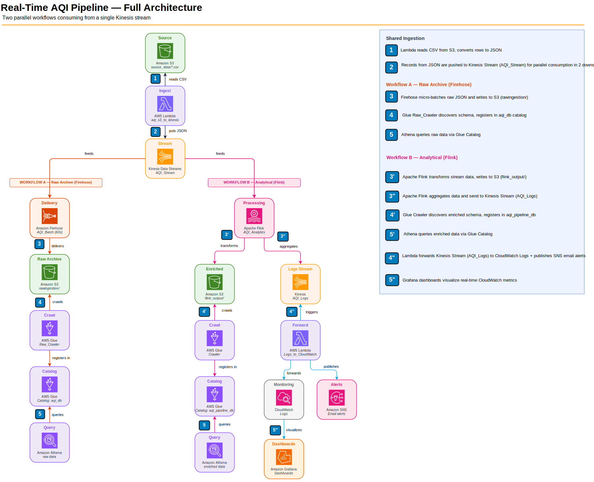
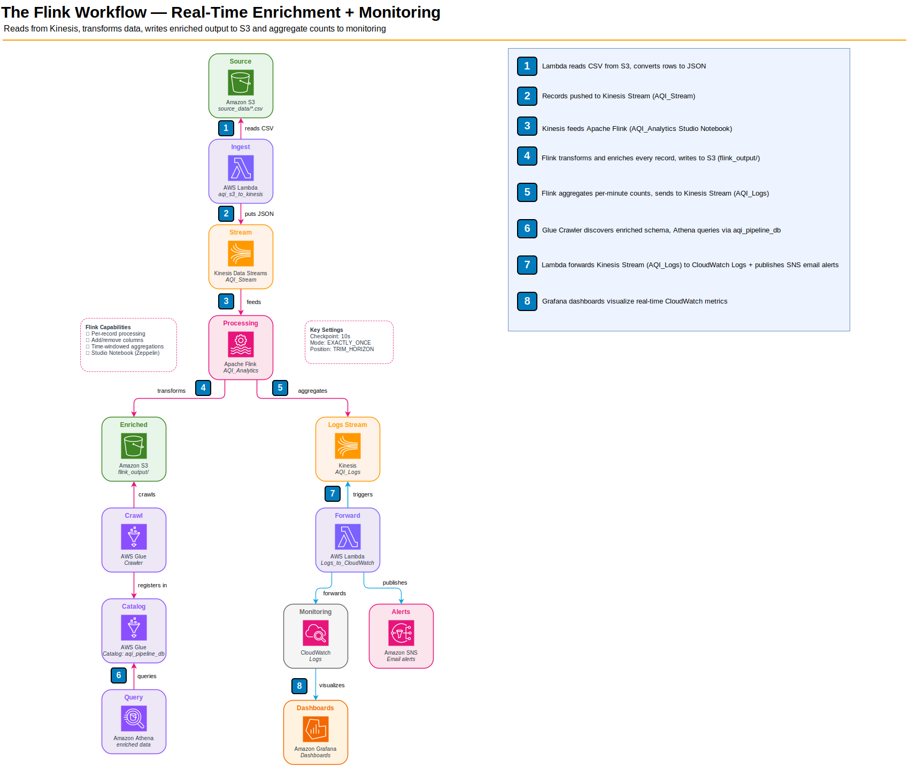
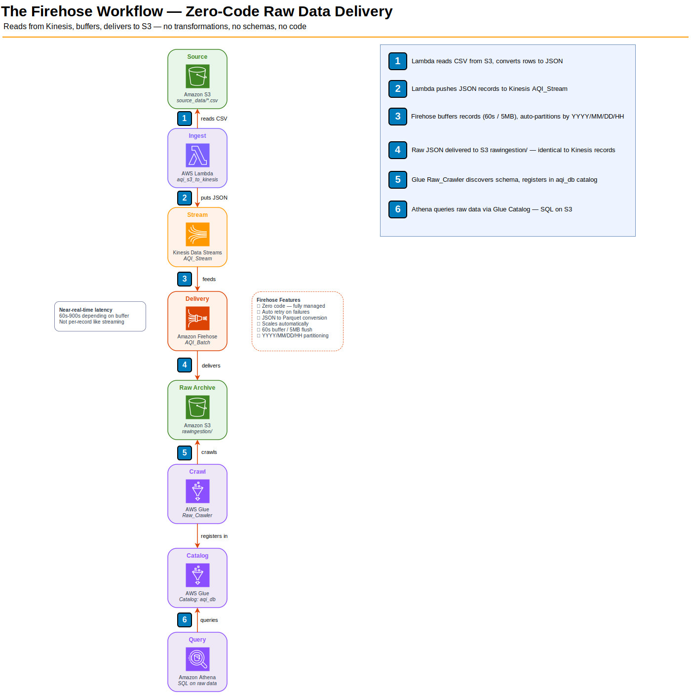

# AQI Data — With Firehose and Flink

**Topic:** Building a real-time data pipeline on AWS for Air Quality Index (AQI) data




&nbsp;

## Before You Start — Placeholders and Conventions

Every CLI and Terraform snippet in this walkthrough uses the placeholders in the table below. Substitute them with your own values before copy-pasting. The concrete values shown in the "Example" column are what this walkthrough used during the authors' test run — they work end-to-end but are not required.

| Placeholder | What it is | Example |
|---|---|---|
| `<ACCOUNT_ID>` | Your 12-digit AWS account ID | `123456789012` |
| `<REGION>` | AWS region for every resource in the pipeline | `eu-north-1` |
| `<AWS_PROFILE>` | Named AWS CLI profile to authenticate with | `aws-learn` |
| `<UNIQUE_SUFFIX>` | Suffix appended to the S3 bucket name (S3 names are globally unique) | `-td-42` |
| `<PIPELINE_BUCKET>` | Full bucket name: `aqi-pipeline-bucket<UNIQUE_SUFFIX>` | `aqi-pipeline-bucket-td-42` |
| `<YOUR_EMAIL>` | Email address for SNS alerts (a confirmation link is emailed on subscribe) | `you@example.com` |
| `<FIREHOSE_ROLE>` | Auto-generated Firehose service role name (includes a random suffix) | `KinesisFirehoseServiceRole-AQI_Batch-eu-north-1-xxxxxx` |
| `<SCHEDULER_ROLE>` | IAM role for EventBridge Scheduler to invoke the Lambda producer | `aqi_eventbridge_scheduler_role` |
| `<GRAFANA_ROLE>` | Auto-generated Grafana workspace role (when using SERVICE_MANAGED) | `AmazonGrafanaServiceRole-xxxxxx` |

> **Values used in this walkthrough**
> - **Region:** `eu-north-1` (change per your target region — every command has `--region eu-north-1` hard-coded for brevity; replace as needed)
> - **AWS profile:** `aws-learn`
> - **Bucket name prefix:** `aqi-pipeline-bucket` — you must append a unique suffix because S3 bucket names are globally unique.

&nbsp;

## Data Flow — How the Pipeline Works in Production

```
1. INGEST     Lambda function (aqi_s3_to_kinesis) reads CSVs from S3
                → source: <bucket>/aqi_pipeline/source_data/
                → converts each CSV row to JSON
                → publishes records to Kinesis Data Stream: AQI_Stream

              ── AQI_Stream forks into two parallel workflows ──

Workflow A — Raw Archive

2. DELIVER    Amazon Data Firehose (AQI_Batch, managed consumer) reads from AQI_Stream
                → buffers for 60–900 s or 1–128 MB (whichever first)
                → writes raw JSON to S3: <bucket>/aqi_pipeline/rawingestion/<YYYY>/<MM>/<DD>/<HH>/

3. CATALOG    Glue Crawler (Raw_Crawler) scans rawingestion/
                → discovers schema and registers table in Glue database: aqi_db

Workflow B — Enrichment + Monitoring

4. ENRICH     Apache Flink (Studio Notebook) reads continuously from AQI_Stream
                → adds computed columns: parameter_uppercase, value_in_fahrenheit
                → writes enriched JSON to S3: <bucket>/aqi_pipeline/flink_output/co-measurements/

5. AGGREGATE  Apache Flink runs a parallel windowed job on AQI_Stream
                → counts records per 1-minute tumbling window
                → writes counts to Kinesis Data Stream: AQI_Logs

6. CATALOG    Glue Crawler (aqi_measurements_crawler) scans co-measurements/
                → discovers schema and registers table in Glue database: aqi_pipeline_db

7. MONITOR    Lambda (Logs_to_Cloud_Watch) is triggered by AQI_Logs
                → writes each aggregate record to CloudWatch Logs
                → publishes summary email via SNS

Analytics & Observability (shared consumption)

8. QUERY      Amazon Athena queries tables through the Glue Data Catalog
                → serverless SQL over aqi_db (raw) and aqi_pipeline_db (enriched)
                → writes query results to S3: <bucket>/aqi_pipeline/athena-results/

9. VISUALIZE  Amazon Managed Grafana connects to CloudWatch
                → renders dashboards: record counts, AQI trends, processing health
```

**Why both?** Firehose gives you a zero-code archive of every raw record — useful for auditing, reprocessing, or feeding other systems that need untransformed data. Flink gives you enriched, queryable data and real-time monitoring. They serve different purposes and both consume from the same `AQI_Stream` independently.

## S3 Bucket Layout

```
aqi-pipeline-bucket/
└── aqi_pipeline/
    ├── source_data/                                  ← AQI CSV files (uploaded manually from OpenAQ)
    ├── rawingestion/<YYYY>/<MM>/<DD>/<HH>/           ← Raw JSON from Firehose (auto-partitioned by arrival time)
    ├── flink_output/
    │   └── co-measurements/                          ← Enriched JSON from Flink (adds parameter_uppercase, value_in_fahrenheit)
    └── athena-results/                               ← Athena query output
```

> **Note on raw data path:** Firehose automatically creates the `<YYYY>/<MM>/<DD>/<HH>/` hierarchy based on arrival time. You do not create these folders manually.

> **Note on bucket naming:** S3 bucket names are globally unique across all AWS accounts worldwide. If your chosen name (`aqi-pipeline-bucket`) is taken, append a suffix.

&nbsp;

## AWS Services Used

| Service | Role in Pipeline |
|---------|-----------------|
| **S3** (`aqi-pipeline-bucket/aqi_pipeline/`) | Object storage for scalable data storage. Holds all pipeline data — source CSVs, raw archive, Flink output, and Athena results |
| **Kinesis Data Streams** (`AQI_Stream`) | Real-time data streaming for high-throughput ingestion. Acts as the ingestion stream — receives records from the producer Lambda and decouples producers from consumers |
| **Amazon Data Firehose** (`AQI_Batch`) | Fully managed service that loads streaming data into storage. Reads from `AQI_Stream` and delivers untransformed JSON to S3 in micro-batches for raw archival |
| **Kinesis Data Streams** (`AQI_Logs`) | Second streaming channel dedicated to monitoring. Receives windowed aggregate counts from Flink and feeds them to the monitoring Lambda |
| **Amazon Managed Service for Apache Flink** | Serverless stream processing engine. Runs a Studio Notebook with Flink SQL — reads from Kinesis, enriches data, and writes to S3 and Kinesis |
| **Apache Zeppelin** | Notebook UI for writing and running Flink SQL interactively |
| **AWS Glue** (Crawlers + Data Catalog) | Automatically discovers and catalogs data. Crawlers scan S3 files, infer schemas, and register them in the Glue Data Catalog — the central metadata repository that Athena reads from |
| **Amazon Athena** | Serverless, interactive query service. Runs SQL directly against S3 files using Glue Catalog schemas — no infrastructure to manage, pay per query |
| **AWS Lambda** | Serverless compute for event-driven tasks. Two functions: producer (reads CSV from S3, pushes JSON to Kinesis) and monitor (reads from `AQI_Logs`, writes to CloudWatch + SNS) |
| **CloudWatch** | Monitoring and observability for AWS resources. Stores Flink aggregate records as structured log events and enables metric filters, alarms, and log-based analysis |
| **SNS** | Pub/sub messaging for email notifications. Publishes Lambda execution summaries so you know the pipeline is alive without watching a dashboard |
| **Amazon Managed Grafana** | Visualization layer for metrics and logs. Connects to CloudWatch and renders interactive dashboards — time-series charts, AQI distributions, and processing health |

&nbsp;

## Component-by-Component Walkthrough

Here's what each service does in the pipeline, in the order data touches it.

**S3 (Simple Storage Service)** — S3 is the object storage backbone of the entire pipeline. It holds everything — source CSVs, raw archives, enriched output, and query results. All data lives in a dedicated bucket (`aqi-pipeline-bucket`) organized under the `aqi_pipeline/` prefix (see the [S3 Bucket Layout](#s3-bucket-layout) tree above).

S3 plays two distinct roles in the pipeline:

- **Source** — the pipeline begins when a CSV file lands in `source_data/`. The producer Lambda reads from here, converts each row to JSON, and pushes records into Kinesis. Think of it as the loading dock where raw material arrives before anything processes it.
- **Destination** — both workflows write their output back to S3. Firehose deposits raw JSON in `rawingestion/` (with automatic `year/month/day/hour/` partitioning). Flink deposits enriched JSON in `flink_output/co-measurements/` (with computed columns added). Athena stores query results in `athena-results/`. S3 is the permanent analytical store — queryable, archivable, loadable into a data warehouse.

> **Why one bucket?** Using a single bucket with prefixes instead of separate buckets keeps IAM simple — one bucket policy, one set of role permissions. The tutorial creates three separate buckets (`AQI DATA`, `rawingestion`, `Analytical`) — we replicate them as S3 prefixes under `aqi_pipeline/`.

**Lambda (producer)** — A Lambda function picks up the S3 event, reads the CSV file, converts each row into a JSON record, and pushes those records into Kinesis. Lambda handles the format translation (CSV → JSON) and the push into the streaming layer. Without it, we'd need a long-running server just to feed data into the stream.

> **Note:** The tutorial uses a local Python script for this step. We use a Lambda function instead because corporate SSO/VPN blocks local `boto3` connections to AWS. Same logic, but it runs inside AWS with the `aqi_lambda_execution_role`.

**Kinesis Data Streams (AQI_Stream)** — This is the central pipe. Kinesis holds incoming records for up to 24 hours, decoupling the producer (Lambda) from the consumers (Firehose and Flink). If either consumer falls behind or restarts, the data is still in the stream waiting. Kinesis doesn't look at the data — it just moves bytes reliably from producers to consumers. Both Firehose and Flink read from this same stream independently.

**Amazon Data Firehose (AQI_Batch)** — Firehose is the simplest way to get streaming data into S3. It reads from `AQI_Stream`, buffers records, and writes them to `rawingestion/` in micro-batches with zero code. The output is partitioned by arrival time into `year/month/day/hour/` subfolders. Firehose cannot transform data — it delivers exactly what it receives.

> **"Real-time" vs "micro-batch":** You may see Firehose described as "real-time delivery." This is imprecise. Firehose buffers records and flushes based on two triggers — a **time interval** (configurable: 60–900 seconds, default 300s) and a **size threshold** (1–128 MB). Whichever trigger fires first causes a flush. This makes Firehose **near-real-time** (latency measured in minutes) compared to Flink (sub-second per record). Compared to a daily ETL batch job, Firehose feels instant. Compared to a true stream processor like Flink, it's buffered delivery. The distinction matters when you need per-record latency guarantees — Firehose is not the tool for that.

**Apache Flink (stream processor)** — Flink is the brain of the pipeline. It reads records from `AQI_Stream` and runs two parallel jobs: an enrichment query that adds computed columns and writes to S3, and a windowed aggregation that counts records per 1-minute tumbling window and writes the results to `AQI_Logs`. That second job is what powers the monitoring chain — Flink is the only component that can look *inside* the data, group it by time intervals, and produce summaries that feed CloudWatch, SNS, and Grafana.

> **Why Flink instead of a Lambda for aggregations?** A Lambda *could* compute simple counts and averages per batch — and for low-volume pipelines that's fine. But Flink is a continuously running stream processor that maintains **state across records**: it natively supports time-windowed aggregations (tumbling, sliding, session windows), handles late-arriving data via watermarks, and guarantees exactly-once output with checkpointing. At high throughput (thousands of records/second), Lambda would need an external state store (e.g., DynamoDB) to track rolling windows — adding latency, cost, and failure modes that Flink handles out of the box.

**Kinesis Data Streams (AQI_Logs)** — A second Kinesis stream carries aggregated summaries that Flink produces using tumbling windows (e.g., record counts per minute). This stream exists solely for real-time monitoring — it feeds CloudWatch metrics and SNS alerts so you know immediately if data quality degrades.

**AWS Glue (crawlers + Data Catalog)** — Two separate Glue Crawlers serve the two workflows. The first, `Raw_Crawler`, scans the untransformed Firehose output in `rawingestion/` and registers the raw schema in the `aqi_db` database. The second, `aqi_measurements_crawler`, scans the enriched Flink output in `flink_output/co-measurements/` and registers the analytical schema in the `aqi_pipeline_db` database. Each catalog entry is the single source of truth for "what columns exist and what types are they" — Athena reads it every time you run a query.

**Amazon Athena** — Athena lets you run SQL directly against the S3 files using the schema Glue discovered. There's no server to manage and no data to load — you point Athena at the Glue catalog table and query. You pay per terabyte scanned.

**CloudWatch + SNS (monitoring & alerting)** — CloudWatch consumes the aggregated metrics from `AQI_Logs` and triggers SNS notifications when thresholds are breached (e.g., record count drops to zero, average AQI spikes). This closes the feedback loop: you don't need to watch a dashboard to know something went wrong.

**Amazon Managed Grafana (dashboards)** — Grafana connects to CloudWatch Logs and turns the raw monitoring data into interactive dashboards. While SNS tells you *something happened*, Grafana shows you *what happened and when* — time-series charts of record counts, AQI trends, and processing latency. The workspace uses CloudWatch as its data source and queries the same `/aws/lambda/Logs_to_Cloud_Watch` log group that the monitoring Lambda writes to.

&nbsp;

## Firehose vs Flink — Why We Use Both

**Diagram 1: The Flink Workflow (Enrichment + Monitoring)**

This is Workflow B — the analytical processing path. Flink reads from `AQI_Stream`, adds computed columns, writes enriched data to S3, and simultaneously produces aggregate counts that feed the monitoring chain (CloudWatch, SNS, Grafana).



&nbsp;

**Diagram 2: The Firehose Workflow (Raw Data Archive)**

This is Workflow A — the raw archive path. Firehose reads from the same `AQI_Stream`, buffers records in micro-batches, and delivers them to S3 exactly as-is. Zero code, zero schemas, zero transformations. The raw data is then crawled by Glue and queryable via Athena.



&nbsp;

## Step 1: S3 Bucket + Folder Structure

### 1.1 — Create the S3 Bucket

1. Go to **S3 → Create bucket**
2. Bucket name: `aqi-pipeline-bucket`
3. Region: **eu-north-1** (must match all other resources)
4. Leave remaining settings as default → Click **Create bucket**

Or via CLI:
```bash
aws s3 mb s3://aqi-pipeline-bucket --region eu-north-1
```

> Terraform: [S3 Bucket](#1-s3-bucket)

### 1.2 — Create the Folder Prefixes

1. Go to **S3 → `aqi-pipeline-bucket`**
2. Create the following folders (use **Create folder** for each):
   - `aqi_pipeline/source_data/`
   - `aqi_pipeline/rawingestion/`
   - `aqi_pipeline/flink_output/`
   - `aqi_pipeline/flink_output/co-measurements/`
   - `aqi_pipeline/athena-results/`
3. Upload your AQI CSV files to `source_data/`

Or via CLI:
```bash
aws s3api put-object --bucket aqi-pipeline-bucket --key aqi_pipeline/source_data/
aws s3api put-object --bucket aqi-pipeline-bucket --key aqi_pipeline/rawingestion/
aws s3api put-object --bucket aqi-pipeline-bucket --key aqi_pipeline/flink_output/
aws s3api put-object --bucket aqi-pipeline-bucket --key aqi_pipeline/flink_output/co-measurements/
aws s3api put-object --bucket aqi-pipeline-bucket --key aqi_pipeline/athena-results/

# Upload your CSV files to source_data/
aws s3 cp <local-csv-path> s3://aqi-pipeline-bucket/aqi_pipeline/source_data/ --recursive
```

> **Mapping to tutorial buckets:** The tutorial creates three separate S3 buckets — `AQI DATA`, `rawingestion`, and `Analytical`. We replicate them as prefixes under `aqi_pipeline/`: `source_data/` = AQI DATA, `rawingestion/` = rawingestion, `flink_output/` = Analytical.

> Terraform: [S3 Folder Prefixes](#2-s3-folder-prefixes)

&nbsp;

## Step 2: Kinesis Data Streams


Two Kinesis Data Streams are needed:

| Stream | Purpose |
|--------|---------|
| `AQI_Stream` | Ingestion — Lambda pushes AQI records here, Firehose and Flink read from here |
| `AQI_Logs` | Monitoring — Flink writes windowed aggregate counts here |

### Create the Streams

1. Go to **Kinesis → Data streams → Create data stream**
2. Stream name: `AQI_Stream` | Capacity mode: **On-demand**
3. Click **Create data stream**
4. Repeat for stream name: `AQI_Logs`

Or via CLI:
```bash
aws kinesis create-stream \
  --stream-name AQI_Stream \
  --stream-mode-details StreamMode=ON_DEMAND \
  --region eu-north-1

aws kinesis create-stream \
  --stream-name AQI_Logs \
  --stream-mode-details StreamMode=ON_DEMAND \
  --region eu-north-1

# Poll until ACTIVE
aws kinesis describe-stream-summary \
  --stream-name AQI_Stream \
  --region eu-north-1 \
  --query 'StreamDescriptionSummary.StreamStatus'
```

> **Note:** On-demand mode auto-provisions 4 shards. You can verify data later via **Data viewer** → select each shard → Starting position: **Trim horizon** → **Get records**.

> Terraform: [Kinesis Data Streams](#3-kinesis-data-streams)

### What is Kinesis Data Streams?

Kinesis Data Streams is a **real-time data streaming service**. Think of it as a pipe — producers push records in on one end, and consumers read them out the other end, all in real-time (sub-second latency).

**Key concepts:**

| Concept | What it means |
|---------|---------------|
| **Stream** | A named channel that holds records. Like a topic in Kafka. |
| **Record** | A blob of data (up to 1MB) with a partition key. In our case, one JSON row of AQI data. |
| **Shard** | A unit of throughput capacity. 1 shard = 1MB/s write, 2MB/s read. On-demand mode auto-provisions 4 shards. |
| **Partition Key** | Determines which shard a record goes to. Records with the same key land on the same shard (preserves order). |
| **Retention** | How long records stay in the stream before expiring. Default 24 hours, max 365 days. |
| **Producer** | Anything that writes records into the stream (our Lambda). |
| **Consumer** | Anything that reads records from the stream (our Firehose delivery stream and Flink notebook). |

**How it fits in this pipeline:**

```
Lambda (producer)                          Firehose + Flink (consumers)
  reads CSV from S3                          Firehose: delivers raw JSON to S3
  converts each row to JSON       ──►        Flink: delivers enriched JSON to S3, aggregates to Kinesis
  pushes into AQI_Stream                     Both read from the same stream
```

We create two Kinesis streams in this step:

- **`AQI_Stream`** — the ingestion stream. The Lambda producer pushes AQI records here; Firehose and Flink both read from it.
- **`AQI_Logs`** — the monitoring stream. Flink writes aggregated output here (record counts per minute).

`AQI_Stream` acts as the **decoupling layer** between data ingestion and processing — both Firehose and Flink consume from it independently.

**On-demand vs Provisioned:**

| Mode | Shards | Pricing | When to use |
|------|--------|---------|-------------|
| **On-demand** | Auto-scales | Pay per GB | Don't know your throughput; bursty workloads |
| **Provisioned** | You choose (1, 2, ...) | Pay per shard-hour | Known steady throughput; lower cost at scale |

&nbsp;

## Step 3: Load Data into Kinesis (Lambda Producer)

The tutorial runs a Python script locally to push CSV data from S3 into Kinesis. Since we can't connect locally (corporate SSO/VPN), we use a **Lambda function** instead — same logic, runs inside AWS with a dedicated execution role.

> **Tutorial vs our approach:** The trainer creates a dedicated IAM user with `AdministratorAccess` for the local script. We use a Lambda function instead, which requires its own scoped execution role. No IAM user, no access keys, no long-lived credentials.

### 3.1 — Prerequisite: Lambda Execution Role

The Lambda function needs the `aqi_lambda_execution_role` IAM role — it grants scoped permissions to read from S3 (`source_data/*`), write to Kinesis (`AQI_Stream`), and emit CloudWatch Logs. This role is provisioned via Terraform before you create the function.

**Trust policy** — allows Lambda to assume this role:

```json
{
    "Version": "2012-10-17",
    "Statement": [
        {
            "Effect": "Allow",
            "Principal": { "Service": "lambda.amazonaws.com" },
            "Action": "sts:AssumeRole"
        }
    ]
}
```

**Inline policy** (`lambda-aqi-producer-access`) — grants the runtime permissions:

```json
{
    "Version": "2012-10-17",
    "Statement": [
        {
            "Sid": "S3ReadSourceData",
            "Effect": "Allow",
            "Action": ["s3:GetObject", "s3:ListBucket"],
            "Resource": [
                aws_s3_bucket.pipeline_bucket.arn,
                "${aws_s3_bucket.pipeline_bucket.arn}/aqi_pipeline/source_data/*"
            ]
        },
        {
            "Sid": "KinesisWrite",
            "Effect": "Allow",
            "Action": ["kinesis:PutRecord", "kinesis:PutRecords"],
            "Resource": aws_kinesis_stream.aqi_stream.arn
        },
        {
            "Sid": "CloudWatchLogs",
            "Effect": "Allow",
            "Action": ["logs:CreateLogGroup", "logs:CreateLogStream", "logs:PutLogEvents"],
            "Resource": "arn:aws:logs:*:*:*"
        }
    ]
}
```

> Terraform: [Lambda Execution Role](#4-lambda-execution-role)

The original local script is at [`s3_to_kinesis.py`](docs/resources/s3_to_kinesis.py) for reference. The Lambda-adapted version is [`s3_to_kinesis_lambda.py`](docs/resources/s3_to_kinesis_lambda.py).

**Key differences from the local script:**

- No `boto3.Session()` — Lambda gets credentials from its execution role automatically
- Entry point is `lambda_handler(event, context)` instead of `main()`
- Returns a structured response (status code + counts) instead of printing to console
- All `print()` statements go to CloudWatch Logs automatically
- Each record is suffixed with `\n` before being sent to Kinesis (so Firehose output becomes NDJSON — see [Firehose delivers concatenated JSON](#athena-query-returns-too-few-rows--firehose-concatenated-json) for why this matters)

### 3.2 — Create the Lambda Function

1. Go to **Lambda → Create function**
2. **Author from scratch**
3. Function name: `aqi_s3_to_kinesis`
4. Runtime: **Python 3.12**
5. Execution role: **Use an existing role** → select `aqi_lambda_execution_role`
6. Click **Create function**
7. In the code editor, **delete the default code** and paste the contents of [`s3_to_kinesis_lambda.py`](docs/resources/s3_to_kinesis_lambda.py)
8. Click **Deploy**
9. Go to **Configuration → General configuration → Edit**:
   - Timeout: **60 seconds** (default 3s is too short)
   - Memory: **128 MB** (sufficient)
   - Click **Save**

Or via CLI (zip the handler first):
```bash
# 1. Package the handler
zip function.zip s3_to_kinesis_lambda.py

# 2. Create the function
aws lambda create-function \
  --function-name aqi_s3_to_kinesis \
  --runtime python3.12 \
  --role arn:aws:iam::<ACCOUNT_ID>:role/aqi_lambda_execution_role \
  --handler s3_to_kinesis_lambda.lambda_handler \
  --zip-file fileb://function.zip \
  --timeout 60 \
  --memory-size 128 \
  --region eu-north-1
```

> Terraform: [Lambda Producer Function](#5-lambda-producer-function)

### 3.3 — Test the Lambda

1. In the Lambda console, click **Test**
2. Click **Test** (no event JSON needed — the function doesn't use the event)
3. Check the **Execution results** tab — you should see:
   ```
   Found 1 matching files in S3
   Read 48 records from aqi_pipeline/source_data/openaq_location_6946_measurment.csv
   Sent 48/48 records
   Done: {'files_processed': 1, 'total_records': 48, 'successfully_sent': 48, 'failed': 0}
   ```
4. Verify in **Kinesis → AQI_Stream → Data viewer** — select a shard → Starting position: **Trim horizon** → **Get records**. You should see the JSON records from the CSV.

Or via CLI:
```bash
# Invoke the Lambda and capture the response
aws lambda invoke \
  --function-name aqi_s3_to_kinesis \
  --region eu-north-1 --profile <AWS_PROFILE> \
  response.json
cat response.json

# Verify records landed in Kinesis — iterate ALL shards (on-demand mode auto-creates 4).
# A single shard iterator only sees records hashed to that one shard.
for SHARD in $(aws kinesis list-shards --stream-name AQI_Stream \
  --region eu-north-1 --profile <AWS_PROFILE> \
  --query 'Shards[].ShardId' --output text); do
    ITER=$(aws kinesis get-shard-iterator --stream-name AQI_Stream \
      --shard-id "$SHARD" --shard-iterator-type TRIM_HORIZON \
      --region eu-north-1 --profile <AWS_PROFILE> \
      --query 'ShardIterator' --output text)
    aws kinesis get-records --shard-iterator "$ITER" --limit 5 \
      --region eu-north-1 --profile <AWS_PROFILE> \
      --query 'Records[].{Seq:SequenceNumber,Time:ApproximateArrivalTimestamp}' --output table
done
```

### 3.4 — (Optional) Schedule with EventBridge

To push data repeatedly (simulating a live feed for Flink), add an EventBridge schedule. EventBridge Scheduler needs its own IAM role that can assume the `scheduler.amazonaws.com` principal and call `lambda:InvokeFunction` on the producer — create it first (or reuse an existing one).

**3.4.0 — Prerequisite: Scheduler role** (DevOps-provisioned in corporate accounts)

Trust policy (allows EventBridge Scheduler to assume the role):

```json
{
    "Version": "2012-10-17",
    "Statement": [
        {
            "Effect": "Allow",
            "Principal": { "Service": "scheduler.amazonaws.com" },
            "Action": "sts:AssumeRole",
            "Condition": {
                "StringEquals": {
                    "aws:SourceAccount": "<ACCOUNT_ID>"
                }
            }
        }
    ]
}
```

Inline policy (`aqi-scheduler-invoke-lambda`) — grants permission to invoke the producer Lambda:

```json
{
    "Version": "2012-10-17",
    "Statement": [
        {
            "Sid": "InvokeProducerLambda",
            "Effect": "Allow",
            "Action": "lambda:InvokeFunction",
            "Resource": "arn:aws:lambda:<REGION>:<ACCOUNT_ID>:function:aqi_s3_to_kinesis"
        }
    ]
}
```

Via CLI:
```bash
# Create the role
aws iam create-role \
  --role-name aqi_eventbridge_scheduler_role \
  --assume-role-policy-document '{"Version":"2012-10-17","Statement":[{"Effect":"Allow","Principal":{"Service":"scheduler.amazonaws.com"},"Action":"sts:AssumeRole","Condition":{"StringEquals":{"aws:SourceAccount":"<ACCOUNT_ID>"}}}]}' \
  --profile <AWS_PROFILE>

# Attach the inline policy
aws iam put-role-policy \
  --role-name aqi_eventbridge_scheduler_role \
  --policy-name aqi-scheduler-invoke-lambda \
  --policy-document '{"Version":"2012-10-17","Statement":[{"Sid":"InvokeProducerLambda","Effect":"Allow","Action":"lambda:InvokeFunction","Resource":"arn:aws:lambda:eu-north-1:<ACCOUNT_ID>:function:aqi_s3_to_kinesis"}]}' \
  --profile <AWS_PROFILE>
```

> Terraform: [EventBridge Scheduler Role](#6a-eventbridge-scheduler-role) (added alongside the schedule block).

**3.4.1 — Console: create the schedule**

1. Go to **EventBridge → Schedules → Create schedule**
2. Name: `aqi-kinesis-feed`
3. Schedule type: **Rate-based** → `rate(2 minutes)`
4. Target: **Lambda** → select `aqi_s3_to_kinesis`
5. Execution role: **Use an existing role** → `aqi_eventbridge_scheduler_role`
6. Click **Create schedule**

This pushes the same 48 records every 2 minutes. **Disable or delete the schedule when done testing.**

Or via CLI:
```bash
aws scheduler create-schedule \
  --name aqi-kinesis-feed \
  --schedule-expression "rate(2 minutes)" \
  --flexible-time-window Mode=OFF \
  --target "Arn=arn:aws:lambda:eu-north-1:<ACCOUNT_ID>:function:aqi_s3_to_kinesis,RoleArn=arn:aws:iam::<ACCOUNT_ID>:role/aqi_eventbridge_scheduler_role" \
  --region eu-north-1 --profile <AWS_PROFILE>

# To disable later:
aws scheduler update-schedule --name aqi-kinesis-feed --state DISABLED --region eu-north-1 --profile <AWS_PROFILE>
# Or delete:
aws scheduler delete-schedule --name aqi-kinesis-feed --region eu-north-1 --profile <AWS_PROFILE>
```

> Terraform: [EventBridge Schedule](#6-eventbridge-schedule)

&nbsp;

## Step 4: Firehose — Raw Data Delivery

### 4.1 — Create the Firehose Delivery Stream

1. Go to **Amazon Data Firehose → Create Firehose stream**
2. Source: **Amazon Kinesis Data Streams**
3. Destination: **Amazon S3**
4. Firehose stream name: `AQI_Batch`
5. In **Source settings**: select `AQI_Stream` as the Kinesis data stream (the ARN auto-fills)
6. In **Destination settings**:
   - S3 bucket: `aqi-pipeline-bucket`
   - S3 bucket prefix: `aqi_pipeline/rawingestion/`
   - *(Leave S3 bucket error output prefix empty or set to `aqi_pipeline/rawingestion-errors/`)*
7. Click **Create Firehose stream**

Or via CLI (the CLI does **not** auto-create the service role — unlike the console wizard. Create the role first, then the delivery stream):

```bash
# 1. Create the Firehose service role (CLI-only prerequisite)
aws iam create-role \
  --role-name KinesisFirehoseServiceRole-AQI_Batch \
  --assume-role-policy-document '{"Version":"2012-10-17","Statement":[{"Effect":"Allow","Principal":{"Service":"firehose.amazonaws.com"},"Action":"sts:AssumeRole","Condition":{"StringEquals":{"sts:ExternalId":"<ACCOUNT_ID>"}}}]}' \
  --profile <AWS_PROFILE>

# 2. Attach the scoped Kinesis-read + S3-write policy (see full JSON in section 4.2)
aws iam put-role-policy \
  --role-name KinesisFirehoseServiceRole-AQI_Batch \
  --policy-name firehose-aqi-batch-access \
  --policy-document file://firehose-inline-policy.json \
  --profile <AWS_PROFILE>

# 3. Create the delivery stream
aws firehose create-delivery-stream \
  --delivery-stream-name AQI_Batch \
  --delivery-stream-type KinesisStreamAsSource \
  --kinesis-stream-source-configuration \
      "KinesisStreamARN=arn:aws:kinesis:eu-north-1:<ACCOUNT_ID>:stream/AQI_Stream,RoleARN=arn:aws:iam::<ACCOUNT_ID>:role/KinesisFirehoseServiceRole-AQI_Batch" \
  --extended-s3-destination-configuration \
      "RoleARN=arn:aws:iam::<ACCOUNT_ID>:role/KinesisFirehoseServiceRole-AQI_Batch,BucketARN=arn:aws:s3:::<PIPELINE_BUCKET>,Prefix=aqi_pipeline/rawingestion/,ErrorOutputPrefix=aqi_pipeline/rawingestion-errors/!{firehose:error-output-type}/,BufferingHints={IntervalInSeconds=60,SizeInMBs=5}" \
  --region eu-north-1 --profile <AWS_PROFILE>

# 4. Poll until ACTIVE
aws firehose describe-delivery-stream \
  --delivery-stream-name AQI_Batch \
  --region eu-north-1 --profile <AWS_PROFILE> \
  --query 'DeliveryStreamDescription.DeliveryStreamStatus'
```

> **When using the Console:** the Firehose create wizard auto-creates the role with a suffixed name (e.g., `KinesisFirehoseServiceRole-AQI_Batch-eu-north-1-a1b2c3`). In that case, skip the CLI role-creation steps and just note the actual role name from the Configuration tab.

> **Tutorial note:** The trainer creates a separate bucket named `rawingestion`. We use the `aqi_pipeline/rawingestion/` prefix in our existing bucket instead — same result, no new bucket needed.

> Terraform: [Firehose Delivery Stream](#8-firehose-delivery-stream)

### 4.2 — Verify Firehose IAM Role

When you create a Firehose delivery stream, AWS automatically creates a service role named something like `KinesisFirehoseServiceRole-AQI_Batch-eu-north-1-<id>`. This role needs access to both the source (Kinesis) and the destination (S3).

1. Go to the **Configuration** tab of the `AQI_Batch` Firehose stream
2. Scroll to **Service access** — note the IAM role name
3. Click the role name to open it in IAM
4. Verify it has these permissions (AWS usually auto-attaches them):
   - **Kinesis read** — `kinesis:GetRecords`, `kinesis:GetShardIterator`, `kinesis:DescribeStream`, `kinesis:ListShards`
   - **S3 write** — `s3:PutObject`, `s3:GetBucketLocation`, `s3:ListBucket`

> **If permissions are missing:** The tutorial adds `AmazonKinesisFullAccess` and `AmazonS3FullAccess` as managed policies. This works but is overly broad. For our setup, the auto-generated `KinesisFirehoseServicePolicy-AQI_Batch-...` policy that AWS creates alongside the role already grants scoped access to the specific Kinesis stream and S3 bucket. Check if this policy exists on the role — if it does, you don't need to add anything. If the auto-generated policy is missing or Firehose reports access errors, add the two managed policies as a fallback and flag them for DevOps to scope down later.

> **Can we reuse an existing role?** No — Firehose requires a role with `firehose.amazonaws.com` as the trusted principal. Neither `aqi_lambda_execution_role` (trusts `lambda.amazonaws.com`) nor the Flink role (trusts `kinesisanalytics.amazonaws.com`) will work. The auto-generated role is the right approach here.

**Trust policy** — what the auto-created role should look like (for reference and Terraform parity):

```json
{
    "Version": "2012-10-17",
    "Statement": [
        {
            "Effect": "Allow",
            "Principal": { "Service": "firehose.amazonaws.com" },
            "Action": "sts:AssumeRole"
        }
    ]
}
```

**Inline policy** (`firehose-aqi-batch-access`) — scoped Kinesis-read + S3-write:

```json
{
    "Version": "2012-10-17",
    "Statement": [
        {
            "Sid": "KinesisRead",
            "Effect": "Allow",
            "Action": [
                "kinesis:GetRecords",
                "kinesis:GetShardIterator",
                "kinesis:DescribeStream",
                "kinesis:ListShards"
            ],
            "Resource": aws_kinesis_stream.aqi_stream.arn
        },
        {
            "Sid": "S3Write",
            "Effect": "Allow",
            "Action": [
                "s3:PutObject",
                "s3:GetBucketLocation",
                "s3:ListBucket",
                "s3:AbortMultipartUpload",
                "s3:ListMultipartUploadParts"
            ],
            "Resource": [
                aws_s3_bucket.pipeline_bucket.arn,
                "${aws_s3_bucket.pipeline_bucket.arn}/aqi_pipeline/rawingestion/*"
            ]
        }
    ]
}
```

> Terraform: [Firehose IAM Role](#7-firehose-iam-role)

### 4.3 — Test Firehose Delivery

1. Run the producer Lambda again: **Lambda → `aqi_s3_to_kinesis` → Test**
2. Wait ~1–2 minutes (Firehose buffers before flushing)
3. Go to **S3 → `aqi-pipeline-bucket` → `aqi_pipeline/rawingestion/`**
4. You should see time-partitioned subfolders: `YYYY/MM/DD/HH/`
5. Navigate into the deepest folder — you should see a file containing raw JSON records

Or via CLI:
```bash
# Trigger the producer
aws lambda invoke --function-name aqi_s3_to_kinesis --region eu-north-1 /tmp/response.json

# Wait ~1-2 minutes, then list delivered files
aws s3 ls s3://aqi-pipeline-bucket/aqi_pipeline/rawingestion/ --recursive | tail -5

# Inspect one of the delivered files
aws s3 cp s3://aqi-pipeline-bucket/aqi_pipeline/rawingestion/<YYYY>/<MM>/<DD>/<HH>/<filename> - | head -3
```

> **The partitioned folder structure** (`2026/04/08/09/AQI_Batch-1-2026-04-08-...`) is Firehose's default behavior. It partitions by the UTC arrival time of the records. This makes it easy to query specific time ranges in Athena.

### What is Amazon Data Firehose?

Amazon Data Firehose (formerly Kinesis Data Firehose) is a **fully managed delivery service** that reads from a streaming source and writes to a destination — with zero code. You don't write consumers, manage servers, or define schemas. You configure a source, a destination, and Firehose handles everything in between.

**How it delivers data:** Firehose buffers incoming records and flushes them to the destination in **micro-batches**. Two triggers control when a flush happens — whichever fires first wins:

| Trigger | Range | Default | Our pipeline |
|---------|-------|---------|-------------|
| **Buffer interval** (time) | 60–900 seconds | 300s (5 min) | 60s (minimum) |
| **Buffer size** (data volume) | 1–128 MB | 5 MB | 5 MB |

So if 5 MB of data accumulates before 60 seconds pass, Firehose flushes early. If 60 seconds pass before 5 MB accumulates, Firehose flushes what it has. This is why Firehose is **near-real-time** (latency in minutes) rather than true real-time (sub-second like Flink).

**Key limitations:**
- Cannot transform data (no adding columns, filtering, or aggregating)
- Cannot write to multiple destinations from a single stream
- Cannot do windowed aggregation
- Minimum buffer interval is 60 seconds — you can't get sub-minute latency

**Supported destinations:** S3, Redshift, OpenSearch, Splunk, HTTP endpoints, and third-party services (Datadog, New Relic, etc.).

**How it fits in this pipeline:**

```
AQI_Stream ──► Firehose (AQI_Batch) ──► S3 (rawingestion/)
                                         └── year/month/day/hour/file.json
```

Firehose reads from `AQI_Stream` and delivers raw JSON to `rawingestion/` with automatic time-based partitioning. This gives us an untransformed archive of every record that entered the pipeline — useful for auditing, reprocessing, and querying the original data shape.

&nbsp;

## Step 5: Raw Data — Glue Crawler + Athena

Now that Firehose is delivering raw data to S3, we set up a Glue Crawler to discover the schema and make the data queryable in Athena. This completes **Workflow A** (the raw archive path).

### 5.1 — Prerequisite: Glue Crawler Role

The Glue Crawler needs the `aqi-glue-crawler-role` IAM role — it grants scoped permissions to read S3 objects under `aqi_pipeline/*`, write to the Glue Data Catalog, and emit CloudWatch Logs. This role is shared by both crawlers (raw and analytical) and is provisioned via Terraform.

**Trust policy** — allows Glue to assume this role:

```json
{
    "Version": "2012-10-17",
    "Statement": [
        {
            "Effect": "Allow",
            "Principal": { "Service": "glue.amazonaws.com" },
            "Action": "sts:AssumeRole"
        }
    ]
}
```

**Inline policy** (`glue-aqi-crawler-access`) — scoped S3 read + Glue Catalog write + CloudWatch Logs:

```json
{
    "Version": "2012-10-17",
    "Statement": [
        {
            "Sid": "S3ReadPipelineData",
            "Effect": "Allow",
            "Action": ["s3:GetObject", "s3:ListBucket"],
            "Resource": [
                aws_s3_bucket.pipeline_bucket.arn,
                "${aws_s3_bucket.pipeline_bucket.arn}/aqi_pipeline/*"
            ]
        },
        {
            "Sid": "GlueCatalogWrite",
            "Effect": "Allow",
            "Action": [
                "glue:GetDatabase",
                "glue:GetDatabases",
                "glue:GetTable",
                "glue:GetTables",
                "glue:CreateTable",
                "glue:UpdateTable",
                "glue:GetPartitions",
                "glue:CreatePartition",
                "glue:BatchCreatePartition"
            ],
            "Resource": "*"
        },
        {
            "Sid": "CloudWatchLogs",
            "Effect": "Allow",
            "Action": ["logs:CreateLogGroup", "logs:CreateLogStream", "logs:PutLogEvents"],
            "Resource": "arn:aws:logs:*:*:*"
        }
    ]
}
```

> Terraform: [Glue Crawler Role](#9-glue-crawler-role)

### 5.2 — Create Glue Database

1. Go to **AWS Glue → Data Catalog → Databases → Add database**
2. Name: `aqi_db`
3. Click **Create**

Or via CLI:
```bash
aws glue create-database \
  --database-input Name=aqi_db \
  --region eu-north-1
```

> **Note:** This is a separate database from the `aqi_pipeline_db` which we'll create later for the Flink enriched output. Two databases keep the raw and analytical data cleanly separated.

> Terraform: [Glue Database (Raw)](#10-glue-database-raw)

### 5.3 — Create Raw Crawler

1. Go to **AWS Glue → Crawlers → Create crawler**
2. Name: `Raw_Crawler`
3. Data source: **S3** → Path: `s3://aqi-pipeline-bucket/aqi_pipeline/rawingestion/`
4. IAM role: `aqi-glue-crawler-role` (see [5.1](#51--prerequisite-glue-crawler-role))
5. Target database: `aqi_db`
6. Schedule: **On demand**
7. Click **Create crawler**
8. Run the crawler

Or via CLI:
```bash
aws glue create-crawler \
  --name Raw_Crawler \
  --role arn:aws:iam::<ACCOUNT_ID>:role/aqi-glue-crawler-role \
  --database-name aqi_db \
  --targets 'S3Targets=[{Path=s3://aqi-pipeline-bucket/aqi_pipeline/rawingestion/}]' \
  --region eu-north-1

aws glue start-crawler --name Raw_Crawler --region eu-north-1

# Poll until READY
aws glue get-crawler --name Raw_Crawler --region eu-north-1 --query 'Crawler.State'
```

> Terraform: [Glue Crawler (Raw)](#11-glue-crawler-raw)

### 5.4 — Verify Crawler Results

After the crawler completes:

1. Go to **AWS Glue → Data Catalog → Tables**
2. Select database: `aqi_db`
3. You should see a new table (named after the S3 prefix, e.g., `rawingestion`)
4. The crawler should report: **1 table change, 1 partition change** (the time-based folders become partitions)

### 5.5 — Query Raw Data in Athena

1. Go to **Athena → Query editor**
2. Set results location if not already done: **Settings → Manage → S3 location:** `s3://aqi-pipeline-bucket/aqi_pipeline/athena-results/`
3. Select database: `aqi_db`
4. Run:

```sql
SELECT * FROM aqi_db.rawingestion LIMIT 20;
```

You should see the raw AQI records — the same JSON that the Lambda producer pushed into `AQI_Stream`, untransformed by Firehose.

Or via CLI:
```bash
QUERY_ID=$(aws athena start-query-execution \
  --query-string "SELECT * FROM aqi_db.rawingestion LIMIT 20;" \
  --query-execution-context Database=aqi_db \
  --result-configuration OutputLocation=s3://aqi-pipeline-bucket/aqi_pipeline/athena-results/ \
  --region eu-north-1 \
  --query 'QueryExecutionId' --output text)

# Wait a few seconds, then fetch results
aws athena get-query-results --query-execution-id $QUERY_ID --region eu-north-1
```

> *No Terraform equivalent — Athena queries are interactive ad-hoc operations.*

&nbsp;

## Step 6: Flink Studio Notebook

### 6.1 — Prerequisite: Flink IAM Role

The Flink notebook needs a **dedicated** IAM role with `kinesisanalytics.amazonaws.com` as the trusted principal. Neither the Lambda role nor the Glue role can be reused — each AWS service requires its own trust policy. The role `kinesis-analytics-AQI_Analytics-eu-north-1` grants scoped access to both Kinesis streams, S3 under `aqi_pipeline/*`, Glue Catalog, and CloudWatch Logs.

**Trust policy** — allows Managed Flink to assume this role:

```json
{
    "Version": "2012-10-17",
    "Statement": [
        {
            "Effect": "Allow",
            "Principal": { "Service": "kinesisanalytics.amazonaws.com" },
            "Action": "sts:AssumeRole"
        }
    ]
}
```

**Inline policy** (`flink-aqi-scoped-access`) — the four capability groups Flink needs:

```json
{
    "Version": "2012-10-17",
    "Statement": [
        {
            "Sid": "KinesisReadWrite",
            "Effect": "Allow",
            "Action": [
                "kinesis:GetRecords",
                "kinesis:GetShardIterator",
                "kinesis:DescribeStream",
                "kinesis:DescribeStreamSummary",
                "kinesis:ListShards",
                "kinesis:PutRecord",
                "kinesis:PutRecords",
                "kinesis:SubscribeToShard",
                "kinesis:ListStreams"
            ],
            "Resource": [
                aws_kinesis_stream.aqi_stream.arn,
                aws_kinesis_stream.aqi_logs.arn
            ]
        },
        {
            "Sid": "S3ReadWritePipeline",
            "Effect": "Allow",
            "Action": [
                "s3:GetObject",
                "s3:PutObject",
                "s3:ListBucket",
                "s3:GetBucketLocation",
                "s3:AbortMultipartUpload",
                "s3:ListMultipartUploadParts"
            ],
            "Resource": [
                aws_s3_bucket.pipeline_bucket.arn,
                "${aws_s3_bucket.pipeline_bucket.arn}/aqi_pipeline/*"
            ]
        },
        {
            "Sid": "GlueCatalogAccess",
            "Effect": "Allow",
            "Action": [
                "glue:GetDatabase",
                "glue:GetDatabases",
                "glue:GetTable",
                "glue:GetTables",
                "glue:GetPartitions",
                "glue:CreateTable",
                "glue:UpdateTable"
            ],
            "Resource": "*"
        },
        {
            "Sid": "CloudWatchLogs",
            "Effect": "Allow",
            "Action": [
                "logs:CreateLogGroup",
                "logs:CreateLogStream",
                "logs:PutLogEvents",
                "logs:DescribeLogStreams"
            ],
            "Resource": "arn:aws:logs:*:*:log-group:/aws/kinesis-analytics/*"
        }
    ]
}
```

> Terraform: [Flink IAM Role](#12-flink-iam-role)

### 6.2 — Create the Notebook

1. Go to **Amazon Managed Service for Apache Flink → Studio notebooks**
2. Click **Create Studio notebook**
3. Configure:
   - Notebook name: `AQI_Analytics`
   - IAM role: Select `kinesis-analytics-AQI_Analytics-eu-north-1`
   - AWS Glue database: *(leave default or select one if prompted)*
4. Click **Create Studio notebook**
5. Wait for status to show **Created**

Or via CLI (the **simplest** path for a Studio notebook — omit `--application-configuration` entirely and let AWS apply defaults. Adding CheckpointConfiguration / ParallelismConfiguration to a Zeppelin runtime returns `InvalidArgumentException`):

```bash
aws kinesisanalyticsv2 create-application \
  --application-name AQI_Analytics \
  --runtime-environment ZEPPELIN-FLINK-3_0 \
  --application-mode INTERACTIVE \
  --service-execution-role arn:aws:iam::<ACCOUNT_ID>:role/kinesis-analytics-AQI_Analytics \
  --region eu-north-1 --profile <AWS_PROFILE> \
  --query 'ApplicationDetail.{Name:ApplicationName,Status:ApplicationStatus}' --output json
```

> **UI-only limitation:** `create-application` provisions only the app shell. Every Step 7 SQL paragraph (`CREATE TABLE air_quality_source`, `INSERT INTO aqi_s3_sink`, etc.) is entered interactively inside Zeppelin after you click **Open in Apache Zeppelin** — Studio notebook paragraphs are **not** creatable via the AWS CLI. If you need fully scripted Flink, deploy a `STREAMING` application with a JAR/Python artifact instead (out of scope for this walkthrough).

> **Runtime version note:** `ZEPPELIN-FLINK-3_0` is the value shown in the Console for current Studio notebooks. AWS occasionally ships newer Zeppelin/Flink combos — check [Supported Studio notebook runtimes](https://docs.aws.amazon.com/managed-flink/latest/java/studio-notebook-versions.html) if the CLI returns `InvalidArgumentException` on `--runtime-environment`.

> **Regional availability:** Studio Notebooks aren't available in every AWS region. If the CLI returns `InternalFailure`, confirm Managed Flink Studio is supported in your region or fall back to a `STREAMING`-mode Flink application.

> Terraform: [Flink Studio Notebook](#13-flink-studio-notebook)

### 6.3 — Start the Notebook

1. Select `AQI_Analytics` → Click **Run**
2. Wait for status to change to **Running** (2–5 minutes)
3. Once running, click **Open in Apache Zeppelin**

Or via CLI:
```bash
aws kinesisanalyticsv2 start-application \
  --application-name AQI_Analytics \
  --region eu-north-1

# Poll until RUNNING
aws kinesisanalyticsv2 describe-application \
  --application-name AQI_Analytics \
  --region eu-north-1 \
  --query 'ApplicationDetail.ApplicationStatus'
```

> **While waiting**, you can re-run the producer Lambda (Step 3) to push more data into `AQI_Stream` so that when the Flink source table is created, there will be data to read.

### What is Amazon Managed Service for Apache Flink?

Apache Flink is an open-source **stream processing engine**. You use it when you want to **transform, enrich, or aggregate** data as it flows through a Kinesis stream — before it lands in S3 or another destination.

In this tutorial, Flink does two things:
1. **Enrichment** — adds two computed columns (proves the transformation pattern)
2. **Windowed aggregation** — counts records per minute and writes the counts to a monitoring stream (demonstrates real-time data-level monitoring)

**Amazon Managed Service for Apache Flink** is AWS's hosted version. You don't manage any servers — AWS handles all of that.

### Streaming Applications vs Studio Notebooks

Amazon Managed Service for Apache Flink offers two modes of operation. Understanding the difference helps you choose the right one.

**Streaming Applications** are production-grade, long-running Flink jobs. You write code (Java, Scala, or Python), package it as a JAR or ZIP, and deploy it to a continuously running application. The application auto-starts on deploy, auto-restarts on failure, and runs 24/7. You don't interact with it — it just processes data. Use this when your Flink logic is finalized and needs to run reliably in production without human intervention.

**Studio Notebooks** are interactive environments for developing and testing Flink logic. They run Apache Zeppelin (a web-based notebook similar to Jupyter) with Flink as the backend engine. You write SQL or Python in cells, run them one at a time, see results immediately, tweak, and iterate. The notebook only runs while you have it started — stop it and the processing stops. Use this during development, exploration, and tutorials (like ours).

| | Studio Notebook | Streaming Application |
|---|---|---|
| **Use case** | Development, exploration, tutorials | Production workloads |
| **How you write code** | Interactively in browser (Zeppelin cells) | Package JAR/ZIP, deploy via CLI/Terraform |
| **Start/stop** | Manual (click Run/Stop) | Runs continuously, auto-restarts on failure |
| **State management** | Ephemeral — state lost when stopped | Persistent — checkpoints survive restarts |
| **Cost** | Runs only while you have it started | Runs 24/7 |
| **Debugging** | See results inline, iterate fast | Check logs, redeploy to test changes |
| **Our use case** | ✅ Tutorial — interactive exploration | Later, if you productionize |

### What is a Studio Notebook?

A Studio Notebook is an **interactive environment** for writing and testing Flink SQL, powered by **Apache Zeppelin** (a web-based notebook, similar to Jupyter).

| Concept | What it means |
|---------|---------------|
| **Studio Notebook** | A managed Flink application with a Zeppelin UI attached |
| **Apache Zeppelin** | The notebook UI — cells/blocks where you write and run code |
| **Interpreter** | The engine behind each block. We use `%flink.ssql` — Flink's streaming SQL interpreter |
| **Source Table** | A `CREATE TABLE` that defines where Flink reads from (Kinesis stream) |
| **Sink Table** | A `CREATE TABLE` that defines where Flink writes to (S3 or Kinesis) |
| **Checkpointing** | Periodic state snapshots — this is when data actually gets flushed to sinks |
| **Watermark** | Tells Flink how to handle late-arriving data. Our watermark allows 5 seconds of lateness |
| **Tumbling Window** | A fixed-size, non-overlapping time window. Our `TUMBLE(..., INTERVAL '1' MINUTE)` groups records into 1-minute buckets |

**How it fits in this pipeline:**

```
                    ┌────────────────────────────────────────────────────────────────────┐
                    │   Flink Studio Notebook (AQI_Analytics)                            │
                    │                                                                    │
AQI_Stream ────►    │   air_quality_source (Kinesis connector)                           │
  (JSON records)    │        │                                                           │
                    │        ├──► Enrichment query ──► aqi_s3_sink ──► S3 (JSON files)   │
                    │        │    (UPPER, Fahrenheit)                                    │
                    │        │                                                           │
                    │        └──► Windowed aggregation ──► aqi_logs_sink ──► AQI_Logs    │
                    │             (COUNT per minute)               (JSON records)        │
                    └────────────────────────────────────────────────────────────────────┘
```

&nbsp;

## Step 7: Flink SQL — Real-Time Processing

Once the Flink Studio Notebook is **Running** and you've opened **Apache Zeppelin**, you'll define schemas and start processing jobs. This is **Workflow B** — the analytical processing path that enriches data and produces monitoring output.

> **Reminder:** Workflow A (Firehose → raw archive) is already running from Step 4. Both workflows consume from the same `AQI_Stream` independently. Firehose delivers raw data; Flink transforms it.

### What are we building?

Flink needs you to describe the **shape of the data** before it can process anything — just like a database needs `CREATE TABLE` before you can `INSERT` or `SELECT`. We define **three** tables that serve as the building blocks:

| Table | Role | Connector | Destination |
|-------|------|-----------|-------------|
| `air_quality_source` | **Input** — reads from Kinesis | `kinesis` | *(reads from `AQI_Stream`)* |
| `aqi_s3_sink` | **Output** — enriched data for analytics | `filesystem` | S3 `flink_output/co-measurements/` |
| `aqi_logs_sink` | **Output** — aggregate counts for monitoring | `kinesis` | Kinesis `AQI_Logs` |

The source table has **15 data fields + 3 metadata fields**. The S3 sink has **15 fields − metadata + 2 computed = 15 fields**. The logs sink has just **2 fields** (window time + count).

| Step | What you run | What it does | Does data move? |
|------|-------------|-------------|-----------------|
| **8.1** | `CREATE TABLE air_quality_source` | Defines the **input schema** | ❌ No — just a definition |
| **8.2** | `SELECT * FROM air_quality_source` | Quick test — see live data from Kinesis | Displays data, doesn't write |
| **8.3** | `CREATE TABLE aqi_s3_sink` | Defines the **output schema** for S3 | ❌ No — just a definition |
| **8.4** | `INSERT INTO aqi_s3_sink SELECT ...` | **Starts enrichment** — reads, adds 2 columns, writes to S3 | ✅ Yes |
| **8.5** | `CREATE TABLE aqi_logs_sink` | Defines the **monitoring output** | ❌ No — just a definition |
| **8.6** | `INSERT INTO aqi_logs_sink SELECT ...` | **Starts aggregation** — counts per minute → `AQI_Logs` | ✅ Yes |

### Where does the data end up?

**`aqi_s3_sink` → S3 (permanent storage)** — Enriched JSON files queryable by Athena, loadable into Snowflake/Redshift, archivable to Glacier.

**`aqi_logs_sink` → Kinesis `AQI_Logs` (real-time monitoring)** — 1 record per minute with the count of processed records. Feeds CloudWatch alarms and Grafana dashboards.

### Important: INSERT jobs need continuous data

The INSERT statements are **continuous streaming jobs**. If no new records arrive in Kinesis for a while, the job may error out with `Retries exceeded for getRecords`. Push more data via the producer Lambda or set up the EventBridge schedule.

&nbsp;

---

&nbsp;

### 7.1 — Checkpoint Configuration + Source Table

In Zeppelin, click **Create new note** → name: `AQI_Data_Analysis` → interpreter: `flink`.

Create a block and paste:

```sql
%flink.ssql

-- Enable checkpointing for reliable data delivery to sinks
SET 'execution.checkpointing.interval' = '10 s';
SET 'execution.checkpointing.mode' = 'EXACTLY_ONCE';

-- ========================================
-- Source Table: reads from Kinesis AQI_Stream
-- ========================================
CREATE TABLE air_quality_source (
  location_id        STRING,
  location_name      STRING,
  parameter_of_AQI   STRING,
  value_of_AQI       DOUBLE,
  unit               STRING,
  processing_time    TIMESTAMP_LTZ(3) METADATA FROM 'timestamp',
  timezone           STRING,
  latitude           DOUBLE,
  longitude          DOUBLE,
  country_iso        STRING,
  isMobile           BOOLEAN,
  isMonitor          BOOLEAN,
  owner_name         STRING,
  provider           STRING,
  shard_id           STRING METADATA FROM 'shard-id',
  sequence_number    STRING METADATA FROM 'sequence-number',
  WATERMARK FOR processing_time AS processing_time - INTERVAL '5' SECOND
)
WITH (
  'connector' = 'kinesis',
  'stream' = 'AQI_Stream',
  'aws.region' = 'eu-north-1',
  'format' = 'json',
  'json.ignore-parse-errors' = 'true',
  'scan.stream.initpos' = 'TRIM_HORIZON'
);
```

Run this block (Shift+Enter).

### Understanding the metadata columns

The source table has **3 columns not present in the actual JSON data** — they're extracted from Kinesis stream internals using the `METADATA` keyword:

| Column | Source | What it contains | Why you'd use it |
|--------|--------|-----------------|-----------------|
| `processing_time` | `METADATA FROM 'timestamp'` | The UTC timestamp when Kinesis received the record | Time-based windows, ordering, latency calculation |
| `shard_id` | `METADATA FROM 'shard-id'` | Which Kinesis shard the record was assigned to (e.g., `shardId-000000000001`) | Debug uneven load distribution, trace specific records |
| `sequence_number` | `METADATA FROM 'sequence-number'` | Kinesis-assigned monotonically increasing ID within a shard | Trace exact record ordering, identify duplicates, resume from a specific point |

These metadata columns are valuable for **troubleshooting and auditing**. For example:
- If enriched S3 output has gaps, you can query the source table and check whether the missing records were in a specific shard — indicating a shard-level read failure
- If you suspect duplicate processing after a Flink restart, `sequence_number` tells you exactly which records were processed twice
- `processing_time` lets you measure end-to-end latency: compare the Kinesis arrival timestamp against when the enriched record lands in S3

These columns exist **only in the source table**. The S3 sink table does not include them because the enriched output is meant for analytics, not pipeline debugging. The INSERT query in 8.4 simply doesn't SELECT them.

### Understanding the watermark

```sql
WATERMARK FOR processing_time AS processing_time - INTERVAL '5' SECOND
```

A watermark tells Flink: **"I can safely assume all events with timestamps up to this point have arrived."** Without it, Flink has no way to know when a tumbling window can close and emit results.

**How it works:** When Flink sees a record with `processing_time = 12:05:30`, the watermark becomes `12:05:25` (30 − 5). This means Flink considers all events before 12:05:25 to have arrived. Any window that ends at or before 12:05:25 can now close.

**Why 5 seconds of tolerance?** In streaming systems, records don't always arrive in order. Network delays, shard reassignment, or Lambda retry can cause a record with timestamp 12:05:24 to arrive after one with 12:05:30. The 5-second tolerance says: "don't close a window until you've waited 5 seconds past the window's end, in case late records are still coming."

**What happens to records that arrive after the watermark passes?** They're dropped. If the watermark is at 12:05:25 and a record arrives with `processing_time = 12:05:20`, Flink ignores it because the window that would contain it is already closed. In our pipeline with a 5-second tolerance and 1-minute windows, this is very generous — you'd need records to be more than 5 seconds late to lose them.

**Why does this matter for the logs sink?** The `aqi_logs_sink` uses a 1-minute tumbling window (`TUMBLE(..., INTERVAL '1' MINUTE)`). Without the watermark, Flink would never know when a 1-minute window is "done" and would never emit the count. The watermark is what triggers window closure and output.

### Understanding the connector properties

| Setting | Value | Why |
|---------|-------|-----|
| `'connector' = 'kinesis'` | Kinesis connector | Tells Flink to use the AWS Kinesis source connector. This connector knows how to authenticate with IAM, poll shards, handle resharding, and manage checkpoints. You'd use `'connector' = 'kafka'` for Kafka, `'connector' = 'filesystem'` for S3, etc. |
| `'stream' = 'AQI_Stream'` | Stream name | Which Kinesis stream to read from |
| `'aws.region' = 'eu-north-1'` | AWS region | Must match where the stream was created |
| `'format' = 'json'` | JSON format | Tells Flink how to deserialize each Kinesis record. The records are JSON because our Lambda producer converts CSV rows to JSON before pushing them. |
| `'json.ignore-parse-errors' = 'true'` | Skip bad records | Skip malformed JSON instead of failing the entire job. In production, you'd route these to a dead-letter queue. |
| `'scan.stream.initpos' = 'TRIM_HORIZON'` | Start from beginning | Read from the oldest available record in the stream, not just new ones. Useful during development so you don't need to push data right before running queries. |

### 7.2 — Verify Source Table

Create a new block:

```sql
%flink.ssql(type=update)

SELECT * FROM air_quality_source;
```

This is a **streaming query** — it runs continuously, showing new records as they arrive. If no data appears, run the producer Lambda again (Step 3) to push more records.

### 7.3 — S3 Sink Table (Output Schema)

The source table defines **what comes in** from Kinesis (15 data fields + 3 metadata fields). The S3 sink defines **what goes out** to S3 — a different shape: the original 15 data fields minus the 3 metadata columns, plus 2 new computed columns (`parameter_uppercase`, `value_in_fahrenheit`), totaling 15 fields.

```
8.1 (15 data + 3 metadata)  →  8.4 drops metadata, adds 2  →  8.3 (15 fields out to S3)
     source schema                   the actual work              output schema
```

> **"Removing metadata columns"?** The metadata columns (`processing_time`, `shard_id`, `sequence_number`) were never part of the S3 sink table's definition in the first place. They exist only in the source table for debugging. The INSERT query in 8.4 simply doesn't include them in its SELECT — there's nothing to remove.

Create a new block:

```sql
%flink.ssql

-- ========================================
-- S3 Sink: writes enriched data as JSON files
-- ========================================
CREATE TABLE aqi_s3_sink (
  location_id          STRING,
  location_name        STRING,
  parameter_of_AQI     STRING,
  value_of_AQI         DOUBLE,
  unit                 STRING,
  timezone             STRING,
  latitude             DOUBLE,
  longitude            DOUBLE,
  country_iso          STRING,
  isMobile             BOOLEAN,
  isMonitor            BOOLEAN,
  owner_name           STRING,
  provider             STRING,
  parameter_uppercase  STRING,
  value_in_fahrenheit  DOUBLE
)
WITH (
  'connector' = 'filesystem',
  'path' = 's3://aqi-pipeline-bucket/aqi_pipeline/flink_output/co-measurements/',
  'format' = 'json',
  'sink.rolling-policy.file-size' = '1MB',
  'sink.rolling-policy.rollover-interval' = '30 s',
  'sink.rolling-policy.check-interval' = '10 s'
);
```

### Understanding the connector properties

| Setting | Value | Why |
|---------|-------|-----|
| `'connector' = 'filesystem'` | Filesystem connector | Writes directly to S3 as files. The filesystem connector treats S3 as a file system (via Hadoop's S3A implementation). You'd use `'connector' = 'kinesis'` to write to a Kinesis stream, `'connector' = 'jdbc'` for a database, etc. |
| `'path'` | S3 location | The S3 prefix where JSON files land |
| `'format' = 'json'` | JSON output | Each row is written as a JSON line — Athena-compatible. Could also be `'parquet'` or `'csv'`. |
| `'sink.rolling-policy.rollover-interval' = '30 s'` | File rotation | Start a new file every 30 seconds. Shorter intervals = more small files (easier to inspect), longer intervals = fewer larger files (better for Athena performance). |
| `'sink.rolling-policy.file-size' = '1MB'` | Max file size | Start a new file when the current one reaches 1MB, even if 30 seconds haven't passed |
| `'sink.rolling-policy.check-interval' = '10 s'` | Check frequency | How often Flink evaluates whether to rotate. Must be ≤ the rollover interval. |

### 7.4 — Insert into S3 Sink (Enrichment Query)

```sql
%flink.ssql(type=update)

INSERT INTO aqi_s3_sink
SELECT
  location_id,
  location_name,
  parameter_of_AQI,
  value_of_AQI,
  unit,
  timezone,
  latitude,
  longitude,
  country_iso,
  isMobile,
  isMonitor,
  owner_name,
  provider,
  UPPER(parameter_of_AQI)          AS parameter_uppercase,
  value_of_AQI * 1.8 + 32         AS value_in_fahrenheit
FROM air_quality_source;
```

Run this block. It starts a **continuous streaming job** that reads from `AQI_Stream`, adds two computed columns, and writes enriched JSON to S3. Notice the SELECT does not include `processing_time`, `shard_id`, or `sequence_number` — those metadata columns stay in the source table for debugging, not in the analytical output.

### 7.5 — Kinesis Log Sink Table (Monitoring Output)

This is the third and final table — purpose-built for **real-time monitoring**. Unlike the S3 sink (which writes every enriched record), this sink writes **one summary per minute** with a count of how many records Flink processed in that window.

| | S3 sink (8.3) | This sink (8.5) |
|---|---|---|
| **What it writes** | Every record, enriched | One summary per minute |
| **Fields** | 15 (data + 2 computed) | 2 (`window_end`, `record_count`) |
| **Where** | S3 (permanent files) | Kinesis `AQI_Logs` (real-time stream) |
| **Could Firehose do this?** | Yes (if we didn't add columns) | **No** — Firehose can't aggregate |

**Why do we need this?** CloudWatch monitors Kinesis at the infrastructure level — API calls, bytes in/out, iterator age. But it can't see **inside** the records. It can't tell you "how many AQI measurements arrived this minute" or "what's the average AQI value." Flink can, because it reads and understands the data. This sink bridges that gap by pushing Flink's data-level insights into `AQI_Logs`, which feeds CloudWatch, SNS, and Grafana.

**What else could you do with this pattern?**
- Count records where `value_of_AQI > 100` per minute (unhealthy air quality alert)
- Compute average, min, max AQI per window for trend monitoring
- Track distinct `location_id` count per window to detect station dropouts
- Monitor `isMobile` vs `isMonitor` ratio to catch sensor fleet changes
- Detect zero-record windows as an early warning that the producer Lambda stopped

```sql
%flink.ssql

CREATE TABLE aqi_logs_sink (
  window_end    TIMESTAMP_LTZ(3),
  record_count  BIGINT
)
WITH (
  'connector' = 'kinesis',
  'stream' = 'AQI_Logs',
  'aws.region' = 'eu-north-1',
  'format' = 'json',
  'sink.partitioner' = 'random'
);
```

### Understanding the connector properties

| Setting | Value | Why |
|---------|-------|-----|
| `'connector' = 'kinesis'` | Kinesis connector | Same connector as the source table, but used in write mode. Flink detects the direction from context — `CREATE TABLE` + `INSERT INTO` = sink. |
| `'stream' = 'AQI_Logs'` | Target stream | The second Kinesis stream, dedicated to monitoring output |
| `'format' = 'json'` | JSON format | Each aggregate record is written as JSON: `{"window_end": "...", "record_count": N}` |
| `'sink.partitioner' = 'random'` | Random partitioning | Distributes records randomly across `AQI_Logs` shards. Since we're writing 1 record per minute, even distribution doesn't matter — but `random` avoids hot-shard issues if you later increase the frequency. |

### 7.6 — Insert into Kinesis Log Sink (Windowed Aggregation)

```sql
%flink.ssql(type=update)

INSERT INTO aqi_logs_sink
SELECT
  window_end,
  COUNT(*) AS record_count
FROM TABLE(
  TUMBLE(TABLE air_quality_source, DESCRIPTOR(processing_time), INTERVAL '1' MINUTE)
)
GROUP BY window_start, window_end;
```

This groups incoming records into 1-minute tumbling windows, counts them, and writes `{"window_end": "...", "record_count": N}` to `AQI_Logs`. The window closes (and the count is emitted) when the watermark passes the window's end time — meaning Flink has waited 5 seconds past the minute boundary for any late records.

### 7.7 — Ad-Hoc Analytics (Optional)

While the streaming jobs are running, you can run analytical queries on the live stream:

```sql
%flink.ssql(type=update)

SELECT avg(value_of_AQI) AS AVG_AQI
FROM air_quality_source
WHERE value_of_aqi IS NOT NULL;
```

> *No Terraform equivalent — Flink SQL queries run interactively in the Flink Studio Notebook browser UI. There is no infrastructure to provision.*

&nbsp;

## Step 8: Verify Flink S3 Output

After the Flink S3 sink has been running for at least 30 seconds:

1. Go to **S3 → `aqi-pipeline-bucket` → `aqi_pipeline/` → `flink_output/` → `co-measurements/`**
2. You should see subdirectories and JSON files appearing
3. Download one file and verify it contains AQI records with the added `parameter_uppercase` and `value_in_fahrenheit` fields

Or via CLI:
```bash
# List delivered files (most recent 5)
aws s3 ls s3://aqi-pipeline-bucket/aqi_pipeline/flink_output/co-measurements/ --recursive | tail -5

# Inspect one file to confirm enriched columns are present
aws s3 cp s3://aqi-pipeline-bucket/aqi_pipeline/flink_output/co-measurements/<key> - | head -3
```

> *No Terraform equivalent — this is a manual verification step to confirm the Flink S3 sink is producing output.*

&nbsp;

## Step 9: Analytical Data — Glue Catalog + Athena Querying

Once enriched data is in S3 from Flink, set up Glue and Athena to query the **analytical** output. This completes **Workflow B's** queryable layer — parallel to the raw data querying you set up in Step 5.

> **Two Glue databases, two purposes:** Step 5 created `aqi_db` for querying raw Firehose output. This step creates `aqi_pipeline_db` for querying Flink's enriched output with the added `parameter_uppercase` and `value_in_fahrenheit` columns.

### 9.1 — Create Glue Database

1. Go to **AWS Glue → Data Catalog → Databases → Add database**
2. Name: `aqi_pipeline_db`
3. Click **Create**

Or via CLI:
```bash
aws glue create-database \
  --database-input Name=aqi_pipeline_db \
  --region eu-north-1
```

> Terraform: [Glue Database (Analytical)](#14-glue-database-analytical)

### 9.2 — Glue Crawler for Enriched Output

IAM role: `aqi-glue-crawler-role` — same role created for the raw crawler (see [Step 5.1](#51--prerequisite-glue-crawler-role)). No additional IAM changes needed.

1. Go to **AWS Glue → Crawlers → Create crawler**
2. Name: `aqi_measurements_crawler`
3. Data source: **S3** → Path: `s3://aqi-pipeline-bucket/aqi_pipeline/flink_output/co-measurements/`
4. IAM role: `aqi-glue-crawler-role` (see [5.1](#51--prerequisite-glue-crawler-role))
5. Target database: `aqi_pipeline_db`
6. Schedule: **On demand**
7. Click **Create crawler**
8. Run the crawler

Or via CLI:
```bash
aws glue create-crawler \
  --name aqi_measurements_crawler \
  --role arn:aws:iam::<ACCOUNT_ID>:role/aqi-glue-crawler-role \
  --database-name aqi_pipeline_db \
  --targets 'S3Targets=[{Path=s3://aqi-pipeline-bucket/aqi_pipeline/flink_output/co-measurements/}]' \
  --region eu-north-1

aws glue start-crawler --name aqi_measurements_crawler --region eu-north-1
```

> Terraform: [Glue Crawler (Analytical)](#15-glue-crawler-analytical)

### 9.3 — Alternative: Athena DDL (Recommended)

If the crawler has issues with schema detection, define the table directly in Athena:

```sql
CREATE EXTERNAL TABLE aqi_pipeline_db.co_measurements (
  location_id          STRING,
  location_name        STRING,
  parameter_of_AQI     STRING,
  value_of_AQI         DOUBLE,
  unit                 STRING,
  timezone             STRING,
  latitude             DOUBLE,
  longitude            DOUBLE,
  country_iso          STRING,
  isMobile             BOOLEAN,
  isMonitor            BOOLEAN,
  owner_name           STRING,
  provider             STRING,
  parameter_uppercase  STRING,
  value_in_fahrenheit  DOUBLE
)
ROW FORMAT SERDE 'org.openx.data.jsonserde.JsonSerDe'
LOCATION 's3://aqi-pipeline-bucket/aqi_pipeline/flink_output/co-measurements/'
TBLPROPERTIES ('has_encrypted_data'='false');
```

### 9.4 — Query in Athena

**Set query results location:**

1. Go to **Athena → Settings** → **Query result and encryption settings** → **Manage**
2. S3 location: `s3://aqi-pipeline-bucket/aqi_pipeline/athena-results/` — select the folder but don't click into it
3. Click **Save**

**Run queries** (make sure `aqi_pipeline_db` is selected):

```sql
-- All records
SELECT * FROM aqi_pipeline_db.co_measurements LIMIT 20;

-- Average AQI by parameter
SELECT parameter_of_AQI, AVG(value_of_AQI) AS avg_aqi
FROM aqi_pipeline_db.co_measurements
WHERE value_of_AQI IS NOT NULL
GROUP BY parameter_of_AQI
ORDER BY avg_aqi DESC;

-- Records by country
SELECT country_iso, COUNT(*) AS record_count
FROM aqi_pipeline_db.co_measurements
GROUP BY country_iso
ORDER BY record_count DESC;

-- High AQI locations
SELECT location_name, parameter_of_AQI, value_of_AQI, latitude, longitude
FROM aqi_pipeline_db.co_measurements
WHERE value_of_AQI > 100
ORDER BY value_of_AQI DESC
LIMIT 50;
```

&nbsp;

## Step 10: CloudWatch Monitoring via Lambda + SNS Notifications

Now we close the monitoring loop. A **second Lambda function** reads the windowed aggregate records from `AQI_Logs`, pushes them into **CloudWatch Logs**, and sends an **SNS email notification** on each execution.

```
AQI_Logs (Kinesis)
   │
   ├── trigger ──► Lambda: Logs_to_Cloud_Watch
   │                   │
   │                   ├──► CloudWatch Logs  (/aws/lambda/Logs_to_Cloud_Watch → AQI_Logs_Stream)
   │                   │
   │                   └──► SNS topic: Records_SNS ──► email notification
```

**Why?**
- **CloudWatch Logs** — durable, searchable log of every aggregate record. You can set metric filters and alarms on it.
- **SNS** — immediate email notification that the pipeline is alive and processing data.

### 10.1 — CloudWatch: Create Log Group and Log Stream

CloudWatch organizes logs as **Log Groups** (container) → **Log Streams** (sequence of events from one source).

| Concept | What it means |
|---------|---------------|
| **Log Group** | A container for log streams. Set retention, access policies, and metric filters at this level. |
| **Log Stream** | A sequence of log events from a single source. Our Lambda writes to one stream within the group. |
| **Log Event** | A single entry — timestamp + JSON message. Each Flink aggregate becomes one event. |

1. Go to **CloudWatch → Logs → Log Management** (left sidebar) — this shows all log groups
   - You'll likely see existing log groups from Lambda executions (e.g. `/aws/lambda/aqi_s3_to_kinesis`)
2. Click **Create log group**
3. Log group name: `/aws/lambda/Logs_to_Cloud_Watch`
4. Retention: leave as **Never expire**
5. Click **Create**
6. Click on the newly created `/aws/lambda/Logs_to_Cloud_Watch` log group
7. Click **Create log stream**
8. Log stream name: `AQI_Logs_Stream`
9. Click **Create**

**Verify creation:**

10. Go back to **CloudWatch → Logs → Log Management** — you should now see `/aws/lambda/Logs_to_Cloud_Watch` in the list
11. Click on it — you should see one log stream: `AQI_Logs_Stream`
12. Click on `AQI_Logs_Stream` — the **Log events** table should be empty (no events yet — that's expected, data comes after the Lambda runs)

Or via CLI:
```bash
aws logs create-log-group \
  --log-group-name /aws/lambda/Logs_to_Cloud_Watch \
  --region eu-north-1

aws logs create-log-stream \
  --log-group-name /aws/lambda/Logs_to_Cloud_Watch \
  --log-stream-name AQI_Logs_Stream \
  --region eu-north-1

# Verify
aws logs describe-log-streams \
  --log-group-name /aws/lambda/Logs_to_Cloud_Watch \
  --region eu-north-1
```

> **Why create these manually?** The Lambda code also creates them programmatically (the `ensure_log_stream()` function), so this step is optional. But creating them first means you can verify the Lambda's output lands in the right place.

> Terraform: [CloudWatch Log Group + Stream](#16-cloudwatch-log-group--stream)

### 10.2 — SNS: Create Topic and Email Subscription

SNS sends notifications to subscribers when a message is published to a topic.

| Concept | What it means |
|---------|---------------|
| **Topic** | A named channel. Publishers don't know who's subscribed — SNS handles fan-out. |
| **Subscription** | A destination (email, SMS, HTTP, Lambda, SQS, etc.) |
| **Standard vs FIFO** | Standard = at-least-once, best-effort ordering. Fine for email notifications. |

1. Go to **SNS → Topics → Create topic**
2. Type: **Standard**
3. Name: `Records_SNS`
4. Click **Create topic**
5. On the topic detail page, click **Create subscription**
6. Protocol: **Email**
7. Endpoint: `<YOUR_EMAIL>` *(see [Before You Start](#before-you-start--placeholders-and-conventions))*
8. Click **Create subscription**
9. **Check your email** — click **Confirm subscription** in the AWS notification
10. Back in SNS console, subscription status should change to `Confirmed`

Or via CLI:
```bash
# 1. Create the topic
TOPIC_ARN=$(aws sns create-topic \
  --name Records_SNS \
  --region eu-north-1 --profile <AWS_PROFILE> \
  --query 'TopicArn' --output text)

# 2. Subscribe your email
aws sns subscribe \
  --topic-arn $TOPIC_ARN \
  --protocol email \
  --notification-endpoint <YOUR_EMAIL> \
  --region eu-north-1 --profile <AWS_PROFILE>

# 3. Confirm the subscription via the link in the email AWS sends you
# 4. Verify it's confirmed (not PendingConfirmation)
aws sns list-subscriptions-by-topic --topic-arn $TOPIC_ARN \
  --region eu-north-1 --profile <AWS_PROFILE> \
  --query 'Subscriptions[].[Endpoint,SubscriptionArn]' --output table
```

> ⚠️ **Topic ARN vs Subscription ARN:** The SNS page shows two different ARNs. The **Topic ARN** ends in the topic name (e.g. `...:Records_SNS`). The **Subscription ARN** has an extra UUID appended (e.g. `...:Records_SNS:5b138059-...`). You need the **Topic ARN** for the Lambda code — if you accidentally use the subscription ARN, `sns.publish()` will fail with `Invalid parameter: Topic Name`.

> Terraform: [SNS Topic + Subscription](#17-sns-topic--subscription)

### 10.3 — Prerequisite: Additional IAM Policy for Monitoring

The monitoring Lambda reuses the `aqi_lambda_execution_role` (created in [Step 3.1](#31--prerequisite-lambda-execution-role)) but needs additional permissions — reading from `AQI_Logs`, writing to CloudWatch Logs, and publishing to SNS. These are added as a separate inline policy via Terraform.

**Inline policy** (`lambda-cloudwatch-sns-aqi-access`) — attached to the existing `aqi_lambda_execution_role`:

```json
{
    "Version": "2012-10-17",
    "Statement": [
        {
            "Sid": "KinesisReadForTrigger",
            "Effect": "Allow",
            "Action": [
                "kinesis:GetRecords",
                "kinesis:GetShardIterator",
                "kinesis:DescribeStream",
                "kinesis:DescribeStreamSummary",
                "kinesis:ListShards",
                "kinesis:ListStreams"
            ],
            "Resource": [aws_kinesis_stream.aqi_logs.arn]
        },
        {
            "Sid": "CloudWatchLogsWrite",
            "Effect": "Allow",
            "Action": [
                "logs:CreateLogGroup",
                "logs:CreateLogStream",
                "logs:PutLogEvents",
                "logs:DescribeLogStreams"
            ],
            "Resource": [
                "arn:aws:logs:*:*:log-group:/aws/lambda/Logs_to_Cloud_Watch",
                "arn:aws:logs:*:*:log-group:/aws/lambda/Logs_to_Cloud_Watch:*"
            ]
        },
        {
            "Sid": "SNSPublish",
            "Effect": "Allow",
            "Action": "sns:Publish",
            "Resource": aws_sns_topic.aqi_records_sns.arn
        }
    ]
}
```

> **Note on `<ACCOUNT_ID>`:** Replace with your 12-digit AWS account ID before applying. See the [Parameterization Note](#parameterization-note) in the Terraform section for all hardcoded values that need substitution.

> Terraform: [Lambda CloudWatch + SNS Policy](#18-lambda-cloudwatch--sns-policy)

### 10.4 — Lambda: Create `Logs_to_Cloud_Watch`

The code is in [`kinesis_to_cloudwatch_lambda.py`](docs/resources/kinesis_to_cloudwatch_lambda.py). The handler reads `SNS_TOPIC_ARN`, `LOG_GROUP`, `LOG_STREAM` from Lambda environment variables (and uses Lambda's built-in `AWS_REGION` — you must not set `AWS_REGION` yourself; it is a reserved Lambda env key). **No code editing required.**

1. Go to **Lambda → Create function**
2. **Author from scratch**
3. Function name: `Logs_to_Cloud_Watch`
4. Runtime: **Python 3.13** (or latest available)
5. Architecture: **arm64**
6. Execution role: **Use an existing role** → select `aqi_lambda_execution_role`
   - (Make sure the `lambda-cloudwatch-sns-aqi-access` inline policy is already attached)
7. Click **Create function**
8. In the code editor, **delete the default code** and paste the contents of [`kinesis_to_cloudwatch_lambda.py`](docs/resources/kinesis_to_cloudwatch_lambda.py)
9. Click **Deploy**
10. Go to **Configuration → Environment variables → Edit → Add environment variable**:
    - Key: `SNS_TOPIC_ARN` — Value: *the Topic ARN copied from* **SNS → Topics → `Records_SNS`** *(the Topic ARN, **not** the Subscription ARN — see warning in 10.2)*
    - Click **Save**
11. Go to **Configuration → General configuration → Edit**:
    - Timeout: **60 seconds**
    - Memory: **128 MB**
    - Click **Save**

Or via CLI (no code edit needed — pass the topic ARN via `--environment`):
```bash
zip monitor.zip kinesis_to_cloudwatch_lambda.py

TOPIC_ARN=$(aws sns list-topics --region eu-north-1 --profile <AWS_PROFILE> \
  --query 'Topics[?contains(TopicArn,`Records_SNS`)].TopicArn' --output text)

aws lambda create-function \
  --function-name Logs_to_Cloud_Watch \
  --runtime python3.13 \
  --architectures arm64 \
  --role arn:aws:iam::<ACCOUNT_ID>:role/aqi_lambda_execution_role \
  --handler kinesis_to_cloudwatch_lambda.lambda_handler \
  --zip-file fileb://monitor.zip \
  --timeout 60 \
  --memory-size 128 \
  --environment "Variables={SNS_TOPIC_ARN=$TOPIC_ARN}" \
  --region eu-north-1 --profile <AWS_PROFILE>
```

> Terraform: [Lambda Monitor Function](#19-lambda-monitor-function)

### 10.5 — Test the Lambda (Manual)

1. Click **Test**
2. Event JSON: `{}` (empty — simulates no Kinesis records)
3. Click **Test**
4. Expected result:
   ```json
   {
     "statusCode": 200,
     "body": "Pushed 0 records to CloudWatch and sent SNS notification"
   }
   ```
5. **Verify CloudWatch:** Go to **CloudWatch → Logs → Log Management → `/aws/lambda/Logs_to_Cloud_Watch` → `AQI_Logs_Stream`** — you should see a log event with `"record_count": 0`
6. **Verify email:** Check for "AQI Logs Update" with `"records_received": 0`

> **AccessDenied?** Check the `lambda-cloudwatch-sns-aqi-access` inline policy is attached to `aqi_lambda_execution_role`. The error message tells you which action was denied.

### 10.6 — Add Kinesis Trigger

Connect the Lambda to `AQI_Logs` so it fires automatically:

1. In the Lambda console for `Logs_to_Cloud_Watch`, click **Add trigger**
2. Trigger source: **Kinesis**
3. Kinesis stream: `AQI_Logs`
4. Starting position: **Trim horizon**
5. Batch size: **100** (default)
6. Click **Add**

Or via CLI:
```bash
aws lambda create-event-source-mapping \
  --function-name Logs_to_Cloud_Watch \
  --event-source-arn arn:aws:kinesis:eu-north-1:<ACCOUNT_ID>:stream/AQI_Logs \
  --starting-position TRIM_HORIZON \
  --batch-size 100 \
  --region eu-north-1
```

> **What happens now?** Lambda polls `AQI_Logs` every few seconds. When Flink writes aggregate records, Lambda picks them up, pushes them to CloudWatch, and sends an SNS email for each batch. Kinesis batches records together, so you get one email per Lambda invocation, not one per record.

> Terraform: [Kinesis → Lambda Trigger](#20-kinesis--lambda-trigger)

### 10.7 — Verify End-to-End

1. **Push data:** Go to **Lambda → `aqi_s3_to_kinesis`** and hit **Test** to push 48 records into `AQI_Stream`
2. **Wait ~2 minutes** for Flink to process a tumbling window and write aggregates to `AQI_Logs`
3. **Check CloudWatch:** Go to **CloudWatch → Logs → Log Management → `/aws/lambda/Logs_to_Cloud_Watch` → `AQI_Logs_Stream`** — refresh, you should see new events with `record_count` > 0
4. **Check email:** You should receive "AQI Logs Update" notifications

> **Still seeing `record_count: 0`?** Make sure the Flink notebook is **running** with the windowed aggregation INSERT (Step 7.6) active, and that data was pushed to `AQI_Stream` recently.

### 10.8 — What We Built in Step 10

| Resource | Name | Purpose |
|----------|------|---------|
| CloudWatch Log Group | `/aws/lambda/Logs_to_Cloud_Watch` | Container for AQI monitoring logs |
| CloudWatch Log Stream | `AQI_Logs_Stream` | Receives aggregate records from Lambda |
| SNS Topic | `Records_SNS` | Publishes Lambda execution summaries |
| SNS Subscription | Email (your address) | Delivers notifications to your inbox |
| Lambda Function | `Logs_to_Cloud_Watch` | Reads from `AQI_Logs`, writes to CloudWatch + SNS |
| Lambda Trigger | Kinesis → `AQI_Logs` | Auto-invokes Lambda when Flink writes aggregate records |
| IAM Inline Policy | `lambda-cloudwatch-sns-aqi-access` | Grants Kinesis read + CloudWatch write + SNS publish |

&nbsp;

## Step 11: Amazon Managed Grafana — Dashboards

> Terraform: [Grafana Workspace](#22-grafana-workspace) · [Grafana IAM Role](#21-grafana-iam-role)

Grafana gives us a visual layer on top of CloudWatch Logs. Instead of reading raw log output, we build dashboards that chart record counts, AQI trends, and processing metrics over time.

> **⚠️ Corporate access note:** Amazon Managed Grafana requires `grafana:*` permissions. If your developer role uses a permissions boundary that explicitly denies Grafana access, DevOps must update the boundary before you can proceed. The error looks like:
> ```
> User: arn:aws:sts::<ACCOUNT_ID>:assumed-role/developer/<your-email>
> is not authorized to perform: grafana:ListWorkspaces ... with an explicit deny in a permissions boundary
> ```
> An explicit deny in a permissions boundary **cannot be overridden** by adding policies to your role — the boundary itself must be changed.

### 11.1 — Prerequisite: Grafana IAM Role

The Grafana workspace needs an IAM role with `grafana.amazonaws.com` as the trusted principal and the `AmazonGrafanaCloudWatchAccess` managed policy. This role is provisioned via Terraform.

**Trust policy** — allows Grafana to assume this role:

```json
{
    "Version": "2012-10-17",
    "Statement": [
        {
            "Effect": "Allow",
            "Principal": { "Service": "grafana.amazonaws.com" },
            "Action": "sts:AssumeRole"
        }
    ]
}
```

**Managed policy attached:** `arn:aws:iam::aws:policy/service-role/AmazonGrafanaCloudWatchAccess` — AWS-managed policy granting CloudWatch Logs and Metrics read access (no custom JSON needed; scope is defined by AWS).

> Terraform: [Grafana IAM Role](#21-grafana-iam-role)

### 11.2 — Create the Grafana Workspace

1. Open **Amazon Managed Grafana** in the console
2. Click **Create workspace**
3. Name: `AQI_Logs_Dashboard`
4. Authentication: select **AWS IAM Identity Center**
5. Click Next (leave remaining settings as default)
6. Data sources: opt in for **Amazon CloudWatch**
7. Click Next → **Create workspace**

Or via CLI — there are two valid paths; pick the one that matches your IAM model:

**Option A — SERVICE_MANAGED (AWS creates the role for you, simpler):**
```bash
aws grafana create-workspace \
  --workspace-name AQI_Logs_Dashboard \
  --account-access-type CURRENT_ACCOUNT \
  --authentication-providers AWS_SSO \
  --permission-type SERVICE_MANAGED \
  --workspace-data-sources CLOUDWATCH \
  --region eu-north-1 --profile <AWS_PROFILE>
```

**Option B — CUSTOMER_MANAGED (you supply a pre-created role, full control):**
```bash
# Requires the role created in section 11.1 (or via Terraform block 21).
aws grafana create-workspace \
  --workspace-name AQI_Logs_Dashboard \
  --account-access-type CURRENT_ACCOUNT \
  --authentication-providers AWS_SSO \
  --permission-type CUSTOMER_MANAGED \
  --workspace-data-sources CLOUDWATCH \
  --workspace-role-arn arn:aws:iam::<ACCOUNT_ID>:role/AQI-Grafana-Role \
  --region eu-north-1 --profile <AWS_PROFILE>
```

```bash
# Poll until status is ACTIVE
aws grafana list-workspaces --region eu-north-1 --profile <AWS_PROFILE> \
  --query "workspaces[?name=='AQI_Logs_Dashboard'].{Id:id,Status:status}" --output table
```

> **Note on `AWS_SSO`:** The CLI enum value is still `AWS_SSO` even though the AWS service was renamed to "IAM Identity Center" in 2022. The Terraform attribute value (block 22) is also still `AWS_SSO`.

> **⚠️ Corporate note — IAM Identity Center:** The tutorial creates a standalone IAM Identity Center user for Grafana login. In a corporate environment with Okta SSO, your organization likely already federates identities. Check with your admin whether you can use your existing SSO identity instead of creating a new Identity Center user. If Okta is already integrated with IAM Identity Center, skip the user creation in step 10.2 and use your corporate login.

### 11.3 — Create an IAM Identity Center User (if needed)

> Skip this step if your organization uses Okta SSO integrated with IAM Identity Center — use your corporate identity instead.

1. Open **IAM Identity Center** in the console
2. Go to **Users** → **Add user**
3. Username: `Log_user` (display name may differ — the console uses a separate display name field)
4. Email: your corporate email address
5. Click Next → Next → **Add user**
6. Password: if behind corporate SSO (Okta), password reset is unnecessary — authentication is handled by your identity provider

### 11.4 — Assign User to Workspace

1. Return to the **Amazon Managed Grafana** console
2. Open the `AQI_Logs_Dashboard` workspace
3. In the **User/group assignment** tab, click **Assign user**
4. Select your user (the display name may differ from the username — look for the email match)
5. After assigning, open the **Actions** dropdown → **Make admin**

### 11.5 — Verify the Grafana IAM Role

Before logging in, confirm the Grafana workspace role has CloudWatch access:

1. Go to **IAM** → **Roles**
2. Search for the Grafana role (created automatically with the workspace — name contains `grafana`)
3. Verify it has the **AmazonGrafanaCloudWatchAccess** managed policy attached

> If the role is missing or doesn't have CloudWatch access, this needs to be provisioned through DevOps. See [21. Grafana IAM Role](#21-grafana-iam-role).

### 11.6 — Log In to Grafana

1. From the Grafana workspace page, click the **Grafana workspace URL**
2. Sign in with your IAM Identity Center credentials (or Okta SSO if federated)

### 11.7 — Configure CloudWatch Data Source

1. Go to **Home** → **Dashboards** → **Create Dashboard** → **Add Visualization**
2. Click **Configure a new data source** → select **CloudWatch**
3. Set the **Default Region** to `eu-north-1` (or your pipeline region)
4. Click **Save & test** to verify connectivity

### 11.8 — Import the CloudWatch Logs Dashboard

1. On the CloudWatch data source page, go to the **Dashboards** pane
2. Click **Import** next to **Amazon CloudWatch Logs**
3. After import, click the **Amazon CloudWatch Logs** dashboard name to open it

### 11.9 — Build Custom Visualizations

From the imported dashboard, click **Add** → **Visualization** to create panels.

**For each panel:**
1. Select your region
2. In the query section, set the query type to **CloudWatch Logs**
3. Click **Select log groups** → choose `/aws/lambda/Logs_to_Cloud_Watch` → **Add log group**

**Query 1 — See your records (table view):**

```
fields @timestamp, @message
| parse @message /"window_end":\s*"(?<window_end>[^"]+)",\s*"record_count":\s*(?<record_count>\d+)/
| display window_end, record_count
| sort @timestamp desc
| limit 20
```

> If the panel shows "data is missing a number field", click **Switch to table**. This is normal for queries that return string/timestamp fields.

**Query 2 — Basic log inspection:**

```
fields @timestamp, @message
| limit 20
```

**Query 3 — Record count stats (bar chart):**

```
fields @timestamp, @message
| parse @message /"record_count":\s*(?<record_count>\d+)/
| stats max(record_count) as max_rc, min(record_count) as min_rc, avg(record_count) as avg_rc by bin(5m)
```

> For this query, select **Bar chart** as the visualization type on the right panel.

**Query 4 — AQI category distribution (pie chart):**

```
fields @timestamp, @message
| parse @message /"aqi_category":\s*"(?<category>[^"]+)"/
| stats count(*) as cnt by category
```

> Select **Pie chart** as the visualization type. This shows how records distribute across AQI health categories (Good, Moderate, Unhealthy, etc.).

**Query 5 — Processing latency over time (time series):**

```
fields @timestamp, @message
| parse @message /"window_start":\s*"(?<win_start>[^"]+)",\s*"window_end":\s*"(?<win_end>[^"]+)"/
| stats count(*) as windows_per_interval by bin(10m)
```

> Select **Time series** as the visualization type. This charts how many tumbling windows complete per interval — a drop indicates processing delays or missing source data.

### 11.10 — What We Built in Step 11

| Resource | Name | Purpose |
|----------|------|---------|
| Grafana Workspace | `AQI_Logs_Dashboard` | Dashboard workspace for AQI pipeline monitoring |
| IAM Identity Center User | `Log_user` (or Okta SSO) | Authentication for Grafana workspace access |
| CloudWatch Data Source | CloudWatch → `eu-north-1` | Connects Grafana to pipeline monitoring logs |
| Dashboard | Amazon CloudWatch Logs (imported) | Pre-built dashboard for CloudWatch log exploration |
| Custom Panels | Record counts, AQI distribution, latency | Visual monitoring of pipeline health and data quality |

&nbsp;

## Troubleshooting

Common issues you may hit during setup, grouped by component.
Start with the group that matches the error you're seeing.

### Flink Issues

#### Flink source table shows no data

1. Verify Kinesis stream has data: **Kinesis → AQI_Stream → Monitoring** — check `IncomingRecords`
2. Re-run the producer Lambda to push more records
3. Check `scan.stream.initpos = 'TRIM_HORIZON'` — if set to `LATEST`, only new records are read

#### Flink S3 sink doesn't produce files

1. Checkpointing must be enabled — verify `SET 'execution.checkpointing.interval' = '10 s'` was run
2. Wait at least 30 seconds (the rollover interval)
3. Check the Flink notebook role has S3 write permissions on `aqi-pipeline-bucket`

### Firehose Issues

#### Firehose `rawingestion/` folder is empty

1. Verify `AQI_Stream` has data: **Kinesis → AQI_Stream → Data viewer** → Trim horizon → Get records
2. Wait at least 60 seconds — Firehose buffers before flushing (minimum buffer interval is 60s)
3. Check the Firehose delivery stream status: **Amazon Data Firehose → `AQI_Batch`** — status should be **Active**
4. Check the Firehose IAM role has both Kinesis read and S3 write permissions

#### Firehose access denied errors

1. Go to **Amazon Data Firehose → `AQI_Batch` → Configuration → Service access**
2. Click the IAM role name
3. Verify it has: Kinesis read actions on `AQI_Stream` and S3 write actions on `aqi-pipeline-bucket`
4. If the auto-generated policy is missing, add `AmazonKinesisFullAccess` and `AmazonS3FullAccess` as managed policies

### Lambda Issues

#### Access Denied errors in Lambda producer

1. Ensure `aqi_lambda_execution_role` has `kinesis:PutRecord` on `AQI_Stream`
2. Ensure `aqi_lambda_execution_role` has `s3:GetObject` + `s3:ListBucket` on `aqi-pipeline-bucket`

#### Lambda `Logs_to_Cloud_Watch` — AccessDenied

1. Check which action failed in the error message:
   - `logs:PutLogEvents` → missing CloudWatchLogsWrite
   - `sns:Publish` → missing SNSPublish
   - `kinesis:GetRecords` → missing KinesisReadForTrigger
2. Verify `lambda-cloudwatch-sns-aqi-access` is attached to `aqi_lambda_execution_role`

#### Lambda trigger shows records but CloudWatch has `record_count: 0`

Expected on first test. The `record_count: 0` events come from Flink windows that closed with no data:
1. Push data to `AQI_Stream` (run the producer Lambda)
2. Make sure the Flink notebook is running with the windowed aggregation INSERT active (Step 7.6)
3. Wait 1-2 minutes for a window to close with data

#### SNS email not arriving

1. Check subscription status in **SNS → Topics → `Records_SNS` → Subscriptions** — must say `Confirmed`
2. If `PendingConfirmation`, check email (including spam) for the confirmation link
3. Verify the `SNS_TOPIC_ARN` in the Lambda code matches the actual topic ARN exactly
4. Check Lambda execution logs in CloudWatch for SNS publish errors

### Grafana Issues

#### Grafana — "explicit deny in a permissions boundary"

This means the `developer` role's permissions boundary blocks `grafana:*` entirely. No policy addition can override it — DevOps must update the permissions boundary itself to allow Grafana actions.

#### Grafana workspace shows no data in panels

1. Verify the CloudWatch data source region matches your pipeline region (`eu-north-1`)
2. Confirm the log group `/aws/lambda/Logs_to_Cloud_Watch` is selected in the query panel
3. Check that the monitoring Lambda (Step 10) is still running and receiving Kinesis triggers
4. Adjust the time range in the top-right of Grafana — default may be too narrow

#### Grafana login fails with IAM Identity Center

If using corporate Okta SSO, ensure your admin has federated Okta with IAM Identity Center. If using a standalone Identity Center user, verify the user was assigned to the workspace and has Admin role.

### Query & Data Issues

#### Athena query returns zero rows

1. Verify JSON files exist in `S3 → aqi-pipeline-bucket → aqi_pipeline/flink_output/co-measurements/`
2. Check the `LOCATION` matches the actual S3 path exactly (including trailing slash)
3. Run `MSCK REPAIR TABLE aqi_pipeline_db.co_measurements;` if using partitions

#### Athena query returns too few rows — Firehose concatenated JSON

**Symptom:** Athena `SELECT COUNT(*)` returns far fewer rows than the number of records you pushed into Kinesis — often exactly 1 per Firehose output file.

**Cause:** Firehose concatenates the `Data` field of each Kinesis record back-to-back into the S3 output file. If each record is a JSON blob with no trailing newline, you get `{...}{...}{...}` glued together. Athena's `JsonSerDe` expects **one JSON object per line** (NDJSON), so it only parses the first JSON per file.

**Fix:** Append a `\n` to each record in the producer before calling `PutRecord`:

```python
put_args = {
    'StreamName': KINESIS_STREAM,
    'Data': json.dumps(record) + '\n',   # newline terminator makes Firehose output NDJSON
    'PartitionKey': record['location_id']
}
```

The updated [`s3_to_kinesis_lambda.py`](docs/resources/s3_to_kinesis_lambda.py) already includes this. Alternative fixes: use Firehose's built-in `AppendDelimiterToRecord` processor, or write a Firehose transformation Lambda.

&nbsp;

## Terraform Reference

This section provides a complete, copy-pasteable Terraform configuration that reproduces every AWS resource built through the console guide above. You can use it in two ways: **(a)** hand the entire file to your DevOps team so they can provision the pipeline in a repeatable, auditable manner, or **(b)** run it yourself in a sandbox account where you have admin rights, then point your team at the state file for production promotion.

**DevOps handoff workflow:** Because the corporate AWS account restricts direct IAM and infrastructure creation, the recommended workflow is to commit these Terraform files to your team's infra repository, open a merge request tagged `pipeline-infra`, and let DevOps review, plan, and apply. IAM-related blocks (Flink IAM Role, Lambda CloudWatch + SNS Policy) are flagged below so reviewers know which resources require elevated privileges. All other resources (S3 objects, Kinesis streams, Lambda functions, Glue, CloudWatch, SNS, EventBridge) can typically be applied by a developer role with scoped permissions.

> **Order matters:** Apply these resources in the order listed. Later resources reference earlier ones (e.g., the Flink notebook references the IAM role, the Kinesis trigger references both the stream and the Lambda). Terraform handles the dependency graph automatically, but if you apply blocks selectively, follow the ordering below.

Before any `resource` blocks, your `.tf` file needs the standard provider preamble and variable definitions. The preamble tells Terraform which cloud provider plugin to download; the variables let you parameterize region, bucket name, email, etc. without hunting through the file.

### Provider

```hcl
terraform {
  required_version = ">= 1.5"
  required_providers {
    aws = {
      source  = "hashicorp/aws"
      version = "~> 5.0"
    }
  }
}

provider "aws" {
  region = var.aws_region

  default_tags {
    tags = {
      Project = var.project_name
      Owner   = var.owner_tag
    }
  }
}
```

### Variables

All parameterized values live here. Override them via `terraform.tfvars`, CLI flags, or environment variables — never hardcode in resource blocks.

```hcl
variable "aws_region" {
  description = "AWS region where every pipeline resource is deployed"
  type        = string
  default     = "eu-north-1"
}

variable "unique_suffix" {
  description = "Suffix appended to the S3 bucket name (bucket names are globally unique)"
  type        = string
  nullable    = false
}

variable "notification_email" {
  description = "Email address subscribed to the SNS topic for pipeline alerts"
  type        = string
  sensitive   = true
  nullable    = false

  validation {
    condition     = can(regex("^[^@\\s]+@[^@\\s]+\\.[^@\\s]+$", var.notification_email))
    error_message = "Must be a valid email address."
  }
}

variable "project_name" {
  description = "Value written to the Project tag on every resource"
  type        = string
  default     = "real-time-aqi-pipeline"
}

variable "owner_tag" {
  description = "Value written to the Owner tag on every resource"
  type        = string
  default     = "aqi-pipeline"
}

variable "kinesis_retention_hours" {
  description = "Retention (hours) for both Kinesis Data Streams — max 8760"
  type        = number
  default     = 24
}

variable "firehose_buffer_size_mb" {
  description = "Firehose buffer size threshold (1-128 MB)"
  type        = number
  default     = 5
}

variable "firehose_buffer_interval_sec" {
  description = "Firehose buffer interval threshold (60-900 s)"
  type        = number
  default     = 60
}

variable "producer_schedule_rate" {
  description = "EventBridge Scheduler rate expression for the producer Lambda"
  type        = string
  default     = "rate(2 minutes)"
}

variable "flink_runtime_environment" {
  description = "Apache Flink runtime. Studio notebooks use ZEPPELIN-FLINK-* values; streaming apps use FLINK-1_18 / FLINK-1_20 / FLINK-2_2."
  type        = string
  default     = "ZEPPELIN-FLINK-3_0"
}

variable "lambda_producer_runtime" {
  description = "Python runtime for the producer Lambda"
  type        = string
  default     = "python3.12"
}

variable "lambda_monitor_runtime" {
  description = "Python runtime for the monitoring Lambda"
  type        = string
  default     = "python3.13"
}

variable "cloudwatch_retention_days" {
  description = "Retention (days) for the monitoring log group. Valid: 1, 3, 5, 7, 14, 30, 60, 90, 120, 150, 180, 365, 400, 545, 731, 1827, 2192, 2557, 2922, 3288, 3653."
  type        = number
  default     = 30

  validation {
    condition     = contains([1, 3, 5, 7, 14, 30, 60, 90, 120, 150, 180, 365, 400, 545, 731, 1827, 2192, 2557, 2922, 3288, 3653], var.cloudwatch_retention_days)
    error_message = "Invalid CloudWatch log retention value."
  }
}
```

Create a `terraform.tfvars` alongside the `.tf` file to supply required values:

```hcl
unique_suffix      = "-td-42"
notification_email = "you@example.com"
```

The blocks below appear in the same order as the console guide steps (Step 1 → Step 11) so you can cross-reference each resource with its manual equivalent. Resources that have no Terraform equivalent (Flink SQL paragraphs, manual S3 uploads, Athena queries, email confirmation clicks) are handled interactively in the console guide above — Terraform covers only the provisionable infrastructure.

> **What's not covered:** Step 7 (Flink SQL processing) and Step 8 (S3 output verification) are interactive steps performed inside the Flink notebook and AWS Console respectively — they have no Terraform representation. Similarly, the initial CSV data upload and Athena ad-hoc queries from Steps 5 and 9 are manual steps.

### 1. S3 Bucket

Creates the S3 bucket that stores all pipeline data. Versioning is disabled (not needed for streaming output); encryption, public-access-block, and ownership controls are set separately to match AWS provider v5 patterns. Corresponds to **Step 1, step 1.1** in the console guide.

```hcl
resource "aws_s3_bucket" "pipeline_bucket" {
  bucket = "aqi-pipeline-bucket${var.unique_suffix}"

  tags = {
    Purpose = "All pipeline data — source CSVs, raw archive, Flink output, Athena results"
  }
}

resource "aws_s3_bucket_server_side_encryption_configuration" "pipeline_bucket" {
  bucket = aws_s3_bucket.pipeline_bucket.id

  rule {
    apply_server_side_encryption_by_default {
      sse_algorithm = "AES256"
    }
  }
}

resource "aws_s3_bucket_public_access_block" "pipeline_bucket" {
  bucket = aws_s3_bucket.pipeline_bucket.id

  block_public_acls       = true
  block_public_policy     = true
  ignore_public_acls      = true
  restrict_public_buckets = true
}

resource "aws_s3_bucket_ownership_controls" "pipeline_bucket" {
  bucket = aws_s3_bucket.pipeline_bucket.id

  rule {
    object_ownership = "BucketOwnerEnforced"
  }
}
```

### 2. S3 Folder Prefixes

Creates the four S3 folder prefixes used by the pipeline: `source_data/` (where the Lambda producer reads CSV rows), `rawingestion/` (where Firehose delivers raw JSON archives), `flink_output/co-measurements/` (where Flink writes enriched JSON), and `athena-results/` (where Athena stores query output). Corresponds to **Step 1, step 1.2** in the console guide.

```hcl
resource "aws_s3_object" "aqi_source_data_prefix" {
  bucket  = aws_s3_bucket.pipeline_bucket.id
  key     = "aqi_pipeline/source_data/"
  content = ""
}

resource "aws_s3_object" "aqi_rawingestion_prefix" {
  bucket  = aws_s3_bucket.pipeline_bucket.id
  key     = "aqi_pipeline/rawingestion/"
  content = ""
}

resource "aws_s3_object" "aqi_flink_output_prefix" {
  bucket  = aws_s3_bucket.pipeline_bucket.id
  key     = "aqi_pipeline/flink_output/co-measurements/"
  content = ""
}

resource "aws_s3_object" "aqi_athena_results_prefix" {
  bucket  = aws_s3_bucket.pipeline_bucket.id
  key     = "aqi_pipeline/athena-results/"
  content = ""
}
```

### 3. Kinesis Data Streams

Creates the two Kinesis data streams that form the pipeline's real-time backbone. `AQI_Stream` carries raw AQI records from the Lambda producer to the Flink notebook, while `AQI_Logs` carries Flink's windowed aggregation output to the monitoring Lambda. Both use ON_DEMAND capacity mode so you pay per-record rather than provisioning shards upfront — ideal for a training pipeline with variable throughput. Corresponds to **Step 2** in the console guide.

```hcl
resource "aws_kinesis_stream" "aqi_stream" {
  name             = "AQI_Stream"
  retention_period = var.kinesis_retention_hours

  stream_mode_details {
    stream_mode = "ON_DEMAND"
  }

  tags = {
    Purpose = "AQI data ingestion stream"
  }
}

resource "aws_kinesis_stream" "aqi_logs" {
  name             = "AQI_Logs"
  retention_period = var.kinesis_retention_hours

  stream_mode_details {
    stream_mode = "ON_DEMAND"
  }

  tags = {
    Purpose = "Flink aggregate logging stream"
  }
}
```

### 4. Lambda Execution Role

Creates the IAM role that both Lambda functions (`aqi_s3_to_kinesis` and `Logs_to_Cloud_Watch`) assume at runtime. The trust policy allows `lambda.amazonaws.com` to assume this role. The inline policy grants scoped access to read from the S3 source folder, write to Kinesis, and emit CloudWatch Logs. Corresponds to **Step 3, step 3.1** in the console guide.

```hcl
resource "aws_iam_role" "lambda_execution_role" {
  name = "aqi_lambda_execution_role"

  assume_role_policy = jsonencode({
    Version = "2012-10-17"
    Statement = [
      {
        Effect    = "Allow"
        Principal = { Service = "lambda.amazonaws.com" }
        Action    = "sts:AssumeRole"
      }
    ]
  })

  tags = {
    Purpose = "Lambda execution role for AQI pipeline functions"
  }
}

resource "aws_iam_role_policy" "lambda_producer_access" {
  name = "lambda-aqi-producer-access"
  role = aws_iam_role.lambda_execution_role.id

  policy = jsonencode({
    Version = "2012-10-17"
    Statement = [
      {
        Sid    = "S3ReadSourceData"
        Effect = "Allow"
        Action = ["s3:GetObject", "s3:ListBucket"]
        Resource = [
          aws_s3_bucket.pipeline_bucket.arn,
          "${aws_s3_bucket.pipeline_bucket.arn}/aqi_pipeline/source_data/*"
        ]
      },
      {
        Sid      = "KinesisWrite"
        Effect   = "Allow"
        Action   = ["kinesis:PutRecord", "kinesis:PutRecords"]
        Resource = aws_kinesis_stream.aqi_stream.arn
      },
      {
        Sid      = "CloudWatchLogs"
        Effect   = "Allow"
        Action   = ["logs:CreateLogGroup", "logs:CreateLogStream", "logs:PutLogEvents"]
        Resource = "arn:aws:logs:*:*:log-group:/aws/lambda/aqi_*:*"
      }
    ]
  })
}
```

### 5. Lambda Producer Function

Deploys the `s3_to_kinesis_lambda` function that reads CSV rows from the S3 source folder and pushes them into `AQI_Stream`. The handler reads configuration from environment variables (`S3_BUCKET`, `KINESIS_STREAM`, etc.) so the same code works across environments. The `archive_file` data source zips the source file at plan time — no pre-apply manual step. The `aws_lambda_permission` allows EventBridge Scheduler to invoke the function. Corresponds to the Lambda creation step in **Step 3** of the console guide.

```hcl
data "archive_file" "producer_lambda" {
  type        = "zip"
  source_file = "${path.module}/docs/resources/s3_to_kinesis_lambda.py"
  output_path = "${path.module}/s3_to_kinesis_lambda.zip"
}

resource "aws_lambda_function" "aqi_s3_to_kinesis" {
  function_name    = "aqi_s3_to_kinesis"
  role             = aws_iam_role.lambda_execution_role.arn
  handler          = "s3_to_kinesis_lambda.lambda_handler"
  runtime          = var.lambda_producer_runtime
  timeout          = 60
  memory_size      = 128
  filename         = data.archive_file.producer_lambda.output_path
  source_code_hash = data.archive_file.producer_lambda.output_base64sha256

  environment {
    variables = {
      S3_BUCKET      = aws_s3_bucket.pipeline_bucket.bucket
      S3_KEY_PREFIX  = "aqi_pipeline/source_data/openaq_location_"
      KINESIS_STREAM = aws_kinesis_stream.aqi_stream.name
    }
  }

  tags = { Purpose = "Reads CSV from S3, pushes JSON records to AQI_Stream" }
}

resource "aws_lambda_permission" "allow_scheduler_invoke" {
  statement_id  = "AllowEventBridgeSchedulerInvoke"
  action        = "lambda:InvokeFunction"
  function_name = aws_lambda_function.aqi_s3_to_kinesis.function_name
  principal     = "scheduler.amazonaws.com"
  source_arn    = aws_scheduler_schedule.aqi_kinesis_feed.arn
}
```

### 6. EventBridge Schedule (+ scheduler role)

Sets up an EventBridge Scheduler rule that invokes the Lambda producer every 2 minutes (configurable via `var.producer_schedule_rate`). EventBridge Scheduler assumes a dedicated IAM role with the trust principal `scheduler.amazonaws.com` and a scoped `lambda:InvokeFunction` policy. Corresponds to **Step 3.4** in the console guide.

```hcl
# 6a. IAM role EventBridge Scheduler assumes when firing the schedule
resource "aws_iam_role" "eventbridge_scheduler_role" {
  name = "aqi_eventbridge_scheduler_role"

  assume_role_policy = jsonencode({
    Version = "2012-10-17"
    Statement = [
      {
        Effect    = "Allow"
        Principal = { Service = "scheduler.amazonaws.com" }
        Action    = "sts:AssumeRole"
        Condition = {
          StringEquals = {
            "aws:SourceAccount" = data.aws_caller_identity.current.account_id
          }
        }
      }
    ]
  })

  tags = { Purpose = "EventBridge Scheduler execution role for producer Lambda" }
}

resource "aws_iam_role_policy" "scheduler_invoke_producer" {
  name = "aqi-scheduler-invoke-lambda"
  role = aws_iam_role.eventbridge_scheduler_role.id

  policy = jsonencode({
    Version = "2012-10-17"
    Statement = [
      {
        Sid      = "InvokeProducerLambda"
        Effect   = "Allow"
        Action   = "lambda:InvokeFunction"
        Resource = aws_lambda_function.aqi_s3_to_kinesis.arn
      }
    ]
  })
}

# Used by the Condition block in the scheduler role's trust policy.
data "aws_caller_identity" "current" {}

# 6b. The schedule itself
resource "aws_scheduler_schedule" "aqi_kinesis_feed" {
  name                = "aqi-kinesis-feed"
  schedule_expression = var.producer_schedule_rate

  flexible_time_window {
    mode = "OFF"
  }

  target {
    arn      = aws_lambda_function.aqi_s3_to_kinesis.arn
    role_arn = aws_iam_role.eventbridge_scheduler_role.arn
  }
}
```

### 7. Firehose IAM Role

Creates the IAM role that the Firehose delivery stream assumes. The trust policy allows `firehose.amazonaws.com` to assume this role. The inline policy grants scoped access to read from `AQI_Stream` and write to the `rawingestion/` prefix in S3. **Note:** Because this creates an IAM role, it must be provisioned by your DevOps team per corporate policy. Corresponds to the role verification in **Step 4** of the console guide.

```hcl
resource "aws_iam_role" "firehose_role" {
  name = "KinesisFirehoseServiceRole-AQI_Batch"

  assume_role_policy = jsonencode({
    Version = "2012-10-17"
    Statement = [
      {
        Effect    = "Allow"
        Principal = { Service = "firehose.amazonaws.com" }
        Action    = "sts:AssumeRole"
      }
    ]
  })

  tags = {
    Project = "real-time-aqi-pipeline"
    Purpose = "Firehose delivery stream execution role"
  }
}

resource "aws_iam_role_policy" "firehose_access" {
  name = "firehose-aqi-batch-access"
  role = aws_iam_role.firehose_role.id

  policy = jsonencode({
    Version = "2012-10-17"
    Statement = [
      {
        Sid    = "KinesisRead"
        Effect = "Allow"
        Action = [
          "kinesis:GetRecords", "kinesis:GetShardIterator",
          "kinesis:DescribeStream", "kinesis:ListShards"
        ]
        Resource = aws_kinesis_stream.aqi_stream.arn
      },
      {
        Sid    = "S3Write"
        Effect = "Allow"
        Action = [
          "s3:PutObject", "s3:GetBucketLocation", "s3:ListBucket",
          "s3:AbortMultipartUpload", "s3:ListMultipartUploadParts"
        ]
        Resource = [
          aws_s3_bucket.pipeline_bucket.arn,
          "${aws_s3_bucket.pipeline_bucket.arn}/aqi_pipeline/rawingestion/*"
        ]
      }
    ]
  })
}
```

### 8. Firehose Delivery Stream

Creates the Amazon Data Firehose delivery stream that reads raw records from `AQI_Stream` and delivers them to the `rawingestion/` prefix in S3. The `ExtendedS3` destination type is required for S3 delivery (despite the name, it's the standard S3 destination). Buffering is set to 60 seconds / 5 MB — whichever threshold hits first triggers a flush. The role ARN references the [Firehose IAM Role](#7-firehose-iam-role) defined above. Corresponds to **Step 4** in the console guide.

```hcl
resource "aws_kinesis_firehose_delivery_stream" "aqi_batch" {
  name        = "AQI_Batch"
  destination = "extended_s3"

  kinesis_source_configuration {
    kinesis_stream_arn = aws_kinesis_stream.aqi_stream.arn
    role_arn           = aws_iam_role.firehose_role.arn
  }

  extended_s3_configuration {
    role_arn            = aws_iam_role.firehose_role.arn
    bucket_arn          = aws_s3_bucket.pipeline_bucket.arn
    prefix              = "aqi_pipeline/rawingestion/"
    error_output_prefix = "aqi_pipeline/rawingestion-errors/!{firehose:error-output-type}/"
    buffering_size      = var.firehose_buffer_size_mb
    buffering_interval  = var.firehose_buffer_interval_sec

    cloudwatch_logging_options {
      enabled = false
    }
  }

  tags = { Purpose = "Raw AQI data delivery from Kinesis to S3" }
}
```

### 9. Glue Crawler Role

Creates the IAM role that both Glue Crawlers (`Raw_Crawler` and `aqi_measurements_crawler`) assume. The trust policy allows `glue.amazonaws.com` to assume this role. The inline policy grants scoped access to read S3 objects under `aqi_pipeline/*`, write to the Glue Data Catalog, and emit CloudWatch Logs. Corresponds to **Step 5, step 5.1** in the console guide.

```hcl
resource "aws_iam_role" "glue_crawler_role" {
  name = "aqi-glue-crawler-role"

  assume_role_policy = jsonencode({
    Version = "2012-10-17"
    Statement = [
      {
        Effect    = "Allow"
        Principal = { Service = "glue.amazonaws.com" }
        Action    = "sts:AssumeRole"
      }
    ]
  })

  tags = {
    Project = "real-time-aqi-pipeline"
    Purpose = "Glue Crawler execution role for AQI pipeline"
  }
}

resource "aws_iam_role_policy" "glue_crawler_access" {
  name = "glue-aqi-crawler-access"
  role = aws_iam_role.glue_crawler_role.id

  policy = jsonencode({
    Version = "2012-10-17"
    Statement = [
      {
        Sid    = "S3ReadPipelineData"
        Effect = "Allow"
        Action = ["s3:GetObject", "s3:ListBucket"]
        Resource = [
          aws_s3_bucket.pipeline_bucket.arn,
          "${aws_s3_bucket.pipeline_bucket.arn}/aqi_pipeline/*"
        ]
      },
      {
        Sid    = "GlueCatalogWrite"
        Effect = "Allow"
        Action = [
          "glue:GetDatabase", "glue:GetDatabases",
          "glue:GetTable", "glue:GetTables",
          "glue:CreateTable", "glue:UpdateTable",
          "glue:GetPartitions", "glue:CreatePartition", "glue:BatchCreatePartition"
        ]
        Resource = "*"
      },
      {
        Sid    = "CloudWatchLogs"
        Effect = "Allow"
        Action = ["logs:CreateLogGroup", "logs:CreateLogStream", "logs:PutLogEvents"]
        Resource = "arn:aws:logs:*:*:*"
      }
    ]
  })
}
```

### 10. Glue Database (Raw)

Creates the Glue Data Catalog database for the raw Firehose output. The `Raw_Crawler` writes table definitions into this database, and Athena queries reference it as `aqi_db`. Corresponds to the Glue database creation step in **Step 5** of the console guide.

```hcl
resource "aws_glue_catalog_database" "aqi_raw_db" {
  name = "aqi_db"
}
```

### 11. Glue Crawler (Raw)

Defines a Glue Crawler that scans the raw Firehose output in the pipeline bucket's `aqi_pipeline/rawingestion/` prefix and registers the discovered schema in the `aqi_db` database. Uses the [Glue Crawler Role](#9-glue-crawler-role) defined above. Corresponds to the crawler setup step in **Step 5** of the console guide.

```hcl
resource "aws_glue_crawler" "aqi_raw_crawler" {
  name          = "Raw_Crawler"
  role          = aws_iam_role.glue_crawler_role.name
  database_name = aws_glue_catalog_database.aqi_raw_db.name

  s3_target {
    path = "s3://${aws_s3_bucket.pipeline_bucket.bucket}/aqi_pipeline/rawingestion/"
  }

  configuration = jsonencode({
    Version  = 1.0
    Grouping = { TableGroupingPolicy = "CombineCompatibleSchemas" }
  })

  tags = { Project = "real-time-aqi-pipeline" }
}
```

### 12. Flink IAM Role

Defines the execution role that the Flink Studio Notebook assumes at runtime, plus a scoped inline policy granting exactly the permissions Flink needs: read/write on both Kinesis streams, S3 access limited to the `aqi_pipeline/*` prefix, Glue Catalog lookups for table metadata, and CloudWatch Logs for notebook diagnostics. The role name follows the auto-generated console convention (`kinesis-analytics-<app>-<region>_<owner>`) so it matches what you'd see after manual creation. **Note:** Because this creates an IAM role, it must be provisioned by your DevOps team per corporate policy — flag this block in your merge request. Corresponds to **Step 6** in the console guide.

```hcl
resource "aws_iam_role" "flink_notebook_role" {
  name = "kinesis-analytics-AQI_Analytics"

  assume_role_policy = jsonencode({
    Version = "2012-10-17"
    Statement = [
      {
        Effect = "Allow"
        Principal = { Service = "kinesisanalytics.amazonaws.com" }
        Action = "sts:AssumeRole"
      }
    ]
  })

  tags = {
    Project   = "real-time-aqi-pipeline"
    Purpose   = "Flink Studio Notebook execution role"
    Owner     = "aqi-pipeline"
    Temporary = "true"
  }
}

resource "aws_iam_role_policy" "flink_scoped_access" {
  name = "flink-aqi-scoped-access"
  role = aws_iam_role.flink_notebook_role.id

  policy = jsonencode({
    Version = "2012-10-17"
    Statement = [
      {
        Sid    = "KinesisReadWrite"
        Effect = "Allow"
        Action = [
          "kinesis:GetRecords", "kinesis:GetShardIterator", "kinesis:DescribeStream",
          "kinesis:DescribeStreamSummary", "kinesis:ListShards", "kinesis:PutRecord",
          "kinesis:PutRecords", "kinesis:SubscribeToShard", "kinesis:ListStreams"
        ]
        Resource = [
          aws_kinesis_stream.aqi_stream.arn,
          aws_kinesis_stream.aqi_logs.arn
        ]
      },
      {
        Sid    = "S3ReadWritePipeline"
        Effect = "Allow"
        Action = [
          "s3:GetObject", "s3:PutObject", "s3:ListBucket",
          "s3:GetBucketLocation", "s3:AbortMultipartUpload", "s3:ListMultipartUploadParts"
        ]
        Resource = [
          aws_s3_bucket.pipeline_bucket.arn,
          "${aws_s3_bucket.pipeline_bucket.arn}/aqi_pipeline/*"
        ]
      },
      {
        Sid    = "GlueCatalogAccess"
        Effect = "Allow"
        Action = [
          "glue:GetDatabase", "glue:GetDatabases", "glue:GetTable", "glue:GetTables",
          "glue:GetPartitions", "glue:CreateTable", "glue:UpdateTable"
        ]
        Resource = "*"
      },
      {
        Sid    = "CloudWatchLogs"
        Effect = "Allow"
        Action = [
          "logs:CreateLogGroup", "logs:CreateLogStream",
          "logs:PutLogEvents", "logs:DescribeLogStreams"
        ]
        Resource = "arn:aws:logs:*:*:log-group:/aws/kinesis-analytics/*"
      }
    ]
  })
}
```

### 13. Flink Studio Notebook

Creates the Amazon Managed Service for Apache Flink application (Terraform resource `kinesisanalyticsv2_application` — the resource name still uses the pre-2023 naming) that runs your Zeppelin notebook. Uses the [Flink IAM Role](#12-flink-iam-role) defined above. The `ZEPPELIN-FLINK-3_0` runtime gives you an interactive SQL environment backed by Flink 1.15. Checkpointing is set to 10-second intervals with CUSTOM configuration so Flink periodically flushes state — this is what makes the S3 sink produce Parquet files at a predictable cadence. The `text_content` placeholder is replaced when you deploy actual notebook paragraphs. Corresponds to **Step 7** in the console guide.

```hcl
resource "aws_kinesisanalyticsv2_application" "aqi_analytics" {
  name                   = "AQI_Analytics"
  runtime_environment    = var.flink_runtime_environment
  application_mode       = "INTERACTIVE"
  service_execution_role = aws_iam_role.flink_notebook_role.arn

  application_configuration {
    application_code_configuration {
      code_content_type = "PLAINTEXT"
      code_content {
        text_content = "-- Flink Studio Notebook placeholder"
      }
    }

    # Note: for ZEPPELIN-FLINK-* runtimes, do NOT set checkpoint_configuration
    # or parallelism_configuration — these apply only to STREAMING-mode apps.
    # Studio Notebooks configure these per-query inside Zeppelin paragraphs.
  }

  lifecycle {
    # Notebook text drifts every time the user edits in the Studio UI —
    # ignore so apply doesn't overwrite live paragraphs.
    ignore_changes = [
      application_configuration[0].application_code_configuration[0].code_content,
    ]
  }

  tags = { Purpose = "Flink Studio Notebook — enrichment + windowed aggregation" }
}
```

> **Note on `application_mode` and Zeppelin:** The AWS provider v5 exposes `application_mode` as a top-level string attribute (typically `INTERACTIVE` for Studio notebooks, `STREAMING` for Flink JAR/Python apps). For Studio notebooks, keep `runtime_environment = "ZEPPELIN-FLINK-3_0"` (or newer per [supported runtimes](https://docs.aws.amazon.com/managed-flink/latest/java/studio-notebook-versions.html)) and omit `checkpoint_configuration`/`parallelism_configuration` — they produce `InvalidArgumentException: not applicable to ZEPPELIN runtime` if set. For pure-streaming Flink apps, switch to `runtime_environment = "FLINK-1_20"` and `application_mode = "STREAMING"`, and add those configs back.

> **Regional availability:** Studio notebooks with Zeppelin runtime are not in every AWS region. If `create-application` returns `InternalFailure`, try calling the CLI without `--application-configuration` (AWS auto-fills defaults), or fall back to a STREAMING-mode Flink app.

### 14. Glue Database (Analytical)

Creates the Glue Data Catalog database that stores table metadata for the Flink enriched output. The Glue Crawler (next block) writes table definitions into this database, and Athena queries reference it as `aqi_pipeline_db`. Corresponds to the Glue database creation step in **Step 9** of the console guide.

```hcl
resource "aws_glue_catalog_database" "aqi_db" {
  name = "aqi_pipeline_db"
}
```

### 15. Glue Crawler (Analytical)

Defines a Glue Crawler that scans the Flink Parquet output in the pipeline bucket's `aqi_pipeline/flink_output/co-measurements/` prefix and registers the discovered schema in the `aqi_pipeline_db` database. The `CombineCompatibleSchemas` grouping policy merges partitions with compatible schemas into a single table, which simplifies Athena queries. Uses the [Glue Crawler Role](#9-glue-crawler-role) defined above. Corresponds to the crawler setup step in **Step 9** of the console guide.

```hcl
resource "aws_glue_crawler" "aqi_measurements" {
  name          = "aqi_measurements_crawler"
  role          = aws_iam_role.glue_crawler_role.name
  database_name = aws_glue_catalog_database.aqi_db.name

  s3_target {
    path = "s3://${aws_s3_bucket.pipeline_bucket.bucket}/aqi_pipeline/flink_output/co-measurements/"
  }

  configuration = jsonencode({
    Version  = 1.0
    Grouping = { TableGroupingPolicy = "CombineCompatibleSchemas" }
  })

  tags = { Project = "real-time-aqi-pipeline" }
}
```

### 16. CloudWatch Log Group + Stream

Creates the CloudWatch Log Group (`/aws/lambda/Logs_to_Cloud_Watch`) and a named stream (`AQI_Logs_Stream`) inside it. The monitoring Lambda writes decoded Kinesis records here so you can inspect Flink's aggregation output in the CloudWatch console. Retention is set to `0` (retain forever) — change this to 30 or 90 days in production to control storage costs. Corresponds to the CloudWatch setup in **Step 10** of the console guide.

```hcl
resource "aws_cloudwatch_log_group" "aqi_logs_to_cloudwatch" {
  name              = "/aws/lambda/Logs_to_Cloud_Watch"
  retention_in_days = var.cloudwatch_retention_days

  tags = {
    Purpose = "AQI Logs monitoring from Kinesis via Lambda"
  }
}

resource "aws_cloudwatch_log_stream" "aqi_logs_stream" {
  name           = "AQI_Logs_Stream"
  log_group_name = aws_cloudwatch_log_group.aqi_logs_to_cloudwatch.name
}
```

### 17. SNS Topic + Subscription

Creates an SNS topic (`Records_SNS`) and an email subscription. The monitoring Lambda publishes a notification to this topic every time it processes a batch from the `AQI_Logs` stream, giving you real-time email alerts that the pipeline is active. The email endpoint comes from the `notification_email` variable. Corresponds to the SNS setup in **Step 10** of the console guide.

```hcl
resource "aws_sns_topic" "aqi_records_sns" {
  name = "Records_SNS"

  tags = { Purpose = "Lambda execution notifications for AQI log processing" }
}

resource "aws_sns_topic_subscription" "aqi_email" {
  topic_arn = aws_sns_topic.aqi_records_sns.arn
  protocol  = "email"
  endpoint  = var.notification_email
}
```

> **Note:** Terraform creates the subscription, but the email confirmation step still requires a human clicking the link.

### 18. Lambda CloudWatch + SNS Policy

Attaches an inline IAM policy to the monitoring Lambda's execution role, granting it exactly three capabilities: read from the `AQI_Logs` Kinesis stream (so the event-source mapping can poll), write to the CloudWatch Log Group, and publish to the SNS topic. The role `aqi_lambda_execution_role`. **Note:** Because this modifies an IAM policy, it must be provisioned by your DevOps team per corporate policy. Corresponds to the IAM policy step in **Step 10** of the console guide.

```hcl
resource "aws_iam_role_policy" "lambda_cloudwatch_sns" {
  name = "lambda-cloudwatch-sns-aqi-access"
  role = aws_iam_role.lambda_execution_role.id

  policy = jsonencode({
    Version = "2012-10-17"
    Statement = [
      {
        Sid    = "KinesisReadForTrigger"
        Effect = "Allow"
        Action = [
          "kinesis:GetRecords", "kinesis:GetShardIterator", "kinesis:DescribeStream",
          "kinesis:DescribeStreamSummary", "kinesis:ListShards", "kinesis:ListStreams"
        ]
        Resource = [aws_kinesis_stream.aqi_logs.arn]
      },
      {
        Sid    = "CloudWatchLogsWrite"
        Effect = "Allow"
        Action = [
          "logs:CreateLogGroup", "logs:CreateLogStream",
          "logs:PutLogEvents", "logs:DescribeLogStreams"
        ]
        Resource = [
          "arn:aws:logs:*:*:log-group:/aws/lambda/Logs_to_Cloud_Watch",
          "arn:aws:logs:*:*:log-group:/aws/lambda/Logs_to_Cloud_Watch:*"
        ]
      },
      {
        Sid      = "SNSPublish"
        Effect   = "Allow"
        Action   = "sns:Publish"
        Resource = aws_sns_topic.aqi_records_sns.arn
      }
    ]
  })
}
```

### 19. Lambda Monitor Function

Deploys the `kinesis_to_cloudwatch_lambda` function that reads batches from `AQI_Logs`, writes each record to the CloudWatch Log Group, and publishes an SNS notification per batch. Uses the [Lambda Execution Role](#4-lambda-execution-role) (with the additional [CloudWatch + SNS Policy](#18-lambda-cloudwatch--sns-policy) attached above). The `SNS_TOPIC_ARN` environment variable is set dynamically from the [SNS Topic](#17-sns-topic--subscription). The function uses `var.lambda_monitor_runtime` (default Python 3.13) on `arm64` (Graviton) for lower cost and better cold-start performance. The `archive_file` data source zips the source at plan time — no pre-apply manual step. Corresponds to the Lambda creation step in **Step 10** of the console guide.

```hcl
data "archive_file" "monitor_lambda" {
  type        = "zip"
  source_file = "${path.module}/docs/resources/kinesis_to_cloudwatch_lambda.py"
  output_path = "${path.module}/kinesis_to_cloudwatch_lambda.zip"
}

resource "aws_lambda_function" "logs_to_cloudwatch" {
  function_name    = "Logs_to_Cloud_Watch"
  role             = aws_iam_role.lambda_execution_role.arn
  handler          = "kinesis_to_cloudwatch_lambda.lambda_handler"
  runtime          = var.lambda_monitor_runtime
  architectures    = ["arm64"]
  timeout          = 60
  memory_size      = 128
  filename         = data.archive_file.monitor_lambda.output_path
  source_code_hash = data.archive_file.monitor_lambda.output_base64sha256

  environment {
    variables = {
      SNS_TOPIC_ARN = aws_sns_topic.aqi_records_sns.arn
      LOG_GROUP     = aws_cloudwatch_log_group.aqi_logs_to_cloudwatch.name
      LOG_STREAM    = aws_cloudwatch_log_stream.aqi_logs_stream.name
    }
  }

  tags = { Purpose = "Push AQI_Logs Kinesis records to CloudWatch + SNS" }
}
```

### 20. Kinesis → Lambda Trigger

Creates an event-source mapping that connects the `AQI_Logs` Kinesis stream to the monitoring Lambda. `TRIM_HORIZON` means the Lambda processes records from the oldest available, ensuring nothing is missed on first deploy. The `batch_size` of 100 balances throughput against invocation cost; `maximum_batching_window_in_seconds` accumulates low-volume windows into fewer invocations. An explicit `depends_on` ensures the Kinesis-read permission is attached before the ESM starts polling. Corresponds to the trigger configuration in **Step 10** of the console guide.

```hcl
resource "aws_lambda_event_source_mapping" "kinesis_aqi_logs_trigger" {
  event_source_arn                   = aws_kinesis_stream.aqi_logs.arn
  function_name                      = aws_lambda_function.logs_to_cloudwatch.arn
  starting_position                  = "TRIM_HORIZON"
  batch_size                         = 100
  maximum_batching_window_in_seconds = 30
  enabled                            = true

  depends_on = [aws_iam_role_policy.lambda_cloudwatch_sns]
}
```

### 21. Grafana IAM Role

Creates an IAM role for the Grafana workspace with the `AmazonGrafanaCloudWatchAccess` managed policy attached. This role allows Grafana to read CloudWatch Logs and Metrics in the pipeline region. Like other IAM resources in this pipeline, this is provisioned by DevOps. Corresponds to the role verification in **Step 11, step 12.4**.

> **DevOps note:** This role is created automatically when the workspace is provisioned through the console, but must be explicitly defined in Terraform.

```hcl
resource "aws_iam_role" "grafana_role" {
  name = "AQI-Grafana-Role"

  assume_role_policy = jsonencode({
    Version = "2012-10-17"
    Statement = [
      {
        Effect = "Allow"
        Principal = {
          Service = "grafana.amazonaws.com"
        }
        Action = "sts:AssumeRole"
      }
    ]
  })
}

resource "aws_iam_role_policy_attachment" "grafana_cloudwatch" {
  role       = aws_iam_role.grafana_role.name
  policy_arn = "arn:aws:iam::aws:policy/service-role/AmazonGrafanaCloudWatchAccess"
}
```

### 22. Grafana Workspace

Creates an Amazon Managed Grafana workspace with IAM Identity Center authentication and CloudWatch as a data source. Uses the [Grafana IAM Role](#21-grafana-iam-role) defined above. The workspace provides a browser-based dashboard environment for visualizing pipeline metrics. The `CURRENT_ACCOUNT` data source scope means Grafana can access CloudWatch data within the same AWS account. This is a DevOps-provisioned resource — the developer role's permissions boundary must explicitly allow `grafana:*` actions. Corresponds to **Step 11** of the console guide.

> **DevOps note:** The `grafana:*` actions must be added to the developer role's permissions boundary before the workspace can be created or accessed. This is an explicit deny override — standard policy attachments are insufficient.

```hcl
resource "aws_grafana_workspace" "aqi_logs_dashboard" {
  name                     = "AQI_Logs_Dashboard"
  account_access_type      = "CURRENT_ACCOUNT"
  authentication_providers = ["AWS_SSO"]
  permission_type          = "SERVICE_MANAGED"
  data_sources             = ["CLOUDWATCH"]

  role_arn = aws_iam_role.grafana_role.arn
}
```

> **Before `terraform apply`:** All parameterized values now live in the [Variables](#variables) block at the top of this section. Create a `terraform.tfvars` file (or pass `-var=` on the CLI) to supply at minimum `unique_suffix` and `notification_email` — the rest have sensible defaults. The Lambda zip files are built automatically by `archive_file` data sources, so no pre-apply packaging step is required. Run `terraform validate` for a syntax-only check and `terraform plan` to preview the graph before applying.


